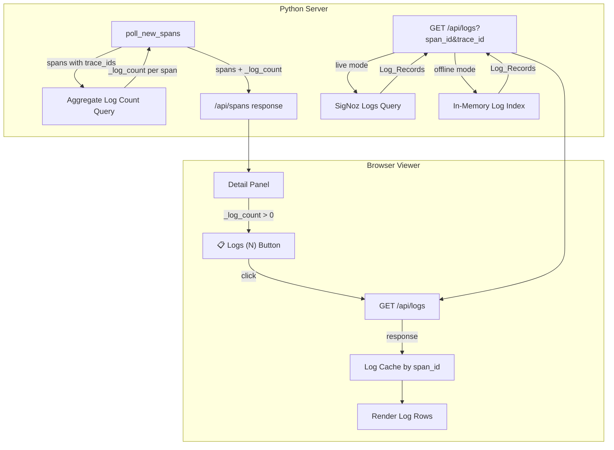

# Design Document: Correlated OTel Logs

## Overview

This feature adds correlated OpenTelemetry application logs to the span detail panel in the trace viewer. It works in two modes:

- **Live mode (SigNoz):** During each poll cycle, a single aggregate query counts logs per `span_id` across all polled `trace_id` values. The count is attached as `_log_count` on each span. When the user clicks a span's "Logs (N)" button, a `GET /api/logs` request fetches the actual log records from SigNoz's `query_range` API with `dataSource: "logs"`.

- **Offline mode (JSON):** The NDJSON parser is extended to recognize `resourceLogs` lines alongside `resourceSpans`. A new `--logs-file` CLI option allows a separate log file. The `JsonProvider` builds an in-memory index (`dict[span_id, list[LogRecord]]`), computes `_log_count` from it, and serves log records directly from memory via the same `/api/logs` endpoint.

The viewer JS renders a "📋 Logs (N)" button in the detail panel when `_log_count > 0`, fetches logs on click, caches them client-side by `span_id`, and displays each log with timestamp, color-coded severity, body text, and expandable attributes.

No new dependencies are introduced — all Python code uses stdlib only.

## Architecture



### Data Flow — Live Mode (SigNoz)

1. `poll_new_spans` fetches spans as today.
2. After spans are returned, collect distinct `trace_id` values.
3. Fire one aggregate query: `dataSource: "logs"`, `aggregateOperator: "count"`, `groupBy: [span_id]`, `filter: trace_id IN (...)`. Timeout: 5 seconds. Fail silently on error.
4. Attach `_log_count` to each span dict in the poll response.
5. When the viewer requests `GET /api/logs?span_id=X&trace_id=Y`, the server builds a `query_range` payload with `dataSource: "logs"`, `panelType: "list"`, filters on `span_id` and `trace_id`, and returns the log records.

### Data Flow — Offline Mode (JSON)

1. `parse_line` is extended: if a JSON line has `resourceLogs` (not `resourceSpans`), extract `RawLogRecord` objects.
2. `parse_file` / `parse_stream` return both spans and log records.
3. If `--logs-file` is provided, parse that file for additional log records.
4. Dedup logs from both sources by `(timestamp, span_id, body)`.
5. `JsonProvider` builds `_log_index: dict[str, list[RawLogRecord]]` keyed by `span_id`.
6. `_log_count` is computed from `len(_log_index.get(span_id, []))` and attached to each span.
7. `GET /api/logs` serves directly from `_log_index`.

## Components and Interfaces

### 1. `RawLogRecord` (parser.py)

New dataclass alongside `RawSpan`:

```python
@dataclass
class RawLogRecord:
    trace_id: str
    span_id: str
    timestamp_unix_nano: int
    severity_text: str
    body: str
    attributes: dict[str, Any] = field(default_factory=dict)
    resource_attributes: dict[str, Any] = field(default_factory=dict)
```

### 2. Parser Extensions (parser.py)

- `parse_log_line(line: str) -> list[RawLogRecord]` — parses a single NDJSON line containing `resourceLogs`.
- `parse_line` remains unchanged (spans only). A new top-level `parse_line_any(line: str) -> tuple[list[RawSpan], list[RawLogRecord]]` dispatches based on whether the JSON contains `resourceSpans` or `resourceLogs`.
- `parse_stream` and `parse_file` gain an optional `include_logs: bool = False` parameter. When true, they return a `ParseResult` named tuple containing both `spans` and `logs`.

### 3. Provider Base (base.py)

New method on `TraceProvider`:

```python
def get_logs(self, span_id: str, trace_id: str) -> list[dict]:
    """Return log records for a span. Default: empty list."""
    return []
```

This keeps the interface backward-compatible — existing providers return no logs.

### 4. SigNozProvider Extensions (signoz_provider.py)

- `_build_log_count_query(trace_ids: set[str]) -> dict` — builds the aggregate count query.
- `_build_log_query(span_id: str, trace_id: str) -> dict` — builds the list query for fetching log bodies.
- `_fetch_log_counts(trace_ids: set[str]) -> dict[str, int]` — executes the aggregate query with a 5-second timeout, returns `{span_id: count}`. Catches all exceptions and returns `{}` on failure.
- `get_logs(span_id: str, trace_id: str) -> list[dict]` — fetches log records from SigNoz.
- `poll_new_spans` is modified: after fetching spans, call `_fetch_log_counts` and attach `_log_count` to each span.

### 5. JsonProvider Extensions (json_provider.py)

- Constructor accepts optional `logs_path: str | None` parameter.
- `_log_index: dict[str, list[RawLogRecord]]` built during `_parse()`.
- `_log_count` attached to each `TraceSpan` in `_to_trace_span`.
- `get_logs(span_id: str, trace_id: str) -> list[dict]` — returns from `_log_index`.

### 6. Server (server.py)

- New `GET /api/logs` endpoint in `_do_GET`.
- Accepts `span_id` and `trace_id` query params. Returns 400 if either is missing.
- Delegates to `provider.get_logs(span_id, trace_id)`.
- Returns JSON array of `{timestamp, severity, body, attributes}`.
- Rate-limited like other API endpoints.
- Returns 502 on provider errors (SigNoz mode).

### 7. CLI (cli.py)

- New `--logs-file <path>` argument added to shared arguments.
- Passed through to `JsonProvider` constructor.
- Validated: if provided but file doesn't exist, exit with error.

### 8. Viewer JS (tree.js)

- `_renderDetailPanel` / `_renderKeywordDetail` / `_renderTestDetail` / `_renderSuiteDetail`: insert a "📋 Logs (N)" button when `data._log_count > 0`, positioned after attributes and before events.
- `_fetchAndRenderLogs(panel, spanId, traceId)`: fetches `GET /api/logs`, renders log rows.
- `_renderLogRow(log)`: renders timestamp (HH:MM:SS.mmm), color-coded severity badge, body text, expandable attributes.
- `_logCache = {}`: keyed by `span_id`, stores fetched log arrays.
- Loading state: spinner/text shown while fetch is in progress.
- Error state: inline error message on fetch failure.
- Scrollable container with `max-height` for log list.

### 9. Styles (style.css)

- `.logs-button` — button styling with 📋 icon.
- `.logs-container` — scrollable container with max-height.
- `.log-row` — individual log entry layout.
- `.log-severity-error`, `.log-severity-warn`, `.log-severity-info`, `.log-severity-debug` — color-coded severity badges.
- `.log-attributes-toggle` — expand/collapse control.

## Data Models

### Log Record (Python → JSON → JS)

The canonical log record format returned by `GET /api/logs`:

```json
{
  "timestamp": "2024-01-15T10:30:00.800Z",
  "severity": "INFO",
  "body": "HTTP request completed",
  "attributes": {
    "http.status_code": "200",
    "http.method": "GET"
  }
}
```

### RawLogRecord (Python internal)

```python
@dataclass
class RawLogRecord:
    trace_id: str          # hex, lowercase
    span_id: str           # hex, lowercase
    timestamp_unix_nano: int
    severity_text: str     # DEBUG, INFO, WARN, ERROR, FATAL
    body: str
    attributes: dict[str, Any]
    resource_attributes: dict[str, Any]
```

### Span with Log Count (poll response)

The existing span dict gains an optional `_log_count` field:

```json
{
  "span_id": "abc123",
  "trace_id": "def456",
  "name": "my-keyword",
  "_log_count": 3,
  ...
}
```

### Log Index (JsonProvider internal)

```python
_log_index: dict[str, list[RawLogRecord]]
# Key: span_id
# Value: list of RawLogRecord sorted by timestamp_unix_nano ascending
```

### Log Dedup Key

When merging logs from embedded and separate file sources:

```python
dedup_key = (log.timestamp_unix_nano, log.span_id, log.body)
```

### Client-Side Log Cache (JS)

```javascript
var _logCache = {};  // { span_id: [{ timestamp, severity, body, attributes }] }
```


## Correctness Properties

*A property is a characteristic or behavior that should hold true across all valid executions of a system — essentially, a formal statement about what the system should do. Properties serve as the bridge between human-readable specifications and machine-verifiable correctness guarantees.*

### Property 1: Log count attachment correctness

*For any* set of spans and any aggregate count result mapping `span_id` → count, attaching log counts should produce spans where: (a) every span whose `span_id` appears in the aggregate result has `_log_count` equal to the corresponding count, and (b) every span whose `span_id` does NOT appear in the aggregate result has no `_log_count` field.

**Validates: Requirements 1.2, 1.3**

### Property 2: Log query response correctness

*For any* `span_id` and `trace_id` with associated log records, the `GET /api/logs` response should contain only records matching that `span_id` and `trace_id`, ordered by timestamp ascending, and each record should contain `timestamp` (ISO 8601 string), `severity` (string), `body` (string), and `attributes` (object) fields.

**Validates: Requirements 2.2, 2.3**

### Property 3: Logs button visibility

*For any* span data object, the detail panel should display a "Logs (N)" button if and only if `_log_count` is present and greater than zero, and when displayed, N should equal the `_log_count` value.

**Validates: Requirements 3.1, 3.2**

### Property 4: Log cache round trip

*For any* `span_id` and any array of log records, storing the array in the log cache keyed by `span_id` and then retrieving by that `span_id` should return the identical array.

**Validates: Requirements 4.5, 6.1, 6.2**

### Property 5: Log rendering chronological order

*For any* array of log records with distinct timestamps, rendering them in the detail panel should produce DOM elements in timestamp-ascending order.

**Validates: Requirements 4.3**

### Property 6: Timestamp formatting

*For any* log record with a valid nanosecond Unix timestamp, the rendered timestamp string should match the `HH:MM:SS.mmm` format derived from that timestamp.

**Validates: Requirements 5.1**

### Property 7: Severity color mapping

*For any* severity string, the CSS class applied to the severity badge should map: ERROR and FATAL → red class, WARN → yellow/amber class, INFO → blue class, DEBUG and TRACE → gray class.

**Validates: Requirements 5.2**

### Property 8: Attributes toggle presence

*For any* log record, an expand/collapse toggle for attributes should be present if and only if the record's `attributes` object is non-empty.

**Validates: Requirements 5.3**

### Property 9: Log query builder structure

*For any* `span_id` and `trace_id`, the built SigNoz log query payload should have `dataSource: "logs"`, `panelType: "list"`, filter items for both `trace_id` and `span_id`, `selectColumns` including `timestamp`, `severity_text`, and `body`, and `orderBy` timestamp ascending.

**Validates: Requirements 7.1, 7.2, 7.3, 7.4**

### Property 10: Aggregate log count query builder structure

*For any* non-empty set of `trace_id` values, the built aggregate query should have `dataSource: "logs"`, `aggregateOperator: "count"`, `groupBy` containing `span_id`, and a filter item for `trace_id` with an `in` operator containing all provided trace IDs.

**Validates: Requirements 7.5**

### Property 11: OTLP log record parsing extraction

*For any* valid OTLP `resourceLogs` JSON structure, parsing should extract `RawLogRecord` objects with correct `trace_id`, `span_id`, `timestamp_unix_nano`, `severity_text`, `body`, and `attributes` fields matching the input data.

**Validates: Requirements 8.1**

### Property 12: Mixed span and log file parsing

*For any* NDJSON content containing interleaved `resourceSpans` and `resourceLogs` lines, parsing should return both spans and log records, with log records correctly associated to spans by matching `trace_id` and `span_id`.

**Validates: Requirements 8.2**

### Property 13: Offline log count computation

*For any* set of parsed spans and parsed log records, the `_log_count` attached to each span should equal the number of log records whose `span_id` matches that span's `span_id`.

**Validates: Requirements 8.3**

### Property 14: Separate file log correlation

*For any* trace file and separate logs file, log records parsed from the logs file should be correlated to spans by matching `trace_id` and `span_id`, and retrievable via `get_logs`.

**Validates: Requirements 9.2**

### Property 15: Log deduplication

*For any* two sets of log records (from embedded and separate file sources) that share some entries with identical `(timestamp_unix_nano, span_id, body)` tuples, merging should produce a result set with no duplicate entries by that key, and the total count should equal the number of unique keys across both sets.

**Validates: Requirements 9.3**

### Property 16: Gzip parsing equivalence

*For any* valid OTLP `resourceLogs` NDJSON content, parsing the content from a plain file and from a gzip-compressed file should produce identical `RawLogRecord` lists.

**Validates: Requirements 9.5**

## Error Handling

| Scenario | Component | Behavior |
|---|---|---|
| Aggregate log count query timeout (>5s) | SigNozProvider | Log warning, return spans without `_log_count`. Poll response unaffected. |
| Aggregate log count query network error | SigNozProvider | Log warning, return spans without `_log_count`. Poll response unaffected. |
| Aggregate log count query non-200 response | SigNozProvider | Log warning with status code, return spans without `_log_count`. |
| `GET /api/logs` missing `span_id` or `trace_id` | Server | Return HTTP 400 with `{"error": "Missing required parameter: span_id"}` (or `trace_id`). |
| `GET /api/logs` SigNoz API failure | Server | Return HTTP 502 with `{"error": "Failed to fetch logs from SigNoz: <detail>"}`. |
| `GET /api/logs` rate limited | Server | Return HTTP 429 (same rate limiter as other endpoints). |
| `--logs-file` path doesn't exist | CLI | Print error message to stderr, exit with code 1. |
| `--logs-file` permission denied | CLI | Print error message to stderr, exit with code 1. |
| Malformed `resourceLogs` JSON line | Parser | Skip line with warning (same behavior as malformed `resourceSpans` lines). |
| Log record missing `span_id` or `trace_id` | Parser | Skip that individual log record (cannot correlate without IDs). |
| `GET /api/logs` fetch failure in viewer | JS Viewer | Display inline error message in the detail panel. No retry. |
| Empty log response | JS Viewer | Hide the log container (button remains showing count from `_log_count`). |

## Testing Strategy

### Property-Based Testing

Use **Hypothesis** (already a project dependency) for all property-based tests. Each property test runs a minimum of 100 iterations (controlled by the project's `dev` and `ci` Hypothesis profiles — no hardcoded `@settings` decorators per the project's test strategy).

Each property test must be tagged with a comment referencing the design property:

```python
# Feature: correlated-otel-logs, Property 1: Log count attachment correctness
```

**Python property tests (Properties 1, 2, 9, 10, 11, 12, 13, 14, 15, 16):**

- Generate random spans, log records, trace IDs, and span IDs using Hypothesis strategies.
- Custom strategies for `RawLogRecord` and OTLP JSON structures.
- Test query builders by generating random inputs and verifying structural invariants of the output payload.
- Test parser by generating valid OTLP `resourceLogs` JSON and verifying round-trip extraction.
- Test dedup by generating overlapping log sets and verifying uniqueness.
- Test gzip equivalence by writing content to both plain and gzip temp files.

**JavaScript property tests (Properties 3, 4, 5, 6, 7, 8):**

- Use **fast-check** for JS property tests (already available or add as dev dependency).
- Generate random span data objects with varying `_log_count` values.
- Generate random log records with timestamps and severity levels.
- Test DOM rendering functions by verifying element presence and ordering.
- Test cache operations by generating random span_id/log pairs.

### Unit Tests

Unit tests complement property tests for specific examples and edge cases:

- **Aggregate query failure modes** (1.4): mock `_api_request` to raise `ProviderError`, `URLError`, `TimeoutError` — verify spans returned without `_log_count`.
- **5-second timeout** (1.5): verify the aggregate query uses `timeout=5`.
- **`GET /api/logs` endpoint existence** (2.1): integration test hitting the endpoint.
- **Missing params → 400** (2.5): specific requests with missing `span_id` or `trace_id`.
- **Empty result → empty array** (2.4): query for non-existent span_id.
- **SigNoz failure → 502** (2.6): mock provider to raise, verify 502.
- **Rate limiting** (2.7): verify `/api/logs` is in the rate-limited path.
- **Cache clear on reset** (6.3): call reset, verify cache is empty.
- **`--logs-file` CLI acceptance** (9.1): parse args with `--logs-file`, verify it's captured.
- **`--logs-file` missing file** (9.4): provide non-existent path, verify error exit.
- **Offline mode no external call** (8.4): verify `JsonProvider.get_logs` doesn't make HTTP requests.

### Test Organization

All tests run inside the `rf-trace-test:latest` Docker container via `make test-unit`. Target: complete in <30 seconds.

```
tests/
  test_log_parser.py          # Properties 11, 12, 15, 16 + unit tests
  test_log_provider_signoz.py # Properties 1, 9, 10 + unit tests for error handling
  test_log_provider_json.py   # Properties 13, 14 + unit tests
  test_log_server.py          # Property 2 + unit tests for endpoint behavior
  test_log_viewer.js          # Properties 3, 4, 5, 6, 7, 8 (fast-check)
```
