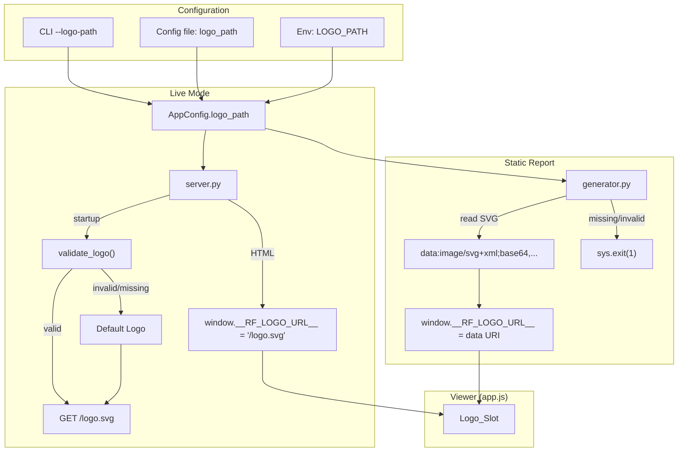

# Design Document: Custom Header Logo

## Overview

This feature adds logo support to the RF Trace Viewer header. A default SVG logo ships with the package and renders in the existing `Logo_Slot` (the `` element built by `app.js`). Operators can override it with a custom SVG via the existing three-tier config system (`logo_path` CLI arg / config file / `LOGO_PATH` env var). The logo is served at `/logo.svg` in live mode and embedded as a data URI in static reports. Kubernetes operators get a commented-out ConfigMap + volume mount example in the Kustomize base.

The design touches five existing modules (`config.py`, `cli.py`, `server.py`, `generator.py`, `app.js`) and adds one new asset file (`default-logo.svg`). No new Python modules are introduced.

## Architecture



### Key Design Decisions

1. **Single validation function**: A shared `validate_svg(path) -> (bool, str)` function in `config.py` checks file existence and `<svg` tag presence. Both `server.py` and `generator.py` call it, but handle failures differently (server falls back; generator exits).

2. **No new Python module**: The logo logic is small enough to live in the existing modules. `config.py` gets the field + validation helper, `server.py` gets the endpoint + startup check, `generator.py` gets the embedding logic.

3. **Default logo resolved via `_VIEWER_DIR`**: The default logo file lives alongside the JS/CSS assets in `src/rf_trace_viewer/viewer/default-logo.svg`. The generator and server resolve it using the existing `_VIEWER_DIR` path constant, keeping asset resolution consistent.

4. **Strict vs. lenient error handling**: Static report generation is a one-shot CLI operation — a bad logo path is a hard error (non-zero exit). The live server is a long-running process — a bad logo path at startup logs a warning and falls back to the default, keeping the server available.

5. **Data URI embedding for static reports**: Static reports must be self-contained. The logo SVG is base64-encoded into a `data:image/svg+xml;base64,...` URI assigned to `window.__RF_LOGO_URL__`. This matches the existing pattern of inlining all assets.

## Components and Interfaces

### 1. AppConfig (config.py)

Add a `logo_path` field to the existing `AppConfig` dataclass:

```python
# New field in AppConfig
logo_path: str | None = None  # path to custom SVG logo file
```

Add `LOGO_PATH` to the `env_map` in `load_config()` so the environment variable is picked up at the lowest precedence tier.

Add a validation helper:

```python
def validate_svg(path: str) -> tuple[bool, str]:
    """Check that path exists and contains an <svg tag.
    
    Returns (True, "") on success, (False, reason) on failure.
    """
```

### 2. CLI (cli.py)

Add `--logo-path` to `_add_shared_arguments()`:

```python
parser.add_argument(
    "--logo-path",
    default=None,
    metavar="<path>",
    help="Path to a custom SVG logo file for the viewer header",
)
```

The argument maps to `logo_path` in the CLI dict via the existing `_args_to_cli_dict` conversion (argparse converts `--logo-path` to `logo_path`).

### 3. Trace Report Server (server.py)

**Startup validation**: In `LiveServer.__init__`, accept a `logo_path` parameter. At startup, resolve the active logo:
- If `logo_path` is set, call `validate_svg(logo_path)`. On failure, log a warning and fall back to the default.
- Store the resolved path as `self.logo_path` (always points to a valid SVG file).

**New endpoint**: Add a `/logo.svg` route in `_do_GET`:

```python
if path == "/logo.svg":
    self._serve_logo(request_id)
    return
```

The `_serve_logo` method reads `self.server.logo_path`, returns the file content with `Content-Type: image/svg+xml`.

**HTML injection**: In `_serve_viewer`, add `window.__RF_LOGO_URL__ = "/logo.svg";` to the script block so the App_Module renders the logo.

### 4. Report Generator (generator.py)

Add a `logo_path` field to `ReportOptions`:

```python
logo_path: str | None = None  # custom SVG logo path (None = use default)
```

In `generate_report()`, resolve the active logo:
- If `logo_path` is set, validate it. On failure, print an error and call `sys.exit(1)`.
- If `logo_path` is not set, use the default logo from `_VIEWER_DIR / "default-logo.svg"`.
- Read the SVG, base64-encode it, and inject `window.__RF_LOGO_URL__ = "data:image/svg+xml;base64,..."` into the HTML `<script>` block.

### 5. App Module (app.js)

Update the Logo_Slot rendering in `_initApp`:
- When `window.__RF_LOGO_URL__` is set (which it now always will be — either `/logo.svg` or a data URI), render the `` element.
- Set `alt` to `window.__RF_LOGO_ALT__` if defined, otherwise `"Logo"`.
- Apply CSS: `max-height` equal to the header height, `object-fit: contain` to preserve aspect ratio.

The current code already renders the logo when `window.__RF_LOGO_URL__` is truthy. The change is:
- Default `alt` becomes `"Logo"` instead of `""` when `__RF_LOGO_ALT__` is not set.
- CSS constraints are added for consistent sizing.

### 6. Kustomize Base (deploy/kustomize/base/)

Add commented-out blocks to `deployment.yaml`:
- A `volume` referencing a `trace-report-logo` ConfigMap
- A `volumeMount` at `/etc/trace-report/logo/`
- A `LOGO_PATH` env var pointing to the mounted file

Add a commented-out `logo-configmap.yaml` example showing how to create the ConfigMap from a file.

### 7. Default Logo Asset

Place `default-logo.svg` at `src/rf_trace_viewer/viewer/default-logo.svg`. Update `pyproject.toml` package-data glob to include `*.svg`:

```toml
rf_trace_viewer = ["viewer/*.js", "viewer/*.css", "viewer/*.svg"]
```

## Data Models

### AppConfig Changes

| Field | Type | Default | Source |
|-------|------|---------|--------|
| `logo_path` | `str \| None` | `None` | CLI `--logo-path`, config file `logo_path`, env `LOGO_PATH` |

### ReportOptions Changes

| Field | Type | Default | Description |
|-------|------|---------|-------------|
| `logo_path` | `str \| None` | `None` | Custom SVG logo path for static report embedding |

### validate_svg Return

```python
tuple[bool, str]  # (is_valid, error_message)
```

- `(True, "")` — file exists and contains `<svg`
- `(False, "File not found: /path/to/logo.svg")` — file missing
- `(False, "Not a valid SVG: /path/to/logo.svg (no <svg tag found)")` — not SVG

### Window Variables (JavaScript)

| Variable | Type | Set By | Value |
|----------|------|--------|-------|
| `window.__RF_LOGO_URL__` | `string` | server.py / generator.py | `/logo.svg` (live) or `data:image/svg+xml;base64,...` (static) |
| `window.__RF_LOGO_ALT__` | `string \| undefined` | External override only | Alt text for logo image |


## Correctness Properties

*A property is a characteristic or behavior that should hold true across all valid executions of a system — essentially, a formal statement about what the system should do. Properties serve as the bridge between human-readable specifications and machine-verifiable correctness guarantees.*

### Property 1: Logo embedding round-trip

*For any* valid SVG string (containing an `<svg` tag and a `viewBox` attribute), base64-encoding it into a `data:image/svg+xml;base64,...` URI and then decoding the URI should produce the original SVG content byte-for-byte.

**Validates: Requirements 3.1, 3.2**

### Property 2: Generator rejects invalid logo files

*For any* file path that either does not exist or points to a file whose content does not contain an `<svg` tag, the report generator's logo validation should return failure with a non-empty error message.

**Validates: Requirements 3.4, 3.5**

### Property 3: Configuration precedence for logo_path

*For any* three distinct non-None string values assigned to CLI args, config file, and environment variable for `logo_path`, `load_config` should resolve to the CLI value. When CLI is None, it should resolve to the config file value. When both CLI and config file are None, it should resolve to the environment variable value.

**Validates: Requirements 4.2, 4.3**

### Property 4: SVG validation correctness

*For any* string content, `validate_svg` should return `True` if and only if the content contains an `<svg` tag (case-insensitive match of `<svg`). Content without an `<svg` tag should always return `False` with a non-empty error message.

**Validates: Requirements 6.1**

### Property 5: Server graceful fallback on invalid logo

*For any* logo path that is either non-existent or points to a non-SVG file, the server's logo resolution at startup should fall back to the default logo path (`_VIEWER_DIR / "default-logo.svg"`) rather than raising an exception.

**Validates: Requirements 6.2, 6.3**

## Error Handling

### Static Report Generation (generator.py)

| Condition | Behavior | Exit Code |
|-----------|----------|-----------|
| `logo_path` set, file missing | Print error to stderr, `sys.exit(1)` | 1 |
| `logo_path` set, not valid SVG | Print error to stderr, `sys.exit(1)` | 1 |
| `logo_path` not set, default missing | `FileNotFoundError` (installation corrupt) | 1 |
| `logo_path` set, file valid | Embed as data URI | 0 |

The generator uses strict error handling because it's a one-shot CLI operation. A bad logo should fail the build, not silently produce a broken report.

### Live Server (server.py)

| Condition | Behavior |
|-----------|----------|
| `logo_path` set, file missing | Log warning, fall back to default logo |
| `logo_path` set, not valid SVG | Log warning, fall back to default logo |
| `logo_path` not set | Use default logo |
| `/logo.svg` request, file read error | Return 500 with error message |

The server uses lenient error handling because it's a long-running process. A bad logo config shouldn't prevent the server from starting.

### Validation Function (config.py)

`validate_svg(path)` is a pure check — it never raises exceptions. It returns `(False, reason)` for all failure modes:
- File does not exist
- File is not readable
- File content does not contain `<svg` tag

Callers decide how to handle the failure (exit vs. fallback).

## Testing Strategy

### Property-Based Testing

Use **Hypothesis** (already configured in `tests/conftest.py` with dev/ci profiles).

Each correctness property maps to a single `@given`-decorated test. No hardcoded `@settings` — the profile system controls iteration counts.

| Property | Test | Strategy |
|----------|------|----------|
| P1: Embedding round-trip | `test_logo_embed_roundtrip` | Generate random valid SVG strings, encode to data URI, decode, compare |
| P2: Generator rejects invalid | `test_generator_rejects_invalid_logo` | Generate random non-SVG content + non-existent paths, verify rejection |
| P3: Config precedence | `test_logo_path_config_precedence` | Generate 3 random strings, test all precedence combinations |
| P4: SVG validation | `test_validate_svg_correctness` | Generate random strings with/without `<svg` tag, verify validate_svg result |
| P5: Server fallback | `test_server_fallback_on_invalid_logo` | Generate invalid paths, verify resolved path is default |

Tag format for each test:
```python
# Feature: custom-header-logo, Property 1: Logo embedding round-trip
```

### Unit Tests (Examples & Edge Cases)

| Test | Validates | Type |
|------|-----------|------|
| `test_default_logo_file_exists` | 1.1 | example |
| `test_default_logo_has_viewbox` | 1.2 | example |
| `test_logo_endpoint_content_type` | 2.1 | example |
| `test_logo_endpoint_serves_default` | 2.3 | example |
| `test_serve_viewer_sets_logo_url` | 2.4 | example |
| `test_static_report_embeds_default_logo` | 3.3 | example |
| `test_appconfig_has_logo_path_field` | 4.1 | example |
| `test_logo_alt_default` | 7.3 | example |
| `test_backward_compat_no_logo_config` | 8.1, 8.3 | example |
| `test_external_logo_url_override` | 8.2 | example |

### Test File Location

All logo tests go in `tests/unit/test_logo.py`.

### Running Tests

```bash
make test-unit          # Fast feedback (dev profile, 5 examples)
make test-full          # Full PBT iterations (ci profile, 200 examples)
```
