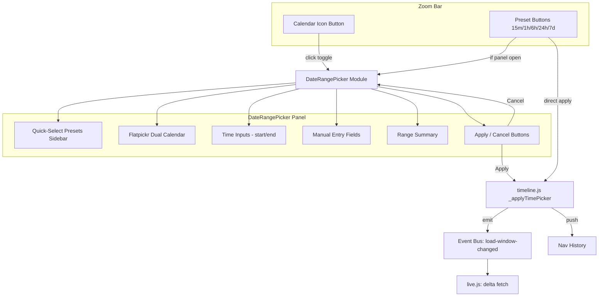

# Design Document: Date Range Picker

## Overview

This design replaces the existing `timeline-time-picker` popover (two `datetime-local` inputs in a small dropdown) with a Flatpickr-powered date range picker panel. The new panel provides dual side-by-side calendars, inline time selection, quick-select presets, manual text entry, and range highlighting — all within a single unified panel that adapts to both light and dark themes.

The implementation follows the project's vanilla JS / IIFE architecture with no build step. Flatpickr v4.6.13 (MIT license) is vendored as standalone JS and CSS files in the `src/rf_trace_viewer/viewer/` directory and inlined into the generated HTML report by `generator.py`, exactly like the existing viewer assets.

### Key Design Decisions

1. **Vendored Flatpickr, not CDN**: The report is a self-contained HTML file with all assets inlined. Flatpickr's JS and CSS are vendored into the viewer directory and added to `_JS_FILES` / `_CSS_FILES` tuples in `generator.py`. This preserves the zero-external-dependency guarantee.

2. **Single new file `date-range-picker.js`**: All picker logic lives in a new IIFE that exposes a `DateRangePicker` constructor on `window.RFTraceViewer`. This keeps `timeline.js` focused on canvas rendering and avoids a 3500+ line monolith growing further.

3. **CSS override strategy for Flatpickr theming**: A dedicated section in `style.css` overrides Flatpickr's internal classes (`.flatpickr-calendar`, `.flatpickr-day`, etc.) to map them to the existing CSS custom properties (`--bg-primary`, `--text-primary`, `--border-color`, `--focus-outline`, etc.). No Flatpickr theme file is used.

4. **Lazy singleton initialization**: Flatpickr is initialized once on first panel open and the instance is reused on subsequent opens, satisfying the <100ms open requirement.

5. **Graceful fallback**: If `window.flatpickr` is undefined at init time (script failed to load), the picker falls back to the existing `datetime-local` input pair approach.

## Architecture



### File Layout and Load Order

```
src/rf_trace_viewer/viewer/
├── flatpickr.min.js          # Vendored Flatpickr v4.6.13 (MIT)
├── flatpickr.min.css         # Vendored Flatpickr base CSS
├── date-range-picker.js      # New: DateRangePicker IIFE module
├── timeline.js               # Modified: delegates to DateRangePicker
├── style.css                 # Modified: Flatpickr theme overrides + panel styles
├── app.js                    # Unchanged (loads after timeline.js)
└── ... (other existing files)
```

**Load order in `generator.py`**:
```python
_JS_FILES = (
    "flatpickr.min.js",       # Must load first — defines window.flatpickr
    "stats.js",
    "tree.js",
    "date-range-picker.js",   # Before timeline.js — defines DateRangePicker
    "timeline.js",
    "keyword-stats.js",
    "search.js",
    "deep-link.js",
    "theme.js",
    "flow-table.js",
    "live.js",
    "service-health.js",
    "app.js",
)
_CSS_FILES = ("flatpickr.min.css", "style.css")
```

Flatpickr JS loads first so `window.flatpickr` is available. `date-range-picker.js` loads before `timeline.js` so the constructor is available when the zoom bar is built.

## Components and Interfaces

### 1. DateRangePicker Module (`date-range-picker.js`)

A self-contained IIFE that registers `window.RFTraceViewer.DateRangePicker`.

```javascript
// Constructor
DateRangePicker(options)
  // options.anchorEl     - the calendar button element
  // options.containerEl  - parent element to append the panel to (zoom bar parent)
  // options.onApply      - callback(startEpoch, endEpoch) called on Apply
  // options.onCancel     - callback() called on Cancel
  // options.getViewWindow - function returning {start, end} in epoch seconds
  // options.themeRootEl  - element with CSS custom properties (.rf-trace-viewer)

// Public methods
DateRangePicker.prototype.open()       // Show panel, populate from current view window
DateRangePicker.prototype.close()      // Hide panel, clean up listeners
DateRangePicker.prototype.isOpen()     // Returns boolean
DateRangePicker.prototype.destroy()    // Tear down Flatpickr instance and DOM
DateRangePicker.prototype.updateSelection(startEpoch, endEpoch)
  // Sync internal state when external preset is applied while panel is open
```

### 2. Panel DOM Structure

```
div.date-range-panel [role="dialog"] [aria-label="Select date range"]
├── div.drp-sidebar
│   ├── button.drp-preset "Last 15 min"
│   ├── button.drp-preset "Last 1 hour"
│   ├── button.drp-preset "Last 6 hours"
│   ├── button.drp-preset "Last 24 hours"
│   ├── button.drp-preset "Today"
│   └── button.drp-preset "This week"
├── div.drp-main
│   ├── div.drp-calendar-container
│   │   └── div#drp-flatpickr-host  ← Flatpickr mounts here (inline mode)
│   ├── div.drp-manual-row
│   │   ├── div.drp-field
│   │   │   ├── label "Start"
│   │   │   ├── input.drp-manual-input [type="text"]
│   │   │   └── div.drp-field-error
│   │   └── div.drp-field
│   │       ├── label "End"
│   │       ├── input.drp-manual-input [type="text"]
│   │       └── div.drp-field-error
│   ├── div.drp-summary [aria-live="polite"]
│   └── div.drp-actions
│       ├── button.drp-cancel "Cancel"
│       └── button.drp-apply "Apply"
```

### 3. Integration Points with timeline.js

The existing `_openTimePicker`, `_closeTimePicker`, and `_applyTimePicker` functions are refactored:

- `_openTimePicker()` → delegates to `dateRangePicker.open()`
- `_closeTimePicker()` → delegates to `dateRangePicker.close()`
- `_applyTimePicker(startEpoch, endEpoch)` → unchanged (still handles view window update, event bus emission, nav history push, re-render). The DateRangePicker calls this via the `onApply` callback.

The existing preset buttons in the zoom bar remain as direct-apply shortcuts. When clicked, they call `_applyPreset()` as before, and additionally call `dateRangePicker.updateSelection()` if the panel is open.

### 4. Event Flow

```
User clicks calendar icon
  → _openTimePicker()
    → dateRangePicker.open()
      → Panel visible, Flatpickr initialized (lazy), populated from viewStart/viewEnd

User selects range (calendar / preset / manual entry)
  → Internal state updated, summary refreshed

User clicks Apply
  → onApply(startEpoch, endEpoch)
    → _applyTimePicker(startEpoch, endEpoch)
      → viewStart/viewEnd updated
      → emit('load-window-changed') if needed
      → _navPush()
      → _render() + _renderHeader()
      → panel closed

User clicks Cancel / presses Escape
  → onCancel()
    → panel closed, no state changes
```

## Data Models

### Internal Picker State

```javascript
{
  _flatpickrInstance: null,    // Flatpickr instance (lazy init)
  _initialized: false,         // Whether Flatpickr has been created
  _panelEl: null,              // Root panel DOM element
  _isOpen: false,              // Panel visibility
  _startEpoch: null,           // Selected start in epoch seconds
  _endEpoch: null,             // Selected end in epoch seconds
  _activePreset: null,         // Currently active preset key or null
  _startInput: null,           // Manual entry input element (start)
  _endInput: null,             // Manual entry input element (end)
  _summaryEl: null,            // Range summary display element
  _applyBtn: null,             // Apply button element
  _startError: null,           // Start field error element
  _endError: null,             // End field error element
  _presetButtons: [],          // Array of preset button elements
  _escHandler: null,           // Keydown handler reference for cleanup
  _fallbackMode: false         // True if Flatpickr failed to load
}
```

### Quick-Select Preset Configuration

```javascript
var PICKER_PRESETS = [
  { key: 'last-15m',  label: 'Last 15 min',   seconds: 900 },
  { key: 'last-1h',   label: 'Last 1 hour',   seconds: 3600 },
  { key: 'last-6h',   label: 'Last 6 hours',  seconds: 21600 },
  { key: 'last-24h',  label: 'Last 24 hours',  seconds: 86400 },
  { key: 'today',     label: 'Today',          seconds: null, compute: 'today' },
  { key: 'this-week', label: 'This week',      seconds: null, compute: 'this-week' }
];
```

For `today`: start = midnight local time today, end = now.
For `this-week`: start = Monday 00:00:00 local time, end = now.

### Flatpickr Configuration Object

```javascript
{
  mode: 'range',
  inline: true,
  showMonths: 2,           // Dual calendars (reduced to 1 below 640px)
  enableTime: true,
  enableSeconds: true,
  time_24hr: true,
  dateFormat: 'Y-m-d H:i:S',
  defaultDate: [startDate, endDate],  // Pre-populated from view window
  onChange: function(selectedDates) { /* sync manual inputs + summary */ },
  onMonthChange: function() { /* re-apply range highlight CSS */ }
}
```

### Manual Entry Format

Input format: `YYYY-MM-DD HH:MM:SS` (e.g., `2024-06-10 14:30:00`)

Validation regex: `/^\d{4}-\d{2}-\d{2} \d{2}:\d{2}:\d{2}$/`

After regex match, the value is parsed with `new Date(value.replace(' ', 'T'))` and checked for `isNaN`.

### Range Summary Format

Template: `"{startFormatted} — {endFormatted} ({duration})"`

Example: `"Jun 10, 14:30:00 — Jun 11, 09:00:00 (18h 30m)"`

Duration formatting:
- < 1 minute: `"{s}s"`
- < 1 hour: `"{m}m {s}s"`
- < 24 hours: `"{h}h {m}m"`
- ≥ 24 hours: `"{d}d {h}h"`


## Correctness Properties

*A property is a characteristic or behavior that should hold true across all valid executions of a system — essentially, a formal statement about what the system should do. Properties serve as the bridge between human-readable specifications and machine-verifiable correctness guarantees.*

### Property 1: Range summary contains start, end, and duration

*For any* pair of valid epoch-second values (start, end) where start < end, the formatted range summary string shall contain the formatted start time, the formatted end time, and a non-empty duration string that correctly represents the difference between end and start.

**Validates: Requirements 3.5**

### Property 2: Preset range computation is correct

*For any* "now" timestamp (epoch seconds) and any preset from the preset list, the computed (start, end) range shall satisfy: end equals "now", and start equals "now minus the preset's duration in seconds" (for duration-based presets), or start equals midnight today / Monday 00:00 of the current week (for calendar-relative presets like "Today" and "This week").

**Validates: Requirements 4.3**

### Property 3: Manual modification clears active preset

*For any* active preset state followed by any manual range change (calendar click or manual entry producing a different start or end value), the active preset shall become null and no preset button shall have the active CSS class.

**Validates: Requirements 4.5**

### Property 4: Date/time string round-trip

*For any* valid epoch-second value, formatting it to the `YYYY-MM-DD HH:MM:SS` display string and then parsing that string back to an epoch-second value shall produce the original epoch-second value (to whole-second precision).

**Validates: Requirements 5.2, 5.3**

### Property 5: Invalid date/time format rejection

*For any* string that does not match the pattern `YYYY-MM-DD HH:MM:SS` (where each component is a valid numeric value forming a real date), the validation function shall return an error and the string shall not be accepted as a valid date/time input.

**Validates: Requirements 5.4**

### Property 6: Apply button disabled for all invalid states

*For any* picker state where the start epoch is greater than or equal to the end epoch, or where either manual entry field contains an unparseable value, or where no range has been selected, the Apply button shall be disabled (the `disabled` attribute is true).

**Validates: Requirements 5.5, 6.4**

### Property 7: Pre-populate from view window

*For any* view window state defined by (viewStart, viewEnd) in epoch seconds, opening the Date_Range_Picker shall result in the manual entry fields displaying the formatted viewStart and viewEnd, and the Flatpickr selection matching those dates.

**Validates: Requirements 6.5**

### Property 8: All interactive elements have aria attributes

*For any* rendered Date_Range_Picker panel, every `<button>` and `<input>` element within the panel shall have either an `aria-label` or `aria-labelledby` attribute with a non-empty value.

**Validates: Requirements 8.4**

### Property 9: External preset syncs picker selection

*For any* zoom bar preset click while the Date_Range_Picker is open, the picker's internal start/end selection and manual entry fields shall update to match the range applied by the preset.

**Validates: Requirements 11.3**

## Error Handling

### Flatpickr Load Failure

If `window.flatpickr` is `undefined` when `DateRangePicker.open()` is first called:
- Set `_fallbackMode = true`
- Build a fallback panel containing two `<input type="datetime-local">` elements (matching the old popover behavior) plus Apply/Cancel buttons
- Log a console warning: `[DateRangePicker] Flatpickr not available, using fallback inputs`
- All subsequent opens reuse the fallback panel (no retry)

### Invalid Manual Entry

- **Format error**: If the input doesn't match `/^\d{4}-\d{2}-\d{2} \d{2}:\d{2}:\d{2}$/`, show inline error "Expected format: YYYY-MM-DD HH:MM:SS" below the field. Apply button disabled.
- **Invalid date**: If the format matches but `new Date(...)` returns `NaN`, show inline error "Invalid date" below the field. Apply button disabled.
- **Start ≥ End**: Show inline error "Start must be before end" below the start field. Apply button disabled.
- Errors clear automatically when the user corrects the input (on `input` event and `blur` event).

### Edge Cases

- **Flatpickr onChange fires with 0 or 1 dates**: During range selection, Flatpickr may fire `onChange` with only the start date selected. The picker treats this as an incomplete selection — summary shows only the start, Apply remains disabled until both dates are selected.
- **Timezone**: All conversions use the browser's local timezone (consistent with the existing `datetime-local` inputs and `_epochToDatetimeLocal` helper). No UTC conversion is performed.
- **Panel positioning overflow**: If the panel would extend below the viewport, it is repositioned upward. If it would extend beyond the right edge, it is shifted left. Handled via a `_positionPanel()` method called on open and on window resize.

## Testing Strategy

### Property-Based Testing

The project uses Python with Hypothesis for property-based testing (per the project's test-strategy steering file). Since the Date Range Picker is a JavaScript UI component, property-based tests target the pure logic functions that can be extracted and tested independently:

**Library**: Hypothesis (Python) — already used by the project
**Configuration**: Uses the project's existing `dev` and `ci` Hypothesis profiles (no hardcoded `@settings`)
**Minimum iterations**: 100 per property (Hypothesis default in `dev` profile)

Testable pure functions to extract into a shared utility or test via the generated HTML:

1. **`formatRangeSummary(startEpoch, endEpoch)`** → string (Property 1)
2. **`computePresetRange(presetKey, nowEpoch)`** → {start, end} (Property 2)
3. **`formatEpochToEntry(epochSec)`** → string (Property 4, forward direction)
4. **`parseEntryToEpoch(str)`** → number|null (Property 4, reverse direction)
5. **`validateManualEntry(str)`** → {valid, error?} (Property 5)
6. **`isApplyEnabled(startEpoch, endEpoch, startValid, endValid)`** → boolean (Property 6)

These functions are implemented in JavaScript but their logic is deterministic and can be mirrored in Python test helpers or tested via a lightweight JS execution approach (e.g., running the functions through a simple Node.js subprocess or by testing the Python-side equivalents if the logic is ported for server-side validation).

Alternatively, since the project already runs tests in Docker, a pragmatic approach is to write the property tests against Python reimplementations of the pure logic (format/parse/validate), ensuring the specification is correct, and then write JS unit tests that verify the JS implementation matches the same examples.

Each property test must be tagged with a comment:
```python
# Feature: date-range-picker, Property 1: Range summary contains start, end, and duration
```

### Unit Testing

Unit tests (also in Python/Hypothesis or as JS tests run in Docker) cover:

- **Examples**: Flatpickr config values (1.2, 1.3, 1.4), panel DOM structure (2.1, 2.5), preset list completeness (4.2), manual entry field labels (5.1), aria-live attribute (8.5), old popover removal (11.1), zoom bar preset regression (11.2), singleton init (10.2)
- **Edge cases**: Flatpickr load failure fallback (1.5), outside click does not close (2.3), Cancel/Escape close without state change (6.2, 6.3), focus trap cycling (8.1), tab order (8.3)
- **Integration**: Apply triggers _applyTimePicker with correct epochs (6.1), pre-populate on open (6.5)

### Test Organization

```
tests/
└── unit/
    └── test_date_range_picker.py   # Property + unit tests for pure logic
```

Tests run via `make test-unit` inside the Docker container, targeting <30s total (per test-strategy steering file).

## Flatpickr Licensing and Vendoring

### Version

Pin to **Flatpickr v4.6.13** (latest stable release, MIT license).

### Files to Vendor

Download from the Flatpickr GitHub releases or unpkg CDN and place in `src/rf_trace_viewer/viewer/`:

- `flatpickr.min.js` (~16 KB minified)
- `flatpickr.min.css` (~4 KB minified)

### MIT License Attribution

1. **File headers**: Both `flatpickr.min.js` and `flatpickr.min.css` already contain the MIT license notice in their minified headers (standard for the Flatpickr distribution). These headers are preserved as-is when vendored.

2. **THIRD_PARTY_LICENSES file**: Create `THIRD_PARTY_LICENSES` in the repository root:
   ```
   Flatpickr v4.6.13
   https://github.com/flatpickr/flatpickr
   License: MIT
   Copyright (c) 2017 Gregory Petrosyan

   Permission is hereby granted, free of charge, to any person obtaining a copy
   of this software and associated documentation files (the "Software"), to deal
   in the Software without restriction, including without limitation the rights
   to use, copy, modify, merge, publish, distribute, sublicense, and/or sell
   copies of the Software, and to permit persons to whom the Software is
   furnished to do so, subject to the following conditions:
   ...
   ```

3. **Inline comment in `date-range-picker.js`**: The IIFE header includes:
   ```javascript
   /* Date Range Picker — uses Flatpickr v4.6.13 (MIT license)
      See THIRD_PARTY_LICENSES for full license text. */
   ```

This satisfies the MIT license requirement of including the copyright notice and permission notice in all copies or substantial portions of the software.
