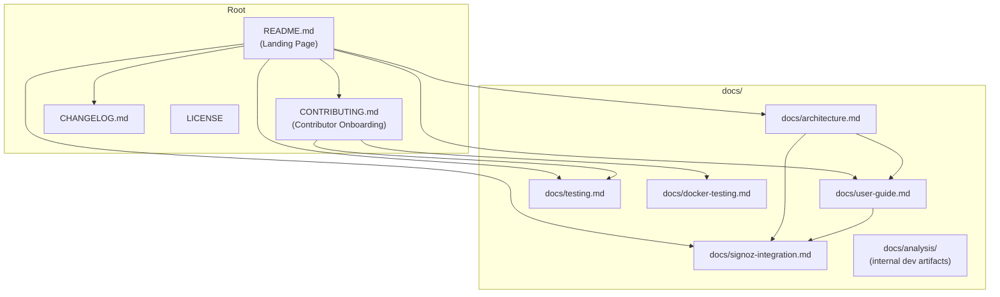

# Design Document: Documentation Overhaul

## Overview

This design covers the complete restructuring and rewriting of the `robotframework-trace-report` project's documentation. The project has accumulated organic documentation across inconsistent formats and locations — session summaries, optimization notes, and verification logs clutter the root directory, while critical usage scenarios (SigNoz integration, Docker Compose stacks, compact serialization) are either buried in source code or scattered across unrelated files.

The overhaul produces a clean, professional documentation set:

- A compact README as the landing page
- A `docs/` hierarchy with architecture, user guide, SigNoz integration, and testing docs
- Updated CONTRIBUTING.md with Docker-only workflow
- Cleaned root directory (clutter files removed)
- Updated steering files reflecting current project state
- All internal cross-references verified

This is a documentation-only feature — no Python or JavaScript code changes are required. The deliverables are Markdown files, file deletions, and `.gitignore` updates.

## Architecture

Since this is a documentation restructuring feature, "architecture" refers to the information architecture — how documents relate to each other and how readers navigate between them.

### Document Hierarchy



### Navigation Model

Readers enter through the README and branch to detailed docs based on their role:

- **Prospective user** → README → Quick Start → User Guide
- **Test engineer** → README → Deployment Scenarios → User Guide → SigNoz Guide
- **New contributor** → README → CONTRIBUTING → Testing docs
- **Architect/advanced user** → README → Architecture Guide

Every document links back to related documents using relative Markdown links. No document is a dead end.

## Components and Interfaces

The "components" of this feature are the documentation files themselves. Each has a defined scope, audience, and interface (what it links to and from).

### Component 1: README.md (Root)

- **Scope**: Compact landing page, under 200 lines
- **Audience**: Everyone (first impression)
- **Content**: One-liner, summary, data flow diagram, installation, quick start, feature list, deployment scenario summaries, comparison table, doc links, related projects, version/status
- **Links out to**: All docs/ files, CONTRIBUTING.md, CHANGELOG.md
- **Links in from**: pyproject.toml `[project.urls]`

### Component 2: docs/architecture.md

- **Scope**: System design, data pipeline, all 6 deployment scenarios with diagrams, component descriptions, design decisions
- **Audience**: Developers, advanced users
- **Content**: Migrated and expanded from current `ARCHITECTURE.md`, adding deployment scenario diagrams, provider abstraction, JS viewer architecture, current file structure
- **Links out to**: docs/user-guide.md, docs/signoz-integration.md
- **Links in from**: README.md

### Component 3: docs/user-guide.md

- **Scope**: Comprehensive end-user documentation
- **Audience**: Test engineers using the tool
- **Content**: All CLI options (organized by category), getting started, deployment scenario step-by-step instructions, Docker Compose stacks, viewer features, compact serialization, live mode, report customization
- **Links out to**: docs/signoz-integration.md
- **Links in from**: README.md, docs/architecture.md

### Component 4: docs/signoz-integration.md

- **Scope**: Dedicated SigNoz setup and troubleshooting
- **Audience**: Users deploying with SigNoz backend
- **Content**: Architecture overview, installation options, authentication setup, CLI options, environment variables, known issues (v0.113.0), Docker Compose reference stack, alternative backends, troubleshooting
- **Links out to**: (external SigNoz docs)
- **Links in from**: README.md, docs/architecture.md, docs/user-guide.md

### Component 5: CONTRIBUTING.md (Root)

- **Scope**: Contributor onboarding and workflow
- **Audience**: New and existing contributors
- **Content**: Prerequisites (Docker + optionally Kiro), quick start, development workflow with Makefile targets, Docker-only philosophy, project structure (current layout including providers/, all viewer JS files, integration tests), testing strategy overview, code style, how to add new JS viewer files, removal of stale references
- **Links out to**: docs/testing.md, docs/docker-testing.md
- **Links in from**: README.md

### Component 6: docs/testing.md

- **Scope**: Complete testing reference
- **Audience**: Contributors writing/running tests
- **Content**: All test types with Makefile targets, pre-built `rf-trace-test:latest` image, memory limits, running specific files, agent hooks
- **Links in from**: CONTRIBUTING.md, README.md

### Component 7: docs/docker-testing.md

- **Scope**: Docker-only testing philosophy and commands
- **Audience**: Contributors
- **Content**: Updated to reference pre-built test image, removal of `python:3.11-slim` + `pip install` examples, Makefile-first approach
- **Links in from**: CONTRIBUTING.md

### Component 8: Steering Files (.kiro/steering/)

- **Scope**: Kiro guidance files
- **Audience**: Kiro AI assistant
- **Content**: Updated `docker-testing-strategy.md` referencing pre-built image, updated `implementation-guide.md` reflecting current state, accurate README listing

### Component 9: Root-Level Cleanup

- **Scope**: File deletions and relocations
- **Content**: Remove clutter files (SESSION_SUMMARY.md, SESSION_FINAL_SUMMARY.md, VERIFICATION_SUMMARY.md, rf-trace-report-optimization-notes.md, rf-trace-report-optimization-notes2.md, req35-baseline-plan.md, coverage_summary.md, benchmark-req35.sh, benchmark-results.txt, verify_timeline_ui.py, playwright-log.txt). Handle HTML test artifacts (gitignore or relocate). Remove empty `docs/sessions/`. Remove stale `ARCHITECTURE.md` from root after content migrated to `docs/architecture.md`.

## Data Models

This feature does not introduce runtime data models. The "data" is the documentation content itself. The key structural model is the file layout:

### Target File Layout

```
robotframework-trace-report/
├── README.md                          # Compact landing page (rewritten)
├── CONTRIBUTING.md                    # Contributor guide (rewritten)
├── CHANGELOG.md                       # Unchanged
├── LICENSE                            # Unchanged
├── docs/
│   ├── architecture.md                # New (content from ARCHITECTURE.md + expansions)
│   ├── user-guide.md                  # New
│   ├── signoz-integration.md          # New
│   ├── testing.md                     # Rewritten from docs/TESTING.md
│   ├── docker-testing.md              # Rewritten from docs/DOCKER_TESTING.md
│   └── analysis/                      # Unchanged (internal dev artifacts)
│       ├── GANTT_CHART_OVERLAP_ANALYSIS.md
│       ├── TESTABILITY_IMPROVEMENTS.md
│       └── ... (other analysis files)
├── .kiro/steering/
│   ├── README.md                      # Updated
│   ├── docker-testing-strategy.md     # Updated
│   ├── implementation-guide.md        # Updated
│   └── pbt-status-fix.md             # Unchanged
└── .gitignore                         # Updated (add HTML test artifacts)
```

### Files to Delete

| File | Reason |
|------|--------|
| `SESSION_SUMMARY.md` | Session artifact |
| `SESSION_FINAL_SUMMARY.md` | Session artifact |
| `VERIFICATION_SUMMARY.md` | Verification artifact |
| `rf-trace-report-optimization-notes.md` | Optimization notes (preserve relevant content in architecture doc) |
| `rf-trace-report-optimization-notes2.md` | Optimization notes |
| `req35-baseline-plan.md` | Planning artifact |
| `coverage_summary.md` | Generated artifact |
| `benchmark-req35.sh` | Benchmark script (relocate to docs/analysis/ if valuable) |
| `benchmark-results.txt` | Benchmark output |
| `verify_timeline_ui.py` | Verification script |
| `playwright-log.txt` | Log artifact |
| `diverse-suite-baseline.html` | Test artifact (gitignore) |
| `large-trace-baseline.html` | Test artifact (gitignore) |
| `large-trace-gzip.html` | Test artifact (gitignore) |
| `ARCHITECTURE.md` | Content migrated to docs/architecture.md |
| `trace-report-k8s-architecture-decisions.md` | Planning artifact |
| `docs/sessions/` | Empty directory |

### Files to Rename (lowercase convention)

| Current | Target |
|---------|--------|
| `docs/TESTING.md` | `docs/testing.md` |
| `docs/DOCKER_TESTING.md` | `docs/docker-testing.md` |


## Correctness Properties

*A property is a characteristic or behavior that should hold true across all valid executions of a system — essentially, a formal statement about what the system should do. Properties serve as the bridge between human-readable specifications and machine-verifiable correctness guarantees.*

Since this is a documentation feature, the "system" is the documentation file set. Properties are verified by scanning files for content presence, link validity, and structural correctness. All properties can be implemented as file-system inspection tests.

### Property 1: All documentation files are Markdown

*For any* file in the `docs/` directory or at the project root that serves as documentation (excluding LICENSE), the file extension shall be `.md`.

**Validates: Requirements 1.1**

### Property 2: Only allowed documentation files at root

*For any* `.md` file at the project root, the filename shall be one of: `README.md`, `CONTRIBUTING.md`, `CHANGELOG.md`, or `TODO.md`. No session summaries, optimization notes, or verification artifacts shall exist as `.md` files at root.

**Validates: Requirements 1.3, 9.1, 9.2**

### Property 3: Clutter files removed from root

*For any* file in the defined clutter list (`SESSION_SUMMARY.md`, `SESSION_FINAL_SUMMARY.md`, `VERIFICATION_SUMMARY.md`, `rf-trace-report-optimization-notes.md`, `rf-trace-report-optimization-notes2.md`, `req35-baseline-plan.md`, `coverage_summary.md`, `benchmark-req35.sh`, `benchmark-results.txt`, `verify_timeline_ui.py`, `playwright-log.txt`, `trace-report-k8s-architecture-decisions.md`), the file shall not exist at the project root.

**Validates: Requirements 9.1, 9.2**

### Property 4: No root-level HTML test artifacts

*For any* `.html` file at the project root, the file shall either not exist or be listed in `.gitignore`.

**Validates: Requirements 9.3**

### Property 5: README features section covers all listed features

*For any* feature in the set {timeline, tree view, statistics, search, filter, live mode, dark mode, deep links, SigNoz, compact serialization, Docker Compose}, the README "Features" section shall contain a reference to that feature.

**Validates: Requirements 2.5**

### Property 6: README links to all docs

*For any* documentation file in `docs/` (`architecture.md`, `user-guide.md`, `signoz-integration.md`, `testing.md`, `docker-testing.md`) and root docs (`CONTRIBUTING.md`, `CHANGELOG.md`), the README shall contain a relative Markdown link to that file.

**Validates: Requirements 2.7, 11.1**

### Property 7: Architecture guide documents all Python components

*For any* Python component in the set {parser, tree, rf_model, generator, server, cli, config, providers}, the Architecture Guide shall contain a description of that component.

**Validates: Requirements 3.2**

### Property 8: Architecture guide documents all JS viewer files

*For any* JS viewer file in the set {app.js, tree.js, timeline.js, stats.js, search.js, keyword-stats.js, flow-table.js, deep-link.js, live.js, theme.js, style.css}, the Architecture Guide shall reference that file.

**Validates: Requirements 3.3**

### Property 9: Architecture guide covers all deployment scenarios

*For any* deployment scenario in the set {local static, local live, OTLP receiver, SigNoz provider, Docker Compose RF stack, Docker Compose SigNoz stack}, the Architecture Guide shall contain a dedicated section with a diagram.

**Validates: Requirements 3.5**

### Property 10: All CLI options documented in the documentation set

*For any* CLI option defined in `cli.py` (extracted from `add_argument` calls), at least one document in the documentation set (user-guide.md, signoz-integration.md, or README.md) shall contain that option string.

**Validates: Requirements 4.1, 8.1**

### Property 11: User guide covers all deployment scenarios

*For any* deployment scenario in the set {local static, local live, OTLP receiver, SigNoz provider, Docker Compose stacks}, the User Guide shall contain step-by-step instructions for that scenario.

**Validates: Requirements 4.3**

### Property 12: User guide documents all viewer features

*For any* viewer feature in the set {tree view, timeline view, statistics, keyword statistics, search, filter, deep links, dark mode, execution flow table}, the User Guide shall contain documentation for that feature.

**Validates: Requirements 4.5**

### Property 13: SigNoz guide documents all SigNoz CLI options

*For any* SigNoz-related CLI option in the set {--provider signoz, --signoz-endpoint, --signoz-api-key, --signoz-jwt-secret, --execution-attribute, --max-spans-per-page, --service-name, --lookback, --overlap-window}, the SigNoz Guide shall document that option.

**Validates: Requirements 5.4**

### Property 14: SigNoz guide documents all SigNoz environment variables

*For any* SigNoz environment variable in the set {SIGNOZ_API_KEY, SIGNOZ_JWT_SECRET, SIGNOZ_TELEMETRYSTORE_PROVIDER, SIGNOZ_TELEMETRYSTORE_CLICKHOUSE_DSN, SIGNOZ_TOKENIZER_JWT_SECRET, SIGNOZ_USER_ROOT_ENABLED, SIGNOZ_USER_ROOT_EMAIL, SIGNOZ_USER_ROOT_PASSWORD, SIGNOZ_USER_ROOT_ORG__NAME, SIGNOZ_ANALYTICS_ENABLED}, the SigNoz Guide shall document that variable.

**Validates: Requirements 5.5**

### Property 15: No stale Docker patterns in documentation

*For any* documentation file in the set {CONTRIBUTING.md, docs/docker-testing.md, docs/testing.md}, the file shall not contain the pattern `python:3.11-slim` combined with `pip install` as a recommended command (the pre-built `rf-trace-test:latest` image should be used instead).

**Validates: Requirements 6.9, 7.5, 7.6**

### Property 16: Contributing guide documents current project structure

*For any* key directory/file in the set {providers/, viewer/app.js, viewer/tree.js, viewer/timeline.js, viewer/stats.js, viewer/search.js, viewer/keyword-stats.js, viewer/flow-table.js, viewer/deep-link.js, viewer/live.js, viewer/theme.js, tests/integration/}, the Contributing Guide project structure section shall reference it.

**Validates: Requirements 6.5**

### Property 17: All internal document links use relative paths

*For any* Markdown link in any documentation file that references another file in the repository, the link shall use a relative path (e.g., `docs/user-guide.md`) rather than an absolute URL (e.g., `https://github.com/.../docs/user-guide.md`).

**Validates: Requirements 11.4**

### Property 18: All internal document links resolve to existing files

*For any* relative Markdown link in any documentation file, the target file shall exist at the referenced path relative to the linking document's location.

**Validates: Requirements 11.1, 11.2, 11.3**

### Property 19: Steering README lists all steering files

*For any* `.md` file in `.kiro/steering/` (excluding README.md itself), the steering README shall contain a reference to that file with a description.

**Validates: Requirements 10.3**

## Error Handling

Since this is a documentation-only feature, there are no runtime errors to handle. However, the following error conditions should be considered during implementation:

1. **Missing source content**: When migrating content from `ARCHITECTURE.md` to `docs/architecture.md`, verify that all sections are transferred. If the source file has been modified since requirements were written, reconcile differences.

2. **Broken links after rename**: Renaming `docs/TESTING.md` → `docs/testing.md` and `docs/DOCKER_TESTING.md` → `docs/docker-testing.md` will break any existing links. All references must be updated in the same commit.

3. **Clutter files with valuable content**: Before deleting `rf-trace-report-optimization-notes.md` and similar files, scan for content that should be preserved in the architecture or user guide. The `benchmark-req35.sh` script may contain useful benchmark methodology worth preserving in `docs/analysis/`.

4. **Git history**: File deletions and renames should be done in a way that preserves git history where possible (use `git mv` for renames).

5. **Undocumented CLI options**: If `cli.py` contains options not listed in the requirements (e.g., `--logo`, `--theme-file`, `--accent-color`, `--primary-color`, `--footer-text` are mentioned in Requirement 4.8 but may not exist in current `cli.py`), document only what actually exists. Check `cli.py` as the source of truth.

## Testing Strategy

### Approach

This feature is documentation-only, so testing focuses on structural validation rather than behavioral testing. We use two complementary approaches:

1. **Property-based tests** (automated): Verify structural properties of the documentation set — file existence, content coverage, link integrity, absence of stale patterns
2. **Manual review** (human): Verify content quality, accuracy, readability, and completeness

### Property-Based Testing

**Library**: Hypothesis (Python) — already used in the project

**Configuration**: Each property test runs with minimum 100 iterations where randomization applies. For documentation tests, many properties are deterministic (file existence checks), but properties that scan content can use Hypothesis to generate search patterns.

**Implementation approach**: Most properties are implemented as parameterized tests that iterate over a known set (e.g., all CLI options, all doc files, all clutter files) and verify a condition holds for each item. While not traditional random-input PBT, this follows the "for all X in set S, property P holds" pattern.

**Test file**: `tests/unit/test_documentation_properties.py`

Each test is tagged with a comment referencing the design property:
```python
# Feature: documentation-overhaul, Property 1: All documentation files are Markdown
```

### Unit Tests

Unit tests cover specific examples and edge cases:

- Verify each expected file exists at its target path (Req 1.2)
- Verify each clutter file is absent (Req 9.1, 9.2)
- Verify README line count is under 200 (Req 2.9)
- Verify specific section headers exist in each document
- Verify `pyproject.toml` Documentation URL points to an existing file (Req 11.5)
- Verify `docs/sessions/` directory is removed (Req 9.4)

### Test Execution

All tests run in Docker using the pre-built `rf-trace-test:latest` image, consistent with the project's Docker-only testing philosophy:

```bash
make dev-test-file FILE=tests/unit/test_documentation_properties.py
```

### Manual Review Checklist

The following criteria require human review and cannot be automated:

- README is "compact and appealing" (Req 2.1)
- Content quality and accuracy of architecture descriptions (Req 3.x)
- SigNoz troubleshooting section is helpful (Req 5.9)
- No vaporware documented (Req 8.7)
- Optimization notes content properly preserved (Req 9.5)
- Steering files reflect current codebase state (Req 10.2, 10.4)
