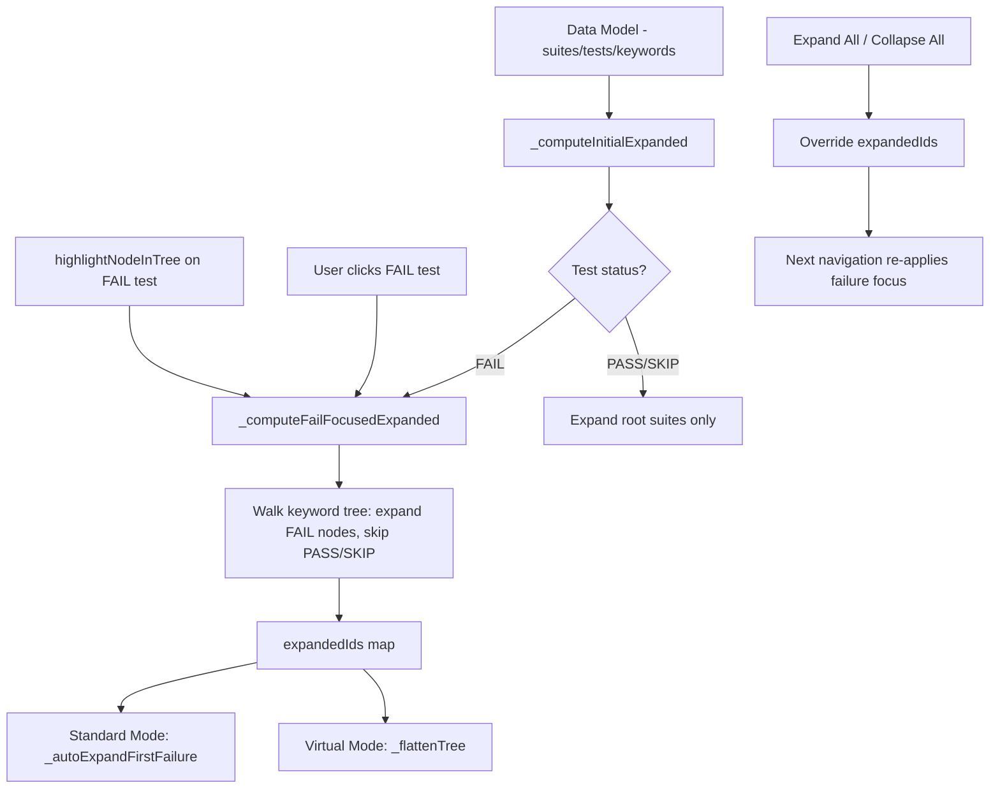

# Design Document: Failure-Focused Collapse

## Overview

This feature changes how the tree view computes its initial expand/collapse state for failing tests. Currently, `_computeInitialExpanded` and `_autoExpandFirstFailure` follow a single FAIL path (the first one found via DFS) and expand every node along it. PASS and SKIP siblings at every level are also expanded, forcing users to manually collapse them to focus on the failure.

The new behavior: when displaying a failing test's keyword subtree, only FAIL-status nodes are expanded. PASS and SKIP siblings stay collapsed. This applies to all FAIL branches (not just the first), so if a test has multiple independent failure paths, all of them are visible. The user retains full manual control — clicking any collapsed node expands it normally.

The change is surgical: modify `_computeInitialExpanded` to walk the full keyword tree of failing tests (expanding all FAIL nodes, skipping PASS/SKIP), and add a helper `_computeFailFocusedExpanded` that can be called from click handlers and `highlightNodeInTree` when navigating to a failing test. No new rendering paths, no new data models, no Python changes.

## Architecture

The feature modifies the expand-state computation layer that sits between the data model and both rendering paths (standard DOM and virtual scroll):



### Key Design Decisions

1. **Modify `_computeInitialExpanded`, don't replace it**: The existing function already handles the "no failures → expand root suites" case. We add the failure-focused logic as the FAIL branch, replacing the current single-path `_findFirstFailPath` approach.

2. **New helper `_computeFailFocusedExpanded(test)`**: A pure function that takes a test data object and returns a set of span IDs to expand. This is reusable from initial load, click handlers, and `highlightNodeInTree`. It walks the keyword tree iteratively (stack-based DFS), adding every FAIL node's ID and skipping PASS/SKIP subtrees.

3. **All FAIL branches, not just the first**: Unlike `_findFirstFailPath` which follows only the first FAIL child, the new helper recurses into ALL FAIL children at each level. This satisfies Requirement 5 (multiple failure branches).

4. **Expand All / Collapse All are simple overrides**: These buttons set expandedIds to "everything" or "nothing". The failure-focused state is re-applied on the next navigation event (clicking a FAIL test, `highlightNodeInTree`, etc.), not after Expand/Collapse All.

5. **Both rendering modes share the same expand computation**: `_computeFailFocusedExpanded` returns a plain object of IDs. Standard mode uses it to drive `_materializeIfNeeded` + `_expandNodeOnly`. Virtual mode uses it directly as `expandedIds` for `_flattenTree`.


## Components and Interfaces

### 1. New Helper: `_computeFailFocusedExpanded(test)`

A pure function that computes the set of node IDs to expand for a failing test's keyword subtree. This is the core of the feature.

```javascript
/**
 * Compute failure-focused expanded IDs for a single failing test.
 * Walks the keyword tree: expands FAIL nodes, skips PASS/SKIP subtrees.
 * Follows ALL FAIL branches (not just the first).
 *
 * @param {Object} test - Test data object with keywords array, status === 'FAIL'
 * @returns {Object} Map of span IDs to expand (id → true)
 */
function _computeFailFocusedExpanded(test) {
  var expanded = {};
  if (test.status !== 'FAIL') return expanded;
  expanded[test.id] = true;
  var stack = (test.keywords || []).slice();
  while (stack.length > 0) {
    var kw = stack.pop();
    if (kw.status !== 'FAIL') continue; // skip PASS/SKIP subtrees
    expanded[kw.id] = true;
    var kids = kw.children || [];
    for (var i = 0; i < kids.length; i++) {
      stack.push(kids[i]);
    }
  }
  return expanded;
}
```

**Properties**:
- Iterative (stack-based), no recursion — safe for deeply nested trees
- Returns only FAIL node IDs — PASS/SKIP siblings are excluded
- Includes the test node itself (so the test is expanded to show its keywords)
- Follows ALL FAIL children at each level (not just the first)

### 2. Modified: `_computeInitialExpanded(suites)`

Replace the current single-path logic with failure-focused expansion for all failing tests.

**Current behavior**: Calls `_findFirstFailPath(suites)` → expands only that one path.

**New behavior**:
1. Walk all suites and tests
2. For each suite that contains a failing descendant, add its ID to expandedIds (so the suite is expanded to reveal its children)
3. For each FAIL test, call `_computeFailFocusedExpanded(test)` and merge the result into expandedIds
4. For PASS/SKIP tests, do not add their IDs (they stay collapsed)
5. If no failures exist, fall back to expanding root suites only (existing behavior)

```javascript
function _computeInitialExpanded(suites) {
  var expandedIds = {};
  var hasFailure = false;

  // Walk suites to find failing tests
  var suiteStack = suites.slice();
  while (suiteStack.length > 0) {
    var suite = suiteStack.pop();
    var children = suite.children || [];
    var suiteHasFail = false;

    for (var i = 0; i < children.length; i++) {
      var child = children[i];
      if (child.keywords !== undefined) {
        // It's a test
        if (child.status === 'FAIL') {
          suiteHasFail = true;
          hasFailure = true;
          var testExpanded = _computeFailFocusedExpanded(child);
          for (var key in testExpanded) {
            expandedIds[key] = true;
          }
        }
      } else {
        // It's a nested suite — push for processing
        suiteStack.push(child);
      }
    }

    // Expand this suite if it has a failing descendant
    if (suiteHasFail || _hasDescendantFail(suite)) {
      expandedIds[suite.id] = true;
    }
  }

  if (!hasFailure) {
    // No failures — expand root suites only (existing behavior)
    for (var j = 0; j < suites.length; j++) {
      if (suites[j].id) expandedIds[suites[j].id] = true;
    }
  }

  return expandedIds;
}
```

### 3. Modified: `_autoExpandFirstFailure(treeRoot, suites)`

Currently expands a single fail path in standard DOM mode. Updated to use `_computeInitialExpanded` for consistency, then materialize and expand all nodes in the returned set.

**New behavior**:
1. Call `_computeInitialExpanded(suites)` to get the full set of IDs to expand
2. For each ID in the set, find the DOM node, materialize lazy children, and expand it
3. Scroll to the first root cause keyword (deepest FAIL node on the first branch)

### 4. Modified: Click handler for FAIL test nodes

In `_createTreeNode`, when a FAIL test node is clicked (toggled open):
- Instead of just toggling, compute `_computeFailFocusedExpanded(test.data)` 
- Materialize and expand the FAIL path nodes within that test's subtree
- Collapse any previously expanded PASS/SKIP siblings within that test

In virtual mode (`_virtualToggle`), when a FAIL test node is toggled open:
- Compute `_computeFailFocusedExpanded(test.data)`
- Merge into `expandedIds`, removing PASS/SKIP keyword IDs that are direct children of the test
- Rebuild flat list and re-render

### 5. Modified: `highlightNodeInTree(spanId)`

When navigating to a span that belongs to a FAIL test:
- Find the test ancestor of the target span
- Apply `_computeFailFocusedExpanded(test)` to set the expand state
- Then expand ancestors of the specific target span (it may be a PASS node the user needs to see)
- Scroll to the target

This ensures the tree shows failure-focused state even when navigating via timeline clicks or programmatic highlight.

### 6. Modified: `_virtualHighlight(spanId)`

Same logic as `highlightNodeInTree` but for virtual scroll mode:
- Find the test ancestor in the data model
- Apply `_computeFailFocusedExpanded(test)` to `expandedIds`
- Expand ancestors of the target span
- Rebuild flat list and scroll to target

### 7. Expand All / Collapse All (no change to core logic)

`_setAllExpanded(true)` and `_virtualSetAllExpanded(true)` already expand everything. `_setAllExpanded(false)` and `_virtualSetAllExpanded(false)` already collapse everything. No changes needed — these override the failure-focused state. The next navigation event (click, highlight) re-applies failure focus per Requirement 6.3.

## Data Models

No new data models. The feature operates on the existing JSON structure and the existing `expandedIds` map.

### Existing Data (consumed, not modified)

```
RFSuite:
  id: string
  status: "PASS" | "FAIL" | "SKIP"
  children: (RFSuite | RFTest)[]

RFTest:
  id: string
  status: "PASS" | "FAIL" | "SKIP"
  keywords: RFKeyword[]

RFKeyword:
  id: string
  status: "PASS" | "FAIL" | "SKIP"
  children: RFKeyword[]
  name: string
```

### Expand State (existing, behavior changed)

```
expandedIds: { [spanId: string]: true }
```

Currently populated by `_findFirstFailPath` (single path). After this feature, populated by `_computeFailFocusedExpanded` (all FAIL branches, excluding PASS/SKIP).


## Correctness Properties

*A property is a characteristic or behavior that should hold true across all valid executions of a system — essentially, a formal statement about what the system should do. Properties serve as the bridge between human-readable specifications and machine-verifiable correctness guarantees.*

### Property 1: Failure-focused expand set equals exactly the FAIL-status nodes

*For any* failing test with a keyword tree of arbitrary depth and branching, `_computeFailFocusedExpanded(test)` shall return a set of IDs that:
- Contains the test's own ID
- Contains the ID of every keyword in the tree with `status === 'FAIL'`
- Does NOT contain the ID of any keyword with `status === 'PASS'` or `status === 'SKIP'`

This holds regardless of tree shape, number of FAIL branches, wrapper vs root-cause classification, or nesting depth.

**Validates: Requirements 1.1, 1.2, 1.3, 1.4, 5.1, 5.2, 5.3**

### Property 2: No-failure fallback expands root suites only

*For any* model where all tests have status PASS or SKIP (no FAIL tests), `_computeInitialExpanded(suites)` shall return a set containing exactly the IDs of the root-level suites and no other IDs.

**Validates: Requirements 1.5**

### Property 3: Suite-level initial expand covers all failing test paths

*For any* model containing one or more FAIL tests, `_computeInitialExpanded(suites)` shall return a set that:
- Contains the ID of every suite that is an ancestor of a FAIL test
- Contains all IDs that `_computeFailFocusedExpanded(test)` would return for each FAIL test
- Does NOT contain the ID of any PASS or SKIP test
- Does NOT contain the ID of any PASS or SKIP keyword that is a child of a FAIL test

**Validates: Requirements 2.3, 4.1**

## Error Handling

### Edge Cases

1. **FAIL test with no keywords**: A test can have `status: 'FAIL'` but an empty `keywords` array (e.g., setup failure before any keywords run). `_computeFailFocusedExpanded` returns `{ [test.id]: true }` — just the test node itself. This is correct: the test is expanded to show it has no children.

2. **FAIL test with all PASS keywords**: A test can be FAIL while all its keywords are PASS (e.g., teardown failure reported at test level). `_computeFailFocusedExpanded` returns `{ [test.id]: true }` — the test is expanded but no keywords are expanded. The user sees all keywords collapsed, which is the correct behavior since none of them failed.

3. **Deeply nested failure chains**: The iterative stack-based DFS in `_computeFailFocusedExpanded` avoids stack overflow. Same pattern already used by `_findRootCauseKeywords` and `_findFirstFailPath`.

4. **Very wide trees (many siblings)**: A FAIL keyword with hundreds of PASS siblings — only the FAIL keyword is expanded. The PASS siblings are collapsed, which is exactly the desired behavior and also improves rendering performance.

5. **Multiple independent failure branches**: A test with `Run Keyword And Continue On Failure` can have multiple FAIL branches at the same level. All FAIL branches are expanded because the algorithm follows ALL FAIL children, not just the first.

6. **Expand All then navigate**: After Expand All, all nodes are expanded. When the user clicks a FAIL test or `highlightNodeInTree` is called, the failure-focused state is re-applied for that test's subtree. PASS siblings within that test collapse. Nodes outside the test's subtree remain in their current state.

7. **Virtual scroll mode consistency**: `_computeInitialExpanded` is called once and its result is used as `expandedIds` for `_flattenTree`. Both rendering modes use the same function, so behavior is identical.

8. **Live polling / re-render**: When new data arrives, `_renderTreeWithFilter` is called again. For virtual mode, `_computeInitialExpanded` is only called on first render (not re-renders triggered by filter changes). The existing re-render logic preserves `expandedIds` across filter changes, which is correct — the user's expand state should not reset when a filter changes.

## Testing Strategy

### Property-Based Testing

Property-based tests use **Hypothesis** (Python) with the project's existing profile system (`dev` for fast feedback, `ci` for thorough coverage). No hardcoded `@settings`.

Since the expand-state logic lives in JavaScript (`tree.js`), property tests validate equivalent Python implementations of `_computeFailFocusedExpanded` and `_computeInitialExpanded`. These Python functions mirror the JS logic exactly and are tested against generated keyword tree structures.

Test file: `tests/unit/test_failure_focused_collapse_properties.py`

Each property test is tagged with a comment referencing the design property:

```python
# Feature: failure-focused-collapse, Property 1: Failure-focused expand set equals exactly the FAIL-status nodes
@given(st.data())
def test_fail_focused_expand_contains_exactly_fail_nodes(data):
    """For any failing test tree, expanded set == {test.id} ∪ {all FAIL keyword IDs}."""
    ...

# Feature: failure-focused-collapse, Property 2: No-failure fallback expands root suites only
@given(st.data())
def test_no_failure_fallback_expands_root_suites(data):
    """For any all-PASS/SKIP model, expanded set == {root suite IDs}."""
    ...

# Feature: failure-focused-collapse, Property 3: Suite-level initial expand covers all failing test paths
@given(st.data())
def test_initial_expand_covers_all_fail_paths(data):
    """For any model with failures, expanded set includes all FAIL paths and ancestor suites."""
    ...
```

**Generators**: A custom Hypothesis strategy generates random keyword trees:
- Random tree depth (1–5 levels)
- Random branching factor (0–4 children per keyword)
- Random status assignment (FAIL, PASS, SKIP) with constraints:
  - At least one FAIL path for failure tests
  - All PASS/SKIP for no-failure tests
- Random keyword names (mix of control flow wrappers and arbitrary strings)
- Suite structures with nested suites and tests

### Unit Tests

Unit tests cover specific examples and edge cases:

- **Single FAIL path**: Linear chain of FAIL keywords — all expanded
- **Multiple FAIL branches**: Two independent FAIL paths — both expanded
- **FAIL test with all PASS keywords**: Only test node expanded
- **FAIL test with no keywords**: Only test node expanded
- **Mixed siblings**: FAIL and PASS keywords at same level — only FAIL expanded
- **Wrapper keywords**: FAIL wrappers with FAIL children — both expanded
- **Root cause keywords**: FAIL leaf keywords — expanded
- **No failures in model**: Root suites only expanded
- **Real-world example (J2_TC02_Step13)**: The example from the requirements — verify the exact expand set matches the expected tree shape

Test file: `tests/unit/test_failure_focused_collapse_unit.py`

### Manual Testing

- Visual verification that PASS branches collapse on initial load with a failing test
- Click a FAIL test node → verify FAIL path expands, PASS siblings collapse
- Click Expand All → verify everything expands → click a FAIL test → verify failure focus re-applied
- Click Collapse All → verify everything collapses
- Virtual scroll mode: same behavior as standard mode
- `highlightNodeInTree` from timeline click on a FAIL keyword → verify failure-focused state
- Multiple failure branches visible simultaneously

### Docker-Only Execution

All tests run inside the `rf-trace-test:latest` Docker image:

```bash
make test-unit                    # Fast feedback (dev profile)
make dev-test-file FILE=tests/unit/test_failure_focused_collapse_properties.py
make test-full                    # Full PBT iterations before merge
```
