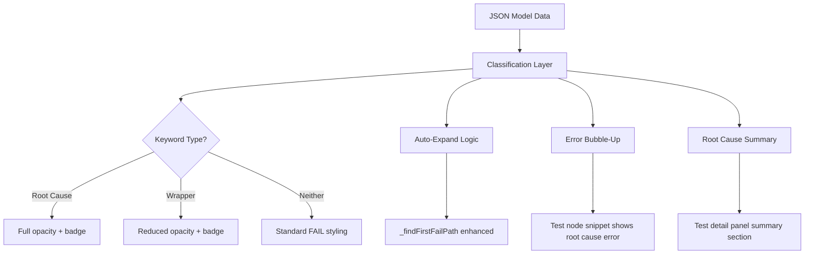

# Design Document: Failure Root Cause UX

## Overview

This feature enhances the RF Trace Viewer's failure investigation workflow by automatically identifying root cause keywords, expanding the tree to them, surfacing their error messages, and visually distinguishing control flow wrappers from true failure origins.

The core insight: when a Robot Framework test fails, the actual assertion error is buried deep in the keyword hierarchy. Most FAIL keywords along the path are control flow wrappers (IF, TRY, Run Keyword And Continue On Failure, etc.) that fail only because a child failed. This feature classifies each FAIL keyword as either a Root Cause (leaf of the failure chain) or a Wrapper, then uses that classification to drive UX improvements across the tree view, detail panels, and error snippets.

All logic lives in `tree.js` (client-side JavaScript). No changes to the Python data model or generator pipeline are needed — the classification is computed at render time from the existing `status`, `children`, and `name` fields already present in the JSON data.

## Architecture

The feature adds a single classification layer that feeds into multiple rendering paths:



### Key Design Decisions

1. **Client-side classification only**: The classification runs in `tree.js` at render time. No changes to `rf_model.py`, `generator.py`, or the JSON data format. This keeps the feature self-contained and backward-compatible with existing reports.

2. **Configurable wrapper list**: The control flow keyword patterns are stored in a module-level array in `tree.js`, making it easy to extend without touching classification logic.

3. **Depth-first, first-match semantics**: When a test has multiple failure branches, we follow the first FAIL child at each level (matching existing `_findFirstFailPath` behavior). This is consistent and predictable.

4. **Classification is computed, not cached**: Each call to the classification function walks the immediate children of a keyword. Since keywords rarely have more than a few dozen direct children, this is O(n) per keyword and doesn't need memoization.

## Components and Interfaces

### 1. Classification Module (new functions in tree.js)

```javascript
/**
 * List of control flow keyword name patterns.
 * Matched case-insensitively against keyword names.
 */
var CONTROL_FLOW_WRAPPERS = [
  'Run Keyword And Continue On Failure',
  'Run Keyword If',
  'Run Keyword Unless',
  'Run Keyword And Expect Error',
  'Run Keyword And Ignore Error',
  'Run Keyword And Return Status',
  'Wait Until Keyword Succeeds',
  'Repeat Keyword',
  'IF', 'ELSE IF', 'ELSE',
  'TRY', 'EXCEPT', 'FINALLY',
  'FOR', 'WHILE'
];

/**
 * Classify a FAIL keyword.
 * @param {Object} kw - Keyword data object with status, children/keywords, name
 * @returns {'root-cause'|'wrapper'|'none'} 
 *   - 'root-cause': FAIL with no FAIL children (leaf of failure chain)
 *   - 'wrapper': FAIL with FAIL children AND name matches control flow pattern
 *   - 'none': FAIL with FAIL children but not a known wrapper
 */
function _classifyFailKeyword(kw) { ... }

/**
 * Find all root cause keywords within a test's keyword tree.
 * @param {Object} test - Test data object with keywords array
 * @returns {Array<Object>} Array of root cause keyword data objects
 */
function _findRootCauseKeywords(test) { ... }

/**
 * Find the first root cause keyword in depth-first order.
 * Returns the span ID path from test to root cause.
 * @param {Object} test - Test data object
 * @returns {Array<string>} Array of span IDs forming the path
 */
function _findRootCausePath(test) { ... }
```

### 2. Enhanced Auto-Expand (modifications to existing functions)

- `_findFirstFailPath(suites)`: No change needed — it already finds the deepest FAIL path. The root cause keyword IS the deepest FAIL keyword on the first failure branch (a FAIL keyword with no FAIL children is by definition the deepest).
- `_autoExpandFirstFailure(treeRoot, suites)`: Already expands to the deepest FAIL node. No change needed for Requirement 2.4.
- `_computeInitialExpanded(suites)`: Already uses `_findFirstFailPath`. No change needed.

For Requirement 2.1 (clicking a failing test triggers auto-expand), we add a handler in `_createTreeNode` that detects clicks on FAIL test nodes and expands the failure path within that test.

### 3. Detail Panel Enhancements (modifications to existing functions)

- `_renderTestDetail(panel, data)`: Add root cause summary section after the existing error block. Calls `_findRootCauseKeywords(data)` and renders each as a clickable entry.
- `_renderKeywordDetail(panel, data)`: Add "Root Cause" or "Wrapper" badge adjacent to the status badge when the keyword is classified.

### 4. Error Snippet Bubble-Up (modification to _createTreeNode)

In `_createTreeNode`, when rendering a test node with `status === 'FAIL'`, call `_findRootCauseKeywords(data)` and use the first root cause's `status_message` for the error snippet instead of the test-level `status_message`.

### 5. CSS Classes (additions to style.css)

| Class | Purpose |
|---|---|
| `.tree-row.kw-wrapper` | Reduced opacity for control flow wrapper FAIL keywords |
| `.root-cause-badge` | "Root Cause" badge in keyword detail panel |
| `.wrapper-badge` | "Wrapper" badge in keyword detail panel |
| `.root-cause-summary` | Container for root cause summary in test detail panel |
| `.root-cause-entry` | Individual clickable root cause entry |

### 6. Virtual Scroll Mode Integration

- `_flattenTree`: Add `rootCauseClass` field to flat items for FAIL keywords (computed via `_classifyFailKeyword`).
- `_createVirtualRow`: Apply wrapper opacity class based on the `rootCauseClass` field.
- `_computeInitialExpanded`: Already uses `_findFirstFailPath` which finds the deepest FAIL — no change needed.

## Data Models

No new data models are introduced. The feature operates on the existing JSON data structure:

### Existing Data (consumed, not modified)

```
RFTest (JSON):
  name: string
  id: string (span ID)
  status: "PASS" | "FAIL" | "SKIP"
  status_message: string
  keywords: RFKeyword[]

RFKeyword (JSON):
  name: string
  id: string (span ID)  
  status: "PASS" | "FAIL" | "SKIP"
  status_message: string
  keyword_type: string
  children: RFKeyword[]
  args: string
  library: string
```

### Classification Result (computed at render time, not persisted)

```
ClassificationResult: 'root-cause' | 'wrapper' | 'none'
```

The classification is derived from:
- `kw.status === 'FAIL'` (precondition)
- `kw.children` (or `kw.keywords` for tests) — check if any child has `status === 'FAIL'`
- `kw.name` — check against `CONTROL_FLOW_WRAPPERS` list

### Root Cause Summary Data (computed per test, not persisted)

```
RootCauseInfo:
  name: string        // keyword name
  status_message: string  // the actual error message
  id: string          // span ID for click-to-navigate
```


## Correctness Properties

*A property is a characteristic or behavior that should hold true across all valid executions of a system — essentially, a formal statement about what the system should do. Properties serve as the bridge between human-readable specifications and machine-verifiable correctness guarantees.*

### Property 1: Classification correctness

*For any* FAIL keyword with a tree of children, the classification function shall return:
- `'root-cause'` if no child has FAIL status,
- `'wrapper'` if at least one child has FAIL status AND the keyword name matches a known control flow pattern (case-insensitive),
- `'none'` if at least one child has FAIL status AND the keyword name does NOT match a known control flow pattern.

Additionally, for any keyword with status other than FAIL, the classification function shall not be called (precondition).

**Validates: Requirements 1.1, 1.2, 1.3**

### Property 2: Root cause path follows depth-first order

*For any* failing test with a keyword tree containing one or more Root_Cause_Keywords, `_findRootCausePath` shall return a path of span IDs from the test to the first Root_Cause_Keyword encountered in depth-first traversal order. The last ID in the path shall correspond to a keyword classified as `'root-cause'`.

**Validates: Requirements 2.3**

### Property 3: Root cause summary completeness

*For any* failing test, the list returned by `_findRootCauseKeywords` shall contain exactly the set of FAIL keywords in the test's keyword tree that have no FAIL children. Each entry shall preserve the keyword's `name`, `status_message`, and `id` fields. The count of entries shall equal the count of root cause keywords in the tree.

**Validates: Requirements 3.2, 3.3, 3.4**

### Property 4: Error snippet bubble-up

*For any* failing test node, if `_findRootCauseKeywords` returns a non-empty list, the error snippet text shall be derived from the `status_message` of the first entry (depth-first order). If `_findRootCauseKeywords` returns an empty list, the error snippet text shall be derived from the test's own `status_message`.

**Validates: Requirements 5.1, 5.2, 5.3**

### Property 5: Detail panel preserves test-level error

*For any* failing test, regardless of whether root cause keywords exist, the test detail panel's Error_Block shall display the test-level `status_message`. The bubble-up applies only to the inline Error_Snippet on the tree node, not to the detail panel.

**Validates: Requirements 5.4**

## Error Handling

### Edge Cases

1. **FAIL test with no FAIL keywords**: A test can have `status: 'FAIL'` while all its keywords are PASS (e.g., test-level setup failure or external timeout). In this case, `_findRootCauseKeywords` returns an empty array. The error snippet falls back to the test-level `status_message`, and no root cause summary section is rendered.

2. **Deeply nested failure chains**: The DFS traversal in `_findRootCausePath` and `_findRootCauseKeywords` uses an iterative stack (not recursion) to avoid stack overflow on deeply nested keyword trees.

3. **Empty keyword name**: If a keyword has an empty or missing `name` field, the control flow pattern matching returns false, so it would be classified as `'none'` (not a wrapper) if it has FAIL children, or `'root-cause'` if it has no FAIL children. This is correct behavior.

4. **Multiple root causes in different branches**: When a test has multiple failure branches (e.g., via `Run Keyword And Continue On Failure`), `_findRootCauseKeywords` collects ALL root causes across all branches. The summary shows all of them. The error snippet and auto-expand use only the first (DFS order).

5. **Virtual scroll mode**: Classification is computed on the data model, not the DOM. The `_flattenTree` function annotates each flat item with its classification, so `_createVirtualRow` can apply the correct CSS class without re-computing.

6. **Live polling mode**: When new data arrives via polling, the tree is re-rendered. Classification is stateless and computed fresh each render, so it automatically picks up new/changed keywords.

## Testing Strategy

### Property-Based Testing

Property-based tests use the **Hypothesis** library (Python) with the project's existing profile system (`dev` profile for fast feedback, `ci` profile for thorough coverage). No hardcoded `@settings` — the profile controls iteration counts.

Since the classification logic lives in JavaScript (`tree.js`), property tests will validate equivalent Python implementations of the classification functions. These Python functions mirror the JS logic exactly and are tested against generated keyword tree structures.

Test file: `tests/unit/test_root_cause_classification.py`

Each property test is tagged with a comment referencing the design property:

```python
# Feature: failure-root-cause-ux, Property 1: Classification correctness
@given(st.data())
def test_classification_correctness(data):
    ...

# Feature: failure-root-cause-ux, Property 2: Root cause path follows depth-first order
@given(st.data())
def test_root_cause_path_dfs_order(data):
    ...

# Feature: failure-root-cause-ux, Property 3: Root cause summary completeness
@given(st.data())
def test_root_cause_summary_completeness(data):
    ...

# Feature: failure-root-cause-ux, Property 4: Error snippet bubble-up
@given(st.data())
def test_error_snippet_bubble_up(data):
    ...

# Feature: failure-root-cause-ux, Property 5: Detail panel preserves test-level error
@given(st.data())
def test_detail_panel_preserves_test_error(data):
    ...
```

**Generators**: A custom Hypothesis strategy generates random keyword trees:
- Random tree depth (1–6 levels)
- Random branching factor (0–5 children per keyword)
- Random status assignment (FAIL, PASS, SKIP) with constraint that at least one path has FAIL keywords
- Random keyword names drawn from both the control flow wrapper list and arbitrary strings
- Random `status_message` strings

### Unit Tests

Unit tests cover specific examples, edge cases, and integration points:

- **Classification examples**: Known keyword structures with expected classifications
- **Edge case: FAIL test with all PASS keywords**: Verify empty root cause list and fallback behavior
- **Edge case: Single keyword test**: FAIL test with one FAIL keyword (no children) → that keyword is root cause
- **Edge case: Wrapper name matching**: Case-insensitive matching, partial matches should NOT match
- **Integration: Error snippet content**: Verify the snippet text matches the first root cause's message
- **Integration: Summary section rendering**: Verify the summary contains all root cause entries

Test file: `tests/unit/test_root_cause_unit.py`

### Manual Testing

- Visual verification of wrapper opacity in light and dark themes
- Click-to-expand behavior on failing test nodes
- Scroll-into-view behavior after auto-expand
- Failures Only toggle with root cause styling
- Virtual scroll mode rendering
- Live polling mode with changing failure data

### Docker-Only Execution

All tests run inside the `rf-trace-test:latest` Docker image:

```bash
make test-unit                    # Fast feedback (dev profile)
make dev-test-file FILE=tests/unit/test_root_cause_classification.py  # Single file
make test-full                    # Full PBT iterations before merge
```
