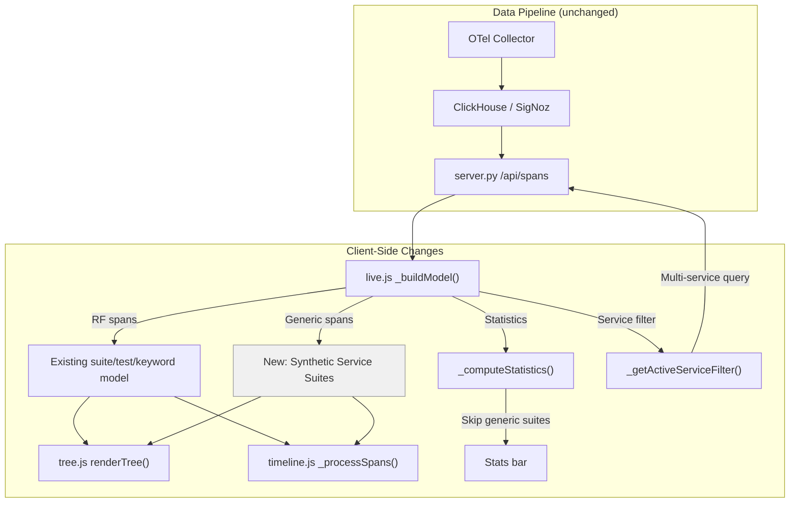

# Design Document: Generic OTel Span Rendering

## Overview

The RF Trace Viewer currently classifies incoming OTel spans into four RF-specific buckets (suite, test, keyword, signal) via `_buildModel()` in `live.js`. Spans from non-RF services that lack `rf.*` attributes are silently dropped — they never enter the model, so the tree and timeline render nothing for them.

Cross-service spans that are children of RF keyword spans already render correctly as `EXTERNAL` keyword nodes. The gap is **standalone root spans** from non-RF services (e.g. `essvt-ui` browser instrumentation) that have no parent relationship to any RF span.

This design adds a "generic span" rendering path that:
1. Collects unclassified spans in `_buildModel()`
2. Groups them by `service.name` into synthetic service suites
3. Renders them in the tree, timeline, and detail panel with white/neutral styling
4. Excludes them from RF test statistics
5. Fixes the service filter to support multi-service queries

All changes are client-side JavaScript and CSS. No server-side Python changes are needed — the server already returns all spans correctly.

## Architecture

The feature touches four viewer files and one CSS file. No new files are created.



### Data Flow

1. `_buildModel()` classifies spans as before (suite/test/keyword/signal)
2. **New**: After classification, a second pass collects spans that matched none of the four RF buckets AND whose `parent_span_id` is not in the current span set
3. These "generic spans" are grouped by `service.name` (missing → `"unknown"`)
4. Each group becomes a `Synthetic_Service_Suite` node appended to `rootSuites`
5. Each generic span becomes a child node with `keyword_type: 'GENERIC'`
6. Tree, timeline, and flow-table renderers consume these nodes via existing traversal logic — minimal branching needed

## Components and Interfaces

### 1. `live.js` — `_buildModel()` Extension

**Location**: After the existing span classification loop (~line 1534), before `rootSuites.sort()`.

**New logic**:
```
for each span in spans:
    if span has any rf.* attribute → skip (already classified)
    if span.parent_span_id exists in byId → skip (EXTERNAL path handles it)
    → add to genericSpans[]

group genericSpans by span.attributes['service.name'] (default: 'unknown')

for each service group:
    create Synthetic_Service_Suite node:
        name: service_name
        id: '__generic_' + service_name
        _is_generic_service: true
        status: FAIL if any child FAIL, else PASS
        start_time: min(children.start_time)
        end_time: max(children.end_time)
        children: generic span nodes with keyword_type 'GENERIC'
    
    append to rootSuites[]
```

**Generic span node shape** (child of synthetic suite):
```js
{
  name: spanName,           // from span.name, HTTP attrs, or 'unknown'
  keyword_type: 'GENERIC',
  service_name: svcName,
  args: '',
  status: _mapStatus(span),
  start_time: span.start_time,
  end_time: span.end_time,
  elapsed_time: _elapsedMs(span.start_time, span.end_time),
  id: span.span_id,
  attributes: span.attributes,
  events: _mapEvents(span.events),
  children: buildKeywords(span.span_id)  // pick up nested children
}
```

**Naming fallback chain**:
1. `span.name` if non-empty
2. `METHOD PATH` from `http.request.method`/`http.method` + `url.path`/`http.route`/`http.target`
3. `'unknown'`

### 2. `live.js` — `_computeStatistics()` Guard

Add a guard at the top of `walkSuite()`:

```js
if (suite._is_generic_service) return;  // skip generic service suites
```

This prevents generic spans from inflating test pass/fail/skip counts and excludes synthetic suites from `suite_stats`.

### 3. `live.js` — `_getActiveServiceFilter()` Multi-Service Fix

**Current behavior**: Returns only `active[0]` when multiple services are checked.

**New behavior**: Return comma-separated list of all active services:

```js
if (active.length > 1) return active.join(',');
```

The server's `/api/spans` endpoint receives this as the `service` query parameter. The `SigNozProvider.poll_new_spans()` already handles comma-separated service names in its query builder, so no server changes are needed. If the server doesn't support comma-separated values, the client-side filtering in `_buildModel()` already handles it — the server returns all spans when service is empty, and the client filters by `_activeServices`.

### 4. `tree.js` — `_createTreeNode()` Extension

**In the kwType class assignment block** (~line 2300):

```js
} else if (opts.kwType === 'GENERIC') {
  row.classList.add('kw-generic');
}
```

**In the service badge block** (~line 2335):

```js
if (opts.data && opts.data.service_name && 
    (opts.kwType === 'EXTERNAL' || opts.kwType === 'GENERIC')) {
```

This reuses the existing `svc-name-badge` rendering for GENERIC spans.

**In `_renderSuiteNode()`** — after creating the suite tree node, check for the generic flag:

```js
if (suite._is_generic_service) {
  node.classList.add('suite-generic-service');
}
```

### 5. `tree.js` — `_renderDetailPanel()` Extension

In `_renderKeywordDetail()`, add a branch for GENERIC keyword_type that renders all `data.attributes` as a key-value table. The existing keyword detail already shows `keyword_type` and `service_name` badges. The new addition is an attributes table:

```js
if (data.keyword_type === 'GENERIC' && data.attributes) {
  _addAttributesTable(panel, data.attributes);
}
```

New helper `_addAttributesTable(panel, attrs)`:
- Creates a `<table>` with class `generic-attrs-table`
- Iterates `Object.keys(attrs)` sorted alphabetically
- Each row: `<td>key</td><td>value</td>`
- Skips `service.name` (already shown as badge)

### 6. `timeline.js` — `_getSpanColors()` Extension

Add a branch for GENERIC keyword type before the default keyword color return:

```js
if (span.kwType === 'GENERIC') {
  return isDark
    ? { top: '#4a4a4a', bottom: '#3a3a3a', border: 'rgba(255,255,255,0.08)', text: '#cccccc' }
    : { top: '#f5f5f5', bottom: '#e0e0e0', border: 'rgba(0,0,0,0.1)', text: '#555555' };
}
```

This gives generic spans a white/light-grey (light theme) or dark-grey (dark theme) appearance, clearly distinct from the blue RF keyword bars and red FAIL bars.

**No changes needed to `_processSpans()`** — it already traverses `suite.children` recursively and handles keyword nodes via the `children` array. Since generic span nodes have `keyword_type` set, they flow through the existing keyword branch of the traversal.

### 7. `flow-table.js` — GENERIC Badge

Add `'GENERIC': 'GEN'` to the `BADGE_LABELS` map. Add context line rendering for GENERIC spans (reuse the existing `extractSpanAttributes` + `generateContextLine` logic already used for EXTERNAL spans).

### 8. `style.css` — New CSS Classes

```css
/* Generic OTel span rows — white/neutral theme */
.rf-trace-viewer .tree-row.kw-generic {
  border-left: 3px solid #bdbdbd;
}
.rf-trace-viewer .kw-generic .node-type {
  color: #757575;
}
.rf-trace-viewer .kw-generic .svc-name-badge {
  background: #ffffff;
  color: #555;
  border: 1px solid #ccc;
}

/* Generic service suite nodes */
.rf-trace-viewer .suite-generic-service > .tree-row {
  border-left: 3px solid #e0e0e0;
}
.rf-trace-viewer .suite-generic-service > .tree-row .node-type {
  color: #9e9e9e;
}

/* Dark theme variants */
.rf-trace-viewer.theme-dark .tree-row.kw-generic {
  border-left-color: #616161;
}
.rf-trace-viewer.theme-dark .kw-generic .node-type {
  color: #9e9e9e;
}
.rf-trace-viewer.theme-dark .kw-generic .svc-name-badge {
  background: #424242;
  color: #bbb;
  border-color: #555;
}
.rf-trace-viewer.theme-dark .suite-generic-service > .tree-row {
  border-left-color: #555;
}

/* Attributes table in generic span detail panel */
.rf-trace-viewer .generic-attrs-table { ... }
```

## Data Models

### Synthetic Service Suite (new model node)

```js
{
  name: "essvt-ui",                    // service.name value
  id: "__generic_essvt-ui",            // prefixed ID
  source: "",                          // no RF source
  status: "PASS",                      // FAIL if any child FAIL
  start_time: 1773727000.0,            // min of children
  end_time: 1773727045.0,              // max of children
  elapsed_time: 45000,                 // ms
  doc: "Generic OTel spans from essvt-ui",
  _is_generic_service: true,           // flag for renderers
  children: [/* Generic span nodes */]
}
```

### Generic Span Node (child of synthetic suite)

```js
{
  name: "GET /api/v1/projects",        // from naming fallback chain
  keyword_type: "GENERIC",             // new keyword type
  service_name: "essvt-ui",            // from service.name attr
  args: "",
  status: "PASS",
  start_time: 1773727000.0,
  end_time: 1773727000.045,
  elapsed_time: 45,
  id: "abc123",                        // original span_id
  attributes: {                        // all original OTel attributes
    "service.name": "essvt-ui",
    "http.request.method": "GET",
    "url.path": "/api/v1/projects",
    "http.response.status_code": "200",
    "browser.platform": "Linux x86_64"
  },
  events: [],
  children: []                         // from buildKeywords()
}
```

### Existing Models (unchanged)

- RF Suite, Test, Keyword nodes — no structural changes
- EXTERNAL keyword nodes — no changes
- Statistics object — shape unchanged, just excludes generic suites

## Correctness Properties

*A property is a characteristic or behavior that should hold true across all valid executions of a system — essentially, a formal statement about what the system should do. Properties serve as the bridge between human-readable specifications and machine-verifiable correctness guarantees.*


### Property 1: Generic Span Classification

*For any* span in the input set, it is classified as a Generic_Span if and only if it has no `rf.*` attributes (`rf.type`, `rf.suite.name`, `rf.test.name`, `rf.keyword.name`, `rf.signal`) AND its `parent_span_id` does not reference a span present in the current span set. Spans with any `rf.*` attribute are classified via existing RF logic; spans whose parent is in the set are handled by the EXTERNAL path.

**Validates: Requirements 1.1, 1.2, 1.3**

### Property 2: Service Grouping

*For any* set of Generic_Spans, the number of Synthetic_Service_Suites created equals the number of distinct `service.name` values among those spans (treating missing/empty `service.name` as `"unknown"`), and each suite's children array contains exactly the spans with that `service.name`.

**Validates: Requirements 2.1, 2.2, 2.3**

### Property 3: Synthetic Suite Structural Invariants

*For any* Synthetic_Service_Suite produced by `_buildModel()`: its `id` starts with `"__generic_"`, its `_is_generic_service` flag is `true`, its `start_time` equals the minimum `start_time` of its children, its `end_time` equals the maximum `end_time` of its children, its `status` is `"FAIL"` if any child has status `"FAIL"` and `"PASS"` otherwise, it appears in the `rootSuites` array, and each child node has `keyword_type` `"GENERIC"` with the original span attributes preserved in an `attributes` property.

**Validates: Requirements 3.1, 3.2, 3.3, 3.4**

### Property 4: Generic Span Naming

*For any* Generic_Span, the resulting node name equals `span.name` if non-empty; otherwise equals `"METHOD PATH"` constructed from HTTP semantic convention attributes (`http.request.method`/`http.method` + `url.path`/`http.route`/`http.target`) if available; otherwise equals `"unknown"`.

**Validates: Requirements 4.1, 4.2, 4.3**

### Property 5: Tree DOM Rendering for Generic Spans

*For any* tree node created from a Generic_Span (keyword_type `"GENERIC"`), the DOM row element has CSS class `kw-generic`, and if the span has a `service_name`, a `svc-name-badge` element is present. For any suite node with `_is_generic_service: true`, the DOM element has CSS class `suite-generic-service`.

**Validates: Requirements 5.1, 5.2, 5.3**

### Property 6: Detail Panel Attribute Rendering

*For any* Generic_Span node with an `attributes` object containing N key-value pairs, the detail panel rendered by `_renderKeywordDetail()` contains the span name, service name, duration, status, and a table with at least N-1 rows (excluding `service.name` which is shown as a badge). Every attribute key present in the span's `attributes` object appears in the rendered detail panel.

**Validates: Requirements 6.1, 6.2**

### Property 7: Timeline Inclusion and Color Distinction

*For any* model containing Synthetic_Service_Suites with Generic_Span children, after `_processSpans()` traversal, the timeline's `flatSpans` array includes those generic spans. For any span with `kwType` of `"GENERIC"`, `_getSpanColors()` returns a white/light-grey color scheme (light theme) or dark-grey color scheme (dark theme), distinct from the blue (suite/test) and grey (default keyword) color schemes used for RF spans.

**Validates: Requirements 7.1, 7.2, 7.3**

### Property 8: Statistics Exclusion

*For any* model containing both RF suites and Synthetic_Service_Suites, `_computeStatistics()` returns totals (`total_tests`, `passed`, `failed`, `skipped`) that count only children of RF suites, and the `suite_stats` array contains no entries where the suite name matches a Synthetic_Service_Suite name.

**Validates: Requirements 9.1, 9.2, 9.3**

### Property 9: RF Classification Regression

*For any* span with at least one `rf.*` attribute, `_buildModel()` classifies it using the existing suite/test/keyword/signal logic and does not treat it as a Generic_Span. For any cross-service child span (parent in the span set, different `service.name`), it receives `keyword_type: 'EXTERNAL'` unchanged.

**Validates: Requirements 10.1, 10.2**

### Property 10: Multi-Service Filter Query

*For any* set of active services in `_activeServices`, `_getActiveServiceFilter()` returns a string containing all active service names (comma-separated when multiple). When no services are active, it returns an empty string (show all). The model produced by `_buildModel()` includes Synthetic_Service_Suites only for services that are included by the current filter state.

**Validates: Requirements 11.1, 11.2, 11.3, 11.5**

### Property 11: Service Filter Label Accuracy

*For any* state of `_activeServices` and `_knownServices`, the service filter button label reads `"Services (all)"` when no services are checked, the single service name when exactly one is checked, or `"N/M services"` when multiple are checked (where N is the count of checked services and M is the total known).

**Validates: Requirements 11.6**

## Error Handling

### Malformed Spans
- Generic spans with missing `start_time` or `end_time`: Use `0` / current time as fallback (consistent with existing RF span handling)
- Generic spans with non-string `service.name`: Coerce to string via `String()` or fall back to `"unknown"`
- Generic spans with circular parent references: The `parent_span_id in byId` check prevents infinite loops — if the parent is in the set, the span is not classified as generic

### Empty States
- No generic spans found: No synthetic suites created, no visual change — existing behavior preserved
- All generic spans from a single service: One synthetic suite created
- Generic spans with no attributes: Node created with empty `attributes` object, name falls back to `"unknown"`

### Service Filter Edge Cases
- Service filter returns comma-separated string but server doesn't support it: The client-side `_buildModel()` already filters by `_activeServices` when building the model, so the tree/timeline only show spans from active services regardless of server behavior
- Rapid service toggle (thrash protection): Existing `_recordToggle()` / `_scheduleThrashUnlock()` logic applies to generic services identically

### Performance
- Large number of generic spans (10K+): The classification loop is O(n) — one additional pass over all spans. Grouping by service name uses a hash map, O(n). No performance regression expected.
- Virtual scroll: Generic span nodes flow through the existing virtual scroll infrastructure in `tree.js` without changes — they are flat items like any other keyword node.

## Testing Strategy

### Property-Based Testing (Hypothesis)

The project uses Python with Hypothesis for property-based testing. Each correctness property maps to a single Hypothesis test. Tests run inside the `rf-trace-test:latest` Docker container via `make test-unit`.

**Library**: Hypothesis (already in use — see `.hypothesis/` directory)
**Minimum iterations**: 100 per property (Hypothesis `dev` profile)
**Tag format**: `# Feature: generic-otel-span-rendering, Property N: <title>`

Since the core logic lives in JavaScript (`live.js`), property tests will target the **data transformation logic** by:
1. Extracting the classification, grouping, naming, and statistics functions into testable pure-function equivalents in Python test helpers
2. Using Hypothesis strategies to generate random span data (with/without `rf.*` attributes, various `service.name` values, parent relationships)
3. Verifying the properties hold across all generated inputs

Key strategies needed:
- `st_otel_span()`: Generates a span dict with random attributes, optional `rf.*` fields, optional `parent_span_id`
- `st_generic_span()`: Generates a span with no `rf.*` attributes and no parent in set
- `st_rf_span()`: Generates a span with at least one `rf.*` attribute
- `st_span_set()`: Generates a mixed set of RF and generic spans

Properties 5, 6, 7 (DOM/canvas rendering) are harder to test with Hypothesis since they involve browser DOM. These will be covered by unit tests using DOM assertions (or manual testing).

### Unit Tests

Unit tests complement property tests for specific examples and edge cases:

- **Classification edge cases**: Span with `rf.type` but empty value, span with only `rf.signal`, span with parent in set
- **Naming edge cases**: Span with empty name and `http.method` (old convention) vs `http.request.method` (new convention), span with only `url.path` but no method
- **Statistics**: Model with 0 generic suites, model with only generic suites, model with mixed
- **Service filter**: 0 active, 1 active, 3 active, label text verification
- **CSS class assertions**: Verify `kw-generic`, `suite-generic-service` classes are applied (JSDOM or manual)
- **Timeline colors**: Verify `_getSpanColors()` returns correct colors for GENERIC kwType
- **Detail panel**: Verify attributes table renders all keys for a known span

### Integration / Manual Testing

1. Open trace-report live view with `essvt-ui` spans in ClickHouse
2. Verify service dropdown lists `essvt-ui` with span count
3. Verify tree shows collapsible "essvt-ui" service node with HTTP spans
4. Verify timeline shows white/neutral Gantt bars for generic spans
5. Verify clicking a generic span shows OTel attributes in detail panel
6. Verify stats bar counts only RF test pass/fail/skip
7. Verify multi-service filter works (check robot + essvt-ui simultaneously)
8. Verify RF suite/test/keyword rendering is unchanged
