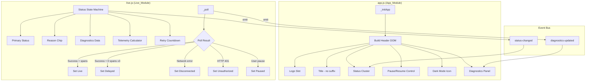
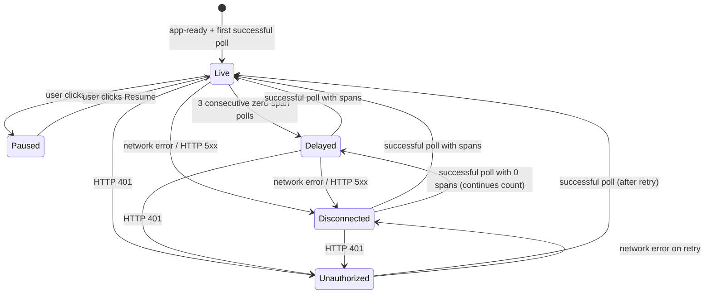

# Design Document: Header Status & Diagnostics

## Overview

This feature redesigns the RF Trace Viewer header to consolidate scattered status indicators into a unified, clickable Status Cluster with a diagnostics dropdown. The connection state model is upgraded from a binary live/snapshot toggle to a five-state primary status (`Live`, `Paused`, `Delayed`, `Disconnected`, `Unauthorized`) with secondary reason chips. The dark mode toggle is demoted to a compact icon, the Live/Snapshot toggle is replaced with a clear Pause/Resume button, and an optional white-label logo slot is added.

All changes are implemented in vanilla JS (no framework) within the existing IIFE architecture of `app.js` and `live.js`, with CSS additions to `style.css` using the existing custom property theme system.

### Key Design Decisions

1. **State machine in live.js, rendering in app.js**: The `Live_Module` owns the status state machine and exposes state via a shared object on `window.RFTraceViewer`. The `App_Module` reads this state to render the Status Cluster and Diagnostics Panel. This preserves the existing separation where `live.js` handles polling logic and `app.js` handles DOM construction.

2. **Event-driven UI updates**: Status changes are communicated via the existing `eventBus` (`RFTraceViewer.emit('status-changed', ...)`), so the header UI updates reactively without tight coupling.

3. **No new JS files**: All changes fit within the existing `app.js`, `live.js`, and `theme.js` files. The feature adds CSS to `style.css`. This avoids changing the asset embedding pipeline in `generator.py` and `server.py`.

4. **Backward compatibility by conditional rendering**: Live-mode-specific controls (Status Cluster, Pause/Resume, Diagnostics Panel) are only rendered when `window.__RF_TRACE_LIVE__` is truthy. Static reports get the clean title, logo slot, and icon-only dark mode toggle without any live controls.

## Architecture



### Status State Machine



## Components and Interfaces

### 1. Status State Machine (`live.js`)

A new internal object `_connectionState` replaces the scattered `snapshotMode`, `statusBarEl.textContent`, and `_authErrorBannerEl` logic.

```javascript
var _connectionState = {
  primaryStatus: 'Live',       // 'Live' | 'Paused' | 'Delayed' | 'Disconnected' | 'Unauthorized'
  reasonChip: '',              // '' | 'SigNoz unreachable' | 'ClickHouse timeout' | ...
  lastSuccessTs: 0,            // Date.now() of last successful poll
  retryCount: 0,               // consecutive failed polls
  lastError: '',               // last error message string
  zeroSpanCount: 0,            // consecutive polls returning 0 new spans
  dataSource: '',              // 'SigNoz' or 'JSON file'
  backendType: '',             // 'ClickHouse' or 'Local file'
  spansPerSec: 0,              // telemetry: spans/sec over last 10s window
  spanWindow: [],              // [{ts, count}] ring buffer for telemetry calc
  retryCountdownSec: 0         // seconds until next retry (0 = hidden)
};
```

**Interface — exposed on `window.RFTraceViewer`:**

```javascript
window.RFTraceViewer.getConnectionState = function() {
  return {
    primaryStatus: _connectionState.primaryStatus,
    reasonChip: _connectionState.reasonChip,
    lastSuccessTs: _connectionState.lastSuccessTs,
    retryCount: _connectionState.retryCount,
    lastError: _connectionState.lastError,
    dataSource: _connectionState.dataSource,
    backendType: _connectionState.backendType,
    spansPerSec: _connectionState.spansPerSec,
    retryCountdownSec: _connectionState.retryCountdownSec
  };
};
```

**Status transition function:**

```javascript
function _setStatus(newStatus, reason) {
  var prev = _connectionState.primaryStatus;
  _connectionState.primaryStatus = newStatus;
  if (newStatus === 'Live') {
    _connectionState.reasonChip = '';
    _connectionState.zeroSpanCount = 0;
    _connectionState.retryCount = 0;
    _connectionState.retryCountdownSec = 0;
  } else if (reason !== undefined) {
    _connectionState.reasonChip = reason;
  }
  if (prev !== newStatus || reason) {
    eventBus.emit('status-changed', {
      primaryStatus: newStatus,
      reasonChip: _connectionState.reasonChip,
      previous: prev
    });
  }
}
```

**Reason chip mapping (in `_pollSigNoz` and `_pollJson` error handlers):**

| Condition | Reason Chip |
|---|---|
| `fetch()` rejection (network error) | `SigNoz unreachable` |
| HTTP 502 + body contains "clickhouse" (case-insensitive) | `ClickHouse timeout` |
| HTTP 401 | `Token expired` |
| HTTP 429 | `Rate limited` |
| JSON parse failure | `Decode error` |
| Unrecognized error | `Unknown` |
| Successful poll | `''` (cleared) |

### 2. Header DOM Construction (`app.js`)

The `_initApp` function's header-building section is refactored. The new layout order:

```
[Logo Slot] [Title] [Status Cluster] ---- flex spacer ---- [Pause/Resume] [Dark Mode Icon]
```

**Logo Slot:**
```javascript
if (window.__RF_LOGO_URL__) {
  var logo = document.createElement('img');
  logo.src = window.__RF_LOGO_URL__;
  logo.alt = window.__RF_LOGO_ALT__ || '';
  logo.className = 'header-logo';
  header.appendChild(logo);
}
```

**Title** — uses `data.title || 'RF Trace Report'` without any "(Live)" suffix.

**Status Cluster** — only rendered when `window.__RF_TRACE_LIVE__` is truthy:
```javascript
var cluster = document.createElement('div');
cluster.className = 'status-cluster';
cluster.setAttribute('role', 'button');
cluster.setAttribute('tabindex', '0');
cluster.setAttribute('aria-expanded', 'false');
cluster.setAttribute('aria-label', 'Connection status. Click for diagnostics.');
// Contains: status dot, status label, reason chip, timestamp, telemetry, countdown
```

**Pause/Resume Control** — only in live mode:
```javascript
var pauseBtn = document.createElement('button');
pauseBtn.className = 'pause-resume-btn';
pauseBtn.setAttribute('aria-label', 'Pause live polling');
// Icon + label updated via status-changed event
```

**Dark Mode Icon** — replaces the full-text toggle in both live and static modes:
```javascript
var darkBtn = document.createElement('button');
darkBtn.className = 'theme-toggle-icon';
darkBtn.setAttribute('aria-label', theme === 'dark' ? 'Switch to light theme' : 'Switch to dark theme');
darkBtn.textContent = theme === 'dark' ? '\u2600' : '\u263e';  // ☀ or ☾
```

### 3. Diagnostics Panel (`app.js`)

A dropdown panel created as a child of the Status Cluster, toggled by click:

```javascript
var diagPanel = document.createElement('div');
diagPanel.className = 'diagnostics-panel';
diagPanel.setAttribute('role', 'dialog');
diagPanel.setAttribute('aria-label', 'Connection diagnostics');
// Rows: Data Source, Backend, Last Success, Retry Count, Last Error
```

**Update mechanism**: Listens to `diagnostics-updated` events emitted by `live.js` after each poll cycle. If the panel is open, values are updated in-place without closing/reopening.

**Close behavior**: Click outside (document click listener) or Escape key.

### 4. Telemetry Indicator (Optional)

Calculated in `live.js` using a sliding window of the last 10 seconds of span counts:

```javascript
function _updateTelemetry(newSpanCount) {
  var now = Date.now();
  _connectionState.spanWindow.push({ ts: now, count: newSpanCount });
  // Prune entries older than 10s
  while (_connectionState.spanWindow.length > 0 &&
         now - _connectionState.spanWindow[0].ts > 10000) {
    _connectionState.spanWindow.shift();
  }
  var total = 0;
  for (var i = 0; i < _connectionState.spanWindow.length; i++) {
    total += _connectionState.spanWindow[i].count;
  }
  _connectionState.spansPerSec = total / 10;
}
```

Displayed in the Status Cluster as "X spans/sec" or "0 spans last 10s" when rate is zero.

### 5. Retry Countdown (Optional)

A 1-second interval timer in `live.js` that decrements `_connectionState.retryCountdownSec` when the status is `Disconnected` or `Delayed`. Hidden when status returns to `Live` or when a poll begins.

### 6. Theme Toggle Changes (`theme.js`)

The `window.toggleTheme` and `window.getTheme` public APIs remain unchanged. The only change is that `theme.js`'s OS-preference listener updates the icon button instead of the old text button:

```javascript
var btn = document.querySelector('.theme-toggle-icon');
if (btn) {
  btn.textContent = currentTheme === 'dark' ? '\u2600' : '\u263e';
  btn.setAttribute('aria-label',
    currentTheme === 'dark' ? 'Switch to light theme' : 'Switch to dark theme');
}
```

## Data Models

### Connection State Object

```typescript
interface ConnectionState {
  primaryStatus: 'Live' | 'Paused' | 'Delayed' | 'Disconnected' | 'Unauthorized';
  reasonChip: '' | 'SigNoz unreachable' | 'ClickHouse timeout' | 'Token expired'
             | 'Stream lost' | 'Decode error' | 'Rate limited' | 'Unknown';
  lastSuccessTs: number;       // ms timestamp (Date.now())
  retryCount: number;          // consecutive failed polls
  lastError: string;           // human-readable error message
  zeroSpanCount: number;       // consecutive zero-span successful polls
  dataSource: string;          // 'SigNoz' | 'JSON file'
  backendType: string;         // 'ClickHouse' | 'Local file'
  spansPerSec: number;         // computed telemetry rate
  spanWindow: SpanWindowEntry[]; // ring buffer for telemetry
  retryCountdownSec: number;   // seconds until next retry
}

interface SpanWindowEntry {
  ts: number;    // Date.now() when spans arrived
  count: number; // number of new spans in that batch
}
```

### Status-Changed Event Payload

```typescript
interface StatusChangedEvent {
  primaryStatus: string;
  reasonChip: string;
  previous: string;  // previous primaryStatus value
}
```

### Diagnostics-Updated Event Payload

```typescript
interface DiagnosticsUpdatedEvent {
  dataSource: string;
  backendType: string;
  lastSuccessTs: number;
  retryCount: number;
  lastError: string;
  spansPerSec: number;
  retryCountdownSec: number;
}
```

### Status Color Mapping (CSS Custom Properties)

| Primary Status | CSS Variable | Light Value | Dark Value |
|---|---|---|---|
| Live | `--status-live` | `#2e7d32` (green) | `#66bb6a` |
| Paused | `--status-paused` | `#757575` (gray) | `#9e9e9e` |
| Delayed | `--status-delayed` | `#f9a825` (amber) | `#ffca28` |
| Disconnected | `--status-disconnected` | `#c62828` (red) | `#ef5350` |
| Unauthorized | `--status-unauthorized` | `#c62828` (red) | `#ef5350` |

