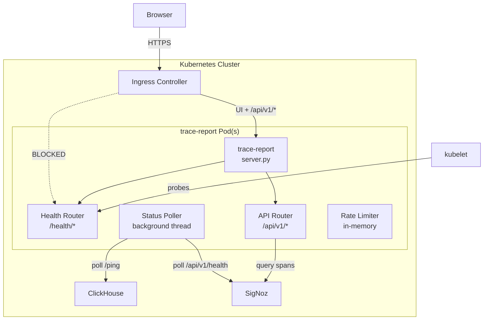
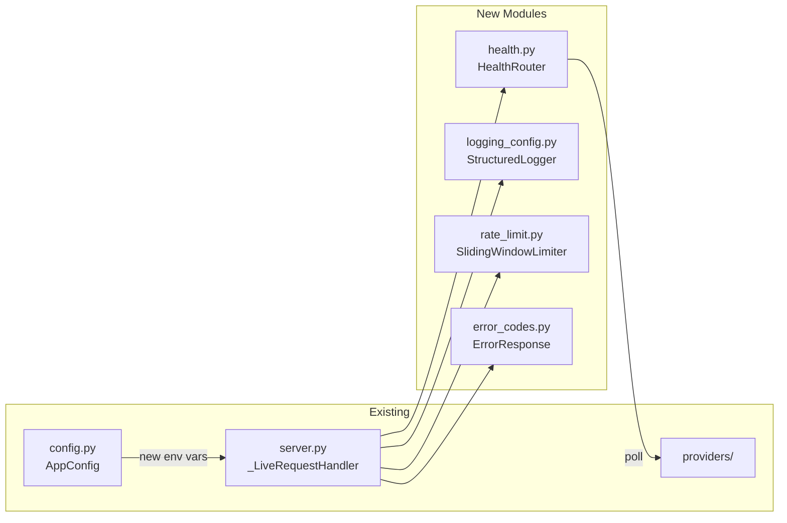
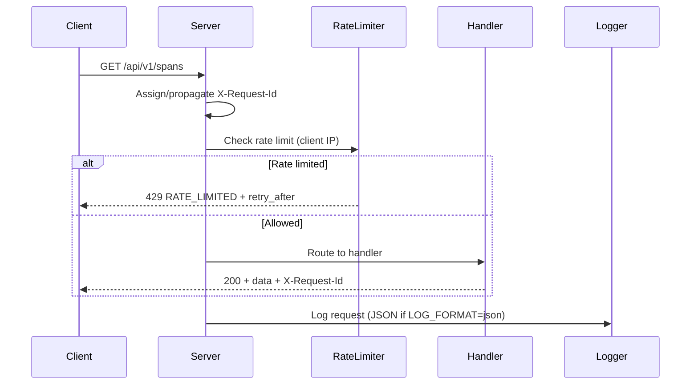
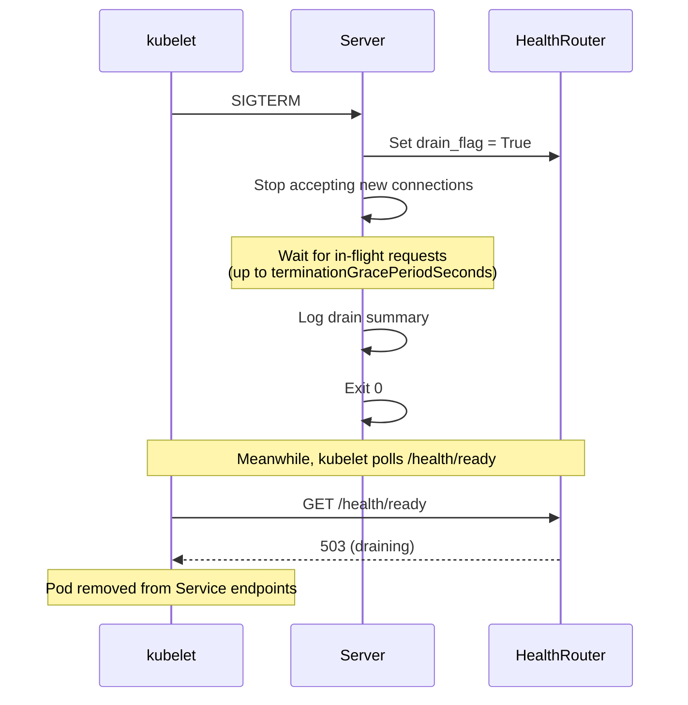

# Design Document: K8s Support for trace-report

## Overview

This design adds Kubernetes deployment support to `rf-trace-report` as a completely separate distribution path from the existing pip package. The changes fall into three categories:

1. **Server hardening** — Health endpoints, graceful shutdown, structured logging, API versioning, error codes, rate limiting, and request tracing added to the existing `http.server`-based server.
2. **Container and manifest infrastructure** — Hardened multi-stage Dockerfile, Kustomize base + overlays (dev/prod), and OCI image publishing to GHCR.
3. **Integration testing** — Kind-based test cluster with Robot Framework integration tests running via docker-compose, CI matrix for OTel on/off.

The existing pip install, docker-compose dev workflow, and CLI behavior remain unchanged. All new K8s-specific behavior is gated behind environment variables (primarily `LOG_FORMAT=json`) and new endpoints that don't conflict with existing routes.

### Key Constraints

- The server uses Python's stdlib `http.server` (single-threaded with `ThreadingMixIn` potential). All new features (health checks, request tracking, graceful shutdown) must work within this constraint.
- Zero external Python dependencies policy is maintained. Rate limiting, structured logging, and health checks are implemented with stdlib only.
- All tests run in Docker containers per project policy.

## Architecture

### System Context



### Component Architecture

The server is extended with four new internal modules, all using stdlib only:



### Request Flow



### Graceful Shutdown Flow



## Components and Interfaces

### 1. Health Router (`health.py`)

Handles `/health/live`, `/health/ready`, and `/health/drain` endpoints.

```python
class HealthRouter:
    """Manages health endpoint logic and drain state."""
    
    def __init__(self, clickhouse_host: str, clickhouse_port: int = 8123,
                 health_check_timeout: float = 2.0):
        self._drain_flag: bool = False
        self._clickhouse_host = clickhouse_host
        self._clickhouse_port = clickhouse_port
        self._timeout = health_check_timeout
    
    def handle_live(self) -> tuple[int, dict]:
        """Returns (status_code, json_body). Always 200 if process is running."""
    
    def handle_ready(self) -> tuple[int, dict]:
        """Returns 200 if not draining AND ClickHouse /ping reachable within timeout.
        Returns 503 with error details otherwise."""
    
    def handle_drain(self) -> tuple[int, dict]:
        """Sets drain flag, returns 200."""
    
    def set_draining(self) -> None:
        """Called by SIGTERM handler to flip drain flag."""
    
    @property
    def is_draining(self) -> bool:
        """Check if server is in drain mode."""
```

### 2. Status Poller (background thread in `health.py`)

```python
class StatusPoller:
    """Background thread that polls ClickHouse and SigNoz health."""
    
    def __init__(self, clickhouse_host: str, clickhouse_port: int,
                 signoz_endpoint: str | None, signoz_api_key: str | None,
                 poll_interval: int = 30):
        self._cached_status: dict  # thread-safe via Lock
        self._poll_interval = poll_interval  # 5-120 seconds
        self._start_time: float  # server start time for uptime calc
    
    def start(self) -> None:
        """Start the polling daemon thread."""
    
    def stop(self) -> None:
        """Signal the polling thread to stop."""
    
    def get_status(self, request_id: str | None = None) -> dict:
        """Return cached status snapshot with optional request_id."""
```

Status response shape:
```json
{
    "server": {"status": "ok", "uptime_seconds": 3600},
    "clickhouse": {
        "reachable": true,
        "latency_ms": 12,
        "last_check": "2025-01-15T10:30:00Z",
        "error": null,
        "error_type": null
    },
    "signoz": {
        "reachable": true,
        "latency_ms": 45,
        "last_check": "2025-01-15T10:30:00Z",
        "error": null,
        "error_type": null
    },
    "request_id": "abc-123"
}
```

Error types: `DNS_FAIL`, `TIMEOUT`, `TLS_ERROR`, `AUTH_MISSING`, `AUTH_EXPIRED`, `HTTP_5XX`, `CONNECTION_REFUSED`.

### 3. Structured Logger (`logging_config.py`)

```python
class StructuredLogger:
    """JSON or text logger based on LOG_FORMAT env var."""
    
    def __init__(self, log_format: str = "text"):
        self._json_mode = (log_format == "json")
        self._secret_pattern: re.Pattern  # compiled regex for masking
    
    def log(self, level: str, message: str, **fields) -> None:
        """Emit a log line. In JSON mode, outputs single-line JSON to stdout.
        Always masks secret values."""
    
    def log_request(self, method: str, path: str, status: int,
                    duration_ms: float, request_id: str) -> None:
        """Log an HTTP request."""
    
    def log_query(self, query_name: str, row_count: int, byte_count: int,
                  duration_ms: float, error_type: str | None = None) -> None:
        """Log a backend query completion."""
    
    def mask_secrets(self, value: str) -> str:
        """Replace API keys, JWT secrets, passwords with '***'."""
```

JSON log format:
```json
{"timestamp": "2025-01-15T10:30:00.123Z", "level": "INFO", "message": "Request completed", "request_id": "abc-123", "logger": "rf_trace_viewer"}
```

### 4. Rate Limiter (`rate_limit.py`)

```python
class SlidingWindowRateLimiter:
    """Per-IP sliding window rate limiter using stdlib only."""
    
    def __init__(self, requests_per_minute: int):
        self._limit = requests_per_minute
        self._windows: dict[str, list[float]]  # IP -> list of timestamps
        self._lock: threading.Lock
    
    def is_allowed(self, client_ip: str) -> tuple[bool, int | None]:
        """Check if request is allowed. Returns (allowed, retry_after_seconds)."""
    
    def cleanup(self) -> None:
        """Remove expired entries. Called periodically."""
```

### 5. Error Response Builder (`error_codes.py`)

```python
# Error code constants
ERROR_CODES = {
    "AUTH_MISSING", "AUTH_EXPIRED",
    "CLICKHOUSE_TIMEOUT", "CLICKHOUSE_UNREACHABLE",
    "SIGNOZ_TIMEOUT", "SIGNOZ_UNREACHABLE",
    "DNS_FAIL", "TLS_ERROR",
    "RATE_LIMITED", "MAX_SPANS_TRUNCATED",
    "INTERNAL_ERROR",
}

def error_response(error_code: str, message: str, request_id: str,
                   status: int = 500, warning: str | None = None) -> tuple[int, dict]:
    """Build a standard error response tuple (status_code, json_body)."""

def truncation_warning(data: dict, error_code: str, limit: int) -> dict:
    """Add a warning field to a successful response when data is truncated."""
```

### 6. API Router Changes (`server.py`)

The existing `_LiveRequestHandler.do_GET` is extended with a routing table:

| Path | Handler | Auth | Rate Limited |
|------|---------|------|-------------|
| `/health/live` | HealthRouter | No | No |
| `/health/ready` | HealthRouter | No | No |
| `/health/drain` | HealthRouter | No | No |
| `/api/v1/status` | StatusPoller | No | Yes |
| `/api/v1/spans` | existing spans handler | No | Yes |
| `/api/v1/services` | new service discovery | No | Yes |
| `/api/spans` | existing (backward compat) | No | Yes |
| `/traces.json` | existing (backward compat) | No | No |
| `/v1/traces` | existing (backward compat) | No | No |
| `/` | viewer HTML | No | No |

### 7. Request ID Middleware

Integrated into the request handler's dispatch:

```python
def _get_or_generate_request_id(self) -> str:
    """Return X-Request-Id from request headers, or generate a UUID."""

def _send_json_response(self, status: int, body: dict, request_id: str) -> None:
    """Send JSON response with X-Request-Id header."""
```

### 8. Graceful Shutdown Handler

Integrated into `LiveServer`:

```python
def _install_signal_handlers(self) -> None:
    """Install SIGTERM handler for graceful shutdown."""

def _sigterm_handler(self, signum, frame) -> None:
    """SIGTERM: set drain flag, stop accepting, wait for in-flight, exit 0."""
```

In-flight request tracking uses a threading counter incremented on request start, decremented on request end.

### 9. Base Filter and Service Discovery

```python
@dataclass
class BaseFilterConfig:
    """Server-side service filtering configuration."""
    excluded_by_default: list[str]  # services excluded unless explicitly included
    hard_blocked: list[str]  # services that can never be queried

def load_base_filter(config_value: str | None) -> BaseFilterConfig:
    """Parse BASE_FILTER_CONFIG from JSON string or file path."""
```

### 10. Configuration Extensions (`config.py`)

New environment variables added to `AppConfig`:

| Variable | Type | Default | Description |
|----------|------|---------|-------------|
| `LOG_FORMAT` | str | `"text"` | `"json"` for structured logging |
| `STATUS_POLL_INTERVAL` | int | `30` | Status poller interval (5-120s) |
| `HEALTH_CHECK_TIMEOUT` | int | `2` | ClickHouse health check timeout (s) |
| `CLICKHOUSE_HOST` | str | `None` | ClickHouse hostname |
| `CLICKHOUSE_PORT` | int | `8123` | ClickHouse HTTP port |
| `MAX_CONCURRENT_QUERIES` | int | `None` | Per-pod query concurrency limit |
| `BASE_FILTER_CONFIG` | str | `None` | JSON string or file path |
| `RATE_LIMIT_PER_IP` | int | `None` | Requests per minute per IP |

Existing 3-tier precedence (CLI > config file > env vars) is preserved.

## Data Models

### Health Check Result

```python
@dataclass
class HealthCheckResult:
    reachable: bool
    latency_ms: float
    last_check: str  # ISO 8601 timestamp
    error: str | None = None
    error_type: str | None = None  # DNS_FAIL | TIMEOUT | TLS_ERROR | etc.
```

### Status Response

```python
@dataclass
class StatusResponse:
    server: dict  # {"status": "ok"|"degraded", "uptime_seconds": int}
    clickhouse: HealthCheckResult
    signoz: HealthCheckResult
    request_id: str | None = None
```

### Error Response

```python
@dataclass
class ErrorResponseBody:
    error_code: str  # from ERROR_CODES set
    message: str
    request_id: str
    warning: str | None = None  # e.g. MAX_SPANS_TRUNCATED
    retry_after: int | None = None  # seconds, for rate limiting
```

### Service Info

```python
@dataclass
class ServiceInfo:
    name: str
    span_count: int
    excluded_by_default: bool
    hard_blocked: bool
```

### Base Filter Config

```python
@dataclass
class BaseFilterConfig:
    excluded_by_default: list[str]
    hard_blocked: list[str]
```

### Structured Log Entry

```python
@dataclass
class LogEntry:
    timestamp: str  # ISO 8601
    level: str  # DEBUG | INFO | WARNING | ERROR
    message: str
    request_id: str | None = None
    logger: str = "rf_trace_viewer"
    # Additional fields vary by log type (query_name, row_count, etc.)
```

### Kustomize Resource Profiles

| Profile | CPU Request | CPU Limit | Memory Request | Memory Limit |
|---------|------------|-----------|----------------|-------------|
| Dev | 50m | 200m | 64Mi | 256Mi |
| Prod | 100m | 500m | 128Mi | 512Mi |

### Docker Image

- Base: `python:3.11-slim` (build stage) → `python:3.11-slim` (runtime, minimal)
- Non-root user: UID 10001
- No dev dependencies, no pip cache in final image
- Compatible with `readOnlyRootFilesystem: true`

### Kustomize Directory Structure

```
deploy/
  kustomize/
    base/
      kustomization.yaml
      deployment.yaml
      service.yaml
      configmap.yaml
      secret.yaml          # reference only (user creates)
    overlays/
      dev/
        kustomization.yaml
        patches/
      prod/
        kustomization.yaml
        patches/
        pdb.yaml
        networkpolicy.yaml
        ingress.yaml        # optional
        hpa.yaml            # optional, default disabled

test/
  kind/
    cluster.yaml
    signoz/                 # SigNoz + ClickHouse manifests for kind
    itest-up.sh
    itest-down.sh
    itest.sh
  robot/
    docker-compose.yaml
    .env.example
    tests/
    resources/
    results/
```

## Correctness Properties

*A property is a characteristic or behavior that should hold true across all valid executions of a system — essentially, a formal statement about what the system should do. Properties serve as the bridge between human-readable specifications and machine-verifiable correctness guarantees.*

### Property 1: Readiness reflects ClickHouse reachability

*For any* ClickHouse reachability state (reachable or unreachable) and any drain flag state, the `/health/ready` endpoint SHALL return HTTP 200 if and only if ClickHouse `/ping` is reachable within the timeout AND the drain flag is false. Otherwise it SHALL return HTTP 503 with a JSON body containing an `"error"` field.

**Validates: Requirements 1.2, 1.3**

### Property 2: Drain endpoint flips readiness

*For any* server state where the drain flag is false, calling `/health/drain` SHALL cause all subsequent `/health/ready` calls to return HTTP 503, regardless of ClickHouse reachability.

**Validates: Requirements 1.4**

### Property 3: Health endpoints are exempt from auth and rate limiting

*For any* rate limiter configuration and any number of prior requests from the same IP, requests to `/health/live`, `/health/ready`, and `/health/drain` SHALL never return HTTP 401, 403, or 429.

**Validates: Requirements 1.6, 12.3**

### Property 4: Status response shape with error classification

*For any* combination of ClickHouse and SigNoz health states (reachable, unreachable with various failure modes), the `GET /api/v1/status` response SHALL be a JSON object containing `server` (with `status` and `uptime_seconds`), `clickhouse` (with `reachable`, `latency_ms`, `last_check`, and optionally `error` and `error_type`), and `signoz` (with the same fields). When a failure is detected, `error_type` SHALL be one of: `DNS_FAIL`, `TIMEOUT`, `TLS_ERROR`, `AUTH_MISSING`, `AUTH_EXPIRED`, `HTTP_5XX`, `CONNECTION_REFUSED`.

**Validates: Requirements 3.2, 3.3**

### Property 5: Request ID round-trip

*For any* HTTP request to the server, the response SHALL include an `X-Request-Id` header. If the request included an `X-Request-Id` header, the response value SHALL equal the request value. If the request did not include one, the response value SHALL be a valid UUID.

**Validates: Requirements 3.4, 4.3, 4.4**

### Property 6: JSON structured log format

*For any* log message emitted when `LOG_FORMAT=json`, the output SHALL be a single-line valid JSON object containing at minimum the fields `timestamp` (ISO 8601), `level`, `message`, and `logger`.

**Validates: Requirements 5.1**

### Property 7: Structured logs contain contextual fields

*For any* HTTP request handled by the server in JSON log mode, the log entry SHALL include the `request_id`. *For any* completed SigNoz or ClickHouse query, the log entry SHALL include `query_name`, `row_count`, `byte_count`, `duration_ms`, and `error_type` (if applicable).

**Validates: Requirements 4.5, 5.4**

### Property 8: Secret masking in log output

*For any* string value that matches a secret pattern (API keys, JWT secrets, passwords) appearing in any log output, the value SHALL be replaced with `***` in the emitted log line, regardless of log format (JSON or text).

**Validates: Requirements 5.3**

### Property 9: Error response shape and valid codes

*For any* API error response, the JSON body SHALL contain the fields `error_code`, `message`, and `request_id`. The `error_code` value SHALL be one of the defined set: `AUTH_MISSING`, `AUTH_EXPIRED`, `CLICKHOUSE_TIMEOUT`, `CLICKHOUSE_UNREACHABLE`, `SIGNOZ_TIMEOUT`, `SIGNOZ_UNREACHABLE`, `DNS_FAIL`, `TLS_ERROR`, `RATE_LIMITED`, `MAX_SPANS_TRUNCATED`, `INTERNAL_ERROR`.

**Validates: Requirements 6.1, 6.2**

### Property 10: Fail-fast on missing required secrets

*For any* required secret key (e.g., ClickHouse credentials when in K8s mode), if the key is missing from the environment at startup, the server SHALL exit with a non-zero exit code and emit a log message identifying the missing key name.

**Validates: Requirements 8.8**

### Property 11: Configuration 3-tier precedence preserved

*For any* configuration key that can be set via CLI arg, config file, and environment variable simultaneously, the resolved value SHALL follow the precedence: CLI arg > config file > environment variable. This SHALL hold for all existing and new configuration keys.

**Validates: Requirements 11.1, 11.2**

### Property 12: Service filtering — base filter and hard block

*For any* base filter configuration with excluded-by-default and hard-blocked services: (a) the `/api/v1/services` endpoint SHALL list all services with correct `excluded_by_default` and `hard_blocked` boolean fields; (b) *for any* span query, hard-blocked services SHALL never have their spans returned regardless of query parameters; (c) *for any* span query without explicit include, excluded-by-default services SHALL have their spans omitted; (d) *for any* span query that explicitly includes an excluded-by-default service, that service's spans SHALL be returned.

**Validates: Requirements 11.3, 13.1, 13.2, 13.3**

### Property 13: Query concurrency limiting

*For any* configured `MAX_CONCURRENT_QUERIES` value N, when N concurrent ClickHouse queries are already in-flight on a pod, the next query request SHALL receive HTTP 503 with `error_code: "RATE_LIMITED"`.

**Validates: Requirements 11.4**

### Property 14: Per-IP sliding window rate limiting

*For any* configured `RATE_LIMIT_PER_IP` value R and any client IP, if the client sends more than R requests to rate-limited endpoints within a 60-second sliding window, the server SHALL return HTTP 429 with a JSON body containing `error_code: "RATE_LIMITED"` and a `retry_after` field in seconds. Requests at or below the limit SHALL be allowed through.

**Validates: Requirements 12.1, 12.2**

### Property 15: Dev overlay resources are lower than prod

*For any* resource field (CPU request, CPU limit, memory request, memory limit), the dev overlay value SHALL be strictly less than the corresponding prod overlay value.

**Validates: Requirements 10.4**

### Property 16: Poll interval range validation

*For any* `STATUS_POLL_INTERVAL` value, the server SHALL accept values in the range 5–120 seconds. Values outside this range SHALL be rejected with a configuration error.

**Validates: Requirements 3.1**

### Property 17: CLI backward compatibility

*For any* existing CLI invocation (`rf-trace-report static`, `rf-trace-report serve`) with existing flags, the behavior and output SHALL be identical to the pre-K8s-support version when no new K8s-specific environment variables are set.

**Validates: Requirements 19.3**

## Error Handling

### Error Classification Strategy

All errors are classified into the defined error code set and returned as structured JSON responses. The classification follows a hierarchy:

| Error Condition | HTTP Status | Error Code | Retry Strategy |
|----------------|-------------|------------|----------------|
| No auth token provided | 401 | `AUTH_MISSING` | Fix config |
| Expired JWT/API key | 401 | `AUTH_EXPIRED` | Refresh token |
| ClickHouse query timeout | 504 | `CLICKHOUSE_TIMEOUT` | Retry with backoff |
| ClickHouse unreachable | 503 | `CLICKHOUSE_UNREACHABLE` | Wait for recovery |
| SigNoz query timeout | 504 | `SIGNOZ_TIMEOUT` | Retry with backoff |
| SigNoz unreachable | 503 | `SIGNOZ_UNREACHABLE` | Wait for recovery |
| DNS resolution failure | 503 | `DNS_FAIL` | Check DNS config |
| TLS/certificate error | 503 | `TLS_ERROR` | Fix certificates |
| Per-IP rate limit exceeded | 429 | `RATE_LIMITED` | Wait `retry_after` seconds |
| Query concurrency exceeded | 503 | `RATE_LIMITED` | Retry with backoff |
| Dataset truncated | 200 | `MAX_SPANS_TRUNCATED` (warning) | Increase `max_spans` or filter |
| Unexpected server error | 500 | `INTERNAL_ERROR` | Report bug |

### Startup Fail-Fast

When running in K8s mode (ClickHouse host configured), the server validates required configuration at startup:

1. If `CLICKHOUSE_HOST` is set but required secret keys are missing → exit code 1 with log identifying the missing key.
2. If `BASE_FILTER_CONFIG` is set but cannot be parsed → exit code 1 with parse error details.
3. If `STATUS_POLL_INTERVAL` is outside 5–120 → exit code 1 with validation error.

This ensures pods fail immediately and visibly rather than entering a crash loop with unclear errors.

### Graceful Degradation

- If SigNoz is unreachable, the server continues to operate (SigNoz health is optional diagnostics). The `/api/v1/status` endpoint reports SigNoz as unreachable but the server remains ready.
- If ClickHouse becomes unreachable after startup, the readiness probe fails, removing the pod from service endpoints. The pod stays alive (liveness probe checks process only) so it can recover when ClickHouse returns.
- Rate limiting and concurrency limiting return clear error codes with retry guidance, allowing clients to back off gracefully.

### Secret Masking

All error messages, log entries, and API responses pass through the secret masking layer before output. The masking regex matches:
- Values of known secret environment variables (`SIGNOZ_API_KEY`, `SIGNOZ_JWT_SECRET`)
- Common secret patterns (Bearer tokens, base64-encoded keys longer than 20 chars)
- Any value explicitly registered as a secret during config loading

## Testing Strategy

### Dual Testing Approach

This feature uses both unit tests and property-based tests:

- **Unit tests**: Verify specific examples, edge cases, integration points, and error conditions. Used for Kustomize manifest validation, CI workflow checks, Docker image inspection, and specific endpoint behavior.
- **Property-based tests**: Verify universal properties across randomly generated inputs. Used for health endpoint behavior, request ID propagation, log format validation, secret masking, error response shape, config precedence, rate limiting, and service filtering.

Both are complementary — unit tests catch concrete bugs at specific points, property tests verify general correctness across the input space.

### Property-Based Testing Configuration

- **Library**: [Hypothesis](https://hypothesis.readthedocs.io/) (Python) — already available in the project's test dependencies
- **Minimum iterations**: 100 per property test (Hypothesis default `max_examples=100`)
- **Each property test references its design document property** via a comment tag:
  ```python
  # Feature: k8s-support, Property 1: Readiness reflects ClickHouse reachability
  ```
- **Tag format**: `Feature: k8s-support, Property {number}: {property_text}`
- **Each correctness property is implemented by a single property-based test**

### Test Organization

All tests run in Docker containers per project policy.

| Test Category | Location | Runner | What It Validates |
|--------------|----------|--------|-------------------|
| Unit tests (health, logging, rate limit, error codes, config) | `tests/unit/test_health.py`, `test_logging_config.py`, `test_rate_limit.py`, `test_error_codes.py` | pytest in Docker | Individual module behavior |
| Property tests (Properties 1–17) | `tests/unit/test_k8s_properties.py` | pytest + Hypothesis in Docker | Universal correctness properties |
| Kustomize manifest validation | `tests/unit/test_kustomize_manifests.py` | pytest in Docker | YAML structure, required fields, overlay correctness |
| Kind integration tests | `test/robot/tests/` | Robot Framework via docker-compose | End-to-end K8s deployment behavior |
| CI matrix tests | `.github/workflows/` | GitHub Actions | OTel on/off, hardened runtime |

### Unit Test Focus Areas

- Health endpoint responses for various ClickHouse states (up, down, timeout, DNS failure)
- Drain flag state transitions (drain endpoint, SIGTERM)
- Structured log output format (JSON mode vs text mode)
- Secret masking with various secret patterns
- Rate limiter sliding window arithmetic
- Error response builder with all error codes
- Config loader with new K8s environment variables
- Base filter parsing (JSON string and file path)
- Service discovery response shape
- Kustomize manifest structure (security context, probes, resources, overlays)

### Integration Test Focus Areas (Robot Framework in Kind)

- Health endpoints return 200 when system is healthy
- `/api/v1/status` returns correct ClickHouse and SigNoz reachability
- Service discovery includes the Robot Framework test service
- Excluded-by-default services labeled correctly
- Hard-blocked services cannot be queried
- Tests pass with both `TRACE_REPORT_OTEL=false` and `TRACE_REPORT_OTEL=true`
- Unique `${RUN_ID}` per execution, poll-based waiting (no fixed sleeps)
