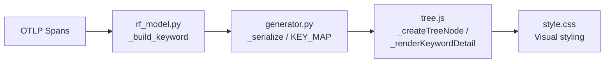

# Design: Keyword Detail Improvements

## Overview

This design covers six enhancements to the RF Trace Viewer's tree view and detail panels, improving keyword context, visual hierarchy, and information density. All changes touch four files: `rf_model.py`, `generator.py`, `tree.js`, and `style.css`.

The improvements are:

1. **Library field on keywords** — Extract `rf.keyword.library` from span attributes into the `RFKeyword` dataclass and serialize it (compact alias `"lb"`). This tells users which Robot Framework library owns each keyword.
2. **Library prefix in tree nodes** — Display the library name as a dimmed prefix before the keyword name in tree rows (e.g., `BuiltIn . Log`), giving at-a-glance context without expanding the detail panel.
3. **Detail panel field toggle pills** — Add clickable pill buttons at the top of keyword detail panels that let users show/hide optional fields (args, doc, events, source). Visibility state persists to localStorage.
4. **Suite context in keyword detail panels** — When a keyword is a direct child of a suite (setup/teardown), propagate the parent suite's name and source into the keyword's detail panel so users know which suite the keyword belongs to.
5. **Setup/teardown visual distinction in tree** — Color the `.node-type` label for SETUP and TEARDOWN keywords in the tree row (blue and pink, matching existing detail badge colors) and apply a subtle left-border tint to the entire row.
6. **Vertical indent guides in tree view** — Render thin vertical lines at each depth level in the tree, similar to the existing `.flow-indent-guide` pattern in the flow view, to help users track nesting at a glance.

## Architecture

The data pipeline is: OTLP spans → `rf_model.py` (interpret) → `generator.py` (serialize to JSON) → `tree.js` (render in browser).



Changes flow left-to-right through this pipeline:

- **rf_model.py**: Add `library: str = ""` field to `RFKeyword`, extract `rf.keyword.library` in `_build_keyword`. Add `suite_name`/`suite_source` propagation in `_build_suite` for setup/teardown keywords.
- **generator.py**: Add `"library": "lb"` to `KEY_MAP`. No other serialization changes needed — `_serialize` and `_serialize_compact` already handle all dataclass fields automatically.
- **tree.js**: Modify `_createTreeNode` for library prefix and setup/teardown coloring. Modify `_renderKeywordDetail` for toggle pills and suite context. Add indent guide rendering in `_createTreeNode` or `_createVirtualRow`.
- **style.css**: Add styles for library prefix, toggle pills, setup/teardown tree tinting, and tree indent guides.

### Design Decisions

1. **Suite context via data propagation (not DOM traversal)**: Rather than walking the DOM to find a keyword's parent suite, we propagate `suite_name` and `suite_source` into the `RFKeyword` dataclass at build time. This works cleanly with both lazy materialization and virtual scrolling modes, where DOM parent relationships don't exist.

2. **Toggle pills with localStorage**: Using localStorage (key: `rf-trace-detail-fields`) to persist field visibility is consistent with the existing indent slider persistence pattern. Pills are rendered per-panel but read from a shared state object.

3. **Indent guides via CSS `::before` pseudo-elements**: Rather than creating separate DOM elements for each guide line (like the flow view does), we use a single `::before` on `.tree-row` with a repeating linear-gradient. This avoids adding N elements per row and works with both lazy and virtual rendering.

4. **Library prefix as separate span element**: Using a dedicated `.kw-library` span before the keyword name allows independent styling (dimmed color, smaller font) and clean separation from the name text.

## Components and Interfaces

### Python Components

#### `RFKeyword` dataclass (rf_model.py)

New fields:
```python
library: str = ""          # From rf.keyword.library span attribute
suite_name: str = ""       # Propagated from parent suite (setup/teardown only)
suite_source: str = ""     # Propagated from parent suite (setup/teardown only)
```

#### `_build_keyword` (rf_model.py)

Extract `rf.keyword.library`:
```python
library=str(attrs.get("rf.keyword.library", "")),
```

#### `_build_suite` (rf_model.py)

After building setup/teardown keywords, set their `suite_name` and `suite_source`:
```python
if kw_type in ("SETUP", "TEARDOWN"):
    kw = _build_keyword(child)
    kw.suite_name = suite_name
    kw.suite_source = suite_source
    children.append(kw)
```

#### `KEY_MAP` (generator.py)

Add compact aliases:
```python
"library": "lb",
"suite_name": "sn",
"suite_source": "ss",
```

### JavaScript Components

#### `_createTreeNode` (tree.js)

Changes:
- Insert a `.kw-library` span before the keyword name text when `opts.data.library` is non-empty
- Add CSS class `kw-setup` or `kw-teardown` to `.tree-row` when `opts.kwType` is `SETUP` or `TEARDOWN`
- Render indent guide via CSS (no JS changes needed — handled by `.tree-row::before` with depth-based width)

#### `_renderKeywordDetail` (tree.js)

Changes:
- Add toggle pill bar at the top of the panel (before existing fields)
- Wrap each optional field section (args, doc, events, source) in a container with a `data-field` attribute
- Read/write visibility state from `localStorage` key `rf-trace-detail-fields`
- Show suite context row when `data.suite_name` is present

New helper function:
```javascript
function _createFieldTogglePills(panel, data) { ... }
```

Pill state shape in localStorage:
```json
{
  "args": true,
  "doc": true,
  "events": true,
  "source": true
}
```

All fields default to visible (`true`). Clicking a pill toggles its field and persists the updated state.

#### `_createVirtualRow` (tree.js)

No structural changes needed — it already passes `data`, `kwType`, and `depth` to `_createTreeNode`. The library prefix and setup/teardown styling flow through automatically.

### CSS Components

#### Library prefix (style.css)
```css
.rf-trace-viewer .kw-library {
  color: var(--text-muted);
  font-size: 0.85em;
  margin-right: 2px;
}
.rf-trace-viewer .kw-library::after {
  content: ' . ';
  color: var(--text-muted);
}
```

#### Setup/teardown tree row tinting (style.css)
```css
.rf-trace-viewer .tree-row.kw-setup {
  border-left: 3px solid #1565c0;
}
.rf-trace-viewer .tree-row.kw-teardown {
  border-left: 3px solid #ad1457;
}
.rf-trace-viewer .tree-row.kw-setup .node-type,
.rf-trace-viewer .tree-row.kw-teardown .node-type {
  /* Reuse existing detail badge colors */
}
.rf-trace-viewer .tree-row.kw-setup .node-type {
  color: #1565c0;
}
.rf-trace-viewer .tree-row.kw-teardown .node-type {
  color: #ad1457;
}
```

#### Toggle pills (style.css)
```css
.rf-trace-viewer .detail-field-pills { display: flex; gap: 4px; margin-bottom: 8px; }
.rf-trace-viewer .detail-field-pill {
  padding: 2px 8px;
  border-radius: 12px;
  font-size: 11px;
  cursor: pointer;
  border: 1px solid var(--border-color);
  background: var(--bg-secondary);
  color: var(--text-secondary);
}
.rf-trace-viewer .detail-field-pill.active {
  background: var(--bg-tertiary);
  color: var(--text-primary);
  border-color: var(--text-muted);
}
```

#### Tree indent guides (style.css)
```css
.rf-trace-viewer .tree-row::before {
  content: '';
  position: absolute;
  left: 0;
  top: 0;
  bottom: 0;
  pointer-events: none;
  /* Width and background set dynamically or via depth class */
}
```

For depth-based guides, each `.tree-node.depth-N` gets a `::before` with `width: calc(N * var(--tree-indent-size))` and a repeating vertical line pattern using `repeating-linear-gradient`.

## Data Models

### RFKeyword (updated)

| Field | Type | Default | Source | New? |
|-------|------|---------|--------|------|
| name | str | — | rf.keyword.name | No |
| keyword_type | str | — | rf.keyword.type | No |
| args | str | — | rf.keyword.args | No |
| status | Status | — | rf.status | No |
| start_time | int | — | span timestamp | No |
| end_time | int | — | span timestamp | No |
| elapsed_time | float | — | computed | No |
| id | str | "" | span_id | No |
| lineno | int | 0 | rf.keyword.lineno | No |
| doc | str | "" | rf.keyword.doc | No |
| status_message | str | "" | span status message | No |
| events | list[dict] | [] | span events | No |
| children | list[RFKeyword] | [] | child spans | No |
| library | str | "" | rf.keyword.library | **Yes** |
| suite_name | str | "" | parent suite name | **Yes** |
| suite_source | str | "" | parent suite source | **Yes** |

### Compact JSON Key Map (updated)

| Original Key | Compact Key | New? |
|-------------|-------------|------|
| library | lb | **Yes** |
| suite_name | sn | **Yes** |
| suite_source | ss | **Yes** |

### localStorage Keys

| Key | Shape | Purpose |
|-----|-------|---------|
| `rf-trace-indent-size` | number | Existing — indent slider value |
| `rf-trace-detail-fields` | `{ args: bool, doc: bool, events: bool, source: bool }` | **New** — detail panel field visibility |


## Correctness Properties

*A property is a characteristic or behavior that should hold true across all valid executions of a system — essentially, a formal statement about what the system should do. Properties serve as the bridge between human-readable specifications and machine-verifiable correctness guarantees.*

### Property 1: Library field extraction

*For any* keyword span with an `rf.keyword.library` attribute set to a non-empty string value, building an `RFKeyword` via `_build_keyword` should produce a keyword whose `library` field equals that attribute value. For spans without the attribute, `library` should be `""`.

**Validates: Requirements 1.1, 1.2**

### Property 2: Library field serialization round-trip

*For any* valid `RFKeyword` with a non-empty `library` field, serializing it with `_serialize_compact` and then applying `KEY_MAP` should produce a dict containing key `"lb"` with the original library value. Deserializing back (reversing the key map) should recover the original `library` value.

**Validates: Requirements 1.3**

### Property 3: Toggle pill state round-trip via localStorage

*For any* valid field visibility state object (a dict with keys `args`, `doc`, `events`, `source` each mapping to a boolean), serializing it to JSON, storing it, and parsing it back should produce an identical object. This ensures the toggle pill persistence mechanism is lossless.

**Validates: Requirements 3.2, 3.3**

### Property 4: Suite context propagation for setup/teardown keywords

*For any* suite span node containing setup or teardown keyword children, building the suite via `_build_suite` should produce `RFKeyword` children whose `suite_name` equals the suite's name and `suite_source` equals the suite's source. Keywords that are children of test nodes (not suites) should have empty `suite_name` and `suite_source`.

**Validates: Requirements 4.1, 4.2**

### Property 5: Setup/teardown tree row class assignment

*For any* keyword data object where `keyword_type` is `"SETUP"` or `"TEARDOWN"`, the tree node created by `_createTreeNode` should have the CSS class `kw-setup` or `kw-teardown` (respectively) on its `.tree-row` element. For all other keyword types, neither class should be present.

**Validates: Requirements 5.1, 5.2**

### Property 6: Library prefix rendering

*For any* keyword data object with a non-empty `library` field, the tree node created by `_createTreeNode` should contain a `.kw-library` span element whose text content equals the library value. For keyword data with an empty `library` field, no `.kw-library` element should be present.

**Validates: Requirements 2.1, 2.2**

## Error Handling

### Missing or malformed `rf.keyword.library`

- If `rf.keyword.library` is absent from span attributes, `library` defaults to `""` (empty string). No warning is emitted — this is expected for keywords from libraries that don't set the attribute.
- If the attribute value is not a string, it is coerced via `str()`, consistent with how `rf.keyword.doc` and `rf.keyword.args` are handled.

### Invalid localStorage state for toggle pills

- If `rf-trace-detail-fields` contains invalid JSON, the system falls back to the default state (all fields visible: `{ args: true, doc: true, events: true, source: true }`).
- If individual keys are missing from the stored object, they default to `true` (visible).
- If localStorage is unavailable (private browsing, storage full), the system operates with defaults and does not throw.

### Backward compatibility

- Existing JSON data without `library`, `suite_name`, or `suite_source` fields will work unchanged. `_serialize_compact` omits fields at their default empty values, so old data simply won't have these keys. The JS viewer treats missing fields as empty/falsy, which is the correct default behavior.
- The `KEY_MAP` additions are additive — existing compact keys are unchanged.

## Testing Strategy

### Property-Based Testing

Use **Hypothesis** (Python) for backend property tests. The project already has `dev` (5 examples) and `ci` (200 examples) profiles configured in `tests/conftest.py`. Do NOT hardcode `@settings(max_examples=N)` — let the profile system control iteration counts.

Each property test must be tagged with a comment referencing the design property:

```python
# Feature: keyword-detail-improvements, Property 1: Library field extraction
```

Property tests to implement:

| Property | Test Description | Generator Strategy |
|----------|-----------------|-------------------|
| 1 | Generate random span attributes with/without `rf.keyword.library`, build keyword, verify `library` field | `st.fixed_dictionaries` with optional library key |
| 2 | Generate random `RFKeyword` instances, serialize compact + apply key map, verify `"lb"` key present | Custom `RFKeyword` strategy |
| 3 | Generate random boolean dicts for field visibility, JSON round-trip | `st.fixed_dictionaries` with `st.booleans()` values |
| 4 | Generate suite span nodes with setup/teardown children, build suite, verify propagation | Custom `SpanNode` strategy with keyword children |
| 5 | Generate keyword data with random `keyword_type` values including SETUP/TEARDOWN, verify CSS class | `st.sampled_from(["SETUP", "TEARDOWN", "KEYWORD", "FOR", "IF"])` |
| 6 | Generate keyword data with random library values (empty and non-empty), verify DOM structure | `st.text()` for library field |

Properties 5 and 6 test JavaScript DOM rendering. These should be tested as unit tests with specific examples rather than Hypothesis property tests, since they require a browser DOM. The property statements above define the invariants; the JS tests verify them with representative examples.

### Unit Tests

Unit tests complement property tests for specific examples, edge cases, and integration points:

- **rf_model.py**: Test `_build_keyword` with a span that has `rf.keyword.library` set; test `_build_suite` propagates suite context to setup/teardown children but not to test children.
- **generator.py**: Test that `KEY_MAP` contains `"library": "lb"`, `"suite_name": "sn"`, `"suite_source": "ss"`. Test compact serialization omits empty library/suite fields.
- **tree.js**: Test `_createTreeNode` with keyword data containing library, SETUP/TEARDOWN types. Test `_renderKeywordDetail` renders toggle pills and suite context row. Test toggle pill click toggles field visibility.

### Test Execution

All tests run in Docker via the `rf-trace-test:latest` image:

```bash
make test-unit          # Fast feedback (dev profile, <30s)
make test-full          # Full PBT iterations (ci profile)
make test-properties    # Property tests only, full iterations
```
