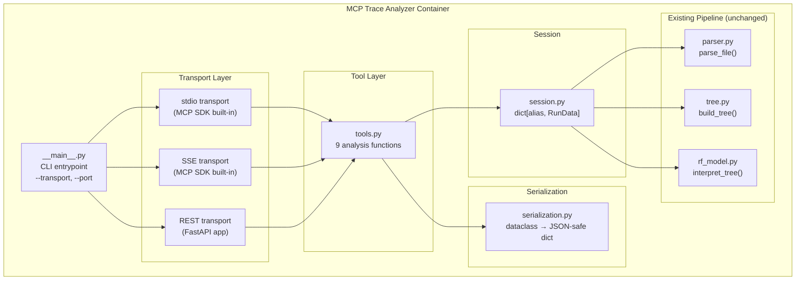

# Design Document: MCP Trace Analyzer

## Overview

The MCP Trace Analyzer is an MCP server that exposes Robot Framework test execution analysis tools to AI assistants. It reuses the existing parsing pipeline (`parser.py` → `tree.py` → `rf_model.py`) and wraps it with a tool layer accessible via three transports: stdio (JSON-RPC), SSE (Server-Sent Events), and REST (JSON over HTTP).

The server is stateful within a session: users load one or more trace/log files under aliases, then invoke analysis tools against those loaded runs. All state lives in-memory — no database, no persistence.

### Key Design Decisions

1. **Single tool layer, three transports**: All nine analysis tools are implemented once as plain Python functions. The MCP SDK handles stdio/SSE, and a thin FastAPI app maps the same functions to REST endpoints. This avoids logic duplication.
2. **Reuse existing pipeline verbatim**: `parse_file`, `build_tree`, and `interpret_tree` are called as-is. No modifications to existing modules.
3. **In-memory session**: A `dict[str, RunData]` keyed by alias. No persistence, no concurrency locks (single-threaded MCP server).
4. **Docker-only**: Packaged as `Dockerfile.mcp` following the existing multi-stage pattern. No host Python.
5. **Zero changes to existing dependencies for the core package**: MCP SDK, FastAPI, and uvicorn are added as a new optional dependency group `[mcp]`, keeping the base package dependency-free.

## Architecture



### Request Flow

1. Client sends a tool invocation (JSON-RPC via stdio/SSE, or POST via REST)
2. Transport layer deserializes the request and dispatches to the matching tool function
3. Tool function reads/writes session state and calls existing pipeline modules as needed
4. Tool function returns a Python dict/dataclass
5. Serialization layer converts the response to JSON-safe dicts (handling enums, nanosecond timestamps)
6. Transport layer serializes and sends the response

## Components and Interfaces

### Module Structure

```
src/rf_trace_viewer/mcp/
├── __init__.py          # Package marker
├── __main__.py          # CLI entrypoint: argparse, transport selection, server start
├── server.py            # MCP server setup: register tools with MCP SDK
├── rest_app.py          # FastAPI app: /api/v1/ routes, CORS, health
├── tools.py             # 9 tool implementations (pure functions taking session + args)
├── session.py           # Session and RunData dataclasses
└── serialization.py     # Dataclass-to-dict conversion, enum/timestamp handling
```

### `session.py` — Session Management

```python
@dataclass
class RunData:
    alias: str
    spans: list[RawSpan]
    logs: list[RawLogRecord]
    roots: list[SpanNode]
    model: RFRunModel
    log_index: dict[str, list[RawLogRecord]]  # span_id → logs

@dataclass
class Session:
    runs: dict[str, RunData] = field(default_factory=dict)

    def load_run(self, alias: str, trace_path: str, log_path: str | None = None) -> RunData: ...
    def get_run(self, alias: str) -> RunData: ...  # raises KeyError with descriptive message
```

`load_run` calls `parse_file` → `build_tree` → `interpret_tree`, builds the `log_index` by grouping log records on `(trace_id, span_id)`, and stores the result under the alias. If the alias already exists, it replaces it.

### `tools.py` — Tool Implementations

Each tool is a standalone function that takes a `Session` and typed arguments, returning a dict. No transport awareness.

| Tool | Signature | Description |
|------|-----------|-------------|
| `load_run` | `(session, trace_path, log_path?, alias)` → summary dict | Parse files, store in session |
| `list_tests` | `(session, alias, status?, tag?)` → list of test summaries | Filter/sort tests |
| `get_test_keywords` | `(session, alias, test_name)` → keyword tree | Full keyword tree for a test |
| `get_span_logs` | `(session, alias, span_id)` → list of log records | Logs correlated to a span |
| `analyze_failures` | `(session, alias)` → list of failure patterns | Detect common failure patterns |
| `compare_runs` | `(session, baseline_alias, target_alias, test_name?)` → diff | Diff two runs |
| `correlate_timerange` | `(session, alias, start, end)` → grouped events | Events in a time window |
| `get_latency_anomalies` | `(session, baseline_alias, target_alias, threshold?)` → anomalies | Duration outliers |
| `get_failure_chain` | `(session, alias, test_name)` → chain | Error propagation path |

### `server.py` — MCP Server Setup

Uses the official `mcp` Python SDK. Registers each tool with name, description, and JSON Schema for input parameters. The SDK handles stdio and SSE transports natively.

```python
from mcp.server import Server

def create_mcp_server(session: Session) -> Server:
    server = Server("mcp-trace-analyzer")
    
    @server.tool()
    async def load_run(trace_path: str, alias: str, log_path: str | None = None) -> dict:
        return tools.load_run(session, trace_path, log_path, alias)
    
    # ... register remaining 8 tools
    return server
```

### `rest_app.py` — REST API Layer

A FastAPI application that wraps the same tool functions.

```python
app = FastAPI(title="MCP Trace Analyzer")
app.add_middleware(CORSMiddleware, allow_origins=["*"], ...)

@app.get("/api/v1/health")
async def health():
    return {"status": "ok", "loaded_runs": len(session.runs)}

@app.get("/api/v1/tools")
async def list_tools():
    return [{"name": t.name, "description": t.description, "input_schema": t.schema} for t in TOOL_REGISTRY]

@app.post("/api/v1/{tool_name}")
async def invoke_tool(tool_name: str, body: dict):
    # dispatch to tools.py function, return JSON
```

Error handling:
- Unknown tool → HTTP 404
- Invalid body / missing fields → HTTP 400
- Unhandled exception in tool → HTTP 500 (server continues)

### `__main__.py` — CLI Entrypoint

```python
parser = argparse.ArgumentParser()
parser.add_argument("--transport", choices=["stdio", "sse", "rest"], default="stdio")
parser.add_argument("--port", type=int, default=8080)

if args.transport == "stdio":
    mcp_server.run_stdio()
elif args.transport == "sse":
    mcp_server.run_sse(port=args.port)
elif args.transport == "rest":
    uvicorn.run(rest_app, host="0.0.0.0", port=args.port)
```

### `serialization.py` — JSON Serialization

A recursive converter that walks dataclass instances and produces JSON-safe dicts:

- `Status.PASS` → `"PASS"` (enum `.value`)
- `SpanType.KEYWORD` → `"keyword"` (enum `.value`)
- Nanosecond timestamps (`int`) → kept as integers (no precision loss)
- ISO 8601 conversion helper for display timestamps
- Dataclass instances → `dict` via `dataclasses.asdict()` with custom handling
- Lists/dicts → recursed

```python
def serialize(obj: Any) -> Any:
    if isinstance(obj, Enum):
        return obj.value
    if dataclasses.is_dataclass(obj) and not isinstance(obj, type):
        return {k: serialize(v) for k, v in dataclasses.asdict(obj).items() if not k.startswith("_")}
    if isinstance(obj, list):
        return [serialize(item) for item in obj]
    if isinstance(obj, dict):
        return {k: serialize(v) for k, v in obj.items()}
    return obj
```

Private fields (prefixed with `_`) are excluded from serialization.

## Data Models

### RunData

The central in-memory structure per loaded run:

```python
@dataclass
class RunData:
    alias: str
    spans: list[RawSpan]           # Raw parsed spans
    logs: list[RawLogRecord]       # Raw parsed log records (empty if no log file)
    roots: list[SpanNode]          # Span tree roots
    model: RFRunModel              # Interpreted RF model (suites, tests, keywords)
    log_index: dict[str, list[RawLogRecord]]  # span_id → sorted log records
```

### Tool Response Schemas

All tool responses are dicts serialized to JSON. Key shapes:

**load_run response:**
```json
{
  "alias": "failing-run",
  "span_count": 1234,
  "log_count": 567,
  "test_count": 42,
  "passed": 38,
  "failed": 3,
  "skipped": 1
}
```

**list_tests response (each item):**
```json
{
  "name": "Test Login Flow",
  "status": "FAIL",
  "duration_ms": 1523.4,
  "suite": "Login Suite",
  "tags": ["smoke", "login"],
  "error_message": "Element not found: id=submit"
}
```

**get_failure_chain response (each node):**
```json
{
  "keyword_name": "Click Element",
  "library": "SeleniumLibrary",
  "keyword_type": "KEYWORD",
  "duration_ms": 5023.1,
  "error_message": "Element not found: id=submit",
  "depth": 3,
  "log_messages": ["ERROR: Element not found after 5s timeout"]
}
```

**analyze_failures response (each pattern):**
```json
{
  "pattern_type": "common_library_keyword",
  "description": "3 of 4 failed tests fail in SeleniumLibrary.Click Element",
  "affected_tests": ["Test Login", "Test Checkout", "Test Profile"],
  "confidence": 0.75
}
```

### Timestamp Handling

- Internal: nanosecond integers (`int`) as stored in `RawSpan.start_time_unix_nano`
- Serialized: integers (no precision loss)
- `correlate_timerange` accepts both ISO 8601 strings and Unix nanosecond integers; the tool normalizes to nanoseconds internally
- Display timestamps (e.g., in log records) are converted to ISO 8601 strings

### Docker Image: `Dockerfile.mcp`

```dockerfile
# ---- Build stage ----
FROM python:3.11-slim AS builder
WORKDIR /build
COPY pyproject.toml README.md ./
COPY src/ src/
RUN pip install --no-cache-dir --upgrade pip && \
    pip install --no-cache-dir --prefix=/install ".[mcp]"

# ---- Runtime stage ----
FROM python:3.11-slim
ARG GIT_SHA=dev
RUN groupadd --gid 10001 appuser && \
    useradd --uid 10001 --gid 10001 --no-create-home --shell /usr/sbin/nologin appuser
COPY --from=builder /install /usr/local
ENV PYTHONDONTWRITEBYTECODE="1" \
    PYTHONUNBUFFERED="1" \
    GIT_SHA="${GIT_SHA}"
EXPOSE 8080
USER 10001
ENTRYPOINT ["python", "-m", "rf_trace_viewer.mcp"]
CMD ["--transport", "stdio"]
```

Usage:
- stdio: `docker run -i -v /traces:/data mcp-trace-analyzer:latest`
- SSE: `docker run -p 8080:8080 mcp-trace-analyzer:latest --transport sse`
- REST: `docker run -p 8080:8080 mcp-trace-analyzer:latest --transport rest --port 8080`

### Dependency Group

Added to `pyproject.toml`:

```toml
[project.optional-dependencies]
mcp = [
    "mcp>=1.0.0",
    "fastapi>=0.100.0",
    "uvicorn[standard]>=0.20.0",
]
```


## Correctness Properties

*A property is a characteristic or behavior that should hold true across all valid executions of a system — essentially, a formal statement about what the system should do. Properties serve as the bridge between human-readable specifications and machine-verifiable correctness guarantees.*

### Property 1: Serialization round-trip

*For any* valid `RFRunModel`, `RFTest`, `RFKeyword`, `RFSuite`, or `RawLogRecord` instance, serializing it to a JSON string via the `serialize` function and then deserializing the JSON string back should produce a data structure equivalent to the original (with enums as their string values and nanosecond timestamps preserved as exact integers).

**Validates: Requirements 13.2, 13.1, 13.3, 13.4**

### Property 2: Log index groups by span_id

*For any* list of `RawLogRecord` objects with arbitrary `trace_id` and `span_id` values, building the `log_index` should produce a dict where every log record appears under its `span_id` key, and the union of all values equals the original log list (no records lost or duplicated).

**Validates: Requirements 2.3**

### Property 3: Load run summary consistency

*For any* valid trace data that produces an `RFRunModel` via the existing pipeline, the `load_run` tool's returned summary should have `span_count` equal to `len(spans)`, `log_count` equal to `len(logs)`, `test_count` equal to `model.statistics.total_tests`, and `passed + failed + skipped` equal to `test_count`.

**Validates: Requirements 2.2, 2.4**

### Property 4: Alias replacement

*For any* session containing an alias `a` with `RunData` R1, loading new data under the same alias `a` should replace R1 entirely, so that `session.get_run(a)` returns the new `RunData` R2 and not R1.

**Validates: Requirements 2.6**

### Property 5: list_tests filter correctness

*For any* set of `RFTest` objects and any combination of status filter and tag filter, every test returned by `list_tests` should match the status filter (if provided) AND contain the tag (if provided), and no test matching both filters should be omitted from the result.

**Validates: Requirements 3.3, 3.4**

### Property 6: list_tests sort order

*For any* list of test summaries returned by `list_tests`, the results should be sorted by status priority (FAIL=0 < SKIP=1 < PASS=2) and within each status group by duration descending.

**Validates: Requirements 3.5**

### Property 7: list_tests field completeness

*For any* `RFTest` in a loaded run, the corresponding test summary returned by `list_tests` should contain `name`, `status`, `duration_ms`, `suite`, `tags`, and `error_message` (non-empty for FAIL tests with a status_message).

**Validates: Requirements 3.2**

### Property 8: Keyword tree completeness

*For any* `RFTest` with keywords, the tree returned by `get_test_keywords` should include for every keyword node: `name`, `keyword_type`, `library`, `status`, `duration_ms`, `args`, `children`, and `events`. Keywords with FAIL status should include a non-empty `error_message` when the source keyword has a non-empty `status_message`.

**Validates: Requirements 4.2, 4.3, 4.5**

### Property 9: Span logs ordering

*For any* span ID with associated log records, `get_span_logs` should return them sorted by `timestamp` ascending, and each record should contain `timestamp`, `severity`, `body`, and `attributes`.

**Validates: Requirements 5.2**

### Property 10: Failure pattern confidence invariant

*For any* run with at least one FAIL test, each `FailurePattern` returned by `analyze_failures` should have `confidence` equal to `len(affected_tests) / total_failed_tests`, every test in `affected_tests` should have FAIL status, and patterns should be ordered by confidence descending then by `len(affected_tests)` descending.

**Validates: Requirements 6.2, 6.3, 6.5**

### Property 11: Compare runs keyword diff symmetry

*For any* two keyword trees for the same test, keywords reported as "present in baseline but missing in target" should not appear in the target tree, and keywords reported as "present in target but missing in baseline" should not appear in the baseline tree.

**Validates: Requirements 7.2**

### Property 12: Compare runs summary consistency

*For any* two runs compared without a test name filter, the summary's `new_failures + resolved_failures + unchanged` should account for all tests present in either run, and `new_failures` should equal the count of tests that are FAIL in target but not FAIL in baseline.

**Validates: Requirements 7.3, 7.4**

### Property 13: Compare runs new error logs

*For any* two runs with log data, the "new error logs" in the comparison should be exactly those log records with ERROR severity that appear in the target run but have no matching body in the baseline run's error logs.

**Validates: Requirements 7.6**

### Property 14: Time range correlation correctness

*For any* time window `[start, end]` and any set of spans/keywords/logs, every event returned by `correlate_timerange` should have a time range that overlaps with `[start, end]`, no overlapping event should be omitted, results within each group should be sorted by start timestamp ascending, and each keyword should include its parent test name and suite name.

**Validates: Requirements 8.2, 8.3, 8.4**

### Property 15: Latency anomaly detection

*For any* two runs, a threshold percentage, and matched keyword pairs, every returned `LatencyAnomaly` should satisfy `target_duration > baseline_duration * (1 + threshold/100)`, the `percentage_increase` should equal `(target_duration - baseline_duration) / baseline_duration * 100`, and anomalies should be ordered by `percentage_increase` descending.

**Validates: Requirements 9.2, 9.3, 9.4**

### Property 16: Failure chain correctness

*For any* failed test with a keyword tree containing FAIL keywords, the failure chain returned by `get_failure_chain` should: start at the test's root keyword level, end at the deepest FAIL keyword in the tree, contain only FAIL-status keywords, have strictly increasing depth values, and when multiple FAIL branches exist, follow the deepest one. Each chain node should include `keyword_name`, `library`, `keyword_type`, `duration_ms`, `error_message`, and `depth`. Nodes with correlated ERROR/WARN log records should include those log messages.

**Validates: Requirements 10.2, 10.3, 10.4, 10.6**

### Property 17: REST routes match registered tools

*For any* tool registered in the MCP server's tool registry, the FastAPI app should have a corresponding `POST /api/v1/{tool_name}` route that accepts JSON and returns JSON.

**Validates: Requirements 12.1**

### Property 18: REST invalid body returns 400

*For any* registered tool endpoint and any request body that is either not valid JSON or missing required fields per the tool's input schema, the REST API should return HTTP 400 with a descriptive error message.

**Validates: Requirements 12.4**

### Property 19: Unknown tool returns error

*For any* string that is not a registered tool name, invoking it via the REST API should return HTTP 404, and invoking it via MCP (stdio/SSE) should return an MCP error response.

**Validates: Requirements 1.8**

### Property 20: CLI transport argument parsing

*For any* value in `{"stdio", "sse", "rest"}`, the CLI argument parser should accept it as a valid `--transport` value. For any string not in that set, the parser should reject it. When `--transport` is omitted, it should default to `"stdio"`.

**Validates: Requirements 1.1**

## Error Handling

### Error Categories

| Category | MCP (stdio/SSE) | REST | Example |
|----------|-----------------|------|---------|
| Alias not found | MCP error response with message | HTTP 404 `{"error": "Run alias 'x' not loaded"}` | `list_tests` with unknown alias |
| Test not found | MCP error response listing available tests | HTTP 404 `{"error": "Test 'x' not found", "available": [...]}` | `get_test_keywords` with bad test name |
| File not found | MCP error response with path | HTTP 400 `{"error": "File not found: /path/to/file"}` | `load_run` with missing trace file |
| Invalid input | MCP error response | HTTP 400 `{"error": "..."}` | Missing required field, bad timestamp format |
| Unknown tool | MCP error response | HTTP 404 `{"error": "Unknown tool: x"}` | Typo in tool name |
| Internal error | MCP error response (generic) | HTTP 500 `{"error": "Internal error"}` | Unhandled exception in tool |

### Error Handling Strategy

1. **Tool-level errors** (alias not found, test not found, file not found): Raised as specific exceptions (`AliasNotFoundError`, `TestNotFoundError`, `FileNotFoundError`) in `tools.py`. The transport layer catches these and maps to appropriate responses.

2. **Validation errors** (invalid JSON, missing fields): Handled by FastAPI's request validation (REST) or MCP SDK's schema validation (stdio/SSE).

3. **Unhandled exceptions**: Caught by a top-level try/except in the transport dispatch. Logged with traceback. Returns generic error to client. Server continues running.

4. **File I/O errors**: The existing `parse_file` raises `FileNotFoundError` or `OSError`. These are caught in `Session.load_run` and re-raised as tool-level errors with descriptive messages.

### Custom Exceptions

```python
class ToolError(Exception):
    """Base for tool-level errors."""
    pass

class AliasNotFoundError(ToolError):
    """Raised when a run alias is not in the session."""
    pass

class TestNotFoundError(ToolError):
    """Raised when a test name doesn't match any test in the run."""
    def __init__(self, test_name: str, available: list[str]):
        self.test_name = test_name
        self.available = available
```

## Testing Strategy

### Dual Testing Approach

This feature uses both unit tests and property-based tests:

- **Property-based tests** (Hypothesis): Verify the 20 correctness properties above across randomly generated inputs. Each property test runs a minimum of 100 iterations (dev profile) or more (ci profile).
- **Unit tests** (pytest): Cover specific examples, edge cases, integration points, and error conditions.

### Property-Based Testing Configuration

- **Library**: [Hypothesis](https://hypothesis.readthedocs.io/) (already a dev dependency)
- **Profiles**: Use existing `dev` and `ci` profiles from the project's Hypothesis configuration
- **No hardcoded `@settings`**: Tests use the profile-based configuration per the project's test-strategy steering doc
- **Minimum iterations**: 100 per property (enforced by dev profile)
- **Tag format**: Each property test includes a comment referencing the design property:
  ```python
  # Feature: mcp-trace-analyzer, Property 1: Serialization round-trip
  ```

### Test File Organization

```
tests/unit/
├── test_mcp_serialization_properties.py   # Properties 1 (round-trip)
├── test_mcp_session_properties.py         # Properties 2, 3, 4 (log index, load summary, alias replace)
├── test_mcp_tools_properties.py           # Properties 5-16 (tool logic properties)
├── test_mcp_rest_properties.py            # Properties 17-19 (REST routing, validation, unknown tool)
├── test_mcp_cli_properties.py             # Property 20 (CLI arg parsing)
├── test_mcp_tools.py                      # Unit tests: examples, edge cases, error conditions
├── test_mcp_session.py                    # Unit tests: session management
├── test_mcp_rest.py                       # Unit tests: REST endpoints, CORS, health
└── test_mcp_serialization.py              # Unit tests: specific serialization examples
```

### Hypothesis Strategies

Custom strategies needed for generating test data:

- `rf_test_strategy()`: Generates `RFTest` instances with random names, statuses, durations, tags, and keywords
- `rf_keyword_strategy()`: Generates `RFKeyword` trees with configurable depth
- `rf_run_model_strategy()`: Generates complete `RFRunModel` instances
- `raw_log_record_strategy()`: Generates `RawLogRecord` instances with random span_ids and timestamps
- `raw_span_strategy()`: Generates `RawSpan` instances

These strategies should be defined in a shared `tests/unit/conftest.py` or a `tests/unit/strategies.py` module.

### What Unit Tests Cover (Not Properties)

- Edge cases: empty runs, no logs loaded, passing test passed to `get_failure_chain`, all tests passing for `analyze_failures`
- Error conditions: missing alias, missing test name, invalid file path, invalid JSON body
- Integration examples: loading a real fixture file, verifying specific tool output against known data
- REST specifics: CORS headers present, health endpoint response shape, tools endpoint response shape

### Docker Execution

All tests run via Docker, consistent with the project's Docker-only philosophy:

```bash
# Run MCP property tests
make dev-test-file FILE=tests/unit/test_mcp_serialization_properties.py

# Run all MCP tests
docker run --rm -v $(pwd):/workspace -w /workspace rf-trace-test:latest bash -c \
  "PYTHONPATH=src HYPOTHESIS_PROFILE=dev pytest tests/unit/test_mcp_*.py -v"
```

Note: The `rf-trace-test:latest` image will need to be rebuilt with MCP dependencies added to `Dockerfile.test`, or MCP tests can use a separate test image that includes the `[mcp]` extras.
