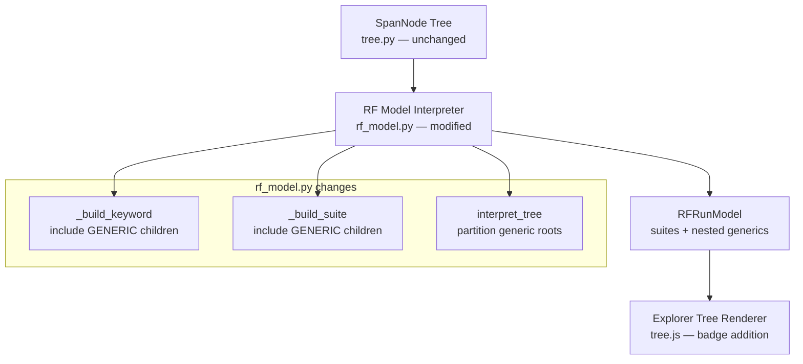

# Design Document: Nested Service Spans

## Overview

This feature changes how the RF Model Interpreter (`rf_model.py`) handles Generic spans whose parent is an RF KEYWORD span. Currently, all Generic spans are collected as "generic roots" and grouped into synthetic Service Suites at the top level of the Explorer tree. After this change, Generic spans whose `parent_span_id` references a KEYWORD-type RF span will be nested as children of that keyword's `RFKeyword` node, preserving the causal chain from RF keyword → backend service call.

The Span Tree builder (`tree.py`) already links parent-child relationships correctly — Generic spans that are children of KEYWORD spans already appear in `SpanNode.children`. The problem is that `_build_keyword()` filters children to only `SpanType.KEYWORD`, discarding Generic children. Similarly, `interpret_tree()` collects Generic root spans but doesn't distinguish between "Generic with a KEYWORD parent" (should nest) and "Generic with no RF parent" (should remain in Service Suite).

The Explorer tree renderer (`tree.js`) already handles GENERIC keyword_type in filtering and rendering. The main addition is service-colored badges on GENERIC/EXTERNAL keyword rows, using the shared `window.__RF_SVC_COLORS__` palette.

## Architecture

The change touches two layers of the data pipeline:



The architecture is a two-phase change:

1. **Backend (Python)**: Modify `_build_keyword()` and `_build_suite()` to include GENERIC children alongside KEYWORD children. Modify `interpret_tree()` to only treat Generic spans as "generic roots" when their parent is absent, not in the dataset, or is a SUITE/TEST span (not a KEYWORD).

2. **Frontend (JavaScript)**: Add service-colored badge rendering to `_createTreeNode()` for GENERIC and EXTERNAL keywords. The filtering, expand/collapse, and virtual scrolling already handle GENERIC keywords correctly.

## Components and Interfaces

### Modified: `_build_keyword()` in `rf_model.py`

Current behavior: Filters `node.children` to only `SpanType.KEYWORD`, recursively building child keywords.

New behavior: Also includes `SpanType.GENERIC` children, converting them via `_build_generic_keyword()`. Children are sorted by `start_time_unix_nano`.

```python
def _build_keyword(node: SpanNode) -> RFKeyword:
    children = []
    for c in node.children:
        ctype = classify_span(c.span)
        if ctype == SpanType.KEYWORD:
            children.append(_build_keyword(c))
        elif ctype == SpanType.GENERIC:
            children.append(_build_generic_keyword(c, all_span_ids))
    children.sort(key=lambda k: k.start_time)
    # ... rest unchanged
```

The `all_span_ids` parameter needs to be threaded through from `interpret_tree()`. Since `_build_generic_keyword()` already accepts this parameter, the change is to pass it into `_build_keyword()` as well.

### Modified: `_build_suite()` in `rf_model.py`

Current behavior: Skips GENERIC children entirely (comment: "Signals and generic spans are not added to the suite children").

New behavior: No change needed for `_build_suite()` itself. Generic spans that are direct children of a SUITE span are still treated as generic roots (per Requirement 1.5). The nesting only applies when the parent is a KEYWORD.

### Modified: `_build_test()` in `rf_model.py`

Current behavior: Filters `node.children` to only `SpanType.KEYWORD`.

New behavior: Also includes `SpanType.GENERIC` children, same pattern as `_build_keyword()`.

### Modified: `interpret_tree()` in `rf_model.py`

Current behavior: Collects all GENERIC root spans (those whose parent is not in the span set) into `generic_roots`, then groups them into Service Suites.

New behavior: The logic for identifying generic roots doesn't change — `interpret_tree()` only sees root-level SpanNodes. Generic spans that are children of KEYWORD spans are never root-level; they're already nested in the SpanNode tree. The key change is in `_build_keyword()` and `_build_test()` which now include those nested Generic children instead of ignoring them.

However, we need to ensure that Generic spans nested under keywords are NOT also collected as generic roots. Since `interpret_tree()` only iterates over `roots` (top-level SpanNodes), and nested Generic spans are children of KEYWORD SpanNodes (not roots), they won't appear in the root iteration. No change needed here.

### Modified: `_build_generic_keyword()` in `rf_model.py`

No changes needed. This function already converts a Generic SpanNode to an RFKeyword with `keyword_type="GENERIC"` and recursively processes children. It's currently only called from `_build_generic_service_suites()` but will now also be called from `_build_keyword()` and `_build_test()`.

The `all_span_ids` parameter is currently passed but not used inside `_build_generic_keyword()` — it was a forward-looking parameter. We need to thread it through `_build_keyword()` and `_build_test()`.

### Modified: `_createTreeNode()` in `tree.js`

The service badge rendering already exists for GENERIC and EXTERNAL keywords (lines 3087-3101 of tree.js). The badge uses `window.__RF_SVC_COLORS__.get(service_name)` to look up colors and applies light/dark theme variants. No changes needed — the badge rendering is already implemented and will automatically apply to newly nested GENERIC keywords.

### Unchanged: `_flattenTree()` / `_flattenSubtree()` in `tree.js`

These functions already handle GENERIC keyword_type in the service filter check. When `_activeServiceFilter` is set, GENERIC keywords with unchecked service names are hidden. This applies regardless of nesting depth, so nested Generic spans will be correctly filtered.

### Unchanged: `tree.py`

The span tree builder already correctly links parent-child relationships. A Generic span whose `parent_span_id` references a KEYWORD span is already a child of that KEYWORD's SpanNode. No changes needed.

## Data Models

### Existing: `RFKeyword` dataclass

No structural changes. The `children: list[RFKeyword]` field already supports mixed keyword types — GENERIC keywords are RFKeyword instances with `keyword_type="GENERIC"`. The `service_name: str` field is already present for service identification.

### Existing: `RFSuite` dataclass  

No changes. Service Suites (`_is_generic_service=True`) continue to group orphan/spontaneous Generic spans.

### Existing: `SpanNode` dataclass

No changes. Parent-child links are already correct.

### Data flow change

Before:
```
KEYWORD SpanNode
  ├── KEYWORD child → RFKeyword (included)
  └── GENERIC child → ignored by _build_keyword(), collected as generic root
```

After:
```
KEYWORD SpanNode
  ├── KEYWORD child → RFKeyword (included)
  └── GENERIC child → RFKeyword(keyword_type="GENERIC") (included via _build_generic_keyword)
```

Generic spans that are NOT children of a KEYWORD (orphans, children of SUITE/TEST, spontaneous) continue to flow into Service Suites unchanged.


## Correctness Properties

*A property is a characteristic or behavior that should hold true across all valid executions of a system — essentially, a formal statement about what the system should do. Properties serve as the bridge between human-readable specifications and machine-verifiable correctness guarantees.*

### Property 1: Keyword-parented Generic spans are nested

*For any* span tree containing Generic spans whose parent is a KEYWORD-type RF span, every such Generic span SHALL appear as an `RFKeyword` child (with `keyword_type="GENERIC"` and `service_name` matching the span's `resource_attributes["service.name"]`) of the corresponding parent RFKeyword in the output RFRunModel. This applies recursively: if a Generic span has Generic children, those children SHALL appear nested under the parent Generic's RFKeyword.

**Validates: Requirements 1.1, 1.2, 1.3**

### Property 2: Non-keyword-parented Generic spans go to Service Suites

*For any* span tree, every Generic span whose parent is absent, not in the span dataset, or is a SUITE/TEST-type RF span (not KEYWORD) SHALL appear in a Service Suite grouped by `service.name`. None of these spans SHALL appear nested under any RFKeyword.

**Validates: Requirements 1.4, 1.5, 2.2, 2.3**

### Property 3: Nested children are sorted by start time

*For any* RFKeyword in the output RFRunModel that contains GENERIC children, those children SHALL be sorted by `start_time` ascending, consistent with the ordering of non-GENERIC keyword children.

**Validates: Requirements 1.6**

### Property 4: Span count invariant — every input span appears exactly once

*For any* valid span tree, the total count of `RFKeyword` nodes with `keyword_type="GENERIC"` in the output RFRunModel SHALL equal the total count of Generic-classified spans in the input span tree. No Generic span is dropped or duplicated by the nesting transformation.

**Validates: Requirements 2.4, 6.1, 6.2**

## Error Handling

The nesting transformation is purely structural — it reclassifies where Generic spans appear in the output model without changing their content. Error conditions are minimal:

1. **Missing `service.name`**: If a Generic span has no `resource_attributes["service.name"]`, `_build_generic_keyword()` already defaults to `""`. No change needed.

2. **Circular parent references**: The SpanNode tree builder (`tree.py`) already handles this — circular references result in orphan nodes. The nesting logic only walks `node.children`, so it cannot loop.

3. **Mixed RF/Generic children**: A KEYWORD span may have both KEYWORD and GENERIC children. The modified `_build_keyword()` handles both types in a single pass, sorting the combined children list by `start_time`.

4. **Deep nesting**: Generic spans can form deep call chains (e.g., HTTP → SQL → cache). `_build_generic_keyword()` is already recursive. Stack depth is bounded by the span tree depth, which is typically < 20 levels in practice.

## Testing Strategy

### Testing Environment

All tests run inside Docker using the pre-built `rf-trace-test:latest` image via `make test-unit`. No raw Python on the host.

### Unit Tests

Unit tests verify specific examples and edge cases:

- **Nesting example**: Build a span tree with a KEYWORD parent and GENERIC child, verify the child appears in `RFKeyword.children` with `keyword_type="GENERIC"`.
- **Recursive nesting**: KEYWORD → GENERIC → GENERIC chain, verify full depth.
- **Orphan preservation**: Generic span with no parent stays in Service Suite.
- **SUITE/TEST parent**: Generic span with SUITE or TEST parent stays in Service Suite.
- **Mixed children**: KEYWORD with both KEYWORD and GENERIC children, verify both appear sorted.
- **Zero service suites**: When all generics have keyword parents, no Service Suites are produced.
- **Service name extraction**: Verify `service_name` is populated from `resource_attributes["service.name"]`.

### Property-Based Tests

Property-based tests use Hypothesis with the existing span generation strategies from `tests/conftest.py`. A new composite strategy generates span trees with mixed RF and Generic spans where some Generic spans are children of KEYWORD spans.

**Library**: Hypothesis (already in use)
**Configuration**: Uses project Hypothesis profiles (dev: 5 examples, ci: 200 examples). No hardcoded `@settings`.

Each property test must:
- Run minimum 100 iterations in CI (handled by the `ci` profile)
- Reference its design document property in a comment tag
- Use the tag format: **Feature: nested-service-spans, Property {number}: {property_text}**

**Property tests to implement**:

1. **Property 1 test**: Generate span trees with KEYWORD→GENERIC parent-child links. Verify every GENERIC child of a KEYWORD appears in the output RFKeyword's children with correct `keyword_type` and `service_name`.
   - Tag: `Feature: nested-service-spans, Property 1: Keyword-parented Generic spans are nested`

2. **Property 2 test**: Generate span trees with Generic spans parented by SUITE/TEST or orphaned. Verify they appear in Service Suites, not nested under keywords.
   - Tag: `Feature: nested-service-spans, Property 2: Non-keyword-parented Generic spans go to Service Suites`

3. **Property 3 test**: Generate KEYWORD nodes with multiple GENERIC children with random start times. Verify children are sorted ascending by `start_time`.
   - Tag: `Feature: nested-service-spans, Property 3: Nested children are sorted by start time`

4. **Property 4 test**: Generate arbitrary span trees with mixed RF and Generic spans. Count Generic-classified input spans, count GENERIC RFKeyword nodes in output. Verify counts match.
   - Tag: `Feature: nested-service-spans, Property 4: Span count invariant`

### Test Strategy Balance

- Unit tests: 7-10 focused examples covering specific scenarios and edge cases
- Property tests: 4 properties covering universal invariants across all valid inputs
- Unit tests catch concrete regressions; property tests verify the nesting transformation is correct for arbitrary span topologies
