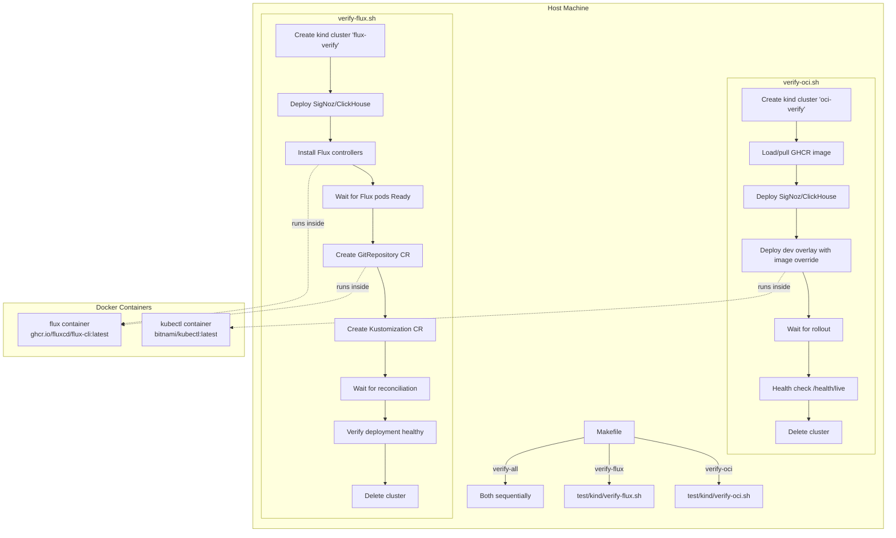

# Design Document: OCI & Flux Verification

## Overview

This feature adds two verification workflows that validate published OCI images in ephemeral kind clusters:

1. **Direct Deploy Verification** (`verify-oci`): Pulls a specific GHCR image tag, deploys it via the existing Kustomize dev overlay with an image override, waits for rollout, and health-checks the `/health/live` endpoint.
2. **Flux GitOps Verification** (`verify-flux`): Installs Flux controllers, creates `GitRepository` + `Kustomization` CRs pointing at the project repo, waits for Flux reconciliation, and verifies the deployment is healthy.

Both workflows run all CLI tools (kubectl, flux, kind) inside Docker containers — nothing is installed on the host. Each workflow uses an isolated kind cluster with a unique name (`oci-verify` / `flux-verify`) that does not interfere with the existing `trace-report-test` integration test cluster.

The SigNoz/ClickHouse stack from `test/kind/signoz/` is deployed in both workflows because the trace-report readiness probe checks ClickHouse connectivity.

### Key Design Decisions

- **Shell scripts over Python**: The verification workflows are orchestration of CLI commands (kind, kubectl, flux). Shell scripts match the existing `test/kind/itest-*.sh` pattern and avoid adding Python dependencies.
- **Docker-wrapped CLIs**: kubectl and flux commands run inside Docker containers with `--network host` to reach the kind cluster API server on the host loopback. The kubeconfig is mounted read-only.
- **Kustomize image override**: For direct deploy, we use `kubectl kustomize` piped through `sed` to replace the image reference — the same pattern used in `itest-up.sh`. This avoids needing `kustomize edit` inside a container.
- **SigNoz dependency**: The trace-report readiness probe hits ClickHouse. Without the SigNoz stack, pods never become ready. Both workflows deploy `test/kind/signoz/` manifests before the application.
- **Trap-based cleanup**: Cluster deletion runs in a `trap EXIT` handler so clusters are cleaned up even on script errors or Ctrl-C.

## Architecture



### Interaction with Existing Infrastructure

- The existing `test/kind/cluster.yaml` is reused as the kind cluster config for both workflows.
- The existing `test/kind/signoz/` manifests are deployed as-is via `kubectl apply -k`.
- The existing `deploy/kustomize/overlays/dev/` is the base for direct deploy verification.
- The existing `itest-up.sh` / `itest-down.sh` / `itest.sh` are not modified.
- The existing `trace-report-test` cluster name is never used by verification scripts.

## Components and Interfaces

### Shell Scripts

| Script | Location | Purpose |
|--------|----------|---------|
| `verify-oci.sh` | `test/kind/verify-oci.sh` | Direct kubectl deployment verification |
| `verify-flux.sh` | `test/kind/verify-flux.sh` | Flux GitOps reconciliation verification |

### Helper Functions (shared patterns)

Both scripts share common patterns extracted from `itest-up.sh`:

| Function | Description |
|----------|-------------|
| `info`, `ok`, `warn`, `die` | Colored output helpers (same as itest-up.sh) |
| `cleanup` | Trap handler: deletes kind cluster, prints summary |
| `dump_diagnostics` | Prints pod status, events, logs on failure |
| `run_kubectl` | Executes kubectl inside a Docker container with kubeconfig mounted |
| `run_flux` | Executes flux CLI inside the Flux CLI container with kubeconfig mounted |

### Docker CLI Wrappers

```bash
# kubectl wrapper — runs kubectl in a Docker container
run_kubectl() {
    docker run --rm --network host \
        -v "${KUBECONFIG}:/root/.kube/config:ro" \
        bitnami/kubectl:latest "$@"
}

# flux wrapper — runs flux CLI in a Docker container
run_flux() {
    docker run --rm --network host \
        -v "${KUBECONFIG}:/root/.kube/config:ro" \
        ghcr.io/fluxcd/flux-cli:latest "$@"
}
```

The `--network host` flag allows the container to reach the kind cluster API server on `127.0.0.1`. The kubeconfig is mounted read-only at the default kubectl path.

### Makefile Targets

| Target | Variable | Default | Description |
|--------|----------|---------|-------------|
| `verify-oci` | `IMAGE_TAG` | `latest` | Run direct deploy verification |
| `verify-flux` | `GIT_REF` | `main` | Run Flux GitOps verification |
| `verify-all` | both | both defaults | Run both sequentially, stop on first failure |

### Script Interfaces

**verify-oci.sh**:
- Input: `IMAGE_TAG` env var (default: `latest`)
- Input: `ROLLOUT_TIMEOUT` env var (default: `180`)
- Output: exit code 0 on success, non-zero on failure
- Output: summary line with pass/fail and elapsed time

**verify-flux.sh**:
- Input: `GIT_REF` env var (default: `main`)
- Input: `FLUX_TIMEOUT` env var (default: `120` for controllers, `300` for reconciliation)
- Output: exit code 0 on success, non-zero on failure
- Output: summary line with pass/fail and elapsed time


## Data Models

This feature is primarily shell-script orchestration with no persistent data models. The key data structures are Kubernetes resource manifests and script configuration.

### Configuration Variables

| Variable | Script | Type | Default | Description |
|----------|--------|------|---------|-------------|
| `IMAGE_TAG` | verify-oci.sh | string | `latest` | GHCR image tag to verify (e.g. `0.1.0`, `sha-abc1234`, `latest`) |
| `GIT_REF` | verify-flux.sh | string | `main` | Git ref for Flux GitRepository (tag or branch) |
| `ROLLOUT_TIMEOUT` | verify-oci.sh | int (seconds) | `180` | Max wait for deployment rollout |
| `FLUX_CTRL_TIMEOUT` | verify-flux.sh | int (seconds) | `120` | Max wait for Flux controller pods |
| `FLUX_RECON_TIMEOUT` | verify-flux.sh | int (seconds) | `300` | Max wait for Kustomization reconciliation |
| `CLUSTER_NAME` | both | string | `oci-verify` / `flux-verify` | Kind cluster name (hardcoded per script) |

### Flux Custom Resources

**GitRepository CR** (created by verify-flux.sh):

```yaml
apiVersion: source.toolkit.fluxcd.io/v1
kind: GitRepository
metadata:
  name: trace-report
  namespace: flux-system
spec:
  interval: 1m
  url: https://github.com/xtergo/robotframework-trace-report
  ref:
    branch: main  # or tag, from GIT_REF
```

**Kustomization CR** (created by verify-flux.sh):

```yaml
apiVersion: kustomize.toolkit.fluxcd.io/v1
kind: Kustomization
metadata:
  name: trace-report
  namespace: flux-system
spec:
  interval: 5m
  sourceRef:
    kind: GitRepository
    name: trace-report
  path: deploy/kustomize/overlays/dev
  prune: true
  targetNamespace: default
  wait: true
  timeout: 5m
```

### Cluster Naming Convention

| Workflow | Cluster Name | Rationale |
|----------|-------------|-----------|
| Direct deploy | `oci-verify` | Short, descriptive, no collision with `trace-report-test` |
| Flux GitOps | `flux-verify` | Short, descriptive, no collision with `trace-report-test` |
| Existing itest | `trace-report-test` | Unchanged, not touched by verification scripts |

### File Layout

```
test/kind/
├── cluster.yaml              # Existing — reused by verification scripts
├── itest-up.sh               # Existing — unchanged
├── itest-down.sh             # Existing — unchanged
├── itest.sh                  # Existing — unchanged
├── verify-oci.sh             # NEW — direct deploy verification
├── verify-flux.sh            # NEW — Flux GitOps verification
└── signoz/                   # Existing — deployed by both verification scripts
    ├── kustomization.yaml
    ├── clickhouse.yaml
    └── ...

docs/
└── oci-verification.md       # NEW — verification documentation

Makefile                      # MODIFIED — add verify-oci, verify-flux, verify-all targets
```


## Correctness Properties

*A property is a characteristic or behavior that should hold true across all valid executions of a system — essentially, a formal statement about what the system should do. Properties serve as the bridge between human-readable specifications and machine-verifiable correctness guarantees.*

### Property 1: Image tag substitution produces valid GHCR reference

*For any* valid image tag string (matching patterns `X.Y.Z`, `sha-HEXCHARS`, or `latest`), substituting it into the Kustomize dev overlay output should produce a manifest where the container image field equals `ghcr.io/xtergo/robotframework-trace-report:<tag>` and the original placeholder image reference no longer appears.

**Validates: Requirements 2.2, 2.7**

### Property 2: GitRepository ref substitution

*For any* valid git ref string (a branch name or tag name), the generated GitRepository YAML should contain that ref in the `spec.ref` field and the resource should have `kind: GitRepository` with the correct repository URL.

**Validates: Requirements 3.4**

### Property 3: Summary line contains status and elapsed time

*For any* verification result (pass or fail) and any non-negative elapsed time in seconds, the summary output line should contain the status indicator and the formatted elapsed time.

**Validates: Requirements 4.4**

### Property 4: Cluster name isolation

*For any* verification type identifier used by the system, the derived cluster name should never equal `trace-report-test` and should be deterministic (same input always produces same output).

**Validates: Requirements 6.1, 6.4**

## Error Handling

### Failure Modes and Responses

| Failure | Script | Response |
|---------|--------|----------|
| Docker image unavailable | both | Print missing image name, exit 1 |
| Kind cluster creation fails | both | Print kind error, exit 1 (no cleanup needed) |
| Pre-existing cluster with same name | both | Delete existing cluster, then create fresh |
| SigNoz/ClickHouse deploy fails | both | Dump diagnostics, cleanup cluster, exit 1 |
| Deployment rollout timeout | verify-oci.sh | Dump pod status + events + logs, cleanup, exit 1 |
| Health check fails | verify-oci.sh | Print HTTP response, cleanup, exit 1 |
| Flux install fails | verify-flux.sh | Dump flux-system pod status, cleanup, exit 1 |
| Flux controller pods not ready | verify-flux.sh | Dump flux-system pod status + logs, cleanup, exit 1 |
| GitRepository creation fails | verify-flux.sh | Print flux error, cleanup, exit 1 |
| Kustomization reconciliation timeout | verify-flux.sh | Dump Kustomization status + GitRepository status + controller logs, cleanup, exit 1 |
| Deployment has zero replicas after reconciliation | verify-flux.sh | Dump deployment status + pod logs, cleanup, exit 1 |

### Diagnostic Output Structure

On failure, diagnostic output follows a consistent structure:

```
✗ =========================================
✗   VERIFICATION FAILURE — DIAGNOSTICS
✗ =========================================

ℹ Pod status (wide):
  <kubectl get pods -o wide output>

ℹ Container logs (last 50 lines per pod):
  --- Logs for pod: <pod-name> ---
  <log output>

ℹ Events (last 20, sorted by timestamp):
  <kubectl get events output>

# Flux-specific (verify-flux.sh only):
ℹ Flux Kustomization status:
  <flux get kustomization output>

ℹ GitRepository status:
  <flux get source git output>

ℹ Flux controller logs (last 50 lines per controller):
  --- Logs for pod: <controller-pod> ---
  <log output>
```

### Cleanup Guarantee

Both scripts use `trap cleanup EXIT` to ensure the kind cluster is deleted regardless of how the script exits (success, failure, signal). The cleanup function:

1. Checks if the cluster exists
2. Deletes it if present
3. Prints elapsed time and pass/fail summary

## Testing Strategy

### Dual Testing Approach

This feature uses both unit tests and property-based tests:

- **Property-based tests**: Validate the four correctness properties above using generated inputs
- **Unit/example tests**: Validate specific integration scenarios, edge cases, and diagnostic output format
- **Integration tests**: End-to-end verification in CI (requires Docker and kind)

### Property-Based Testing

**Library**: [Hypothesis](https://hypothesis.readthedocs.io/) (already used by the project)

**Configuration**: Uses the project's existing Hypothesis profile system:
- `dev` profile: `max_examples=5` for fast feedback
- `ci` profile: `max_examples=200` for thorough coverage
- No hardcoded `@settings` per the project's test strategy steering file

**Test file**: `tests/unit/test_verify_properties.py`

Each property test must be tagged with a comment referencing the design property:

```python
# Feature: oci-flux-verification, Property 1: Image tag substitution produces valid GHCR reference
@given(image_tag=st.from_regex(r"^(\d+\.\d+\.\d+|sha-[a-f0-9]{7,40}|latest)$"))
def test_image_substitution_property(image_tag):
    ...
```

```python
# Feature: oci-flux-verification, Property 2: GitRepository ref substitution
@given(git_ref=st.from_regex(r"^[a-zA-Z0-9._/-]{1,100}$"))
def test_git_repo_ref_substitution_property(git_ref):
    ...
```

```python
# Feature: oci-flux-verification, Property 3: Summary line contains status and elapsed time
@given(
    passed=st.booleans(),
    elapsed=st.integers(min_value=0, max_value=86400)
)
def test_summary_line_property(passed, elapsed):
    ...
```

```python
# Feature: oci-flux-verification, Property 4: Cluster name isolation
@given(verify_type=st.sampled_from(["oci", "flux"]))
def test_cluster_name_isolation_property(verify_type):
    ...
```

### Testable Helper Functions

To enable property-based testing of shell script logic, the following pure functions are extracted into a small Python module (`tests/unit/verify_helpers.py` or tested via subprocess):

| Function | Input | Output | Tested by |
|----------|-------|--------|-----------|
| `substitute_image_tag(manifest, tag)` | Kustomize output + tag string | Modified manifest | Property 1 |
| `generate_git_repo_yaml(ref)` | Git ref string | GitRepository YAML | Property 2 |
| `format_summary(passed, elapsed)` | bool + int | Summary line string | Property 3 |
| `cluster_name(verify_type)` | "oci" or "flux" | Cluster name string | Property 4 |

These can be implemented as thin Python wrappers that replicate the shell logic, or as shell functions tested via `subprocess.run`.

### Unit/Example Tests

**Test file**: `tests/unit/test_verify_examples.py`

| Test | Validates |
|------|-----------|
| `test_image_sub_version_tag` | 2.2 — version tag like `0.1.0` |
| `test_image_sub_sha_tag` | 2.7 — SHA tag like `sha-abc1234` |
| `test_image_sub_latest_tag` | 2.7 — `latest` tag |
| `test_summary_pass` | 4.4 — pass summary format |
| `test_summary_fail` | 4.4 — fail summary format |
| `test_cluster_name_oci` | 6.1 — `oci-verify` name |
| `test_cluster_name_flux` | 6.1 — `flux-verify` name |
| `test_cluster_name_not_itest` | 6.4 — never `trace-report-test` |

### Integration Tests (CI only)

Integration tests run the actual scripts against real kind clusters. These are not part of `make test-unit` — they run via `make verify-oci` and `make verify-flux` in CI.

| Scenario | Command | Validates |
|----------|---------|-----------|
| Deploy latest image | `make verify-oci IMAGE_TAG=latest` | Req 2 end-to-end |
| Deploy specific version | `make verify-oci IMAGE_TAG=0.1.0` | Req 2.7 |
| Flux reconciliation | `make verify-flux` | Req 3 end-to-end |
| Both workflows | `make verify-all` | Req 4.3 |
