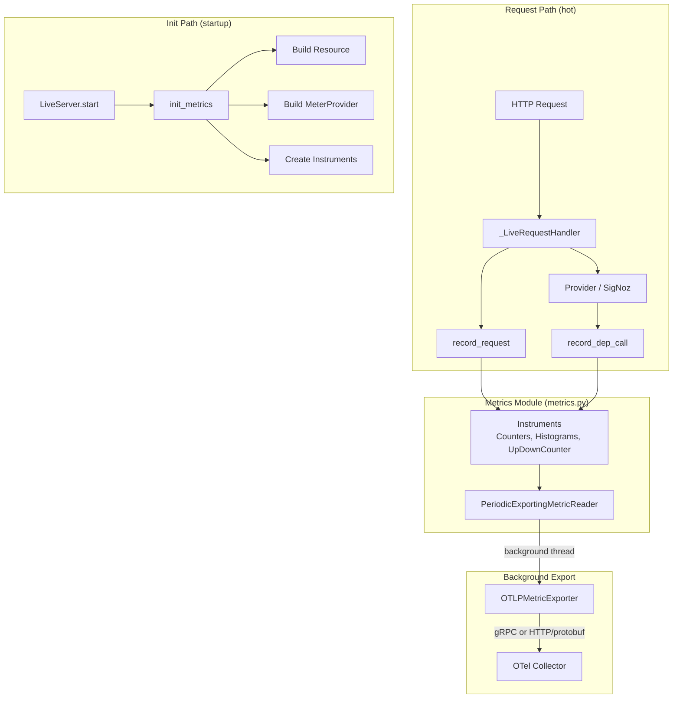
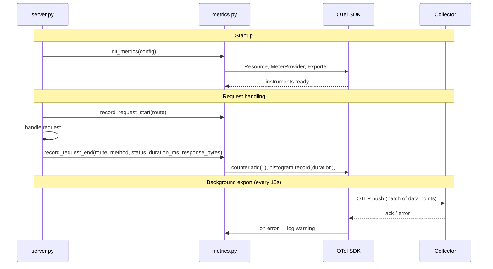

# Design Document: OpenTelemetry Metrics Instrumentation

## Overview

This design adds an optional OpenTelemetry metrics subsystem to `robotframework-trace-report` that emits RED metrics (Rate, Errors, Duration) for HTTP endpoints and dependency calls, plus result-size and inflight-request gauges, all pushed via OTLP to an external collector. The subsystem is off by default (`TRACE_REPORT_METRICS_ENABLED=false`) and, when enabled, runs entirely in background threads so that a collector outage never blocks or crashes request handling.

The implementation introduces a single new module (`src/rf_trace_viewer/metrics.py`) that owns the OTel `MeterProvider`, instruments, and recording helpers. The server and provider layers call thin recording functions; they never import OTel SDK types directly. When metrics are disabled, the recording functions are no-ops with zero overhead.

### Key Design Decisions

1. **Single module, no SDK leakage.** All OTel SDK usage is confined to `metrics.py`. The rest of the codebase calls plain Python functions (`record_request`, `record_dep_call`, etc.) that accept primitive arguments. This keeps the OTel dependency optional and testable.
2. **Push-only (OTLP), no Prometheus scrape.** The requirements explicitly call for push export. No `/metrics` HTTP endpoint is exposed.
3. **Env-first configuration.** Standard `OTEL_EXPORTER_OTLP_*` variables are read directly by the OTel SDK. Custom `TRACE_REPORT_*` variables are parsed in `metrics.py` and fed into the SDK programmatically.
4. **Graceful degradation.** If the SDK fails to initialize (missing dependency, bad config), the server starts normally with a logged warning and all recording functions become no-ops.

## Architecture



### Module Interaction



## Components and Interfaces

### 1. `MetricsConfig` (dataclass)

Holds all metrics-related configuration parsed from environment variables. Created during `init_metrics` and not exposed outside the module.

```python
@dataclasses.dataclass(frozen=True)
class MetricsConfig:
    enabled: bool = False
    export_interval_ms: int = 15_000
    otlp_endpoint: str | None = None
    otlp_protocol: str = "grpc"          # "grpc" | "http/protobuf"
    otlp_timeout_s: int = 5
    otlp_headers: dict[str, str] | None = None
    max_queue: int = 2048
    batch_size: int = 512
    drop_policy: str = "drop_oldest"     # "drop_oldest" | "drop_newest"
    diagnostics: bool = False
    log_level: str = "info"
    attr_allowlist: frozenset[str] | None = None
```

### 2. Public Recording Functions

These are the only symbols imported by `server.py` and provider modules. When metrics are disabled, each is a no-op.

| Function | Called from | Purpose |
|---|---|---|
| `init_metrics() -> None` | `LiveServer.start` | Initialize MeterProvider, instruments, exporter. |
| `shutdown_metrics() -> None` | `LiveServer.stop` | Flush and shut down the MeterProvider. |
| `record_request_start(route: str) -> None` | `_LiveRequestHandler.do_GET/do_POST` | Increment inflight gauge. |
| `record_request_end(route, method, status_code, duration_ms, response_bytes) -> None` | `_LiveRequestHandler.do_GET/do_POST` | Record counter, duration histogram, response size histogram; decrement inflight gauge. |
| `record_dep_call(dep, operation, status_code, duration_ms, req_bytes, resp_bytes) -> None` | `SigNozProvider._do_request` | Record dependency counter, duration, payload histograms. |
| `record_dep_timeout(dep: str, operation: str) -> None` | `SigNozProvider._do_request` | Increment timeout counter. |
| `record_items_returned(route: str, operation: str, count: int) -> None` | `_LiveRequestHandler._serve_signoz_spans`, `_serve_services` | Record items-returned histogram. |

### 3. Instruments Created

| Metric Name | Type | Unit | Attributes |
|---|---|---|---|
| `http.server.requests` | Counter | `{request}` | `route`, `method`, `status_class` |
| `http.server.duration` | Histogram | `ms` | `route`, `method`, `status_class` |
| `http.server.inflight` | UpDownCounter | `{request}` | `route` |
| `http.response.size` | Histogram | `By` | `route` |
| `dep.requests` | Counter | `{request}` | `dep`, `operation`, `status_class` |
| `dep.duration` | Histogram | `ms` | `dep`, `operation`, `status_class` |
| `dep.timeouts` | Counter | `{timeout}` | `dep`, `operation` |
| `dep.payload.in_bytes` | Histogram | `By` | `dep`, `operation` |
| `dep.payload.out_bytes` | Histogram | `By` | `dep`, `operation` |
| `items.returned` | Histogram | `{item}` | `route`, `operation` |

### 4. Route Normalization

A pure function `normalize_route(path: str) -> str` replaces dynamic segments:

- `/runs/abc123` → `/runs/{id}`
- `/api/v1/spans?since_ns=0` → `/api/v1/spans` (query string stripped before normalization)
- Unknown paths → `/_other` (catch-all to bound cardinality)

### 5. Status Class Mapping

A pure function `status_class(code: int) -> str` maps HTTP status codes:

- `200-299` → `"2xx"`, `300-399` → `"3xx"`, `400-499` → `"4xx"`, `500-599` → `"5xx"`

### 6. Attribute Allowlist Filtering

When `TRACE_REPORT_METRICS_ATTR_ALLOWLIST` is set (comma-separated), a function `filter_attributes(attrs: dict[str, str]) -> dict[str, str]` drops any key not in the allowlist before recording.

## Data Models

### Resource Attributes

Built at init time and attached to the `MeterProvider`:

```python
resource = Resource.create({
    "service.name": "robotframework-trace-report",
    "service.version": __version__,  # from __init__.py
    # merged from OTEL_RESOURCE_ATTRIBUTES env var by the SDK
})
```

The OTel SDK automatically merges `OTEL_RESOURCE_ATTRIBUTES`. The code explicitly sets `service.name` so it takes precedence if the user also specifies it in the env var.

### Histogram Bucket Boundaries

`http.server.duration` and `dep.duration` use explicit bucket boundaries optimized for p50/p95/p99:

```python
DURATION_BUCKETS = [1, 2, 5, 10, 25, 50, 100, 250, 500, 1000, 2500, 5000, 10000, 30000]
```

Payload size histograms use byte-oriented boundaries:

```python
SIZE_BUCKETS = [128, 256, 512, 1024, 4096, 16384, 65536, 262144, 1048576, 4194304]
```

Items-returned histogram:

```python
ITEMS_BUCKETS = [0, 1, 5, 10, 50, 100, 500, 1000, 5000, 10000, 50000]
```

### Configuration Environment Variables

| Variable | Default | Description |
|---|---|---|
| `TRACE_REPORT_METRICS_ENABLED` | `false` | Enable/disable metrics collection |
| `TRACE_REPORT_METRICS_EXPORT_INTERVAL_MS` | `15000` | Export interval in milliseconds |
| `TRACE_REPORT_OTEL_MAX_QUEUE` | `2048` | Max buffered data points |
| `TRACE_REPORT_OTEL_BATCH_SIZE` | `512` | Data points per export batch |
| `TRACE_REPORT_OTEL_DROP_POLICY` | `drop_oldest` | Queue-full strategy |
| `TRACE_REPORT_OTEL_DIAGNOSTICS` | `false` | Verbose exporter logging |
| `TRACE_REPORT_METRICS_ATTR_ALLOWLIST` | *(all)* | Comma-separated attribute allowlist |
| `TRACE_REPORT_LOG_LEVEL` | `info` | Application log level |
| `OTEL_EXPORTER_OTLP_ENDPOINT` | *(none)* | Collector endpoint (SDK standard) |
| `OTEL_EXPORTER_OTLP_METRICS_ENDPOINT` | *(none)* | Metrics-specific endpoint override |
| `OTEL_EXPORTER_OTLP_PROTOCOL` | `grpc` | Export protocol (SDK standard) |
| `OTEL_EXPORTER_OTLP_TIMEOUT` | `5` | Export timeout in seconds (SDK standard) |
| `OTEL_EXPORTER_OTLP_HEADERS` | *(none)* | Auth headers (SDK standard) |
| `OTEL_RESOURCE_ATTRIBUTES` | *(none)* | Resource attributes (SDK standard) |


## Correctness Properties

*A property is a characteristic or behavior that should hold true across all valid executions of a system — essentially, a formal statement about what the system should do. Properties serve as the bridge between human-readable specifications and machine-verifiable correctness guarantees.*

### Property 1: Resource attributes always include mandatory fields

*For any* set of `OTEL_RESOURCE_ATTRIBUTES` environment variable values (including empty, missing, or values that attempt to override `service.name`), the built OTel Resource SHALL always contain `service.name = "robotframework-trace-report"` and a non-empty `service.version`, and SHALL preserve any user-supplied attributes (e.g., `deployment.environment`, `k8s.namespace.name`) with the mandatory `service.name` taking precedence.

**Validates: Requirements 1.1, 1.2, 1.3, 1.4, 12.1**

### Property 2: MetricsConfig round-trip from environment variables

*For any* valid combination of `TRACE_REPORT_*` and `OTEL_EXPORTER_OTLP_*` environment variables, constructing a `MetricsConfig` from those variables and then reading back each field SHALL yield the originally set value, or the documented default when the variable is unset. Specifically: `OTEL_EXPORTER_OTLP_METRICS_ENDPOINT` SHALL take precedence over `OTEL_EXPORTER_OTLP_ENDPOINT` when both are set.

**Validates: Requirements 8.1, 8.2, 8.3, 8.5, 9.1, 9.2, 11.1, 11.2, 11.3**

### Property 3: HTTP request recording correctness

*For any* sequence of `record_request_end` calls with random `(route, method, status_code, duration_ms, response_bytes)` tuples, the `http.server.requests` counter value for each `(route, method, status_class)` combination SHALL equal the number of calls with that combination, the `http.server.duration` histogram observation count SHALL match, and the `http.response.size` histogram observation count SHALL match.

**Validates: Requirements 3.1, 3.2, 3.4**

### Property 4: Inflight request tracking invariant

*For any* interleaved sequence of `record_request_start(route)` and `record_request_end(route, ...)` calls where the number of starts is ≥ the number of ends for each route, the `http.server.inflight` UpDownCounter value for that route SHALL equal `starts - ends`.

**Validates: Requirements 3.3**

### Property 5: Dependency call recording correctness

*For any* sequence of `record_dep_call` calls with random `(dep, operation, status_code, duration_ms, req_bytes, resp_bytes)` tuples and `record_dep_timeout` calls with random `(dep, operation)` tuples, the `dep.requests` counter SHALL equal the call count per `(dep, operation, status_class)`, the `dep.duration` histogram observation count SHALL match, the `dep.payload.in_bytes` and `dep.payload.out_bytes` histogram observation counts SHALL match, and the `dep.timeouts` counter SHALL equal the timeout count per `(dep, operation)`.

**Validates: Requirements 4.1, 4.2, 4.3, 4.4, 4.5**

### Property 6: Items returned recording correctness

*For any* sequence of `record_items_returned(route, operation, count)` calls, the `items.returned` histogram observation count for each `(route, operation)` combination SHALL equal the number of calls with that combination.

**Validates: Requirements 5.1**

### Property 7: Route normalization replaces dynamic segments

*For any* URL path string containing segments that match UUID, numeric ID, or hex-string patterns, `normalize_route` SHALL replace those segments with `{id}` placeholders, and the output SHALL never contain the original dynamic value. Static known routes (e.g., `/api/v1/spans`, `/health/ready`) SHALL pass through unchanged.

**Validates: Requirements 6.3**

### Property 8: Attribute allowlist filtering

*For any* dict of string key-value pairs and any non-empty allowlist (frozenset of strings), `filter_attributes(attrs, allowlist)` SHALL return a dict containing only keys present in both the input and the allowlist, with values unchanged. Keys not in the allowlist SHALL be absent from the result.

**Validates: Requirements 6.4**

### Property 9: Recorded attributes are restricted to the allowed set

*For any* call to `record_request_end` or `record_dep_call`, the attribute keys attached to the recorded metric data point SHALL be a subset of `{route, method, status_class, dep, operation}`. No other attribute keys SHALL appear.

**Validates: Requirements 6.1, 6.2**

### Property 10: Export interval validation

*For any* integer value provided for `TRACE_REPORT_METRICS_EXPORT_INTERVAL_MS`, the config parser SHALL accept positive integers and reject zero or negative values. Values below 1000 SHALL be accepted but SHALL trigger a warning log.

**Validates: Requirements 9.4**

### Property 11: Invalid drop policy falls back to default

*For any* string value that is not `"drop_oldest"` or `"drop_newest"`, parsing `TRACE_REPORT_OTEL_DROP_POLICY` SHALL produce `"drop_oldest"` as the effective value and SHALL trigger a warning log.

**Validates: Requirements 11.4**

### Property 12: Status class mapping

*For any* HTTP status code integer in the range 100–599, `status_class(code)` SHALL return the correct grouping string (`"2xx"`, `"3xx"`, `"4xx"`, `"5xx"`, or `"other"` for 1xx). The mapping SHALL be a pure function of the status code with no side effects.

**Validates: Requirements 3.1, 4.1**

### Property 13: OTLP header parsing

*For any* valid OTLP header string (comma-separated `key=value` pairs), parsing SHALL produce a dict where each key maps to its value. Round-tripping (format then parse) SHALL preserve all key-value pairs.

**Validates: Requirements 8.4**

## Error Handling

### SDK Initialization Failure

If the OTel SDK raises any exception during `init_metrics()` (e.g., missing `opentelemetry-sdk` package, invalid endpoint URL, permission error), the function catches the exception, logs it via `StructuredLogger` at ERROR level, and sets an internal `_enabled = False` flag. All subsequent recording function calls become no-ops. The server starts normally.

### Exporter Failure During Operation

The `PeriodicExportingMetricReader` runs in a daemon thread. If an export attempt fails (network error, collector down, timeout), the OTel SDK logs the error internally. The metrics module additionally logs a WARNING via `StructuredLogger` when diagnostics mode is enabled. No data is retried — the SDK's built-in retry policy applies. The export queue continues to buffer new data points up to `max_queue`, applying the configured drop policy when full.

### Invalid Configuration Values

| Variable | Invalid Value | Behavior |
|---|---|---|
| `TRACE_REPORT_METRICS_EXPORT_INTERVAL_MS` | Non-integer, zero, negative | Log WARNING, use default (15000) |
| `TRACE_REPORT_METRICS_EXPORT_INTERVAL_MS` | < 1000 | Log WARNING (too aggressive), accept value |
| `TRACE_REPORT_OTEL_DROP_POLICY` | Not `drop_oldest`/`drop_newest` | Log WARNING, fall back to `drop_oldest` |
| `OTEL_EXPORTER_OTLP_PROTOCOL` | Not `grpc`/`http/protobuf` | Log WARNING, fall back to `grpc` |
| `TRACE_REPORT_METRICS_ENABLED` | Not `true`/`false` | Treat as `false` (disabled) |

### Recording Function Errors

All recording functions (`record_request_end`, `record_dep_call`, etc.) wrap their body in a try/except that catches `Exception`, logs at DEBUG level, and returns silently. A bug in metrics instrumentation must never crash request handling.

## Testing Strategy

### Dual Testing Approach

This feature uses both unit tests and property-based tests:

- **Property-based tests** verify the 13 correctness properties above using Hypothesis with randomized inputs. Each property test runs a minimum of 100 iterations (ci profile: 200, dev profile: 5).
- **Unit tests** cover specific examples, edge cases, integration points, and error conditions that are better expressed as concrete scenarios.

### Property-Based Testing

**Library:** [Hypothesis](https://hypothesis.readthedocs.io/) (already a dev dependency)

**Test file:** `tests/unit/test_metrics_properties.py`

**Configuration:** Tests use the project's existing Hypothesis profile system (dev/ci) via `conftest.py`. No hardcoded `@settings` decorators.

Each property test is tagged with a comment referencing its design property:

```python
# Feature: otel-metrics-instrumentation, Property 1: Resource attributes always include mandatory fields
def test_resource_attributes_always_include_mandatory_fields(self):
    ...
```

**Strategies needed** (added to `conftest.py` or local to the test file):

- `metrics_config_env()` — generates random valid combinations of `TRACE_REPORT_*` and `OTEL_*` env vars
- `otel_resource_attrs_str()` — generates random `OTEL_RESOURCE_ATTRIBUTES` strings (key=value,key=value)
- `http_request_recording()` — generates `(route, method, status_code, duration_ms, response_bytes)` tuples
- `dep_call_recording()` — generates `(dep, operation, status_code, duration_ms, req_bytes, resp_bytes)` tuples
- `url_path_with_dynamic_segments()` — generates URL paths containing UUIDs, numeric IDs, hex strings
- `attribute_dict_and_allowlist()` — generates random attribute dicts paired with random allowlists
- `otlp_header_string()` — generates valid comma-separated `key=value` header strings

### Unit Tests

**Test file:** `tests/unit/test_metrics.py`

Unit tests cover:

- `init_metrics` with enabled=true creates instruments (Req 2.1)
- `init_metrics` with enabled=false is a no-op (Req 2.2)
- SDK initialization failure → server starts without metrics (Req 7.7)
- Exporter failure → server continues, warning logged (Req 7.2, 7.3)
- Bucket boundaries are correctly configured (Req 3.5)
- No CPU/memory instruments created (Req 12.3)
- Specific route normalization examples: `/runs/abc123` → `/runs/{id}`, `/api/v1/spans` → `/api/v1/spans`
- Header parsing edge cases: empty string, single header, multiple headers
- Diagnostics mode logging behavior (Req 10.2, 10.3)

### Test Execution

All tests run in Docker via the existing Makefile targets:

```bash
# Quick dev run (light PBT, 5 examples)
make test-unit

# Full PBT (200 examples per property)
make test-properties

# Single file
make dev-test-file FILE=tests/unit/test_metrics_properties.py
```

### Mocking Strategy

The OTel SDK is mocked at the `MeterProvider` / instrument level using `InMemoryMetricReader` from `opentelemetry-sdk` (test utility). This avoids needing a real collector and allows direct inspection of recorded metrics in assertions. For tests that verify no-op behavior when disabled, the module's internal `_enabled` flag is checked directly.
