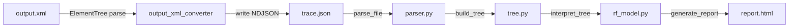

# Design Document: Output XML Converter

## Overview

The output-xml-converter transforms Robot Framework 7.x `output.xml` files into OTLP NDJSON trace files that the existing `parser → tree → rf_model → generator` pipeline can consume. This enables offline viewing of RF test results without requiring the RF tracer listener during test execution.

The converter is a single Python module (`output_xml_converter.py`) with a CLI entry point. It reads the XML hierarchy (suites, tests, keywords, control structures), maps each element to an OTLP span with the correct `rf.*` attributes, and writes a single NDJSON line containing one `ExportTraceServiceRequest`.

### Design Decisions

1. **Single-module design**: The converter lives in `src/rf_trace_viewer/output_xml_converter.py`. It has no new dependencies beyond the standard library (`xml.etree.ElementTree`, `json`, `uuid`, `datetime`). This keeps the footprint minimal and avoids coupling to the rest of the codebase at the module level — the only contract is the OTLP NDJSON output format.

2. **ElementTree over lxml**: `xml.etree.ElementTree` is sufficient for output.xml parsing. The files are well-formed XML produced by RF itself, so we don't need lxml's error recovery or XPath extensions. This avoids adding a C dependency.

3. **Depth-first traversal**: The XML is walked depth-first, mirroring the natural parent-child hierarchy. Each element gets a span with `parent_span_id` pointing to its parent's `span_id`. This produces the same tree structure that `build_tree` reconstructs from the flat span list.

4. **Timestamp strategy**: RF 7.x uses ISO 8601 `start` + `elapsed` (seconds) on `<status>` elements. We parse `start` to nanoseconds since epoch and compute `end = start + elapsed * 1e9`. Elements without a `start` attribute inherit from their parent.

5. **Single NDJSON line**: The output is one JSON line (one `ExportTraceServiceRequest`), matching the format the parser expects. All spans share a single `trace_id` generated per conversion run.

## Architecture



The converter sits upstream of the existing pipeline. Its output is indistinguishable from what the RF tracer listener produces — the downstream modules don't know or care whether the NDJSON came from live tracing or XML conversion.

### Module Placement

```
src/rf_trace_viewer/
├── output_xml_converter.py   # NEW — the converter module
├── parser.py                 # Existing — reads NDJSON
├── tree.py                   # Existing — builds span tree
├── rf_model.py               # Existing — interprets RF model
├── generator.py              # Existing — generates HTML report
└── cli.py                    # Existing — add convert subcommand
```

### CLI Integration

The converter is invoked via a new `convert` subcommand on the existing CLI:

```bash
rf-trace-viewer convert output.xml -o trace.json
```

This is added as a subcommand in `cli.py` that delegates to `output_xml_converter.convert_file()`. The existing default behavior (report generation) is unchanged.

## Components and Interfaces

### 1. `output_xml_converter` module

The public API consists of two functions:

```python
def convert_file(input_path: str, output_path: str) -> None:
    """Convert an RF output.xml file to OTLP NDJSON.
    
    Raises:
        SystemExit: If the file is missing, unreadable, or has unsupported schema version.
    """

def convert_xml(root: xml.etree.ElementTree.Element) -> dict:
    """Convert a parsed XML root element to an ExportTraceServiceRequest dict.
    
    This is the pure-logic core, separated from I/O for testability.
    Returns the complete NDJSON object ready for json.dumps().
    """
```

Internal helpers (not part of public API):

| Function | Purpose |
|---|---|
| `_validate_schema(root)` | Check `schemaversion` attribute ≥ 5 |
| `_extract_resource_attrs(root)` | Build resource attributes from `<robot>` element |
| `_walk_element(elem, parent_span_id, trace_id, context)` | Recursive depth-first traversal |
| `_make_span(name, attrs, status_elem, parent_span_id, trace_id, context)` | Create a single OTLP span dict |
| `_parse_timestamp(iso_str)` | ISO 8601 → nanoseconds since epoch |
| `_parse_elapsed(elapsed_str)` | Elapsed seconds string → nanoseconds |
| `_make_events(elem)` | Convert `<msg>` children to OTLP events |
| `_make_otlp_attr(key, value)` | Create `{"key": ..., "value": {"string_value": ...}}` |
| `_make_otlp_array_attr(key, values)` | Create array_value attribute for tags |
| `_generate_span_id()` | Generate 16-char lowercase hex string |

### 2. CLI integration in `cli.py`

A new `convert` subcommand is added to the argument parser:

```python
convert_parser = subparsers.add_parser("convert", help="Convert RF output.xml to OTLP NDJSON")
convert_parser.add_argument("input", help="Path to RF output.xml file")
convert_parser.add_argument("-o", "--output", help="Output NDJSON file path (default: input with .json extension)")
```

### 3. Conversion Context

A lightweight dataclass tracks state during the recursive walk:

```python
@dataclass
class _ConversionContext:
    trace_id: str
    parent_start_time_ns: int  # fallback timestamp for elements without start
    spans: list[dict]          # accumulates all generated spans
```

## Data Models

### Input: RF output.xml structure

The converter handles these XML elements:

| Element | Maps to | Key attributes |
|---|---|---|
| `<robot>` | Resource attributes | `generator`, `generated`, `rpa`, `schemaversion` |
| `<suite>` | Suite span | `name`, `id`, `source` |
| `<test>` | Test span | `name`, `id` |
| `<kw>` | Keyword span | `name`, `type`, `library`/`owner` |
| `<for>` | Keyword span (type=FOR) | — |
| `<while>` | Keyword span (type=WHILE) | — |
| `<if>` | Keyword span (type=IF) | — |
| `<try>` | Keyword span (type=TRY) | — |
| `<branch>` | Keyword span | `type` (IF, ELSEIF, ELSE, TRY, EXCEPT, FINALLY) |
| `<iter>` | Keyword span (type=ITERATION) | — |
| `<status>` | Timestamps + status | `status`, `start`, `elapsed` |
| `<msg>` | Span event | `time`, `level`, text content |
| `<tag>` | Test tag array | text content |
| `<arg>` | Keyword args string | text content |

### Output: OTLP NDJSON structure

One line, one `ExportTraceServiceRequest`:

```json
{
  "resource_spans": [{
    "resource": {
      "attributes": [
        {"key": "service.name", "value": {"string_value": "My Suite"}},
        {"key": "rf.version", "value": {"string_value": "7.4.2"}},
        {"key": "telemetry.sdk.name", "value": {"string_value": "rf-output-xml-converter"}},
        {"key": "run.id", "value": {"string_value": "<uuid>"}}
      ]
    },
    "scope_spans": [{
      "scope": {"name": "rf-output-xml-converter"},
      "spans": [
        {
          "trace_id": "<32-hex>",
          "span_id": "<16-hex>",
          "parent_span_id": "<16-hex or empty>",
          "name": "My Suite",
          "kind": "SPAN_KIND_INTERNAL",
          "start_time_unix_nano": "<int>",
          "end_time_unix_nano": "<int>",
          "attributes": [
            {"key": "rf.suite.name", "value": {"string_value": "My Suite"}},
            {"key": "rf.suite.id", "value": {"string_value": "s1"}},
            {"key": "rf.status", "value": {"string_value": "PASS"}}
          ],
          "status": {"code": "STATUS_CODE_OK"},
          "events": []
        }
      ]
    }]
  }]
}
```

### Attribute Mapping Reference

| RF XML source | OTLP span attribute | Value |
|---|---|---|
| `<suite name="X">` | `rf.suite.name` | `X` |
| `<suite id="X">` | `rf.suite.id` | `X` |
| `<suite source="X">` | `rf.suite.source` | `X` |
| `<test name="X">` | `rf.test.name` | `X` |
| `<test id="X">` | `rf.test.id` | `X` |
| `<tag>X</tag>` | `rf.test.tags` | array_value |
| `<kw name="X">` | `rf.keyword.name` | `X` |
| `<kw type="setup">` | `rf.keyword.type` | `SETUP` |
| `<kw type="teardown">` | `rf.keyword.type` | `TEARDOWN` |
| `<kw>` (no type) | `rf.keyword.type` | `KEYWORD` |
| `<kw library="X">` | `rf.keyword.library` | `X` |
| `<arg>X</arg>` | `rf.keyword.args` | joined with `", "` |
| `<for>` | `rf.keyword.name`=`FOR`, `rf.keyword.type`=`FOR` | — |
| `<while>` | `rf.keyword.name`=`WHILE`, `rf.keyword.type`=`WHILE` | — |
| `<if>` | `rf.keyword.name`=`IF`, `rf.keyword.type`=`IF` | — |
| `<try>` | `rf.keyword.name`=`TRY`, `rf.keyword.type`=`TRY` | — |
| `<branch type="X">` | `rf.keyword.type` | `X` (uppercased) |
| `<iter>` | `rf.keyword.type` | `ITERATION` |
| `<status status="X">` | `rf.status` | `X` |
| `<status start="X">` | `start_time_unix_nano` | ISO 8601 → ns |
| `<status elapsed="X">` | `end_time_unix_nano` | start + elapsed×1e9 |
| `<msg level="X">text</msg>` | span event | `log.level`=X, name=text |

### Resource Attributes

| Attribute | Source |
|---|---|
| `service.name` | Top-level `<suite name="...">` |
| `rf.version` | Extracted from `<robot generator="Robot 7.4.2 (...)">` |
| `telemetry.sdk.name` | `"rf-output-xml-converter"` (constant) |
| `run.id` | Generated UUID per conversion run |

### Status Mapping

| RF status | OTLP status code |
|---|---|
| `PASS` | `STATUS_CODE_OK` |
| `FAIL` | `STATUS_CODE_ERROR` |
| `SKIP` | `STATUS_CODE_OK` |


## Correctness Properties

*A property is a characteristic or behavior that should hold true across all valid executions of a system — essentially, a formal statement about what the system should do. Properties serve as the bridge between human-readable specifications and machine-verifiable correctness guarantees.*

### Property 1: Full pipeline round-trip

*For any* valid RF output.xml containing suites, tests, and keywords with arbitrary names and statuses, converting to NDJSON and then running through `parse_file → build_tree → interpret_tree` shall produce an `RFRunModel` where the suite names, test names, keyword names, and status values match the original XML content.

**Validates: Requirements 11.4, 11.1**

### Property 2: Span classification correctness

*For any* valid RF output.xml, every span in the converter output shall be classified correctly by `classify_span`: suite elements → `SpanType.SUITE`, test elements → `SpanType.TEST`, keyword and control structure elements → `SpanType.KEYWORD`.

**Validates: Requirements 11.2**

### Property 3: Tree structure matches XML hierarchy

*For any* valid RF output.xml with nested suites, tests, and keywords, converting to NDJSON and then running through `parse_file → build_tree` shall produce a `SpanNode` tree where the parent-child relationships match the original XML element nesting (suites contain suites/tests, tests contain keywords, keywords contain keywords).

**Validates: Requirements 11.3, 2.3, 3.3**

### Property 4: Timestamp conversion correctness

*For any* ISO 8601 timestamp string and elapsed seconds value, `_parse_timestamp` shall produce a nanosecond-since-epoch value that, when converted back to a datetime, equals the original timestamp; and `end_time_unix_nano` shall equal `start_time_unix_nano + elapsed * 1_000_000_000`.

**Validates: Requirements 6.1, 6.2**

### Property 5: Timestamp ordering invariant

*For any* valid RF output.xml, every parent span in the converter output shall have `start_time_unix_nano` less than or equal to all of its children's `start_time_unix_nano` values.

**Validates: Requirements 6.4**

### Property 6: Output structural invariants

*For any* valid RF output.xml, the converter output shall be a single line of valid JSON conforming to `ExportTraceServiceRequest` structure, where: all spans share a single 32-character lowercase hex `trace_id`, each span has a unique 16-character lowercase hex `span_id`, and all spans have `kind` set to `SPAN_KIND_INTERNAL`.

**Validates: Requirements 8.1, 8.2, 8.3, 8.4, 8.5**

### Property 7: Resource attributes correctness

*For any* valid RF output.xml with a `<robot>` root element, the converter output shall include resource attributes where `service.name` equals the top-level suite name, `rf.version` is extracted from the `generator` attribute, `telemetry.sdk.name` is `rf-output-xml-converter`, and `run.id` is a valid UUID.

**Validates: Requirements 1.4, 9.1, 9.2, 9.3, 9.4**

### Property 8: Control structure element mapping

*For any* valid RF output.xml containing `<for>`, `<while>`, `<if>`, or `<try>` elements, the converter shall produce spans with `rf.keyword.name` and `rf.keyword.type` matching the element tag name (uppercased); `<branch>` children shall have `rf.keyword.type` set to their `type` attribute; `<iter>` children shall have `rf.keyword.type` set to `ITERATION`.

**Validates: Requirements 5.1, 5.2, 5.3, 5.4, 5.5, 5.6**

### Property 9: Keyword attribute completeness

*For any* `<kw>` element with a `type` attribute of `setup` or `teardown`, the span shall have `rf.keyword.type` set to `SETUP` or `TEARDOWN` respectively; for `<kw>` elements without a `type` attribute, `rf.keyword.type` shall be `KEYWORD`. *For any* `<kw>` element with `<arg>` children, `rf.keyword.args` shall equal the arg texts joined by `", "`. *For any* `<kw>` element with a `library` or `owner` attribute, `rf.keyword.library` shall be set to that value.

**Validates: Requirements 4.2, 4.3, 4.4, 4.5**

### Property 10: Test tags mapping

*For any* `<test>` element containing `<tag>` children, the corresponding span shall have `rf.test.tags` as an OTLP `array_value` containing all tag text values in order.

**Validates: Requirements 3.2**

### Property 11: Message-to-event mapping

*For any* `<kw>` or `<test>` element containing `<msg>` children, the corresponding span shall have one OTLP event per `<msg>` element, where each event's `name` equals the message text, `time_unix_nano` is the converted timestamp, and `log.level` matches the message `level` attribute.

**Validates: Requirements 7.1, 7.2, 7.3, 7.4**

### Property 12: Schema version validation

*For any* integer schema version less than 5 (including 0, 1, 2, 3, 4) or a missing `schemaversion` attribute, the converter shall reject the input with a non-zero exit code.

**Validates: Requirements 1.3**

### Property 13: Status code mapping

*For any* element with `<status status="PASS">`, the span shall have `status.code` set to `STATUS_CODE_OK`; for `<status status="FAIL">`, the span shall have `status.code` set to `STATUS_CODE_ERROR`.

**Validates: Requirements 8.6, 2.4, 3.4**

### Property 14: CLI default output path

*For any* input file path, when no `--output` argument is provided, the CLI shall default the output path to the input filename with the extension replaced by `.json`.

**Validates: Requirements 10.2**

## Error Handling

### Input Validation Errors

| Condition | Behavior |
|---|---|
| Input file does not exist | `SystemExit(1)` with message to stderr |
| Input file is not readable | `SystemExit(1)` with message to stderr |
| XML parse error (malformed XML) | `SystemExit(1)` with message to stderr |
| Root element is not `<robot>` | `SystemExit(1)` with message to stderr |
| `schemaversion` missing or < 5 | `SystemExit(1)` with message indicating RF 7.x required |

### Graceful Degradation

| Condition | Behavior |
|---|---|
| `<status>` element missing `start` attribute | Use parent's start time as fallback |
| `<status>` element missing `elapsed` attribute | Set `end_time = start_time` (zero duration) |
| `<msg>` element missing `time` attribute | Use parent span's start time |
| `<msg>` element missing `level` attribute | Omit `log.level` event attribute |
| `<kw>` element missing `name` attribute | Use empty string |
| `generator` attribute doesn't match expected pattern | Set `rf.version` to full generator string |
| `<suite>` missing `source` attribute | Set `rf.suite.source` to empty string |

### Output Errors

| Condition | Behavior |
|---|---|
| Output directory does not exist | `SystemExit(1)` with message to stderr |
| Output file not writable | `SystemExit(1)` with message to stderr |

## Testing Strategy

### Dual Testing Approach

This feature uses both unit tests and property-based tests:

- **Unit tests** (`tests/unit/test_output_xml_converter.py`): Specific examples, edge cases, error conditions, CLI integration
- **Property tests** (`tests/unit/test_output_xml_converter_properties.py`): Universal properties across generated inputs

### Property-Based Testing

**Library**: Hypothesis (already configured in the project)

**Profiles**: Uses the existing `dev`/`ci` profile system from `tests/conftest.py`:
- `dev`: `max_examples=5` for fast feedback during development
- `ci`: `max_examples=200` for thorough CI coverage

**No hardcoded `@settings`** — the profile system controls iteration counts globally.

**Each property test must reference its design document property with a tag comment:**
```python
# Feature: output-xml-converter, Property 1: Full pipeline round-trip
```

**Each correctness property is implemented by a single property-based test.**

### Hypothesis Strategy for Output XML

A new Hypothesis strategy `rf_output_xml` will be added to `tests/conftest.py` that generates valid RF output.xml `Element` trees with:
- Random suite names, test names, keyword names
- Random nesting depth (suites containing suites, tests, keywords)
- Random control structures (`<for>`, `<while>`, `<if>`, `<try>` with `<branch>`/`<iter>`)
- Random `<status>` elements with valid timestamps and elapsed values
- Random `<msg>` elements with levels and text
- Random `<tag>` and `<arg>` elements

This strategy is the foundation for all property tests — it generates the input XML, and the properties verify the converter output.

### Unit Test Coverage

| Area | Tests |
|---|---|
| Schema validation | Reject schemaversion < 5, missing schemaversion, non-robot root |
| File I/O errors | Missing file, unreadable file, unwritable output |
| Timestamp parsing | Known ISO 8601 values → expected nanoseconds |
| Element mapping | Specific XML snippets → expected span attributes |
| CLI integration | Argument parsing, default output path, exit codes |
| Edge cases | Empty suites, keywords with no args, missing attributes |

### Test Execution

All tests run inside Docker via the `rf-trace-test:latest` image:

```bash
make test-unit                    # Quick run (dev profile, <30s)
make dev-test-file FILE=tests/unit/test_output_xml_converter_properties.py  # Single file
make test-full                    # Full PBT iterations (ci profile)
```
