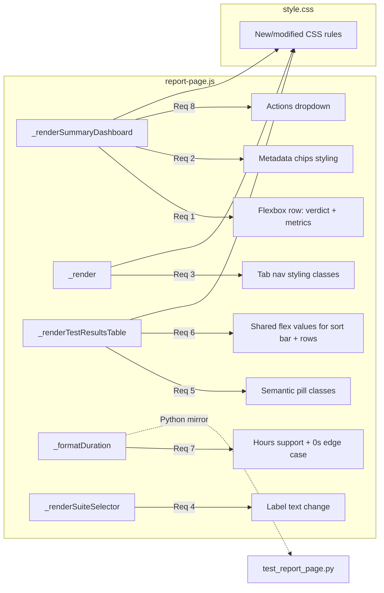

# Design Document: Report UX Overhaul

## Overview

This design covers six areas of visual and functional improvement to the RF Trace Viewer Report page: compact header layout, inline metadata chips, improved tab navigation, clearer suite selector labeling, semantic status pill colors, table header alignment, improved duration formatting, and an actions dropdown for artifact downloads.

All changes are scoped to `report-page.js` and `style.css`. The existing dark theme, IIFE/`var`-only JavaScript conventions, and DOM-based rendering approach are preserved. No new JS files are introduced — the asset embedding pipeline (`generator.py`, `server.py`) remains unchanged.

The duration formatting logic has a Python mirror in `tests/unit/test_report_page.py` that must be updated in lockstep with the JS changes. Property-based tests validate the formatter using Hypothesis with the project's existing dev/ci profile system.

## Architecture

The Report page is a single IIFE in `report-page.js` that renders into a container element. It exposes helper functions via `window._reportPageHelpers` for testing. The rendering pipeline is:

```
_render()
  ├── _renderSummaryDashboard()   ← Req 1, 2, 8 (header, metadata, actions dropdown)
  ├── Sub-tab nav (inline in _render)  ← Req 3 (tab styling)
  └── renderTabContent()
       ├── _renderSuiteSelector()  ← Req 4 (label change)
       ├── _renderTestResultsTable()  ← Req 5, 6 (pills, sort bar alignment)
       └── _renderTagStatistics() / _renderKeywordInsights()
```

All styling lives in `style.css` using CSS custom properties (`--status-pass`, `--status-fail`, `--status-skip`, `--bg-tertiary`, `--focus-outline`, etc.) that already have light and dark theme variants.

### Change Scope



## Components and Interfaces

### 1. Compact Header Layout (Req 1)

Modify `_renderSummaryDashboard()` to place the `Run_Verdict_Header` and `Metrics_Summary_Line` in a flexbox row layout within the hero section.

**JS changes in `_renderSummaryDashboard()`:**
- Wrap `verdictHeader` and `metricsLine` in a new `div.hero-top-row` with `display: flex; align-items: baseline; justify-content: space-between`.
- The ratio bar remains below the top row.
- Append `hero-top-row` to `hero` instead of appending verdict and metrics separately.

**CSS changes:**
- `.report-hero` padding reduced to `10px 20px` (from `16px 20px`).
- New `.hero-top-row` rule: `display: flex; align-items: baseline; justify-content: space-between; flex-wrap: wrap; gap: 8px`.
- `@media (max-width: 768px)` rule: `.hero-top-row { flex-direction: column; }`.

### 2. Inline Metadata Chips (Req 2)

Modify the metadata row rendering in `_renderSummaryDashboard()` to style each item as a chip.

**CSS changes:**
- `.report-metadata-row` gap reduced to `6px`, `margin-top: 6px`.
- `.report-metadata-item` gets `background: var(--bg-tertiary); border-radius: 4px; padding: 2px 8px; font-size: 12px; color: var(--text-secondary)`.
- Existing omission logic for missing fields is already correct (no empty placeholders).

### 3. Improved Tab Navigation (Req 3)

Modify the sub-tab styling to make tabs visually attached to the content panel.

**CSS changes:**
- `.report-sub-tabs` gets `margin-bottom: 0` (remove gap between tabs and content).
- `.report-sub-tab.active` gets `border-bottom: 2px solid var(--focus-outline); background: var(--bg-tertiary)`.
- `.report-sub-tab:not(.active)` gets `opacity: 0.6` (consolidating existing scattered opacity rules).
- `.report-controls-panel` gets `border: 1px solid var(--border-color); border-radius: 6px; overflow: hidden` to visually group tabs with content.
- `.report-sub-tabs` gets `background: var(--bg-secondary)` to create a tab bar background.

### 4. Clearer Suite Selector Label (Req 4)

**JS changes in `_renderSuiteSelector()`:**
- Change `label.textContent` from `'Suite: '` to `'Suite Filter '`.

**JS changes in `_renderTestResultsTable()`:**
- Move the suite filter dropdown into the toolbar row (it's already there for the inline filter). The top-level `_renderSuiteSelector()` is used for the multi-suite root selector — the inline `report-suite-filter-dropdown` in the toolbar already handles per-test filtering. The label change applies to `_renderSuiteSelector()`.

**CSS changes:**
- `.suite-selector-dropdown` gets matching height and border styling as `.report-search-input` for visual consistency.

### 5. Semantic Status Pill Colors (Req 5)

**JS changes in `_renderTestResultsTable()`:**
- Add a `data-status` attribute to each pill (already present).
- Add status-specific CSS classes: `pill-pass`, `pill-fail`, `pill-skip` based on the status filter value.

**CSS changes:**
- `.report-status-pill.pill-pass.active` uses `background: var(--status-pass); color: #fff`.
- `.report-status-pill.pill-fail.active` uses `background: var(--status-fail); color: #fff`.
- `.report-status-pill.pill-skip.active` uses `background: var(--status-skip); color: #fff`.
- `.report-status-pill.pill-pass:not(.active)` uses `color: var(--status-pass); opacity: 0.6`.
- `.report-status-pill.pill-fail:not(.active)` uses `color: var(--status-fail); opacity: 0.6`.
- `.report-status-pill.pill-skip:not(.active)` uses `color: var(--status-skip); opacity: 0.6`.
- The "All" pill keeps the existing neutral `--focus-outline` color when active.
- Dark theme variants are handled automatically since `--status-pass/fail/skip` already have dark overrides.

### 6. Table Header Alignment Fix (Req 6)

**Problem:** The sort bar uses flex values `{ name: '1', start_time: '0 0 150px', status: '0 0 70px', duration: '0 0 90px' }` but the test row summary uses different flex values for its child elements (`.report-test-name` has `flex: 1`, `.report-test-dur` has `flex: 0 0 80px`, `.report-status-dot` has `width: 20px`).

**Solution:** Define shared column width CSS custom properties and apply them consistently to both the sort bar columns and the test row summary elements.

**CSS changes:**
- New custom properties on `.report-test-results`:
  ```
  --col-name: 1;
  --col-start: 0 0 140px;
  --col-status: 0 0 60px;
  --col-duration: 0 0 85px;
  ```
- `.report-sort-col` and corresponding `.report-test-summary` children use these shared values.
- The status dot column in the sort bar and the status dot in test rows both use `--col-status`.

**JS changes:**
- Update `sortCols` flex values to match the CSS custom properties.
- Update test row summary element styles to use the same flex values.

### 7. Improved Duration Formatting (Req 7)

**JS changes in `_formatDuration()`:**
- Add hours support: when `ms >= 3600000`, format as `Xh Ym Zs`.
- Change zero/negative/non-numeric handling to return `'0s'` (already correct for zero and negative; ensure `NaN`, `undefined`, `null` also return `'0s'`).
- Keep existing behavior for ms, seconds, and minutes ranges.

**Updated `_formatDuration` logic:**
```javascript
function _formatDuration(ms) {
    if (typeof ms !== 'number' || isNaN(ms) || ms <= 0) return '0s';
    if (ms < 1000) return Math.round(ms) + 'ms';
    if (ms < 60000) return (ms / 1000).toFixed(1) + 's';
    if (ms < 3600000) {
        var m = Math.floor(ms / 60000);
        var s = Math.round((ms % 60000) / 1000);
        return m + 'm ' + s + 's';
    }
    var h = Math.floor(ms / 3600000);
    var m = Math.floor((ms % 3600000) / 60000);
    var s = Math.round((ms % 60000) / 1000);
    return h + 'h ' + m + 'm ' + s + 's';
}
```

**Python mirror update in `test_report_page.py`:**
- Update `format_duration()` to match the new JS logic (add hours branch).
- Add property-based test for round-trip tolerance.

### 8. Actions Dropdown (Req 8)

**JS changes in `_renderSummaryDashboard()`:**
- Create an `Actions_Dropdown` button in the hero top row area.
- The button uses a download icon (Unicode `⬇` or text "Export ▾").
- Clicking toggles a dropdown menu with options:
  - "Download JSON" — serializes `_runData` + `_statistics` to a JSON blob and triggers `<a download>`.
  - "Download CSV" — generates CSV from the flat test list (name, status, duration, start time, end time, tags) and triggers download.
- Close on outside click via a `document.addEventListener('click', ...)` handler.
- Close on Escape key via a `document.addEventListener('keydown', ...)` handler.
- Keyboard accessible: button is a `<button>` element (natively focusable), menu items are `<button>` elements inside the dropdown.

**CSS changes:**
- `.actions-dropdown` positioned relative to the hero top row.
- `.actions-dropdown-menu` absolutely positioned below the button, with `background: var(--bg-primary); border: 1px solid var(--border-color); border-radius: 4px; box-shadow: 0 2px 8px rgba(0,0,0,0.15)`.
- `.actions-dropdown-item` styled as block buttons with hover state.

**Helper functions (new, inside the IIFE):**
- `_generateReportJSON()` — returns a JSON string of run data + statistics.
- `_generateReportCSV()` — returns a CSV string with headers: Name, Status, Duration (ms), Start Time, End Time, Tags.
- `_triggerDownload(content, filename, mimeType)` — creates a temporary `<a>` element with a Blob URL and clicks it.

These helpers will be exposed via `window._reportPageHelpers` for testing.

## Data Models

No new data models are introduced. All changes operate on the existing data structures:

- `_runData` — object with `start_time`, `end_time`, `rf_version`, `executor` fields (epoch nanoseconds for times).
- `_statistics` — object with `total_tests`, `passed`, `failed`, `skipped`, `total_duration_ms`, `suite_stats`.
- `_suites` — array of suite objects with `id`, `name`, `children` (tests have `keywords` key).
- Test objects — `{ id, name, status, start_time, end_time, elapsed_time, tags, keywords, ... }`.

The CSV export produces a flat representation:

| Column | Source |
|---|---|
| Name | `test.name` |
| Status | `test.status` |
| Duration (ms) | `test.elapsed_time * 1000` |
| Start Time | `_formatTimestamp(test.start_time)` |
| End Time | `_formatTimestamp(test.end_time)` |
| Tags | `(test.tags \|\| []).join(', ')` |

The JSON export is a direct serialization of `{ run: _runData, statistics: _statistics, suites: _suites }`.


## Correctness Properties

*A property is a characteristic or behavior that should hold true across all valid executions of a system — essentially, a formal statement about what the system should do. Properties serve as the bridge between human-readable specifications and machine-verifiable correctness guarantees.*

### Property 1: Duration format matches range pattern

*For any* positive integer millisecond value, the formatted duration string SHALL match the expected pattern for its range:
- `[1, 999]` → matches `^\d+ms$`
- `[1000, 59999]` → matches `^\d+\.\d{1}s$`
- `[60000, 3599999]` → matches `^\d+m \d+s$`
- `[3600000, ∞)` → matches `^\d+h \d+m \d+s$`

**Validates: Requirements 7.1, 7.2, 7.3, 7.4**

### Property 2: Duration format round-trip tolerance

*For any* non-negative integer millisecond value, parsing the formatted output back to milliseconds SHALL produce a value within 500ms of the original input. This validates that the display rounding does not lose significant information.

**Validates: Requirements 7.6**

### Property 3: Duration format invalid input handling

*For any* value that is zero, negative, non-numeric (string, null, undefined, NaN, boolean), the formatter SHALL return exactly `"0s"`.

**Validates: Requirements 7.5**

### Property 4: Metadata chips omit missing fields

*For any* run data object where some metadata fields (start_time, end_time, rf_version, executor) are absent, empty, or zero, the rendered metadata row SHALL contain only chips for fields that have valid non-empty values. The number of rendered chips SHALL equal the number of present fields.

**Validates: Requirements 2.3**

### Property 5: Status pill counts match test data

*For any* list of tests with arbitrary status values, each status pill's displayed count SHALL equal the number of tests matching that status, and the "All" pill count SHALL equal the total number of tests.

**Validates: Requirements 5.6**

### Property 6: CSV export contains all test data

*For any* list of test objects, the generated CSV SHALL contain exactly one header row plus one data row per test, and each data row SHALL contain the test's name, status, and duration value.

**Validates: Requirements 8.4**

### Property 7: JSON export round-trip

*For any* valid run data and statistics object, serializing to JSON and parsing back SHALL produce an object equivalent to the original input.

**Validates: Requirements 8.3**

## Error Handling

| Scenario | Handling |
|---|---|
| `_formatDuration` receives non-numeric input | Returns `"0s"` |
| `_formatDuration` receives `NaN`, `null`, `undefined` | Returns `"0s"` |
| `_formatDuration` receives negative value | Returns `"0s"` |
| Metadata field missing from `_runData` | Chip omitted (no empty placeholder) |
| `_runData` is null/undefined | Metadata row not rendered |
| CSV export with empty test list | Returns header row only |
| CSV export with test containing commas in name | Name is quoted in CSV output |
| CSV export with test containing quotes in name | Quotes are escaped (doubled) per RFC 4180 |
| JSON export with missing `_runData` | Returns `{}` or minimal valid JSON |
| Actions dropdown Blob URL creation fails | Silently fails, no download triggered |
| Single suite trace | Suite selector hidden (existing behavior preserved) |

## Testing Strategy

### Dual Testing Approach

This feature uses both unit tests and property-based tests:

- **Unit tests**: Verify specific examples, edge cases, DOM structure, and CSS class assignments.
- **Property tests**: Verify universal properties of the duration formatter, CSV generator, and JSON serializer across randomized inputs.

### Property-Based Testing

**Library**: Hypothesis (Python, already configured in `tests/conftest.py`)

The Python mirror functions in `tests/unit/test_report_page.py` serve as the reference implementation. Property tests validate the Python mirror, which must match the JS implementation exactly.

**Configuration**: Uses the project's existing Hypothesis profile system:
- `dev` profile: `max_examples=5` (fast feedback, `make test-unit`)
- `ci` profile: `max_examples=200` (thorough, `make test-full`)
- Do NOT hardcode `@settings(max_examples=N)` on individual tests.

**Property test tags**: Each test includes a docstring comment referencing the design property:
```
Feature: report-ux-overhaul, Property N: <property_text>
```

Each correctness property is implemented by a single `@given(...)` decorated test function.

### Unit Tests

Unit tests focus on:
- Specific duration formatting examples (e.g., `format_duration(126000) == "2m 6s"`)
- Edge cases: `0`, `-1`, `NaN`, very large values
- CSV generation with special characters (commas, quotes, newlines in test names)
- JSON round-trip with minimal and maximal data
- Suite selector label text verification

### Test Execution

All tests run inside Docker via the `rf-trace-test:latest` image:

```bash
make test-unit          # Fast: dev profile, <30s
make test-full          # Thorough: ci profile, 200 examples
make test-properties    # Property tests only, ci profile
```
