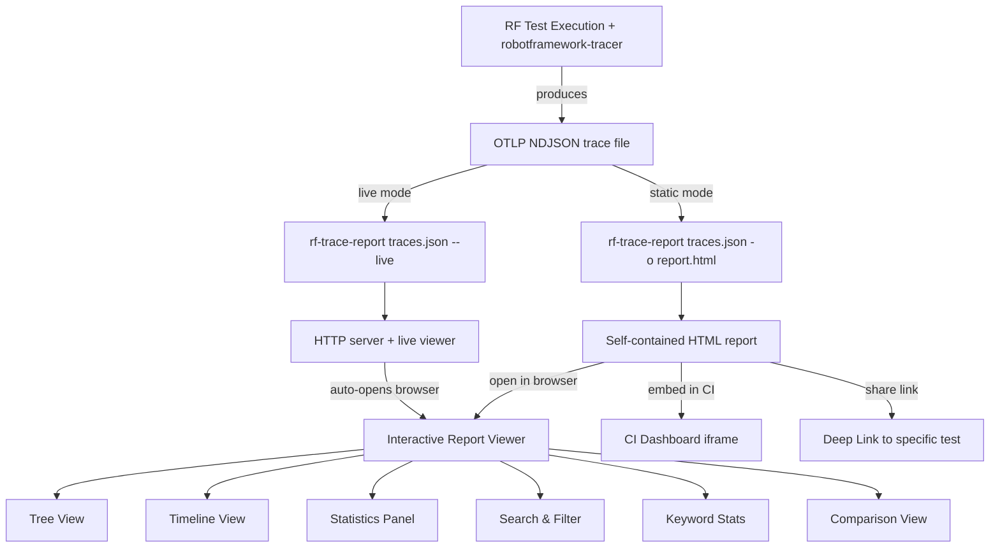
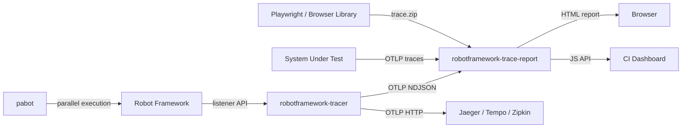
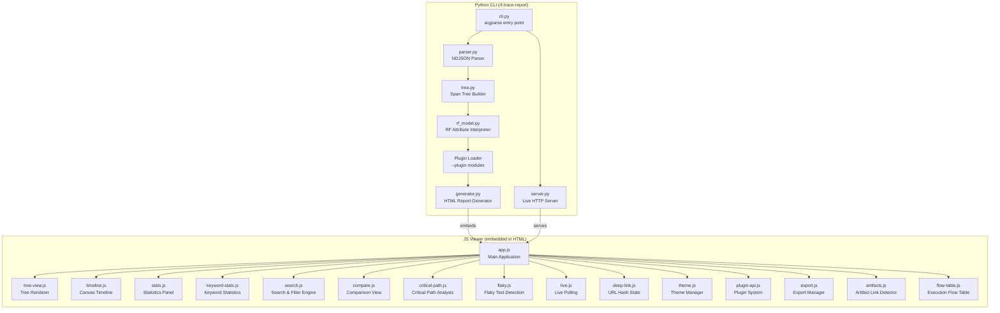

# Design Document: RF HTML Report Replacement

## Overview

`robotframework-trace-report` is a standalone tool that reads OTLP NDJSON trace files produced by `robotframework-tracer` and generates interactive, self-contained HTML reports for Robot Framework test execution. It replaces RF's built-in `report.html` and `log.html` with a modern viewer featuring timeline visualization, live updates, parallel execution clarity, comparison views, and extensibility.

The system has two runtime modes:
- **Static mode**: Python CLI reads trace file → builds span tree → interprets RF attributes → generates a single self-contained HTML file with embedded data and JS viewer
- **Live mode**: Python CLI starts a minimal HTTP server → serves HTML viewer and raw trace file → JS viewer polls for updates and renders incrementally

### Technology Stack

| Layer | Technology | Rationale |
|-------|-----------|-----------|
| CLI & Backend | Python 3.8+ (stdlib only) | Zero runtime dependencies, wide compatibility |
| File I/O | `json`, `gzip`, `sys.stdin` | Stdlib covers NDJSON, gzip, stdin |
| HTTP Server | `http.server` | Stdlib, no framework needed for simple file serving |
| Frontend | Vanilla JS (ES2020+) + CSS3 | Must embed in single HTML file, no build step |
| Timeline Rendering | HTML5 Canvas | Performance for 10,000+ spans, smooth zoom/pan |
| Theming | CSS Custom Properties | Override-friendly, no preprocessor needed |
| Testing | pytest + Hypothesis | pytest for unit tests, Hypothesis for property-based tests |
| Formatting/Linting | black + ruff | Already configured in pyproject.toml |

### Personas

1. **Test Engineer** — Primary user. Runs RF tests, generates reports, investigates failures, monitors live execution. Needs fast navigation, filtering, and clear failure details.
2. **Team Lead / Manager** — Reviews test health dashboards. Needs statistics summaries, flaky test detection, and exportable results for stakeholder reports.
3. **CI/CD Pipeline** — Automated consumer. Generates static reports as build artifacts. Needs reliable CLI, non-zero exit codes on errors, and customizable output paths.
4. **Developer / Integrator** — Embeds reports in internal portals, writes plugins, customizes branding. Needs JS API, plugin system, theming, and iframe support.

### Use Case Flows



### Related Ecosystem



- **Robot Framework**: The test automation framework. Provides the Listener v3 API that `robotframework-tracer` hooks into.
- **pabot**: Parallel executor for RF. Runs tests across multiple workers. The tracer produces spans from each worker with shared `trace_id`, and the viewer renders them on separate timeline lanes.
- **OpenTelemetry (OTLP)**: The trace data format. Standard NDJSON encoding with `ExportTraceServiceRequest` per line. The viewer is format-compatible with any OTLP source, not just RF.
- **robotframework-tracer**: The RF listener that produces trace files. Captures suite/test/keyword hierarchy as spans with `rf.*` attributes. Supports trace context propagation via `TRACEPARENT`.
- **Playwright / Browser Library**: When RF tests drive browser automation, Playwright trace files can be linked from span attributes for deep debugging.

## Architecture



### Data Flow: Static Mode

```
1. CLI parses arguments
2. Parser reads NDJSON file → flat span list
3. Tree Builder reconstructs hierarchy → SpanNode trees
4. RF Interpreter classifies spans → RFSuite/RFTest/RFKeyword models
5. Plugin Loader runs Python plugins (if any) → modified span data
6. Generator embeds data + JS + CSS → single HTML file
7. User opens HTML in browser → JS Viewer renders all views
```

### Data Flow: Live Mode

```
1. CLI parses arguments
2. Server starts HTTP server on configured port
3. Server serves HTML viewer at / (with embedded JS, no data)
4. Server serves raw trace file at /traces.json
5. JS Viewer polls /traces.json every N seconds
6. JS Parser (in browser) reads new lines incrementally
7. JS Tree Builder updates span tree with new spans
8. JS Viewer updates all views incrementally
```

## Components and Interfaces

### Python Components

#### 1. NDJSON Parser (`parser.py`)

```python
@dataclass
class ParsedSpan:
    trace_id: str          # hex string
    span_id: str           # hex string
    parent_span_id: str    # hex string or empty
    name: str
    kind: str
    start_time: float      # seconds since epoch
    end_time: float        # seconds since epoch
    attributes: dict       # key → value (flattened)
    resource_attributes: dict  # key → value (flattened)
    status_code: str       # STATUS_CODE_OK | STATUS_CODE_ERROR | STATUS_CODE_UNSET
    status_message: str
    events: list           # span events (log messages etc.)

class NDJSONParser:
    def parse_file(self, path: str) -> list[ParsedSpan]:
        """Parse entire NDJSON file. Handles .json and .json.gz."""

    def parse_stream(self, stream: IO) -> list[ParsedSpan]:
        """Parse from any readable stream (stdin, file, etc.)."""

    def parse_line(self, line: str) -> list[ParsedSpan]:
        """Parse a single NDJSON line. Returns spans or empty list on error."""

    def parse_incremental(self, path: str, offset: int) -> tuple[list[ParsedSpan], int]:
        """Read new lines from offset. Returns (new_spans, new_offset)."""
```

Key behaviors:
- Flattens OTLP attribute arrays (`[{"key": "k", "value": {"string_value": "v"}}]`) into plain dicts (`{"k": "v"}`)
- Converts nanosecond timestamps to float seconds
- Normalizes trace/span IDs to hex strings
- Skips malformed lines with warnings (logged to stderr)
- Attaches resource attributes from the enclosing `resource_spans` to each span

#### 2. Span Tree Builder (`tree.py`)

```python
@dataclass
class SpanNode:
    span: ParsedSpan
    children: list['SpanNode']
    depth: int

class SpanTreeBuilder:
    def build(self, spans: list[ParsedSpan]) -> dict[str, list[SpanNode]]:
        """Build trees grouped by trace_id.
        Returns {trace_id: [root_nodes]} sorted by start_time."""

    def merge(self, existing: dict, new_spans: list[ParsedSpan]) -> dict:
        """Incrementally merge new spans into existing trees (for live mode)."""
```

Key behaviors:
- Groups spans by `trace_id`
- Builds parent→child map using `parent_span_id`
- Orphan spans (parent not found) become roots
- Children sorted by `start_time` ascending
- `depth` computed during tree construction

#### 3. RF Attribute Interpreter (`rf_model.py`)

```python
class SpanType(Enum):
    SUITE = "suite"
    TEST = "test"
    KEYWORD = "keyword"
    SIGNAL = "signal"
    GENERIC = "generic"

class RFStatus(Enum):
    PASS = "PASS"
    FAIL = "FAIL"
    SKIP = "SKIP"
    NOT_RUN = "NOT RUN"

@dataclass
class RFSuite:
    name: str
    id: str
    source: str
    status: RFStatus
    elapsed_time: float
    start_time: str
    end_time: str
    span_node: SpanNode

@dataclass
class RFTest:
    name: str
    id: str
    lineno: int
    status: RFStatus
    elapsed_time: float
    start_time: str
    end_time: str
    tags: list[str]
    span_node: SpanNode

@dataclass
class RFKeyword:
    name: str
    keyword_type: str  # KEYWORD, SETUP, TEARDOWN, FOR, IF, TRY, WHILE
    lineno: int
    args: str
    status: RFStatus
    elapsed_time: float
    span_node: SpanNode

@dataclass
class RFSignal:
    signal_type: str   # e.g., "test.starting"
    name: str          # associated test/suite name
    span_node: SpanNode

class RFAttributeInterpreter:
    def classify(self, node: SpanNode) -> SpanType:
        """Determine span type from rf.* attributes."""

    def interpret(self, node: SpanNode) -> RFSuite | RFTest | RFKeyword | RFSignal | SpanNode:
        """Produce typed model object from span node."""

    def interpret_tree(self, trees: dict[str, list[SpanNode]]) -> dict:
        """Interpret all nodes in all trees. Returns enriched tree structure."""

    @staticmethod
    def map_status(otlp_status: str, rf_status: str | None) -> RFStatus:
        """Map OTLP status code + rf.status attribute to RFStatus."""
```

Classification logic:
- Has `rf.suite.name` → SUITE
- Has `rf.test.name` → TEST
- Has `rf.keyword.name` → KEYWORD
- Has `rf.signal` → SIGNAL
- None of the above → GENERIC

Status mapping:
- `rf.status = "PASS"` or `STATUS_CODE_OK` → PASS
- `rf.status = "FAIL"` or `STATUS_CODE_ERROR` → FAIL
- `rf.status = "SKIP"` → SKIP
- `STATUS_CODE_UNSET` with no `rf.status` → NOT_RUN

#### 4. Report Generator (`generator.py`)

```python
class ReportGenerator:
    def generate(self, trees: dict, options: ReportOptions) -> str:
        """Generate complete HTML string."""

    def write(self, html: str, output_path: str) -> None:
        """Write HTML to file."""

@dataclass
class ReportOptions:
    title: str | None
    theme: str           # "light" | "dark" | "system"
    logo_path: str | None
    theme_file: str | None
    accent_color: str | None
    primary_color: str | None
    footer_text: str | None
    plugin_files: list[str]
    base_url: str | None
    poll_interval: int   # for live mode
```

HTML structure:
```html
<!DOCTYPE html>
<html lang="en">
<head>
  <meta charset="UTF-8">
  <meta name="viewport" content="width=device-width, initial-scale=1.0">
  <title>{title}</title>
  <style>/* core styles */</style>
  <style>/* custom theme overrides */</style>
</head>
<body>
  <div id="app">
    <header id="report-header"><!-- logo, title, controls --></header>
    <nav id="view-tabs"><!-- Tree | Timeline | Stats | Keywords | Flaky --></nav>
    <aside id="filter-panel"><!-- search, filters --></aside>
    <main id="content">
      <div id="tree-view"></div>
      <div id="timeline-view"><canvas></canvas></div>
      <div id="stats-view"></div>
      <div id="keyword-stats-view"></div>
      <div id="flaky-view"></div>
      <div id="compare-view"></div>
      <div id="plugin-panels"></div>
    </main>
    <footer id="report-footer"><!-- footer text --></footer>
  </div>
  <script id="trace-data" type="application/json">{embedded_json}</script>
  <script>/* viewer JS */</script>
  <script>/* plugin JS */</script>
</body>
</html>
```

#### 5. Live Server (`server.py`)

```python
class LiveServer:
    def __init__(self, trace_path: str, port: int, options: ReportOptions):
        ...

    def start(self, open_browser: bool = True) -> None:
        """Start HTTP server. Blocks until interrupted."""

    def stop(self) -> None:
        """Graceful shutdown."""
```

Routes:
- `GET /` → HTML viewer (with live mode flag, no embedded data)
- `GET /traces.json` → Raw trace file (re-read on each request)
- `GET /traces.json?offset=N` → Trace file from byte offset N (for incremental polling)

#### 6. CLI (`cli.py`)

```python
def main() -> int:
    """Entry point. Returns exit code."""
```

Arguments (extending existing argparse):
- `input` — positional, trace file path or `-`
- `-o, --output` — output HTML path (default: `trace-report.html`)
- `--live` — start live server
- `--port` — live server port (default: 8077)
- `--poll-interval` — live polling interval in seconds (default: 5)
- `--title` — report title
- `--no-open` — suppress browser auto-open
- `--logo` — logo image path
- `--theme-file` — custom CSS file path
- `--accent-color` — accent color hex
- `--primary-color` — primary color hex
- `--footer-text` — footer text
- `--plugin` — Python plugin module path (repeatable)
- `--plugin-file` — JS plugin file path (repeatable)
- `--base-url` — base URL for embedded resources

### JavaScript Components

All JS is vanilla ES2020+, concatenated into a single `<script>` block by the generator.

#### app.js — Main Application
- Initializes all views and the event bus
- Manages view switching (tabs)
- Loads trace data from `#trace-data` script tag (static) or fetches from server (live)
- Exposes `window.RFTraceViewer` API

#### tree-view.js — Tree Renderer
- Renders expandable/collapsible DOM tree from span hierarchy
- Virtual scrolling for large trees (renders only visible nodes)
- Color-coded status indicators
- Inline keyword args, docs, error messages
- Arrow key navigation (up/down/left/right)

#### timeline.js — Canvas Timeline
- HTML5 Canvas-based Gantt chart
- X-axis: wall-clock time, Y-axis: span rows
- Zoom (wheel/pinch), pan (drag)
- Click-and-drag for time range selection (feeds into filter)
- Separate lanes for pabot workers
- Critical path highlighting overlay
- Color-coded bars by status

#### stats.js — Statistics Panel
- Computes pass/fail/skip counts and percentages
- Total duration
- Per-suite breakdown table
- Tag-based grouping table
- Respects active filters

#### keyword-stats.js — Keyword Statistics
- Aggregates all keyword spans by name
- Computes count, min, max, avg, total duration
- Sortable table columns
- Click keyword → highlight in tree and timeline

#### search.js — Search & Filter Engine
- Central filter state manager
- Text search (name, attributes, log messages)
- Status filter (PASS/FAIL/SKIP toggles)
- Tag filter (multi-select)
- Suite filter (multi-select)
- Keyword type filter (multi-select)
- Duration range filter (min/max inputs)
- Time range filter (from timeline selection)
- AND logic for combined filters
- Emits filter-changed events
- Shows "N of M results" count

#### compare.js — Comparison View
- File input control to load second trace
- Parses second trace using same NDJSON parser (JS port)
- Test matching by name for regression detection
- Status diff: PASS→FAIL, FAIL→PASS, new, removed
- Duration diff with percentage change
- Trace ID correlation for unified timeline
- Time-based alignment fallback
- SUT span overlay (generic spans without rf.* attributes)

#### critical-path.js — Critical Path Analysis
- Computes critical path from span timing data
- Algorithm: find the longest sequential chain from earliest start to latest end
- Renders overlay on timeline canvas
- Shows critical path duration and percentage

#### flaky.js — Flaky Test Detection
- Identifies tests appearing in multiple traces with different statuses
- Computes flakiness score: `unique_statuses / total_appearances`
- Sorted panel view
- Click to navigate to test in tree

#### live.js — Live Polling
- Fetches `/traces.json?offset=N` at configured interval
- Incremental NDJSON parsing (only new lines)
- Triggers tree/timeline/stats updates
- Signal span detection for "in progress" indicators
- "Live — last updated Ns ago" status display

#### deep-link.js — URL Hash State
- Encodes: selected span ID, active filters, active view tab, scroll position
- Decodes on page load to restore state
- Updates hash on navigation/filter changes
- "Copy Link" button

#### theme.js — Theme Manager
- Detects `prefers-color-scheme` media query
- Manual toggle (light/dark)
- Applies by setting `data-theme` attribute on `<html>`
- CSS custom properties handle all color/font changes

#### plugin-api.js — Plugin System
- `window.RFTraceViewer.registerPlugin({name, init, render})`
- `window.RFTraceViewer.on(event, callback)` — event subscription
- `window.RFTraceViewer.setFilter(filterState)` — programmatic filter control
- `window.RFTraceViewer.navigateTo(spanId)` — programmatic navigation
- `window.RFTraceViewer.getState()` — query current viewer state
- `postMessage` bridge for iframe communication
- Plugin panel container in DOM

#### export.js — Export Manager
- CSV export: test name, status, duration, suite, tags
- JSON export: full filtered span data
- Print-friendly CSS media query

#### artifacts.js — Artifact Link Detector
- Scans span attributes for known artifact patterns
- Playwright trace: attributes matching `*.trace.zip` → link to `trace.playwright.dev`
- Screenshots: attributes matching image extensions → thumbnail + link
- Configurable URL pattern mapping (base URL prefix)

#### flow-table.js — Execution Flow Table
- Renders sequential table of keyword spans for a selected test
- Columns: source file, line number, keyword name, args, status, duration, error
- Includes SETUP/TEARDOWN keywords labeled by type
- FAIL rows highlighted in red with error message
- Click row → navigate to span in tree view and timeline
- Status filter to show only failed steps

## Data Models

### OTLP NDJSON Input Format

Each line in the input file is an `ExportTraceServiceRequest`:

```json
{
  "resource_spans": [{
    "resource": {
      "attributes": [
        {"key": "service.name", "value": {"string_value": "long-running-suite"}},
        {"key": "run.id", "value": {"string_value": "pabot-run-20260219-141222"}},
        {"key": "rf.version", "value": {"string_value": "7.4.1"}}
      ]
    },
    "scope_spans": [{
      "scope": {"name": "robotframework_tracer.listener"},
      "spans": [{
        "trace_id": "0d077f083a9f42acdc3c862ebd202521",
        "span_id": "f17e43d020d07570",
        "parent_span_id": "5fbcfe1b71a6d724",
        "name": "One Minute Test",
        "kind": "SPAN_KIND_INTERNAL",
        "start_time_unix_nano": "1771506747553671186",
        "end_time_unix_nano": "1771506807559349268",
        "attributes": [
          {"key": "rf.test.name", "value": {"string_value": "One Minute Test"}},
          {"key": "rf.test.id", "value": {"string_value": "s1-t1"}},
          {"key": "rf.status", "value": {"string_value": "PASS"}},
          {"key": "rf.elapsed_time", "value": {"double_value": 60.006}}
        ],
        "status": {"code": "STATUS_CODE_OK"},
        "flags": 256
      }]
    }]
  }]
}
```

### Internal Span Model (Python)

```python
ParsedSpan(
    trace_id="0d077f083a9f42acdc3c862ebd202521",
    span_id="f17e43d020d07570",
    parent_span_id="5fbcfe1b71a6d724",
    name="One Minute Test",
    kind="SPAN_KIND_INTERNAL",
    start_time=1771506747.553671186,   # float seconds
    end_time=1771506807.559349268,
    attributes={
        "rf.test.name": "One Minute Test",
        "rf.test.id": "s1-t1",
        "rf.status": "PASS",
        "rf.elapsed_time": 60.006
    },
    resource_attributes={
        "service.name": "long-running-suite",
        "run.id": "pabot-run-20260219-141222",
        "rf.version": "7.4.1"
    },
    status_code="STATUS_CODE_OK",
    status_message="",
    events=[]
)
```

### Internal Span Model (JavaScript — mirrors Python)

```javascript
// Span object in JS (parsed from embedded JSON or fetched NDJSON)
{
  traceId: "0d077f083a9f42acdc3c862ebd202521",
  spanId: "f17e43d020d07570",
  parentSpanId: "5fbcfe1b71a6d724",
  name: "One Minute Test",
  startTime: 1771506747.553671186,
  endTime: 1771506807.559349268,
  attributes: { "rf.test.name": "One Minute Test", ... },
  resourceAttributes: { "service.name": "long-running-suite", ... },
  statusCode: "STATUS_CODE_OK",
  events: [],
  // Computed fields
  type: "test",        // suite | test | keyword | signal | generic
  status: "PASS",      // PASS | FAIL | SKIP | NOT_RUN
  duration: 60.006,
  children: [],        // SpanNode references
  depth: 2
}
```

### Filter State Model (JavaScript)

```javascript
{
  text: "",                    // search text
  statuses: ["PASS", "FAIL", "SKIP"],  // active status filters
  tags: [],                    // selected tags (empty = all)
  suites: [],                  // selected suite names (empty = all)
  keywordTypes: [],            // selected keyword types (empty = all)
  durationMin: null,           // minimum duration in seconds
  durationMax: null,           // maximum duration in seconds
  timeRangeStart: null,        // timeline selection start (epoch seconds)
  timeRangeEnd: null           // timeline selection end (epoch seconds)
}
```

### Comparison Result Model (JavaScript)

```javascript
{
  regressions: [               // tests that went PASS → FAIL
    { name: "Test Name", suite: "Suite", oldStatus: "PASS", newStatus: "FAIL", durationChange: 1.5 }
  ],
  fixes: [],                   // tests that went FAIL → PASS
  newTests: [],                // tests only in second trace
  removedTests: [],            // tests only in first trace
  durationChanges: [           // significant duration changes
    { name: "Test Name", oldDuration: 10.0, newDuration: 15.0, changePercent: 50.0 }
  ],
  correlatedTraces: [],        // trace_ids found in both files
  uncorrelatedTraces: []       // trace_ids only in one file
}
```

### Keyword Statistics Model (JavaScript)

```javascript
{
  keyword: "Log",
  count: 42,
  minDuration: 0.001,
  maxDuration: 0.015,
  avgDuration: 0.003,
  totalDuration: 0.126,
  spanIds: ["abc123", "def456", ...]  // for highlighting
}
```

### Deep Link Hash Format

```
#view=tree&span=f17e43d020d07570&status=FAIL&tag=smoke&search=login
```

Encoded as URL query parameters in the hash fragment. Decoded on page load to restore state.


## Correctness Properties

*A property is a characteristic or behavior that should hold true across all valid executions of a system — essentially, a formal statement about what the system should do. Properties serve as the bridge between human-readable specifications and machine-verifiable correctness guarantees.*

The following properties are derived from the acceptance criteria in the requirements document. Each property is universally quantified and suitable for property-based testing with the Hypothesis library.

### Property 1: Parser output correctness

*For any* valid OTLP NDJSON line containing spans with arbitrary attributes, trace/span IDs, and nanosecond timestamps, parsing that line should produce `ParsedSpan` objects where: (a) `trace_id` and `span_id` are valid hexadecimal strings, (b) `start_time` and `end_time` are the input nanosecond values divided by 1e9, and (c) all input span attributes and resource attributes are present in the output dictionaries.

**Validates: Requirements 1.1, 1.6, 1.7, 1.8**

### Property 2: Gzip parsing transparency

*For any* valid OTLP NDJSON content, parsing the content directly and parsing a gzip-compressed version of the same content should produce identical `ParsedSpan` lists.

**Validates: Requirements 1.2**

### Property 3: Malformed line resilience

*For any* valid OTLP NDJSON content with random malformed lines (invalid JSON or valid JSON without `resource_spans`) injected at random positions, the parser should extract exactly the same spans as parsing the valid content alone.

**Validates: Requirements 1.4, 1.5**

### Property 4: Incremental parsing equivalence

*For any* valid OTLP NDJSON file, parsing the entire file at once should produce the same span list as parsing it incrementally (first N lines, then the remaining lines) and concatenating the results.

**Validates: Requirements 1.9**

### Property 5: Tree reconstruction round-trip

*For any* randomly generated span tree (with known parent-child relationships), flattening the tree into a span list and then rebuilding it with the Span_Tree_Builder should produce a tree with the same parent-child relationships as the original.

**Validates: Requirements 2.1**

### Property 6: Root span identification

*For any* set of spans, the Span_Tree_Builder should identify as root spans exactly those spans whose `parent_span_id` is empty or references a span ID not present in the input set.

**Validates: Requirements 2.2, 2.5**

### Property 7: Child sort order invariant

*For any* tree produced by the Span_Tree_Builder, the children of every node should be sorted by `start_time` in ascending order.

**Validates: Requirements 2.3**

### Property 8: Trace grouping correctness

*For any* set of spans with N distinct `trace_id` values, the Span_Tree_Builder should produce exactly N tree groups, and every span should appear in the group matching its `trace_id`.

**Validates: Requirements 2.4**

### Property 9: Span classification correctness

*For any* span, the RF_Attribute_Interpreter should classify it as: SUITE if it has `rf.suite.name`, TEST if it has `rf.test.name`, KEYWORD if it has `rf.keyword.name`, SIGNAL if it has `rf.signal`, and GENERIC if it has none of these attributes.

**Validates: Requirements 3.1**

### Property 10: RF model field extraction

*For any* span with `rf.*` attributes (suite, test, or keyword), the interpreted model object should contain all specified fields (name, id, status, elapsed_time, etc.) with values matching the corresponding input span attributes.

**Validates: Requirements 3.2, 3.3, 3.4, 3.5**

### Property 11: Generic span preservation

*For any* span without `rf.*` attributes, the RF_Attribute_Interpreter should classify it as GENERIC and the output should preserve the original span name and all attributes unchanged.

**Validates: Requirements 3.6**

### Property 12: Status mapping correctness

*For any* combination of OTLP status code and `rf.status` attribute value, the `map_status` function should return: PASS when `rf.status` is "PASS" or OTLP status is `STATUS_CODE_OK`, FAIL when `rf.status` is "FAIL" or OTLP status is `STATUS_CODE_ERROR`, SKIP when `rf.status` is "SKIP", and NOT_RUN when OTLP status is `STATUS_CODE_UNSET` with no `rf.status`.

**Validates: Requirements 3.7**

### Property 13: HTML data embedding round-trip

*For any* set of processed span trees, the Report_Generator should embed them as JSON in a `<script>` tag such that parsing the JSON from the generated HTML produces data equivalent to the input. Additionally, the generated HTML should contain no external resource references (no `src=` or `href=` pointing to external URLs for core viewer functionality).

**Validates: Requirements 4.2, 4.3**

### Property 14: Title embedding correctness

*For any* report options, the generated HTML `<title>` element should contain the explicitly provided title if one was given, or the root suite name from the trace data if no title was provided.

**Validates: Requirements 4.4, 4.5**

### Property 15: Statistics computation correctness

*For any* set of test spans with known statuses, the statistics computation should produce: (a) total count equal to the number of test spans, (b) pass + fail + skip counts summing to total, (c) percentages that are count/total * 100, (d) per-suite counts summing to the total for each suite, (e) per-tag counts reflecting all tests with each tag, and (f) total duration equal to max(end_time) - min(start_time) across all spans.

**Validates: Requirements 7.1, 7.2, 7.3, 7.4**

### Property 16: Filter logic correctness

*For any* set of spans and any filter state (text search, status filter, tag filter, suite filter, keyword type filter, duration range, time range), every span in the filtered output should satisfy all active filter criteria simultaneously (AND logic), and no span satisfying all criteria should be excluded from the output.

**Validates: Requirements 8.1, 8.2, 8.3, 8.4, 8.5, 8.6, 8.7, 8.8**

### Property 17: Concatenated trace parsing

*For any* two valid OTLP NDJSON contents A and B, parsing the concatenation of A and B should produce a span list that is the union of parsing A alone and parsing B alone.

**Validates: Requirements 12.1**

### Property 18: Comparison regression detection

*For any* two sets of RF test results (matched by test name), the comparison should correctly identify: (a) regressions (tests that changed from PASS to FAIL), (b) fixes (FAIL to PASS), (c) new tests (only in second set), (d) removed tests (only in first set), and (e) when trace_ids match between sets, those traces should be marked as correlated.

**Validates: Requirements 14.2, 14.3, 14.4**

### Property 19: Artifact detection correctness

*For any* span with attributes containing file path values, the artifact detector should identify Playwright trace references (paths ending in `.trace.zip`), screenshot references (paths ending in image extensions), and generate appropriate link URLs using the configured base URL pattern.

**Validates: Requirements 15.1, 15.2, 15.3**

### Property 20: Flakiness score computation

*For any* set of test results across multiple runs where a test appears with varying statuses, the flakiness score should be: 0 when the test has the same status in all runs, and greater than 0 when statuses differ. Tests with more status variation should have higher flakiness scores than tests with less variation.

**Validates: Requirements 16.1, 16.2**

### Property 21: Critical path correctness

*For any* set of spans with known start and end times, the computed critical path should be a valid chain of non-overlapping spans from the earliest start to the latest end, and no alternative chain should have a longer total duration.

**Validates: Requirements 17.1**

### Property 22: Keyword statistics correctness

*For any* set of keyword spans, the computed statistics for each distinct keyword name should satisfy: (a) count equals the number of spans with that name, (b) min ≤ avg ≤ max, (c) total equals the sum of all durations, (d) avg equals total / count, and (e) min and max are actual durations from the input set.

**Validates: Requirements 18.1, 18.2**

### Property 23: Deep link round-trip

*For any* viewer state (selected span, active filters, active view), encoding the state as a URL hash and then decoding it should produce an equivalent state.

**Validates: Requirements 20.1, 20.2, 20.3**

### Property 24: Export data completeness

*For any* filtered set of test spans, the CSV export should contain one row per visible test with correct name, status, duration, suite, and tags fields. The JSON export should contain all span data for visible spans.

**Validates: Requirements 21.1, 21.2**

### Property 25: Plugin span transformation

*For any* Python plugin that implements `process_spans(spans) -> spans`, the Report_Generator should use the plugin's returned span list (not the original) for HTML generation, and the returned spans should appear in the embedded JSON data.

**Validates: Requirements 24.2**

### Property 26: Theme and branding embedding

*For any* report options with a logo path, theme file, or color overrides, the generated HTML should contain: (a) the base64-encoded logo image if a logo was provided, (b) the custom CSS content if a theme file was provided, (c) CSS custom property overrides for accent and primary colors if specified.

**Validates: Requirements 22.1, 22.2, 22.4**

## Error Handling

### Python-Side Errors

| Error Condition | Handling | Exit Code |
|----------------|----------|-----------|
| Input file not found | Print error to stderr, exit | 1 |
| Output path not writable | Print error to stderr, exit | 1 |
| Malformed NDJSON line | Skip line, warn to stderr, continue | N/A |
| Invalid OTLP structure in line | Skip line, warn to stderr, continue | N/A |
| Gzip decompression failure | Print error to stderr, exit | 1 |
| Empty trace file (no spans) | Generate report with "No data" message | 0 |
| Plugin module not found | Print error to stderr, exit | 1 |
| Plugin `process_spans` raises exception | Print error to stderr, exit | 1 |
| Port already in use (live mode) | Print error to stderr, exit | 1 |
| Logo/theme file not found | Print warning to stderr, continue without | 0 |

### JavaScript-Side Errors

| Error Condition | Handling |
|----------------|----------|
| JSON parse error in embedded data | Display error message in viewer |
| Fetch failure in live mode | Show "Connection lost" indicator, retry on next poll |
| Second trace file parse error (comparison) | Show error message, keep primary report |
| Canvas rendering error | Fall back to simplified rendering |
| Plugin init/render error | Log to console, disable plugin, continue |
| Invalid URL hash | Ignore hash, load default state |

## Testing Strategy

### Dual Testing Approach

The project uses both unit tests and property-based tests:

- **Unit tests** (pytest): Specific examples, edge cases, integration points, error conditions
- **Property-based tests** (Hypothesis): Universal properties across randomly generated inputs

### Property-Based Testing Configuration

- Library: **Hypothesis** (Python)
- Minimum iterations: **100 per property** (`@settings(max_examples=100)`)
- Each property test references its design document property number
- Tag format: `# Feature: rf-html-report-replacement, Property N: <property_text>`

### Test Organization

```
tests/
├── unit/
│   ├── test_parser.py          # Parser unit tests + properties 1-4, 17
│   ├── test_tree.py            # Tree builder unit tests + properties 5-8
│   ├── test_rf_model.py        # RF interpreter unit tests + properties 9-12
│   ├── test_generator.py       # Generator unit tests + properties 13-14, 26
│   ├── test_stats.py           # Statistics computation + property 15
│   ├── test_filter.py          # Filter logic + property 16
│   ├── test_comparison.py      # Comparison logic + property 18
│   ├── test_artifacts.py       # Artifact detection + property 19
│   ├── test_flaky.py           # Flaky detection + property 20
│   ├── test_critical_path.py   # Critical path + property 21
│   ├── test_keyword_stats.py   # Keyword stats + property 22
│   ├── test_deep_link.py       # Deep link encoding + property 23
│   ├── test_export.py          # Export logic + property 24
│   ├── test_plugin.py          # Plugin system + property 25
│   └── test_cli.py             # CLI argument parsing + error handling
├── fixtures/
│   ├── pabot_trace.json        # Existing: parallel execution trace
│   ├── simple_trace.json       # Single suite, single test
│   ├── merged_trace.json       # Multiple trace_ids concatenated
│   ├── malformed_trace.json    # Mix of valid and invalid lines
│   ├── all_types_trace.json    # Suite, test, keyword, signal spans
│   └── large_trace.json        # 1000+ spans for performance baseline
└── conftest.py                 # Shared Hypothesis strategies for OTLP data generation
```

### Hypothesis Strategies (conftest.py)

Custom strategies for generating valid OTLP data:

```python
from hypothesis import strategies as st

# Generate valid hex IDs
hex_id = st.text(alphabet="0123456789abcdef", min_size=32, max_size=32)

# Generate valid OTLP attributes
otlp_attribute = st.fixed_dictionaries({
    "key": st.text(min_size=1, max_size=50),
    "value": st.one_of(
        st.builds(lambda v: {"string_value": v}, st.text()),
        st.builds(lambda v: {"int_value": v}, st.integers()),
        st.builds(lambda v: {"double_value": v}, st.floats(allow_nan=False)),
    )
})

# Generate valid spans
otlp_span = st.builds(make_otlp_span, trace_id=hex_id, span_id=hex_id, ...)

# Generate valid NDJSON lines
ndjson_line = st.builds(make_ndjson_line, spans=st.lists(otlp_span, min_size=1))

# Generate RF-specific spans
rf_suite_span = otlp_span.map(add_suite_attributes)
rf_test_span = otlp_span.map(add_test_attributes)
rf_keyword_span = otlp_span.map(add_keyword_attributes)
```

### Property Test Implementation Pattern

Each property test follows this pattern:

```python
from hypothesis import given, settings

@given(ndjson_content=st.lists(ndjson_line, min_size=1))
@settings(max_examples=100)
def test_property_1_parser_output_correctness(ndjson_content):
    """Feature: rf-html-report-replacement, Property 1: Parser output correctness"""
    # Arrange: generate valid NDJSON
    # Act: parse it
    # Assert: verify hex IDs, float timestamps, attribute preservation
```

### Development Workflow Hooks (Kiro)

The following Kiro hooks should be configured for development workflow automation:

1. **On Python file edit**: Run `ruff check` and `black --check` on the changed file
2. **On test file edit**: Run the corresponding pytest test file
3. **On agent stop**: Run `pytest --cov` to verify coverage hasn't dropped below 80%
