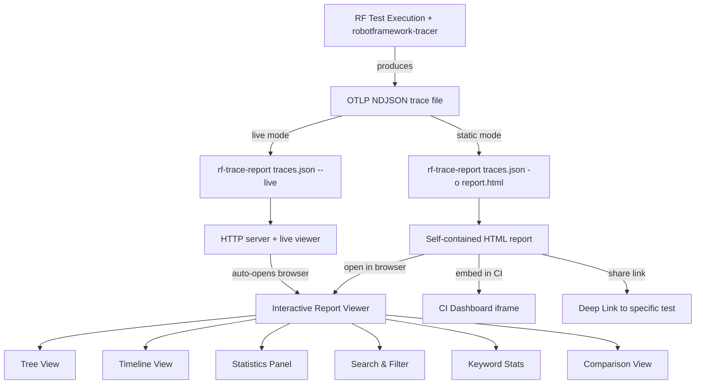
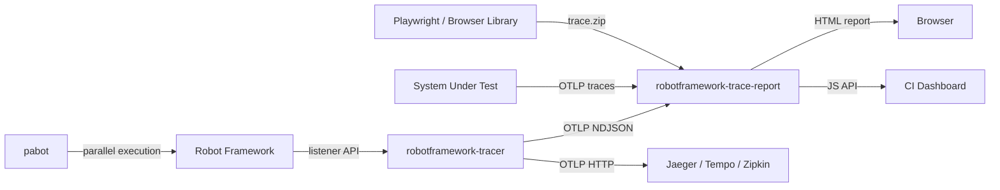
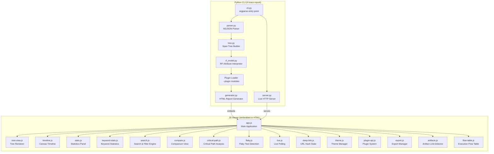
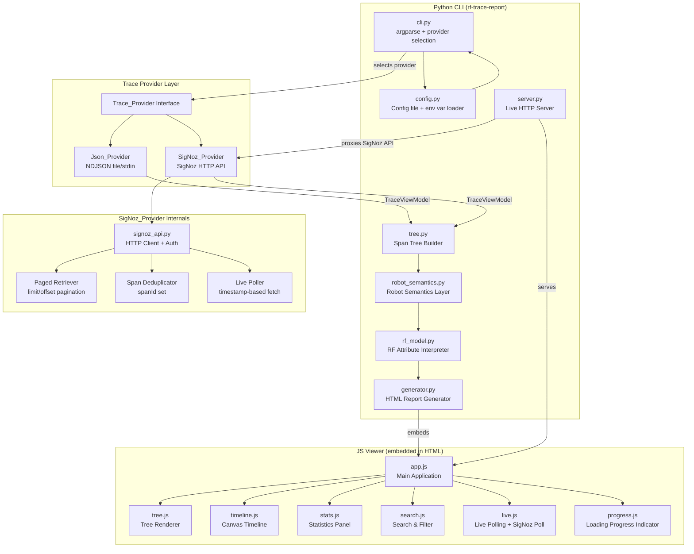
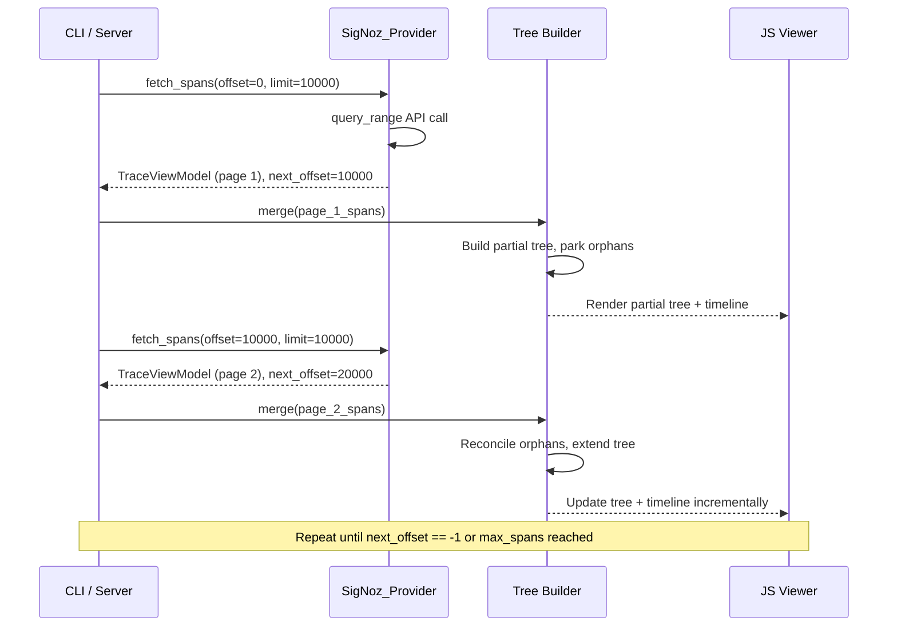
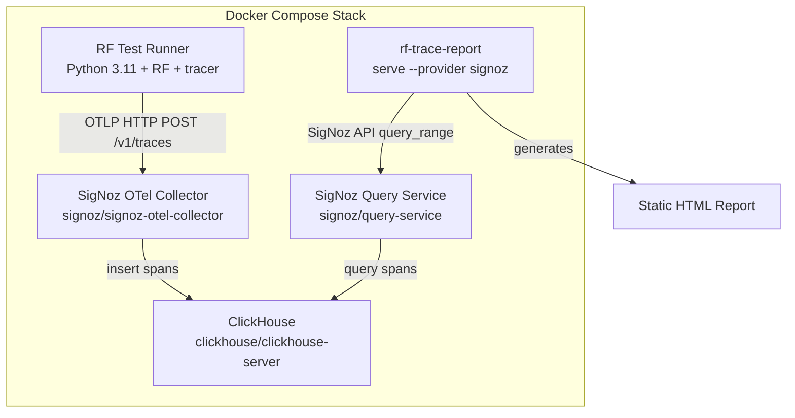

# Design Document: RF HTML Report Replacement

## Overview

`robotframework-trace-report` is a standalone tool that reads OTLP NDJSON trace files produced by `robotframework-tracer` and generates interactive, self-contained HTML reports for Robot Framework test execution. It replaces RF's built-in `report.html` and `log.html` with a modern viewer featuring timeline visualization, live updates, parallel execution clarity, comparison views, and extensibility.

The system has two runtime modes:
- **Static mode**: Python CLI reads trace file → builds span tree → interprets RF attributes → generates a single self-contained HTML file with embedded data and JS viewer
- **Live mode**: Python CLI starts a minimal HTTP server → serves HTML viewer and raw trace file → JS viewer polls for updates and renders incrementally

### Technology Stack

| Layer | Technology | Rationale |
|-------|-----------|-----------|
| CLI & Backend | Python 3.8+ (stdlib only) | Zero runtime dependencies, wide compatibility |
| File I/O | `json`, `gzip`, `sys.stdin` | Stdlib covers NDJSON, gzip, stdin |
| HTTP Server | `http.server` | Stdlib, no framework needed for simple file serving |
| Frontend | Vanilla JS (ES2020+) + CSS3 | Must embed in single HTML file, no build step |
| Timeline Rendering | HTML5 Canvas | Performance for 10,000+ spans, smooth zoom/pan |
| Theming | CSS Custom Properties | Override-friendly, no preprocessor needed |
| Testing | pytest + Hypothesis | pytest for unit tests, Hypothesis for property-based tests |
| Formatting/Linting | black + ruff | Already configured in pyproject.toml |

### Personas

1. **Test Engineer** — Primary user. Runs RF tests, generates reports, investigates failures, monitors live execution. Needs fast navigation, filtering, and clear failure details.
2. **Team Lead / Manager** — Reviews test health dashboards. Needs statistics summaries, flaky test detection, and exportable results for stakeholder reports.
3. **CI/CD Pipeline** — Automated consumer. Generates static reports as build artifacts. Needs reliable CLI, non-zero exit codes on errors, and customizable output paths.
4. **Developer / Integrator** — Embeds reports in internal portals, writes plugins, customizes branding. Needs JS API, plugin system, theming, and iframe support.

### Use Case Flows


```mermaid
graph TD
    A[RF Test Execution + robotframework-tracer] -->|produces| B[OTLP NDJSON trace file]
    B -->|static mode| C[rf-trace-report traces.json -o report.html]
    B -->|live mode| D[rf-trace-report traces.json --live]
    C --> E[Self-contained HTML report]
    D --> F[HTTP server + live viewer]
    E -->|open in browser| G[Interactive Report Viewer]
    F -->|auto-opens browser| G
    G --> H[Tree View]
    G --> I[Timeline View]
    G --> J[Statistics Panel]
    G --> K[Search & Filter]
    G --> L[Keyword Stats]
    G --> M[Comparison View]
    E -->|embed in CI| N[CI Dashboard iframe]
    E -->|share link| O[Deep Link to specific test]
```

### Related Ecosystem


```mermaid
graph LR
    RF[Robot Framework] -->|listener API| T[robotframework-tracer]
    P[pabot] -->|parallel execution| RF
    T -->|OTLP NDJSON| V[robotframework-trace-report]
    T -->|OTLP HTTP| B[Jaeger / Tempo / Zipkin]
    SUT[System Under Test] -->|OTLP traces| V
    PW[Playwright / Browser Library] -->|trace.zip| V
    V -->|HTML report| Browser
    V -->|JS API| Dashboard[CI Dashboard]
```

- **Robot Framework**: The test automation framework. Provides the Listener v3 API that `robotframework-tracer` hooks into.
- **pabot**: Parallel executor for RF. Runs tests across multiple workers. The tracer produces spans from each worker with shared `trace_id`, and the viewer renders them on separate timeline lanes.
- **OpenTelemetry (OTLP)**: The trace data format. Standard NDJSON encoding with `ExportTraceServiceRequest` per line. The viewer is format-compatible with any OTLP source, not just RF.
- **robotframework-tracer**: The RF listener that produces trace files. Captures suite/test/keyword hierarchy as spans with `rf.*` attributes. Supports trace context propagation via `TRACEPARENT`.
- **Playwright / Browser Library**: When RF tests drive browser automation, Playwright trace files can be linked from span attributes for deep debugging.

## Architecture


```mermaid
graph TB
    subgraph "Python CLI (rf-trace-report)"
        CLI[cli.py<br/>argparse entry point]
        Parser[parser.py<br/>NDJSON Parser]
        Tree[tree.py<br/>Span Tree Builder]
        RFModel[rf_model.py<br/>RF Attribute Interpreter]
        Gen[generator.py<br/>HTML Report Generator]
        Server[server.py<br/>Live HTTP Server]
        PluginLoader[Plugin Loader<br/>--plugin modules]
    end

    subgraph "JS Viewer (embedded in HTML)"
        App[app.js<br/>Main Application]
        TreeView[tree-view.js<br/>Tree Renderer]
        Timeline[timeline.js<br/>Canvas Timeline]
        Stats[stats.js<br/>Statistics Panel]
        KWStats[keyword-stats.js<br/>Keyword Statistics]
        Search[search.js<br/>Search & Filter Engine]
        Compare[compare.js<br/>Comparison View]
        Critical[critical-path.js<br/>Critical Path Analysis]
        Flaky[flaky.js<br/>Flaky Test Detection]
        Live[live.js<br/>Live Polling]
        DeepLink[deep-link.js<br/>URL Hash State]
        Theme[theme.js<br/>Theme Manager]
        PluginAPI[plugin-api.js<br/>Plugin System]
        Export[export.js<br/>Export Manager]
        Artifacts[artifacts.js<br/>Artifact Link Detector]
        FlowTable[flow-table.js<br/>Execution Flow Table]
    end

    CLI --> Parser
    CLI --> Server
    Parser --> Tree
    Tree --> RFModel
    RFModel --> PluginLoader
    PluginLoader --> Gen
    Gen -->|embeds| App
    Server -->|serves| App

    App --> TreeView
    App --> Timeline
    App --> Stats
    App --> KWStats
    App --> Search
    App --> Compare
    App --> Critical
    App --> Flaky
    App --> Live
    App --> DeepLink
    App --> Theme
    App --> PluginAPI
    App --> Export
    App --> Artifacts
    App --> FlowTable
```

### Data Flow: Static Mode

```
1. CLI parses arguments
2. Parser reads NDJSON file → flat span list
3. Tree Builder reconstructs hierarchy → SpanNode trees
4. RF Interpreter classifies spans → RFSuite/RFTest/RFKeyword models
5. Plugin Loader runs Python plugins (if any) → modified span data
6. Generator embeds data + JS + CSS → single HTML file
7. User opens HTML in browser → JS Viewer renders all views
```

### Data Flow: Live Mode

```
1. CLI parses arguments
2. Server starts HTTP server on configured port
3. Server serves HTML viewer at / (with embedded JS, no data)
4. Server serves raw trace file at /traces.json
5. JS Viewer polls /traces.json every N seconds
6. JS Parser (in browser) reads new lines incrementally
7. JS Tree Builder updates span tree with new spans
8. JS Viewer updates all views incrementally
```

## Components and Interfaces

### Python Components

#### 1. NDJSON Parser (`parser.py`)

```python
@dataclass
class ParsedSpan:
    trace_id: str          # hex string
    span_id: str           # hex string
    parent_span_id: str    # hex string or empty
    name: str
    kind: str
    start_time: float      # seconds since epoch
    end_time: float        # seconds since epoch
    attributes: dict       # key → value (flattened)
    resource_attributes: dict  # key → value (flattened)
    status_code: str       # STATUS_CODE_OK | STATUS_CODE_ERROR | STATUS_CODE_UNSET
    status_message: str
    events: list           # span events (log messages etc.)

class NDJSONParser:
    def parse_file(self, path: str) -> list[ParsedSpan]:
        """Parse entire NDJSON file. Handles .json and .json.gz."""

    def parse_stream(self, stream: IO) -> list[ParsedSpan]:
        """Parse from any readable stream (stdin, file, etc.)."""

    def parse_line(self, line: str) -> list[ParsedSpan]:
        """Parse a single NDJSON line. Returns spans or empty list on error."""

    def parse_incremental(self, path: str, offset: int) -> tuple[list[ParsedSpan], int]:
        """Read new lines from offset. Returns (new_spans, new_offset)."""
```

Key behaviors:
- Flattens OTLP attribute arrays (`[{"key": "k", "value": {"string_value": "v"}}]`) into plain dicts (`{"k": "v"}`)
- Converts nanosecond timestamps to float seconds
- Normalizes trace/span IDs to hex strings
- Skips malformed lines with warnings (logged to stderr)
- Attaches resource attributes from the enclosing `resource_spans` to each span

#### 2. Span Tree Builder (`tree.py`)

```python
@dataclass
class SpanNode:
    span: ParsedSpan
    children: list['SpanNode']
    depth: int

class SpanTreeBuilder:
    def build(self, spans: list[ParsedSpan]) -> dict[str, list[SpanNode]]:
        """Build trees grouped by trace_id.
        Returns {trace_id: [root_nodes]} sorted by start_time."""

    def merge(self, existing: dict, new_spans: list[ParsedSpan]) -> dict:
        """Incrementally merge new spans into existing trees (for live mode)."""
```

Key behaviors:
- Groups spans by `trace_id`
- Builds parent→child map using `parent_span_id`
- Orphan spans (parent not found) become roots
- Children sorted by `start_time` ascending
- `depth` computed during tree construction

#### 3. RF Attribute Interpreter (`rf_model.py`)

```python
class SpanType(Enum):
    SUITE = "suite"
    TEST = "test"
    KEYWORD = "keyword"
    SIGNAL = "signal"
    GENERIC = "generic"

class RFStatus(Enum):
    PASS = "PASS"
    FAIL = "FAIL"
    SKIP = "SKIP"
    NOT_RUN = "NOT RUN"

@dataclass
class RFSuite:
    name: str
    id: str
    source: str
    status: RFStatus
    elapsed_time: float
    start_time: str
    end_time: str
    span_node: SpanNode

@dataclass
class RFTest:
    name: str
    id: str
    lineno: int
    status: RFStatus
    elapsed_time: float
    start_time: str
    end_time: str
    tags: list[str]
    span_node: SpanNode

@dataclass
class RFKeyword:
    name: str
    keyword_type: str  # KEYWORD, SETUP, TEARDOWN, FOR, IF, TRY, WHILE
    lineno: int
    args: str
    status: RFStatus
    elapsed_time: float
    span_node: SpanNode

@dataclass
class RFSignal:
    signal_type: str   # e.g., "test.starting"
    name: str          # associated test/suite name
    span_node: SpanNode

class RFAttributeInterpreter:
    def classify(self, node: SpanNode) -> SpanType:
        """Determine span type from rf.* attributes."""

    def interpret(self, node: SpanNode) -> RFSuite | RFTest | RFKeyword | RFSignal | SpanNode:
        """Produce typed model object from span node."""

    def interpret_tree(self, trees: dict[str, list[SpanNode]]) -> dict:
        """Interpret all nodes in all trees. Returns enriched tree structure."""

    @staticmethod
    def map_status(otlp_status: str, rf_status: str | None) -> RFStatus:
        """Map OTLP status code + rf.status attribute to RFStatus."""
```

Classification logic:
- Has `rf.suite.name` → SUITE
- Has `rf.test.name` → TEST
- Has `rf.keyword.name` → KEYWORD
- Has `rf.signal` → SIGNAL
- None of the above → GENERIC

Status mapping:
- `rf.status = "PASS"` or `STATUS_CODE_OK` → PASS
- `rf.status = "FAIL"` or `STATUS_CODE_ERROR` → FAIL
- `rf.status = "SKIP"` → SKIP
- `STATUS_CODE_UNSET` with no `rf.status` → NOT_RUN

#### 4. Report Generator (`generator.py`)

```python
class ReportGenerator:
    def generate(self, trees: dict, options: ReportOptions) -> str:
        """Generate complete HTML string."""

    def write(self, html: str, output_path: str) -> None:
        """Write HTML to file."""

@dataclass
class ReportOptions:
    title: str | None
    theme: str           # "light" | "dark" | "system"
    logo_path: str | None
    theme_file: str | None
    accent_color: str | None
    primary_color: str | None
    footer_text: str | None
    plugin_files: list[str]
    base_url: str | None
    poll_interval: int   # for live mode
```

HTML structure:
```html
<!DOCTYPE html>
<html lang="en">
<head>
  <meta charset="UTF-8">
  <meta name="viewport" content="width=device-width, initial-scale=1.0">
  <title>{title}</title>
  <style>/* core styles */</style>
  <style>/* custom theme overrides */</style>
</head>
<body>
  <div id="app">
    <header id="report-header"><!-- logo, title, controls --></header>
    <nav id="view-tabs"><!-- Tree | Timeline | Stats | Keywords | Flaky --></nav>
    <aside id="filter-panel"><!-- search, filters --></aside>
    <main id="content">
      <div id="tree-view"></div>
      <div id="timeline-view"><canvas></canvas></div>
      <div id="stats-view"></div>
      <div id="keyword-stats-view"></div>
      <div id="flaky-view"></div>
      <div id="compare-view"></div>
      <div id="plugin-panels"></div>
    </main>
    <footer id="report-footer"><!-- footer text --></footer>
  </div>
  <script id="trace-data" type="application/json">{embedded_json}</script>
  <script>/* viewer JS */</script>
  <script>/* plugin JS */</script>
</body>
</html>
```

#### 5. Live Server (`server.py`)

```python
class LiveServer:
    def __init__(self, trace_path: str, port: int, options: ReportOptions):
        ...

    def start(self, open_browser: bool = True) -> None:
        """Start HTTP server. Blocks until interrupted."""

    def stop(self) -> None:
        """Graceful shutdown. In receiver mode, generates final static report."""
```

Routes:
- `GET /` → HTML viewer (with live mode flag, no embedded data)
- `GET /traces.json` → Raw trace file (re-read on each request) [file mode]
- `GET /traces.json?offset=N` → Trace file from byte offset N (for incremental polling) [file mode]
- `POST /v1/traces` → OTLP HTTP receiver, accepts `ExportTraceServiceRequest` JSON [receiver mode]
- `GET /traces.json?offset=N` → Serve from in-memory buffer using span index offset [receiver mode]

##### OTLP Receiver Mode

When `--receiver` is passed, the server operates without an input file:

```
tracer → POST /v1/traces → LiveServer
                              ├── in-memory span buffer → serves /traces.json to browser
                              ├── append to journal file (crash recovery)
                              └── forward to --forward <collector_url> (optional)
```

The receiver accepts standard OTLP JSON payloads (`ExportTraceServiceRequest`), extracts the NDJSON lines, and:
1. Appends raw JSON lines to the in-memory buffer (list of NDJSON strings)
2. Appends the same lines to the journal file (append-only, no parsing overhead)
3. If `--forward` is set, POSTs the original payload to the upstream collector

The `/traces.json?offset=N` endpoint in receiver mode uses `N` as a line index into the buffer (not byte offset), returning all NDJSON lines from index N onward and the new offset in `X-File-Offset`.

On graceful shutdown, the server calls the static report generator with the buffered data to produce the final HTML report.

#### 6. CLI (`cli.py`)

```python
def main() -> int:
    """Entry point. Returns exit code."""
```

Arguments (extending existing argparse):
- `input` — positional, trace file path or `-`
- `-o, --output` — output HTML path (default: `trace-report.html`)
- `--live` — start live server
- `--port` — live server port (default: 8077)
- `--poll-interval` — live polling interval in seconds (default: 5)
- `--title` — report title
- `--no-open` — suppress browser auto-open
- `--logo` — logo image path
- `--theme-file` — custom CSS file path
- `--accent-color` — accent color hex
- `--primary-color` — primary color hex
- `--footer-text` — footer text
- `--plugin` — Python plugin module path (repeatable)
- `--plugin-file` — JS plugin file path (repeatable)
- `--base-url` — base URL for embedded resources

### JavaScript Components

All JS is vanilla ES2020+, concatenated into a single `<script>` block by the generator.

#### app.js — Main Application
- Initializes all views and the event bus
- Manages view switching (tabs)
- Loads trace data from `#trace-data` script tag (static) or fetches from server (live)
- Exposes `window.RFTraceViewer` API

#### tree-view.js — Tree Renderer
- Renders expandable/collapsible DOM tree from span hierarchy
- Virtual scrolling for large trees (renders only visible nodes)
- Color-coded status indicators
- Inline keyword args, docs, error messages
- Arrow key navigation (up/down/left/right)

#### timeline.js — Canvas Timeline
- HTML5 Canvas-based Gantt chart
- X-axis: wall-clock time, Y-axis: span rows
- Zoom (wheel/pinch), pan (drag)
- Click-and-drag for time range selection (feeds into filter)
- Separate lanes for pabot workers
- Critical path highlighting overlay
- Color-coded bars by status

#### stats.js — Statistics Panel
- Computes pass/fail/skip counts and percentages
- Total duration
- Per-suite breakdown table
- Tag-based grouping table
- Respects active filters

#### keyword-stats.js — Keyword Statistics
- Aggregates all keyword spans by name
- Computes count, min, max, avg, total duration
- Sortable table columns
- Click keyword → highlight in tree and timeline

#### search.js — Search & Filter Engine
- Central filter state manager
- Text search (name, attributes, log messages)
- Status filter (PASS/FAIL/SKIP toggles)
- Tag filter (multi-select)
- Suite filter (multi-select)
- Keyword type filter (multi-select)
- Duration range filter (min/max inputs)
- Time range filter (from timeline selection)
- AND logic for combined filters
- Emits filter-changed events
- Shows "N of M results" count

#### compare.js — Comparison View
- File input control to load second trace
- Parses second trace using same NDJSON parser (JS port)
- Test matching by name for regression detection
- Status diff: PASS→FAIL, FAIL→PASS, new, removed
- Duration diff with percentage change
- Trace ID correlation for unified timeline
- Time-based alignment fallback
- SUT span overlay (generic spans without rf.* attributes)

#### critical-path.js — Critical Path Analysis
- Computes critical path from span timing data
- Algorithm: find the longest sequential chain from earliest start to latest end
- Renders overlay on timeline canvas
- Shows critical path duration and percentage

#### flaky.js — Flaky Test Detection
- Identifies tests appearing in multiple traces with different statuses
- Computes flakiness score: `unique_statuses / total_appearances`
- Sorted panel view
- Click to navigate to test in tree

#### live.js — Live Polling
- Fetches `/traces.json?offset=N` at configured interval
- Incremental NDJSON parsing (only new lines)
- Triggers tree/timeline/stats updates
- Signal span detection for "in progress" indicators
- "Live — last updated Ns ago" status display

#### deep-link.js — URL Hash State
- Encodes: selected span ID, active filters, active view tab, scroll position
- Decodes on page load to restore state
- Updates hash on navigation/filter changes
- "Copy Link" button

#### theme.js — Theme Manager
- Detects `prefers-color-scheme` media query
- Manual toggle (light/dark)
- Applies by setting `data-theme` attribute on `<html>`
- CSS custom properties handle all color/font changes

#### plugin-api.js — Plugin System
- `window.RFTraceViewer.registerPlugin({name, init, render})`
- `window.RFTraceViewer.on(event, callback)` — event subscription
- `window.RFTraceViewer.setFilter(filterState)` — programmatic filter control
- `window.RFTraceViewer.navigateTo(spanId)` — programmatic navigation
- `window.RFTraceViewer.getState()` — query current viewer state
- `postMessage` bridge for iframe communication
- Plugin panel container in DOM

#### export.js — Export Manager
- CSV export: test name, status, duration, suite, tags
- JSON export: full filtered span data
- Print-friendly CSS media query

#### artifacts.js — Artifact Link Detector
- Scans span attributes for known artifact patterns
- Playwright trace: attributes matching `*.trace.zip` → link to `trace.playwright.dev`
- Screenshots: attributes matching image extensions → thumbnail + link
- Configurable URL pattern mapping (base URL prefix)

#### flow-table.js — Execution Flow Table
- Renders sequential table of keyword spans for a selected test
- Columns: source file, line number, keyword name, args, status, duration, error
- Includes SETUP/TEARDOWN keywords labeled by type
- FAIL rows highlighted in red with error message
- Click row → navigate to span in tree view and timeline
- Status filter to show only failed steps

## Data Models

### OTLP NDJSON Input Format

Each line in the input file is an `ExportTraceServiceRequest`:

```json
{
  "resource_spans": [{
    "resource": {
      "attributes": [
        {"key": "service.name", "value": {"string_value": "long-running-suite"}},
        {"key": "run.id", "value": {"string_value": "pabot-run-20260219-141222"}},
        {"key": "rf.version", "value": {"string_value": "7.4.1"}}
      ]
    },
    "scope_spans": [{
      "scope": {"name": "robotframework_tracer.listener"},
      "spans": [{
        "trace_id": "0d077f083a9f42acdc3c862ebd202521",
        "span_id": "f17e43d020d07570",
        "parent_span_id": "5fbcfe1b71a6d724",
        "name": "One Minute Test",
        "kind": "SPAN_KIND_INTERNAL",
        "start_time_unix_nano": "1771506747553671186",
        "end_time_unix_nano": "1771506807559349268",
        "attributes": [
          {"key": "rf.test.name", "value": {"string_value": "One Minute Test"}},
          {"key": "rf.test.id", "value": {"string_value": "s1-t1"}},
          {"key": "rf.status", "value": {"string_value": "PASS"}},
          {"key": "rf.elapsed_time", "value": {"double_value": 60.006}}
        ],
        "status": {"code": "STATUS_CODE_OK"},
        "flags": 256
      }]
    }]
  }]
}
```

### Internal Span Model (Python)

```python
ParsedSpan(
    trace_id="0d077f083a9f42acdc3c862ebd202521",
    span_id="f17e43d020d07570",
    parent_span_id="5fbcfe1b71a6d724",
    name="One Minute Test",
    kind="SPAN_KIND_INTERNAL",
    start_time=1771506747.553671186,   # float seconds
    end_time=1771506807.559349268,
    attributes={
        "rf.test.name": "One Minute Test",
        "rf.test.id": "s1-t1",
        "rf.status": "PASS",
        "rf.elapsed_time": 60.006
    },
    resource_attributes={
        "service.name": "long-running-suite",
        "run.id": "pabot-run-20260219-141222",
        "rf.version": "7.4.1"
    },
    status_code="STATUS_CODE_OK",
    status_message="",
    events=[]
)
```

### Internal Span Model (JavaScript — mirrors Python)

```javascript
// Span object in JS (parsed from embedded JSON or fetched NDJSON)
{
  traceId: "0d077f083a9f42acdc3c862ebd202521",
  spanId: "f17e43d020d07570",
  parentSpanId: "5fbcfe1b71a6d724",
  name: "One Minute Test",
  startTime: 1771506747.553671186,
  endTime: 1771506807.559349268,
  attributes: { "rf.test.name": "One Minute Test", ... },
  resourceAttributes: { "service.name": "long-running-suite", ... },
  statusCode: "STATUS_CODE_OK",
  events: [],
  // Computed fields
  type: "test",        // suite | test | keyword | signal | generic
  status: "PASS",      // PASS | FAIL | SKIP | NOT_RUN
  duration: 60.006,
  children: [],        // SpanNode references
  depth: 2
}
```

### Filter State Model (JavaScript)

```javascript
{
  text: "",                    // search text
  statuses: ["PASS", "FAIL", "SKIP"],  // active status filters
  tags: [],                    // selected tags (empty = all)
  suites: [],                  // selected suite names (empty = all)
  keywordTypes: [],            // selected keyword types (empty = all)
  durationMin: null,           // minimum duration in seconds
  durationMax: null,           // maximum duration in seconds
  timeRangeStart: null,        // timeline selection start (epoch seconds)
  timeRangeEnd: null           // timeline selection end (epoch seconds)
}
```

### Comparison Result Model (JavaScript)

```javascript
{
  regressions: [               // tests that went PASS → FAIL
    { name: "Test Name", suite: "Suite", oldStatus: "PASS", newStatus: "FAIL", durationChange: 1.5 }
  ],
  fixes: [],                   // tests that went FAIL → PASS
  newTests: [],                // tests only in second trace
  removedTests: [],            // tests only in first trace
  durationChanges: [           // significant duration changes
    { name: "Test Name", oldDuration: 10.0, newDuration: 15.0, changePercent: 50.0 }
  ],
  correlatedTraces: [],        // trace_ids found in both files
  uncorrelatedTraces: []       // trace_ids only in one file
}
```

### Keyword Statistics Model (JavaScript)

```javascript
{
  keyword: "Log",
  count: 42,
  minDuration: 0.001,
  maxDuration: 0.015,
  avgDuration: 0.003,
  totalDuration: 0.126,
  spanIds: ["abc123", "def456", ...]  // for highlighting
}
```

### Deep Link Hash Format

```
#view=tree&span=f17e43d020d07570&status=FAIL&tag=smoke&search=login
```

Encoded as URL query parameters in the hash fragment. Decoded on page load to restore state.


## Correctness Properties

*A property is a characteristic or behavior that should hold true across all valid executions of a system — essentially, a formal statement about what the system should do. Properties serve as the bridge between human-readable specifications and machine-verifiable correctness guarantees.*

The following properties are derived from the acceptance criteria in the requirements document. Each property is universally quantified and suitable for property-based testing with the Hypothesis library.

### Property 1: Parser output correctness

*For any* valid OTLP NDJSON line containing spans with arbitrary attributes, trace/span IDs, and nanosecond timestamps, parsing that line should produce `ParsedSpan` objects where: (a) `trace_id` and `span_id` are valid hexadecimal strings, (b) `start_time` and `end_time` are the input nanosecond values divided by 1e9, and (c) all input span attributes and resource attributes are present in the output dictionaries.

**Validates: Requirements 1.1, 1.6, 1.7, 1.8**

### Property 2: Gzip parsing transparency

*For any* valid OTLP NDJSON content, parsing the content directly and parsing a gzip-compressed version of the same content should produce identical `ParsedSpan` lists.

**Validates: Requirements 1.2**

### Property 3: Malformed line resilience

*For any* valid OTLP NDJSON content with random malformed lines (invalid JSON or valid JSON without `resource_spans`) injected at random positions, the parser should extract exactly the same spans as parsing the valid content alone.

**Validates: Requirements 1.4, 1.5**

### Property 4: Incremental parsing equivalence

*For any* valid OTLP NDJSON file, parsing the entire file at once should produce the same span list as parsing it incrementally (first N lines, then the remaining lines) and concatenating the results.

**Validates: Requirements 1.9**

### Property 5: Tree reconstruction round-trip

*For any* randomly generated span tree (with known parent-child relationships), flattening the tree into a span list and then rebuilding it with the Span_Tree_Builder should produce a tree with the same parent-child relationships as the original.

**Validates: Requirements 2.1**

### Property 6: Root span identification

*For any* set of spans, the Span_Tree_Builder should identify as root spans exactly those spans whose `parent_span_id` is empty or references a span ID not present in the input set.

**Validates: Requirements 2.2, 2.5**

### Property 7: Child sort order invariant

*For any* tree produced by the Span_Tree_Builder, the children of every node should be sorted by `start_time` in ascending order.

**Validates: Requirements 2.3**

### Property 8: Trace grouping correctness

*For any* set of spans with N distinct `trace_id` values, the Span_Tree_Builder should produce exactly N tree groups, and every span should appear in the group matching its `trace_id`.

**Validates: Requirements 2.4**

### Property 9: Span classification correctness

*For any* span, the RF_Attribute_Interpreter should classify it as: SUITE if it has `rf.suite.name`, TEST if it has `rf.test.name`, KEYWORD if it has `rf.keyword.name`, SIGNAL if it has `rf.signal`, and GENERIC if it has none of these attributes.

**Validates: Requirements 3.1**

### Property 10: RF model field extraction

*For any* span with `rf.*` attributes (suite, test, or keyword), the interpreted model object should contain all specified fields (name, id, status, elapsed_time, etc.) with values matching the corresponding input span attributes.

**Validates: Requirements 3.2, 3.3, 3.4, 3.5**

### Property 11: Generic span preservation

*For any* span without `rf.*` attributes, the RF_Attribute_Interpreter should classify it as GENERIC and the output should preserve the original span name and all attributes unchanged.

**Validates: Requirements 3.6**

### Property 12: Status mapping correctness

*For any* combination of OTLP status code and `rf.status` attribute value, the `map_status` function should return: PASS when `rf.status` is "PASS" or OTLP status is `STATUS_CODE_OK`, FAIL when `rf.status` is "FAIL" or OTLP status is `STATUS_CODE_ERROR`, SKIP when `rf.status` is "SKIP", and NOT_RUN when OTLP status is `STATUS_CODE_UNSET` with no `rf.status`.

**Validates: Requirements 3.7**

### Property 13: HTML data embedding round-trip

*For any* set of processed span trees, the Report_Generator should embed them as JSON in a `<script>` tag such that parsing the JSON from the generated HTML produces data equivalent to the input. Additionally, the generated HTML should contain no external resource references (no `src=` or `href=` pointing to external URLs for core viewer functionality).

**Validates: Requirements 4.2, 4.3**

### Property 14: Title embedding correctness

*For any* report options, the generated HTML `<title>` element should contain the explicitly provided title if one was given, or the root suite name from the trace data if no title was provided.

**Validates: Requirements 4.4, 4.5**

### Property 15: Statistics computation correctness

*For any* set of test spans with known statuses, the statistics computation should produce: (a) total count equal to the number of test spans, (b) pass + fail + skip counts summing to total, (c) percentages that are count/total * 100, (d) per-suite counts summing to the total for each suite, (e) per-tag counts reflecting all tests with each tag, and (f) total duration equal to max(end_time) - min(start_time) across all spans.

**Validates: Requirements 7.1, 7.2, 7.3, 7.4**

### Property 16: Filter logic correctness

*For any* set of spans and any filter state (text search, status filter, tag filter, suite filter, keyword type filter, duration range, time range), every span in the filtered output should satisfy all active filter criteria simultaneously (AND logic), and no span satisfying all criteria should be excluded from the output.

**Validates: Requirements 8.1, 8.2, 8.3, 8.4, 8.5, 8.6, 8.7, 8.8**

### Property 17: Concatenated trace parsing

*For any* two valid OTLP NDJSON contents A and B, parsing the concatenation of A and B should produce a span list that is the union of parsing A alone and parsing B alone.

**Validates: Requirements 12.1**

### Property 18: Comparison regression detection

*For any* two sets of RF test results (matched by test name), the comparison should correctly identify: (a) regressions (tests that changed from PASS to FAIL), (b) fixes (FAIL to PASS), (c) new tests (only in second set), (d) removed tests (only in first set), and (e) when trace_ids match between sets, those traces should be marked as correlated.

**Validates: Requirements 14.2, 14.3, 14.4**

### Property 19: Artifact detection correctness

*For any* span with attributes containing file path values, the artifact detector should identify Playwright trace references (paths ending in `.trace.zip`), screenshot references (paths ending in image extensions), and generate appropriate link URLs using the configured base URL pattern.

**Validates: Requirements 15.1, 15.2, 15.3**

### Property 20: Flakiness score computation

*For any* set of test results across multiple runs where a test appears with varying statuses, the flakiness score should be: 0 when the test has the same status in all runs, and greater than 0 when statuses differ. Tests with more status variation should have higher flakiness scores than tests with less variation.

**Validates: Requirements 16.1, 16.2**

### Property 21: Critical path correctness

*For any* set of spans with known start and end times, the computed critical path should be a valid chain of non-overlapping spans from the earliest start to the latest end, and no alternative chain should have a longer total duration.

**Validates: Requirements 17.1**

### Property 22: Keyword statistics correctness

*For any* set of keyword spans, the computed statistics for each distinct keyword name should satisfy: (a) count equals the number of spans with that name, (b) min ≤ avg ≤ max, (c) total equals the sum of all durations, (d) avg equals total / count, and (e) min and max are actual durations from the input set.

**Validates: Requirements 18.1, 18.2**

### Property 23: Deep link round-trip

*For any* viewer state (selected span, active filters, active view), encoding the state as a URL hash and then decoding it should produce an equivalent state.

**Validates: Requirements 20.1, 20.2, 20.3**

### Property 24: Export data completeness

*For any* filtered set of test spans, the CSV export should contain one row per visible test with correct name, status, duration, suite, and tags fields. The JSON export should contain all span data for visible spans.

**Validates: Requirements 21.1, 21.2**

### Property 25: Plugin span transformation

*For any* Python plugin that implements `process_spans(spans) -> spans`, the Report_Generator should use the plugin's returned span list (not the original) for HTML generation, and the returned spans should appear in the embedded JSON data.

**Validates: Requirements 24.2**

### Property 26: Theme and branding embedding

*For any* report options with a logo path, theme file, or color overrides, the generated HTML should contain: (a) the base64-encoded logo image if a logo was provided, (b) the custom CSS content if a theme file was provided, (c) CSS custom property overrides for accent and primary colors if specified.

**Validates: Requirements 22.1, 22.2, 22.4**

### Property 27: Compact serialization round-trip

*For any* set of processed span trees, applying compact serialization (omit defaults + short keys + string intern table) and then decoding with the JS viewer's expansion logic should produce data equivalent to the original uncompressed serialization. No span data should be lost or corrupted by the round-trip.

**Validates: Requirements 35.1, 35.2, 35.3, 35.9**

### Property 28: Gzip embed round-trip

*For any* JSON payload, gzip-compressing and base64-encoding it for embedding, then decoding and decompressing in the browser via `DecompressionStream`, should produce the original JSON string byte-for-byte.

**Validates: Requirements 35.5**

### Property 29: Span truncation correctness

*For any* span tree and a `--max-spans N` limit, the truncated output should contain at most N spans, should include all FAIL spans before any PASS spans, and should never split a parent from its children without marking the parent as truncated.

**Validates: Requirements 35.6, 35.7, 35.8**

## Compact Serialization Design (Requirement 35)

### Motivation

Benchmarking with a 610,051-span trace revealed:
- Raw embedded JSON: **152.6 MB**
- Breakdown: 51% repeated key names, 19% empty default values, 18% timing data, 12% actual content
- Gzipping the JSON alone: 152 MB → **7.8 MB** (95% reduction)
- The HTML file is 99.9% embedded JSON data — the JS+CSS is only 0.19 MB

### Compact JSON Format

The embedded data wrapper object structure:

```json
{
  "v": 1,
  "km": {"n":"name","t":"type","s":"status","st":"start_time","et":"end_time","el":"elapsed_time","ch":"children","ev":"events","at":"attributes","kt":"keyword_type","sm":"status_message","d":"doc","ln":"lineno","a":"args","tg":"tags","md":"metadata"},
  "it": ["PASS","FAIL","keyword","test","suite","KEYWORD","Log",""],
  "data": { ... span tree using short keys and intern indices ... }
}
```

- `v`: format version (integer, currently 1)
- `km`: key mapping — maps short alias → original field name (JS uses this to expand keys)
- `it`: intern table — array of frequently repeated string values; spans reference values by index (e.g., `"s": 0` means `"status": "PASS"`)
- `data`: the actual span tree using short keys and intern indices

### Key Mapping Table

| Original field | Short alias | Typical savings |
|---------------|-------------|-----------------|
| `keyword_type` | `kt` | 10 chars × 600K nodes = ~6 MB |
| `status_message` | `sm` | 13 chars × 610K nodes = ~8 MB |
| `start_time` | `st` | 9 chars × 610K nodes = ~5.5 MB |
| `end_time` | `et` | 7 chars × 610K nodes = ~4.3 MB |
| `elapsed_time` | `el` | 11 chars × 610K nodes = ~6.7 MB |
| `children` | `ch` | 7 chars × 610K nodes = ~4.3 MB |
| `status` | `s` | 5 chars × 610K nodes = ~3 MB |
| `name` | `n` | 3 chars × 610K nodes = ~1.8 MB |
| `type` | `t` | 3 chars × 610K nodes = ~1.8 MB |

Estimated total key-name savings: **~44 MB** on a 610K-span trace.

### Omit-Defaults Optimization

Fields omitted when at default value:
- `doc: ""` → omit (saves ~610K × 6 chars = ~3.7 MB)
- `status_message: ""` → omit (saves ~610K × 16 chars = ~9.8 MB)
- `events: []` → omit (saves ~610K × 9 chars = ~5.5 MB)
- `children: []` → omit (saves ~610K × 12 chars = ~7.3 MB)
- `lineno: 0` → omit
- `args: ""` → omit
- `metadata: {}` → omit

Estimated total omit-defaults savings: **~28 MB** on a 610K-span trace.

### String Intern Table

Collect all string values appearing more than once across the serialized tree. Replace each with its integer index into the intern array. The JS viewer expands indices back to strings on load.

Example: if `"PASS"` appears 400K times, storing it once in the intern table and using index `0` saves `400K × (6 - 1) chars = ~2 MB`.

Estimated total intern savings: **~14 MB** on a 610K-span trace.

### Gzip Embed (`--gzip-embed`)

```python
import gzip, base64, json

compressed = gzip.compress(json_bytes, compresslevel=9)
b64 = base64.b64encode(compressed).decode("ascii")
# Embed as: window.__RF_TRACE_DATA_GZ__ = "<b64string>";
```

JS decompression at load time:
```javascript
async function decompressData(b64) {
  const bytes = Uint8Array.from(atob(b64), c => c.charCodeAt(0));
  const ds = new DecompressionStream('gzip');
  const writer = ds.writable.getWriter();
  writer.write(bytes);
  writer.close();
  const chunks = [];
  for await (const chunk of ds.readable) chunks.push(chunk);
  const text = new TextDecoder().decode(
    new Uint8Array(chunks.reduce((a, b) => [...a, ...b], []))
  );
  return JSON.parse(text);
}
```

Expected size reduction: 152 MB → **~8 MB** (95% reduction) for a 610K-span trace.

### CLI Filter Options

| Flag | Effect | Use case |
|------|--------|----------|
| `--compact-html` | Omit defaults + short keys + intern table | Default for large traces |
| `--gzip-embed` | Gzip+base64 the embedded JSON | Extreme size reduction |
| `--max-keyword-depth N` | Truncate keyword tree at depth N | Focus on test-level results |
| `--exclude-passing-keywords` | Drop PASS keyword spans | Keep only failure context |
| `--max-spans N` | Hard cap on total embedded spans | Emergency size limit |

### JS Decoder

The JS viewer detects compact format by checking for the `v` field in the wrapper:

```javascript
function decodeTraceData(raw) {
  if (!raw.v) return raw; // legacy uncompressed format
  const { km, it, data } = raw;
  // Build reverse key map: short → original
  const keyMap = Object.fromEntries(Object.entries(km).map(([orig, short]) => [short, orig]));
  return expandNode(data, keyMap, it);
}

function expandNode(node, keyMap, internTable) {
  const expanded = {};
  for (const [k, v] of Object.entries(node)) {
    const fullKey = keyMap[k] || k;
    expanded[fullKey] = expandValue(v, keyMap, internTable);
  }
  return expanded;
}

function expandValue(v, keyMap, internTable) {
  if (typeof v === 'number' && internTable && v < internTable.length) return internTable[v];
  if (Array.isArray(v)) return v.map(item =>
    typeof item === 'object' ? expandNode(item, keyMap, internTable) : expandValue(item, keyMap, internTable)
  );
  if (typeof v === 'object' && v !== null) return expandNode(v, keyMap, internTable);
  return v;
}
```

## Error Handling

### Python-Side Errors

| Error Condition | Handling | Exit Code |
|----------------|----------|-----------|
| Input file not found | Print error to stderr, exit | 1 |
| Output path not writable | Print error to stderr, exit | 1 |
| Malformed NDJSON line | Skip line, warn to stderr, continue | N/A |
| Invalid OTLP structure in line | Skip line, warn to stderr, continue | N/A |
| Gzip decompression failure | Print error to stderr, exit | 1 |
| Empty trace file (no spans) | Generate report with "No data" message | 0 |
| Plugin module not found | Print error to stderr, exit | 1 |
| Plugin `process_spans` raises exception | Print error to stderr, exit | 1 |
| Port already in use (live mode) | Print error to stderr, exit | 1 |
| Logo/theme file not found | Print warning to stderr, continue without | 0 |

### JavaScript-Side Errors

| Error Condition | Handling |
|----------------|----------|
| JSON parse error in embedded data | Display error message in viewer |
| Fetch failure in live mode | Show "Connection lost" indicator, retry on next poll |
| Second trace file parse error (comparison) | Show error message, keep primary report |
| Canvas rendering error | Fall back to simplified rendering |
| Plugin init/render error | Log to console, disable plugin, continue |
| Invalid URL hash | Ignore hash, load default state |

## Testing Strategy

### Dual Testing Approach

The project uses both unit tests and property-based tests:

- **Unit tests** (pytest): Specific examples, edge cases, integration points, error conditions
- **Property-based tests** (Hypothesis): Universal properties across randomly generated inputs

### Property-Based Testing Configuration

- Library: **Hypothesis** (Python)
- Minimum iterations: **100 per property** (`@settings(max_examples=100)`)
- Each property test references its design document property number
- Tag format: `# Feature: rf-html-report-replacement, Property N: <property_text>`

### Test Organization

```
tests/
├── unit/
│   ├── test_parser.py          # Parser unit tests + properties 1-4, 17
│   ├── test_tree.py            # Tree builder unit tests + properties 5-8
│   ├── test_rf_model.py        # RF interpreter unit tests + properties 9-12
│   ├── test_generator.py       # Generator unit tests + properties 13-14, 26
│   ├── test_stats.py           # Statistics computation + property 15
│   ├── test_filter.py          # Filter logic + property 16
│   ├── test_comparison.py      # Comparison logic + property 18
│   ├── test_artifacts.py       # Artifact detection + property 19
│   ├── test_flaky.py           # Flaky detection + property 20
│   ├── test_critical_path.py   # Critical path + property 21
│   ├── test_keyword_stats.py   # Keyword stats + property 22
│   ├── test_deep_link.py       # Deep link encoding + property 23
│   ├── test_export.py          # Export logic + property 24
│   ├── test_plugin.py          # Plugin system + property 25
│   └── test_cli.py             # CLI argument parsing + error handling
├── fixtures/
│   ├── pabot_trace.json        # Existing: parallel execution trace
│   ├── simple_trace.json       # Single suite, single test
│   ├── merged_trace.json       # Multiple trace_ids concatenated
│   ├── malformed_trace.json    # Mix of valid and invalid lines
│   ├── all_types_trace.json    # Suite, test, keyword, signal spans
│   └── large_trace.json        # 1000+ spans for performance baseline
└── conftest.py                 # Shared Hypothesis strategies for OTLP data generation
```

### Hypothesis Strategies (conftest.py)

Custom strategies for generating valid OTLP data:

```python
from hypothesis import strategies as st

# Generate valid hex IDs
hex_id = st.text(alphabet="0123456789abcdef", min_size=32, max_size=32)

# Generate valid OTLP attributes
otlp_attribute = st.fixed_dictionaries({
    "key": st.text(min_size=1, max_size=50),
    "value": st.one_of(
        st.builds(lambda v: {"string_value": v}, st.text()),
        st.builds(lambda v: {"int_value": v}, st.integers()),
        st.builds(lambda v: {"double_value": v}, st.floats(allow_nan=False)),
    )
})

# Generate valid spans
otlp_span = st.builds(make_otlp_span, trace_id=hex_id, span_id=hex_id, ...)

# Generate valid NDJSON lines
ndjson_line = st.builds(make_ndjson_line, spans=st.lists(otlp_span, min_size=1))

# Generate RF-specific spans
rf_suite_span = otlp_span.map(add_suite_attributes)
rf_test_span = otlp_span.map(add_test_attributes)
rf_keyword_span = otlp_span.map(add_keyword_attributes)
```

### Property Test Implementation Pattern

Each property test follows this pattern:

```python
from hypothesis import given, settings

@given(ndjson_content=st.lists(ndjson_line, min_size=1))
@settings(max_examples=100)
def test_property_1_parser_output_correctness(ndjson_content):
    """Feature: rf-html-report-replacement, Property 1: Parser output correctness"""
    # Arrange: generate valid NDJSON
    # Act: parse it
    # Assert: verify hex IDs, float timestamps, attribute preservation
```

### Development Workflow Hooks (Kiro)

The following Kiro hooks should be configured for development workflow automation:

1. **On Python file edit**: Run `ruff check` and `black --check` on the changed file
2. **On test file edit**: Run the corresponding pytest test file
3. **On agent stop**: Run `pytest --cov` to verify coverage hasn't dropped below 80%

## Configurable Tree Indentation Design (Requirement 36)

### Motivation

The current tree view uses a hardcoded `margin-left: 16px` per nesting level. For deeply nested suites/tests/keywords (common in large RF projects with library keyword chains), 16px per level makes deep nodes hard to distinguish visually. A configurable indentation with a wider default (24px) and user-adjustable range improves readability for both shallow and deep trees.

### CSS Custom Property Approach

Replace the hardcoded `margin-left: 16px` on `.tree-node` with a CSS custom property:

```css
:root {
  --tree-indent-size: 24px;
}

.rf-trace-viewer .tree-node {
  margin-left: var(--tree-indent-size);
}

.rf-trace-viewer .tree-node.depth-0 {
  margin-left: 0;
}
```

This allows:
- Theme files to override the default via `--tree-indent-size`
- The JS slider control to update the value at runtime via `document.documentElement.style.setProperty('--tree-indent-size', value + 'px')`
- Virtual scroll nodes to automatically inherit the current value (CSS custom properties cascade to dynamically created elements)

### Slider Control UI

A range slider is added to the tree controls bar, after the "Failures Only" button:

```
[Expand All] [Collapse All] [Failures Only]   Indent: [====|====] 24px
```

Implementation:
```javascript
var indentLabel = document.createElement('label');
indentLabel.className = 'tree-indent-control';
indentLabel.textContent = 'Indent: ';

var indentSlider = document.createElement('input');
indentSlider.type = 'range';
indentSlider.min = '8';
indentSlider.max = '48';
indentSlider.step = '4';
indentSlider.value = currentIndent;

var indentValue = document.createElement('span');
indentValue.textContent = currentIndent + 'px';

indentSlider.addEventListener('input', function() {
  var val = parseInt(indentSlider.value, 10);
  document.documentElement.style.setProperty('--tree-indent-size', val + 'px');
  indentValue.textContent = val + 'px';
  localStorage.setItem('rf-trace-indent-size', String(val));
  // Update any visible truncated indicators
  _updateTruncatedIndicators(val);
});
```

The slider is rendered in both the regular tree controls bar and the virtual scroll controls bar, kept in sync.

### localStorage Persistence

- Key: `rf-trace-indent-size`
- On init: `var saved = localStorage.getItem('rf-trace-indent-size'); if (saved) { currentIndent = parseInt(saved, 10); }`
- On change: `localStorage.setItem('rf-trace-indent-size', String(val));`
- Applied before first render so the tree never flashes at the wrong indentation

### Virtual Scrolling Compatibility

No special handling needed. Virtual scrolling creates `.tree-node` elements dynamically, and they inherit `margin-left: var(--tree-indent-size)` from the stylesheet. The CSS custom property is set on `:root`, so all current and future DOM elements pick it up.

### Truncated-Children Indicator Alignment

The truncated indicator currently uses:
```javascript
truncEl.style.paddingLeft = (lazy.depth * 16 + 24) + 'px';
```

This changes to read the current indent size:
```javascript
var indentSize = parseInt(
  getComputedStyle(document.documentElement).getPropertyValue('--tree-indent-size'), 10
) || 24;
truncEl.style.paddingLeft = (lazy.depth * indentSize + 24) + 'px';
```

For performance (avoiding `getComputedStyle` on every render), the current indent value is cached in a module-level variable and updated when the slider changes.

### Files Changed

| File | Changes |
|------|---------|
| `src/rf_trace_viewer/viewer/style.css` | Add `--tree-indent-size: 24px` to `:root`, change `.tree-node` margin-left to `var(--tree-indent-size)`, add `.tree-indent-control` styles |
| `src/rf_trace_viewer/viewer/tree.js` | Add slider control in both regular and virtual scroll control bars, localStorage read/write, update truncated indicator padding calculation, cache indent value |

### Correctness Properties for Requirement 36

### Property 30: Indentation CSS custom property controls node indentation

*For any* valid indentation value between 8 and 48 pixels (inclusive, step 4), setting `--tree-indent-size` to that value should cause all tree nodes at depth N (where N > 0) to have a computed `margin-left` equal to that value, and depth-0 nodes to have `margin-left: 0`.

**Validates: Requirements 36.3, 36.4**

### Property 31: Indentation persistence round-trip

*For any* valid indentation value between 8 and 48 pixels, setting the indentation control to that value should persist it to `localStorage` under key `rf-trace-indent-size`, and reading that key should return the string representation of the same integer value.

**Validates: Requirements 36.5**

### Property 32: Truncated indicator alignment with tree indentation

*For any* valid indentation value between 8 and 48 pixels and any depth N ≥ 0, the truncated-children indicator's left padding should equal `N * indentSize + 24` pixels, using the same indentation value as tree nodes at that depth.

**Validates: Requirements 36.7**


## Filter Scope Mode and Cross-Level Filter Logic Design (Requirement 37)

### Motivation

The current `_applyFilters()` logic already has partial cross-level behavior: when filtering keywords, it checks the parent test's status against `testStatuses`. However, this behavior is implicit and always-on — users have no visibility into or control over it. Additionally, there's no scoping between Suite filters and Tag filter options, so selecting a specific suite still shows tags from all suites in the tag dropdown.

Requirement 37 makes this cross-level logic explicit, controllable, and visible. A `scopeToTestContext` toggle lets users choose between hierarchical filtering (keywords scoped to their parent test's filter result) and flat filtering (each level evaluated independently). The filter panel gains AND operator indicators between sections, and the summary bar groups scoped chips visually.

### Filter State Extension

Add `scopeToTestContext` to the existing `filterState` object:

```javascript
var filterState = {
  text: '',
  testStatuses: ['PASS', 'FAIL', 'SKIP'],
  kwStatuses: ['PASS', 'FAIL', 'NOT_RUN'],
  tags: [],
  suites: [],
  keywordTypes: [],
  durationMin: null,
  durationMax: null,
  timeRangeStart: null,
  timeRangeEnd: null,
  scopeToTestContext: true   // NEW — default enabled
};
```

The default is `true` because the existing `_applyFilters()` already performs parent-test checking for keywords. Enabling by default preserves current behavior and makes the implicit logic explicit.

### Scope Toggle UI

A toggle control is inserted into the filter panel between the Test Status and Keyword Status sections. It uses a checkbox styled as a toggle switch:

```
┌─────────────────────────────┐
│ Filters                     │
├─────────────────────────────┤
│ Search: [________________]  │
├─────────────────────────────┤
│ Test Status                 │
│ ☑ Pass  ☑ Fail  ☑ Skip     │
├─────────────────────────────┤
│ ── AND ──                   │  ← NEW: operator indicator
├─────────────────────────────┤
│ [●] Scope to test context   │  ← NEW: toggle control
├─────────────────────────────┤
│ Keyword Status              │
│ ☑ Pass  ☑ Fail  ☑ Not Run  │
├─────────────────────────────┤
│ ── AND ──                   │  ← NEW: operator indicator
├─────────────────────────────┤
│ Tags                        │
│ [multiselect]               │
├─────────────────────────────┤
│ ── AND ──                   │
├─────────────────────────────┤
│ Suites                      │
│ [multiselect]               │
│ ...                         │
└─────────────────────────────┘
```

Implementation in `_buildFilterUI`:

```javascript
function _buildScopeToggle() {
  var section = document.createElement('div');
  section.className = 'filter-section filter-scope-toggle-section';

  var toggleLabel = document.createElement('label');
  toggleLabel.className = 'filter-scope-toggle-label';

  var checkbox = document.createElement('input');
  checkbox.type = 'checkbox';
  checkbox.id = 'filter-scope-toggle';
  checkbox.checked = filterState.scopeToTestContext;
  checkbox.addEventListener('change', function (e) {
    filterState.scopeToTestContext = e.target.checked;
    _updateTagFilterOptions();  // re-scope tag options if needed
    localStorage.setItem('rf-trace-scope-to-test-context',
                          filterState.scopeToTestContext ? '1' : '0');
    _applyFilters();
  });
  toggleLabel.appendChild(checkbox);

  var labelText = document.createElement('span');
  labelText.textContent = 'Scope to test context';
  toggleLabel.appendChild(labelText);

  section.appendChild(toggleLabel);
  return section;
}
```

### AND Operator Indicators

A new helper builds a visual separator between filter sections:

```javascript
function _buildAndIndicator() {
  var indicator = document.createElement('div');
  indicator.className = 'filter-and-indicator';
  indicator.setAttribute('aria-hidden', 'true');

  var line = document.createElement('span');
  line.className = 'filter-and-line';
  indicator.appendChild(line);

  var text = document.createElement('span');
  text.className = 'filter-and-text';
  text.textContent = 'AND';
  indicator.appendChild(text);

  var line2 = document.createElement('span');
  line2.className = 'filter-and-line';
  indicator.appendChild(line2);

  return indicator;
}
```

CSS for the indicator:

```css
.filter-and-indicator {
  display: flex;
  align-items: center;
  gap: 8px;
  padding: 4px 0;
  opacity: 0.5;
  font-size: 11px;
}

.filter-and-line {
  flex: 1;
  height: 1px;
  background: var(--border-color);
}

.filter-and-text {
  color: var(--text-secondary);
  font-weight: 600;
  letter-spacing: 0.05em;
}
```

The `_buildFilterUI` function is updated to insert `_buildAndIndicator()` between each filter section, and `_buildScopeToggle()` between Test Status and Keyword Status sections.

### Modified `_applyFilters()` Logic

The keyword filtering block in `_applyFilters()` changes to respect `scopeToTestContext`:

```javascript
} else if (span.type === 'keyword') {
  // Keyword must pass kwStatuses
  if (filterState.kwStatuses.length > 0 &&
      filterState.kwStatuses.indexOf(span.status) === -1) {
    continue;
  }
  // Cross-level scoping: only check parent test status when scope is enabled
  if (filterState.scopeToTestContext && filterState.testStatuses.length > 0) {
    var testAncestor = _findTestAncestor(span.id);
    if (testAncestor &&
        filterState.testStatuses.indexOf(testAncestor.status) === -1) {
      continue;
    }
  }
  // When scope is disabled, keywords are evaluated independently —
  // no parent test status check is performed.
}
```

The key difference from the current code: the `_findTestAncestor` check is now gated behind `filterState.scopeToTestContext`. When disabled, keywords pass through based solely on their own `kwStatuses` match.

### Tag Filter Dynamic Options Scoping

When `scopeToTestContext` is enabled and suites are selected, the tag filter dropdown should only show tags from tests within those suites. A new function handles this:

```javascript
function _updateTagFilterOptions() {
  if (!filterState.scopeToTestContext || filterState.suites.length === 0) {
    // Show all tags
    _rebuildTagSelect(availableOptions.tags);
    return;
  }

  // Collect tags only from tests in selected suites
  var scopedTags = {};
  for (var i = 0; i < allSpans.length; i++) {
    var span = allSpans[i];
    if (span.type === 'test' &&
        filterState.suites.indexOf(span.suite) !== -1) {
      for (var j = 0; j < span.tags.length; j++) {
        scopedTags[span.tags[j]] = true;
      }
    }
  }

  var tagList = Object.keys(scopedTags).sort();
  _rebuildTagSelect(tagList);
}

function _rebuildTagSelect(tags) {
  var select = document.querySelector('.filter-section .filter-multiselect');
  // Find the tag multiselect specifically (first one after Tags label)
  var tagSection = document.querySelector('.filter-tag-section .filter-multiselect');
  if (!tagSection) return;

  var currentSelections = filterState.tags.slice();
  tagSection.innerHTML = '';

  for (var i = 0; i < tags.length; i++) {
    var option = document.createElement('option');
    option.value = tags[i];
    option.textContent = tags[i];
    option.selected = currentSelections.indexOf(tags[i]) !== -1;
    tagSection.appendChild(option);
  }

  tagSection.size = Math.min(5, tags.length);

  // Remove any selected tags that are no longer in the scoped list
  filterState.tags = currentSelections.filter(function (t) {
    return tags.indexOf(t) !== -1;
  });
}
```

The `_buildTagFilters` function adds a `filter-tag-section` class to its section element so `_rebuildTagSelect` can target it. The suite filter's change handler calls `_updateTagFilterOptions()` after updating `filterState.suites`.

### Filter Summary Bar Changes

When scoping is active, the summary bar groups related chips hierarchically. The `_getActiveFilterChips()` function is extended to return chips with an optional `scoped` flag and `parentGroup` reference:

```javascript
// When scoping is active, keyword status chips are marked as scoped under test status
if (filterState.scopeToTestContext) {
  // Test status chips get a group marker
  for (var i = 0; i < chips.length; i++) {
    if (chips[i].label.indexOf('Hide:') === 0 &&
        chips[i].label.indexOf('KW') === -1) {
      chips[i].group = 'test-status';
    }
  }
  // KW status chips are nested under test status
  for (var i = 0; i < chips.length; i++) {
    if (chips[i].label.indexOf('KW Hide:') === 0) {
      chips[i].group = 'kw-status';
      chips[i].scopedUnder = 'test-status';
    }
  }
}
```

The `_updateFilterSummaryBar()` function renders scoped chips with indentation:

```javascript
// When rendering a chip with scopedUnder, add a scope indicator
if (chip.scopedUnder && filterState.scopeToTestContext) {
  var scopeArrow = document.createElement('span');
  scopeArrow.className = 'filter-chip-scope-arrow';
  scopeArrow.textContent = '↳';
  scopeArrow.setAttribute('aria-hidden', 'true');
  chipsContainer.appendChild(scopeArrow);
}
```

When scoping is active and both test status and keyword status filters are modified, the summary bar shows:

```
3 of 150 results  [Hide: PASS ×]  ↳ [KW Hide: NOT_RUN ×]  [Clear all]
```

Additionally, when scoping is active, a scope relationship indicator is shown:

```javascript
if (filterState.scopeToTestContext && _hasActiveStatusFilters()) {
  var scopeIndicator = document.createElement('span');
  scopeIndicator.className = 'filter-scope-indicator';
  scopeIndicator.textContent = 'Test Status → Keyword Status';
  scopeIndicator.setAttribute('title',
    'Keyword results are scoped to tests matching the Test Status filter');
  bar.insertBefore(scopeIndicator, chipsContainer);
}
```

### localStorage Persistence

The scope toggle state is persisted alongside the existing indent size persistence:

- Key: `rf-trace-scope-to-test-context`
- Values: `'1'` (enabled) or `'0'` (disabled)
- Read on init in `initSearch`:
  ```javascript
  var savedScope = localStorage.getItem('rf-trace-scope-to-test-context');
  if (savedScope !== null) {
    filterState.scopeToTestContext = savedScope === '1';
  }
  ```
- Written on toggle change (shown in the toggle handler above)

### Deep Link Hash Encoding

The scope state is added to the URL hash encoding. The existing hash format:

```
#view=tree&span=f17e43d020d07570&status=FAIL&tag=smoke&search=login
```

Becomes:

```
#view=tree&span=f17e43d020d07570&status=FAIL&tag=smoke&search=login&scope=1
```

- `scope=1` means scoping enabled (default, can be omitted)
- `scope=0` means scoping disabled

The deep link encoder adds:
```javascript
if (!filterState.scopeToTestContext) {
  params.push('scope=0');
}
```

The deep link decoder adds:
```javascript
if (params.scope !== undefined) {
  filterState.scopeToTestContext = params.scope !== '0';
}
```

Since the default is `true`, the hash only needs to encode `scope=0` when scoping is disabled, keeping URLs shorter in the common case.

### `_clearAllFilters()` Update

The clear function resets the scope toggle to its default:

```javascript
filterState.scopeToTestContext = true;
// Update toggle UI
var scopeToggle = document.getElementById('filter-scope-toggle');
if (scopeToggle) scopeToggle.checked = true;
```

### `_hasActiveFilters()` Update

The scope toggle being disabled is not itself an "active filter" in the summary bar sense — it changes filter behavior but doesn't narrow results on its own. However, `_hasActiveFilters()` does not need to check `scopeToTestContext` because the scope toggle modifies how existing filters combine, not whether filters are active.

### `setFilterState()` Public API Update

```javascript
if (newState.scopeToTestContext !== undefined) {
  filterState.scopeToTestContext = newState.scopeToTestContext;
}
```

### Files Changed

| File | Changes |
|------|---------|
| `src/rf_trace_viewer/viewer/search.js` | Add `scopeToTestContext` to filterState, add `_buildScopeToggle()`, add `_buildAndIndicator()`, update `_buildFilterUI()` to insert toggle and AND indicators, gate parent-test check in `_applyFilters()` behind scope flag, add `_updateTagFilterOptions()` and `_rebuildTagSelect()`, update `_getActiveFilterChips()` with scoped chip grouping, update `_updateFilterSummaryBar()` with scope indicator and nested chip rendering, update `_clearAllFilters()`, update `setFilterState()` |
| `src/rf_trace_viewer/viewer/style.css` | Add `.filter-and-indicator`, `.filter-and-line`, `.filter-and-text`, `.filter-scope-toggle-section`, `.filter-scope-toggle-label`, `.filter-chip-scope-arrow`, `.filter-scope-indicator` styles with light/dark theme variants |
| `src/rf_trace_viewer/viewer/deep-link.js` (or equivalent hash logic in app.js) | Add `scope` parameter encoding/decoding in URL hash |

### Correctness Properties for Requirement 37

### Property 33: Scope toggle controls cross-level keyword filtering

*For any* set of spans containing tests and keywords with various statuses, and *for any* combination of `testStatuses` and `kwStatuses` filter values: when `scopeToTestContext` is `true`, a keyword should appear in the filtered output only if (a) its own status is in `kwStatuses` AND (b) its parent test's status is in `testStatuses`; when `scopeToTestContext` is `false`, a keyword should appear in the filtered output if its own status is in `kwStatuses`, regardless of its parent test's status.

**Validates: Requirements 37.1, 37.2, 37.3, 37.9**

### Property 34: Scope toggle localStorage round-trip

*For any* boolean value, setting `scopeToTestContext` and persisting it to `localStorage` under key `rf-trace-scope-to-test-context`, then reading and parsing that key, should produce the original boolean value.

**Validates: Requirements 37.4**

### Property 35: Tag options scoped by suite filter

*For any* set of spans with known suite and tag associations, when `scopeToTestContext` is enabled and specific suites are selected in the suite filter, the tag filter options should contain exactly the set of tags that appear on tests within the selected suites — no tags from tests in unselected suites should appear, and all tags from tests in selected suites should appear.

**Validates: Requirements 37.6**

### Property 36: Scope state deep link round-trip

*For any* filter state including a `scopeToTestContext` boolean value, encoding the state as a URL hash string and then decoding it should produce a filter state with the same `scopeToTestContext` value.

**Validates: Requirements 37.10**


## SigNoz Integration Mode Design (Requirements 40–50)

### Motivation

The existing pipeline is tightly coupled to NDJSON file I/O: `parser.py` reads files, `tree.py` builds trees from `ParsedSpan` objects, and `rf_model.py` interprets RF attributes. This works well for local trace files but prevents the system from consuming trace data from remote backends like SigNoz, where spans are fetched via HTTP API with pagination, authentication, and live polling.

Requirements 40–50 introduce a pluggable `Trace_Provider` abstraction that decouples data acquisition from rendering. The existing file-based pipeline becomes `Json_Provider`, and a new `SigNoz_Provider` fetches spans from SigNoz's `query_range` API. Both providers emit a canonical `TraceViewModel` that the rest of the pipeline consumes unchanged.

### Updated Architecture


```mermaid
graph TB
    subgraph "Trace Provider Layer"
        TP[Trace_Provider Interface]
        JP[Json_Provider<br/>NDJSON file/stdin]
        SP[SigNoz_Provider<br/>SigNoz HTTP API]
        TP --> JP
        TP --> SP
    end

    subgraph "Python CLI (rf-trace-report)"
        CLI[cli.py<br/>argparse + provider selection]
        Config[config.py<br/>Config file + env var loader]
        Tree[tree.py<br/>Span Tree Builder]
        RSL[robot_semantics.py<br/>Robot Semantics Layer]
        RFModel[rf_model.py<br/>RF Attribute Interpreter]
        Gen[generator.py<br/>HTML Report Generator]
        Server[server.py<br/>Live HTTP Server]
    end

    subgraph "SigNoz_Provider Internals"
        APIClient[signoz_api.py<br/>HTTP Client + Auth]
        Pager[Paged Retriever<br/>limit/offset pagination]
        Dedup[Span Deduplicator<br/>spanId set]
        Poller[Live Poller<br/>timestamp-based fetch]
    end

    subgraph "JS Viewer (embedded in HTML)"
        App[app.js<br/>Main Application]
        TreeView[tree.js<br/>Tree Renderer]
        Timeline[timeline.js<br/>Canvas Timeline]
        Stats[stats.js<br/>Statistics Panel]
        Search[search.js<br/>Search & Filter]
        Live[live.js<br/>Live Polling + SigNoz Poll]
        Progress[progress.js<br/>Loading Progress Indicator]
    end

    CLI --> Config
    Config --> CLI
    CLI -->|selects provider| TP
    JP -->|TraceViewModel| Tree
    SP -->|TraceViewModel| Tree
    SP --> APIClient
    APIClient --> Pager
    APIClient --> Dedup
    APIClient --> Poller
    Tree --> RSL
    RSL --> RFModel
    RFModel --> Gen
    Gen -->|embeds| App
    Server -->|serves| App
    Server -->|proxies SigNoz API| SP

    App --> TreeView
    App --> Timeline
    App --> Stats
    App --> Search
    App --> Live
    App --> Progress
```


### Data Flow: SigNoz Mode (Static Report)

```
1. CLI parses arguments, loads config (CLI args > config file > env vars)
2. CLI selects SigNoz_Provider based on --provider signoz
3. SigNoz_Provider authenticates with API key
4. SigNoz_Provider lists executions via query_range (Execution_Attribute filter)
5. User selects execution (or CLI specifies --execution-id)
6. SigNoz_Provider fetches spans page-by-page (10,000 per page default)
7. Each page → TraceViewModel → Tree Builder (incremental merge)
8. Orphan spans parked as roots, reconciled when parents arrive
9. After all pages loaded (or cap reached):
   Robot Semantics Layer → RF models → Generator → HTML file
```

### Data Flow: SigNoz Live Poll Mode

```
1. CLI starts server with --provider signoz --live
2. Server starts HTTP server, opens browser
3. JS Viewer requests /api/spans?offset=0
4. Server proxies to SigNoz_Provider.fetch_page(offset=0)
5. SigNoz_Provider queries query_range with startTimeNs > last_seen
6. Response → deduplicate by spanId → TraceViewModel page
7. Server returns page to JS Viewer
8. JS Viewer merges into tree, updates views incrementally
9. After poll_interval seconds, JS Viewer requests /api/spans?offset=N
10. Repeat 4-8 until user stops or switches to snapshot mode
```


### Components and Interfaces: Provider Layer

#### Trace_Provider Interface (`providers/base.py`)

```python
from abc import ABC, abstractmethod
from dataclasses import dataclass, field


@dataclass
class TraceSpan:
    """Canonical span record. All providers must emit these."""
    span_id: str                    # hex string
    parent_span_id: str             # hex string or "" for roots
    trace_id: str                   # hex string
    start_time_ns: int              # nanoseconds since epoch
    duration_ns: int                # nanoseconds (non-negative)
    status: str                     # "OK" | "ERROR" | "UNSET"
    attributes: dict[str, str]      # key → string value
    resource_attributes: dict[str, str] = field(default_factory=dict)
    events: list[dict] = field(default_factory=list)
    status_message: str = ""
    name: str = ""


@dataclass
class TraceViewModel:
    """Canonical container returned by all providers."""
    spans: list[TraceSpan]
    resource_attributes: dict[str, str] = field(default_factory=dict)


@dataclass
class ExecutionSummary:
    """Summary of a test execution found in the backend."""
    execution_id: str
    start_time_ns: int
    span_count: int
    root_span_name: str = ""


class TraceProvider(ABC):
    """Interface that all trace data sources must implement."""

    @abstractmethod
    def list_executions(
        self, start_ns: int | None = None, end_ns: int | None = None
    ) -> list[ExecutionSummary]:
        """List available test executions in the time range."""

    @abstractmethod
    def fetch_spans(
        self,
        execution_id: str | None = None,
        trace_id: str | None = None,
        offset: int = 0,
        limit: int = 10_000,
    ) -> tuple[TraceViewModel, int]:
        """Fetch a page of spans. Returns (view_model, next_offset).
        next_offset == -1 means no more pages."""

    @abstractmethod
    def fetch_all(
        self,
        execution_id: str | None = None,
        trace_id: str | None = None,
        max_spans: int = 500_000,
    ) -> TraceViewModel:
        """Fetch all spans up to max_spans cap. Handles pagination internally."""

    @abstractmethod
    def supports_live_poll(self) -> bool:
        """Whether this provider supports live polling."""

    @abstractmethod
    def poll_new_spans(self, since_ns: int) -> TraceViewModel:
        """Fetch spans newer than since_ns. For live poll mode."""
```


#### Json_Provider (`providers/json_provider.py`)

Wraps the existing `parser.py` logic behind the `TraceProvider` interface. No new parsing code — just adapts `ParsedSpan` → `TraceSpan` conversion.

```python
class JsonProvider(TraceProvider):
    """Reads OTLP NDJSON files. Wraps existing parser.py."""

    def __init__(self, path: str | None = None, stream=None):
        self._parser = NDJSONParser()
        self._path = path
        self._stream = stream

    def list_executions(self, start_ns=None, end_ns=None) -> list[ExecutionSummary]:
        """JSON files represent a single execution. Returns one entry."""
        spans = self._parse_all()
        if not spans:
            return []
        return [ExecutionSummary(
            execution_id=spans[0].trace_id,
            start_time_ns=min(s.start_time_ns for s in spans),
            span_count=len(spans),
            root_span_name=self._find_root_name(spans),
        )]

    def fetch_spans(self, execution_id=None, trace_id=None,
                    offset=0, limit=10_000) -> tuple[TraceViewModel, int]:
        """Return a page of spans from the file."""
        all_spans = self._parse_all()
        page = all_spans[offset:offset + limit]
        next_offset = offset + limit if offset + limit < len(all_spans) else -1
        return TraceViewModel(spans=page), next_offset

    def fetch_all(self, execution_id=None, trace_id=None,
                  max_spans=500_000) -> TraceViewModel:
        """Parse entire file and convert to TraceViewModel."""
        parsed = self._parser.parse_file(self._path) if self._path else \
                 self._parser.parse_stream(self._stream)
        spans = [self._to_trace_span(p) for p in parsed[:max_spans]]
        return TraceViewModel(spans=spans)

    def supports_live_poll(self) -> bool:
        return False  # JSON live mode uses existing file-offset polling

    def poll_new_spans(self, since_ns: int) -> TraceViewModel:
        raise NotImplementedError("JSON provider uses file-offset polling")

    @staticmethod
    def _to_trace_span(p: ParsedSpan) -> TraceSpan:
        """Convert ParsedSpan to canonical TraceSpan."""
        return TraceSpan(
            span_id=p.span_id,
            parent_span_id=p.parent_span_id,
            trace_id=p.trace_id,
            start_time_ns=int(p.start_time * 1_000_000_000),
            duration_ns=int((p.end_time - p.start_time) * 1_000_000_000),
            status=_map_otlp_status(p.status_code),
            attributes={k: str(v) for k, v in p.attributes.items()},
            resource_attributes={k: str(v) for k, v in p.resource_attributes.items()},
            events=p.events,
            status_message=p.status_message,
            name=p.name,
        )
```

Key design decision: `JsonProvider` delegates to the existing `NDJSONParser` and only adds a thin conversion layer. The existing file-offset-based live mode (`parse_incremental`) continues to work through the `LiveServer` as before — `JsonProvider` does not replace that path. This preserves backward compatibility (Req 50).


#### SigNoz_Provider (`providers/signoz_provider.py`)

```python
import json
import time
from urllib.request import Request, urlopen
from urllib.error import HTTPError, URLError


@dataclass
class SigNozConfig:
    endpoint: str               # e.g. "https://signoz.example.com"
    api_key: str                # Bearer token
    execution_attribute: str = "essvt.execution_id"
    poll_interval: int = 5      # seconds (1-30)
    max_spans_per_page: int = 10_000
    overlap_window_ns: int = 2_000_000_000  # 2 seconds in nanoseconds


class SigNozProvider(TraceProvider):
    """Fetches trace data from SigNoz via query_range API."""

    def __init__(self, config: SigNozConfig):
        self._config = config
        self._seen_span_ids: set[str] = set()  # for deduplication
        self._last_poll_ns: int = 0

    def list_executions(self, start_ns=None, end_ns=None) -> list[ExecutionSummary]:
        """Query SigNoz for distinct execution_id values."""
        query = self._build_aggregate_query(
            attribute=self._config.execution_attribute,
            start_ns=start_ns or 0,
            end_ns=end_ns or int(time.time() * 1e9),
        )
        response = self._api_request("/api/v3/query_range", query)
        return self._parse_execution_list(response)

    def fetch_spans(self, execution_id=None, trace_id=None,
                    offset=0, limit=None) -> tuple[TraceViewModel, int]:
        """Fetch one page of spans from SigNoz."""
        limit = limit or self._config.max_spans_per_page
        filters = self._build_span_filters(execution_id, trace_id)
        query = self._build_span_query(filters, offset=offset, limit=limit)
        response = self._api_request("/api/v3/query_range", query)
        spans = self._parse_spans(response)
        # Deduplicate
        new_spans = [s for s in spans if s.span_id not in self._seen_span_ids]
        self._seen_span_ids.update(s.span_id for s in new_spans)
        next_offset = offset + limit if len(spans) == limit else -1
        return TraceViewModel(spans=new_spans), next_offset

    def fetch_all(self, execution_id=None, trace_id=None,
                  max_spans=500_000) -> TraceViewModel:
        """Fetch all spans with automatic pagination."""
        all_spans: list[TraceSpan] = []
        offset = 0
        while len(all_spans) < max_spans:
            remaining = max_spans - len(all_spans)
            page_limit = min(self._config.max_spans_per_page, remaining)
            page, next_offset = self.fetch_spans(
                execution_id=execution_id, trace_id=trace_id,
                offset=offset, limit=page_limit,
            )
            all_spans.extend(page.spans)
            if next_offset == -1:
                break
            offset = next_offset
        return TraceViewModel(spans=all_spans)

    def supports_live_poll(self) -> bool:
        return True

    def poll_new_spans(self, since_ns: int) -> TraceViewModel:
        """Fetch spans newer than since_ns with overlap window."""
        query_start = since_ns - self._config.overlap_window_ns
        filters = [{"key": "startTimeNs", "op": ">", "value": str(query_start)}]
        query = self._build_span_query(filters, offset=0,
                                        limit=self._config.max_spans_per_page)
        response = self._api_request("/api/v3/query_range", query)
        spans = self._parse_spans(response)
        # Deduplicate against all previously seen spans
        new_spans = [s for s in spans if s.span_id not in self._seen_span_ids]
        self._seen_span_ids.update(s.span_id for s in new_spans)
        return TraceViewModel(spans=new_spans)

    def _api_request(self, path: str, payload: dict) -> dict:
        """Make authenticated HTTP request to SigNoz API."""
        url = self._config.endpoint.rstrip("/") + path
        data = json.dumps(payload).encode("utf-8")
        req = Request(url, data=data, method="POST")
        req.add_header("Content-Type", "application/json")
        req.add_header("SIGNOZ-API-KEY", self._config.api_key)
        try:
            with urlopen(req, timeout=30) as resp:
                return json.loads(resp.read())
        except HTTPError as e:
            if e.code == 401:
                raise AuthenticationError(
                    f"SigNoz authentication failed (401) at {url}. "
                    "Check your API key."
                ) from e
            if e.code == 429:
                raise RateLimitError(
                    f"SigNoz rate limit hit (429) at {url}."
                ) from e
            raise ProviderError(
                f"SigNoz API error ({e.code}) at {url}: {e.reason}"
            ) from e
        except URLError as e:
            raise ProviderError(
                f"Cannot reach SigNoz at {url}: {e.reason}"
            ) from e
```


Key design decisions for `SigNoz_Provider`:

1. **stdlib-only HTTP**: Uses `urllib.request` to maintain the zero-dependency constraint. No `requests` or `httpx`.
2. **Deduplication via `_seen_span_ids` set**: The overlap window (default 2s) means some spans may be returned twice across poll cycles. The set ensures each span is emitted exactly once.
3. **Pagination via limit/offset**: SigNoz's `query_range` supports `limit` and `offset` parameters. Pages are fetched sequentially; `next_offset == -1` signals completion.
4. **Error hierarchy**: `AuthenticationError`, `RateLimitError`, and `ProviderError` are distinct exception types so callers can handle them differently (e.g., exponential backoff for rate limits).
5. **No RF assumptions**: The provider fetches raw spans and converts them to `TraceSpan`. It does not inspect `rf.*` attributes — that's the Robot Semantics Layer's job (Req 45.3).

#### SigNoz API Query Format

The SigNoz `query_range` endpoint accepts a composite query body. The provider builds queries for two use cases:

**List executions** (aggregate distinct execution IDs):
```json
{
  "compositeQuery": {
    "builderQueries": {
      "A": {
        "dataSource": "traces",
        "aggregateOperator": "count",
        "groupBy": [{"key": "essvt.execution_id", "dataType": "string", "type": "tag"}],
        "filters": {"items": [], "op": "AND"},
        "selectColumns": [],
        "orderBy": [{"columnName": "timestamp", "order": "desc"}]
      }
    },
    "queryType": "builder"
  },
  "start": 1700000000,
  "end": 1700100000,
  "step": 60
}
```

**Fetch spans** (list spans with filters):
```json
{
  "compositeQuery": {
    "builderQueries": {
      "A": {
        "dataSource": "traces",
        "aggregateOperator": "noop",
        "filters": {
          "items": [
            {"key": {"key": "essvt.execution_id", "dataType": "string", "type": "tag"},
             "op": "=", "value": "exec-123"}
          ],
          "op": "AND"
        },
        "selectColumns": [
          {"key": "spanID"}, {"key": "parentSpanID"}, {"key": "traceID"},
          {"key": "startTime"}, {"key": "durationNano"}, {"key": "statusCode"},
          {"key": "name"}
        ],
        "orderBy": [{"columnName": "timestamp", "order": "asc"}],
        "limit": 10000,
        "offset": 0
      }
    },
    "queryType": "builder"
  },
  "start": 1700000000,
  "end": 1700100000,
  "step": 60
}
```

The provider maps SigNoz response rows to `TraceSpan` objects, extracting span attributes from the `tagMap` and `stringTagMap` fields in the response.


### TraceViewModel Data Model

The canonical data model that bridges providers and the rendering pipeline:

```python
@dataclass
class TraceSpan:
    span_id: str                        # hex string, unique identifier
    parent_span_id: str                 # hex string or "" for root spans
    trace_id: str                       # hex string
    start_time_ns: int                  # nanoseconds since epoch (non-negative)
    duration_ns: int                    # nanoseconds (non-negative)
    status: str                         # "OK" | "ERROR" | "UNSET"
    attributes: dict[str, str]          # all span attributes as string k/v
    resource_attributes: dict[str, str] = field(default_factory=dict)
    events: list[dict] = field(default_factory=list)
    status_message: str = ""
    name: str = ""


@dataclass
class TraceViewModel:
    spans: list[TraceSpan]
    resource_attributes: dict[str, str] = field(default_factory=dict)
```

**Invariants:**
- `start_time_ns >= 0`
- `duration_ns >= 0`
- `status` is one of `"OK"`, `"ERROR"`, `"UNSET"`
- `span_id` is a non-empty hex string
- `trace_id` is a non-empty hex string
- `parent_span_id` is either `""` (root) or a valid hex string
- All attribute values are strings (providers must stringify non-string values)

**Relationship to existing `ParsedSpan`:**

| `ParsedSpan` field | `TraceSpan` field | Conversion |
|---|---|---|
| `span_id` | `span_id` | identity |
| `parent_span_id` | `parent_span_id` | identity |
| `trace_id` | `trace_id` | identity |
| `start_time` (float seconds) | `start_time_ns` (int nanoseconds) | `int(start_time * 1e9)` |
| `end_time` (float seconds) | `duration_ns` (int nanoseconds) | `int((end_time - start_time) * 1e9)` |
| `status_code` | `status` | `STATUS_CODE_OK` → `"OK"`, etc. |
| `attributes` (mixed values) | `attributes` (string values) | `str(v)` for each value |
| `resource_attributes` | `resource_attributes` | `str(v)` for each value |
| `events` | `events` | identity |
| `status_message` | `status_message` | identity |
| `name` | `name` | identity |

The `TraceViewModel` is JSON-serializable by design (Req 41.6). Round-tripping through `json.dumps` / `json.loads` produces an equivalent object since all fields are primitives, strings, or lists/dicts of primitives.


### Paged Loading and Incremental Tree Building

#### Paged Retrieval Strategy

The `SigNoz_Provider` fetches spans in pages of configurable size (default 10,000). The tree builder processes each page incrementally:


```mermaid
sequenceDiagram
    participant CLI as CLI / Server
    participant SP as SigNoz_Provider
    participant TB as Tree Builder
    participant UI as JS Viewer

    CLI->>SP: fetch_spans(offset=0, limit=10000)
    SP->>SP: query_range API call
    SP-->>CLI: TraceViewModel (page 1), next_offset=10000
    CLI->>TB: merge(page_1_spans)
    TB->>TB: Build partial tree, park orphans
    TB-->>UI: Render partial tree + timeline

    CLI->>SP: fetch_spans(offset=10000, limit=10000)
    SP-->>CLI: TraceViewModel (page 2), next_offset=20000
    CLI->>TB: merge(page_2_spans)
    TB->>TB: Reconcile orphans, extend tree
    TB-->>UI: Update tree + timeline incrementally

    Note over CLI,UI: Repeat until next_offset == -1 or max_spans reached
```

#### Incremental Tree Builder Extension

The existing `SpanTreeBuilder.merge()` method already supports incremental span addition (designed for live mode). For SigNoz paged loading, the same method is used with an added orphan reconciliation step:

```python
class SpanTreeBuilder:
    def __init__(self):
        self._orphans: dict[str, list[SpanNode]] = {}  # parent_span_id → orphan nodes
        self._node_index: dict[str, SpanNode] = {}     # span_id → node (for fast lookup)

    def merge(self, existing: dict, new_spans: list[TraceSpan]) -> dict:
        """Incrementally merge new spans into existing trees.
        Handles orphan reconciliation."""
        for span in new_spans:
            node = SpanNode(span=span, children=[], depth=0)
            self._node_index[span.span_id] = node

            # Check if this span resolves any orphans
            if span.span_id in self._orphans:
                for orphan in self._orphans.pop(span.span_id):
                    node.children.append(orphan)
                    orphan.depth = node.depth + 1
                node.children.sort(key=lambda n: n.span.start_time_ns)

            # Try to attach to parent
            if span.parent_span_id and span.parent_span_id in self._node_index:
                parent = self._node_index[span.parent_span_id]
                parent.children.append(node)
                node.depth = parent.depth + 1
                parent.children.sort(key=lambda n: n.span.start_time_ns)
            elif span.parent_span_id:
                # Parent not yet loaded — park as orphan
                self._orphans.setdefault(span.parent_span_id, []).append(node)
            else:
                # Root span
                trace_id = span.trace_id
                existing.setdefault(trace_id, []).append(node)

        return existing

    @property
    def orphan_count(self) -> int:
        """Number of spans waiting for their parent."""
        return sum(len(v) for v in self._orphans.values())

    @property
    def total_count(self) -> int:
        """Total spans indexed."""
        return len(self._node_index)
```

Orphan spans are initially invisible in the tree (parked in `_orphans`). When their parent arrives in a later page, they are automatically re-parented. If all pages are loaded and orphans remain, they are promoted to root-level nodes with a visual "orphan" indicator (Req 49.1).


### SigNoz Live Poll Mode Design

Live poll mode for SigNoz reuses the existing `live.js` polling infrastructure but replaces the file-offset mechanism with a timestamp-based fetch through the server proxy.

#### Server-Side Proxy

When running in SigNoz mode, the `LiveServer` adds a proxy route:

```
GET /api/spans?since_ns=<timestamp>  →  SigNoz_Provider.poll_new_spans(since_ns)
```

The server maintains the `SigNoz_Provider` instance and its deduplication state. The JS viewer calls this endpoint instead of `/traces.json?offset=N`.

```python
# In server.py — SigNoz mode route handler
class SigNozLiveHandler(BaseHTTPRequestHandler):
    def do_GET(self):
        if self.path.startswith("/api/spans"):
            since_ns = int(self._parse_param("since_ns", "0"))
            try:
                vm = self.server.provider.poll_new_spans(since_ns)
                self._respond_json({
                    "spans": [self._serialize_span(s) for s in vm.spans],
                    "orphan_count": self.server.tree_builder.orphan_count,
                    "total_count": self.server.tree_builder.total_count,
                })
            except RateLimitError:
                self._respond_json({"error": "rate_limited", "retry_after": 10}, status=429)
            except ProviderError as e:
                self._respond_json({"error": str(e)}, status=502)
```

#### JS Viewer Changes (`live.js`)

The existing `live.js` polling loop is extended with a provider-aware branch:

```javascript
// In live.js polling loop
function _pollForUpdates() {
  if (window.__RF_PROVIDER === 'signoz') {
    _pollSigNoz();
  } else {
    _pollFile();  // existing file-offset logic
  }
}

function _pollSigNoz() {
  var url = '/api/spans?since_ns=' + _lastSeenNs;
  fetch(url)
    .then(function(resp) {
      if (resp.status === 429) {
        // Rate limited — back off
        _showNotification('Data loading throttled. Retrying...');
        _pollInterval = Math.min(_pollInterval * 2, 30000);
        return null;
      }
      return resp.json();
    })
    .then(function(data) {
      if (!data || data.error) return;
      if (data.spans.length > 0) {
        _mergeNewSpans(data.spans);
        _lastSeenNs = Math.max.apply(null,
          data.spans.map(function(s) { return s.start_time_ns + s.duration_ns; })
        );
      }
      _updateProgressIndicator(data.total_count, data.orphan_count);
      _updateLiveStatus();
    });
}
```

#### Overlap Window

The overlap window (default 2 seconds) handles clock skew between SigNoz ingest and query. When polling with `since_ns = last_seen - 2s`, some spans from the previous poll may be returned again. The server-side `_seen_span_ids` set ensures these duplicates are filtered before reaching the viewer.

#### Snapshot Mode Toggle

The viewer provides a toggle button in the live status bar:

```
[● Live] [⏸ Snapshot]   Loading: 45,230 spans | 12 orphans | Last update: 2s ago
```

Clicking "Snapshot" stops polling. Clicking "Live" resumes from the last seen timestamp.


### Robot Semantics Layer Design

The Robot Semantics Layer (`robot_semantics.py`) operates on `TraceViewModel` data and reconstructs RF hierarchy from span attributes. It sits between the tree builder and the RF model interpreter, ensuring that SigNoz-sourced spans produce the same RF model objects as JSON-sourced spans.

```python
class RobotSemanticsLayer:
    """Reconstructs RF hierarchy from TraceSpan attributes.
    Operates on TraceViewModel — provider-agnostic."""

    def __init__(self, execution_attribute: str = "essvt.execution_id"):
        self._execution_attribute = execution_attribute

    def enrich(self, vm: TraceViewModel) -> TraceViewModel:
        """Normalize attribute names and ensure RF attributes are present.
        Maps alternative attribute names to canonical rf.* names."""
        for span in vm.spans:
            attrs = span.attributes
            # Map robot.type → rf.* attributes if rf.* not already present
            if "robot.type" in attrs and "rf.suite.name" not in attrs \
               and "rf.test.name" not in attrs and "rf.keyword.name" not in attrs:
                rtype = attrs["robot.type"]
                if rtype == "suite" and "robot.suite" in attrs:
                    attrs["rf.suite.name"] = attrs["robot.suite"]
                elif rtype == "test" and "robot.test" in attrs:
                    attrs["rf.test.name"] = attrs["robot.test"]
                elif rtype == "keyword" and "robot.keyword" in attrs:
                    attrs["rf.keyword.name"] = attrs["robot.keyword"]
        return vm

    def group_by_execution(self, vm: TraceViewModel) -> dict[str, TraceViewModel]:
        """Group spans by execution_id attribute.
        Returns {execution_id: TraceViewModel}."""
        groups: dict[str, list[TraceSpan]] = {}
        for span in vm.spans:
            exec_id = span.attributes.get(self._execution_attribute, "unknown")
            groups.setdefault(exec_id, []).append(span)
        return {
            eid: TraceViewModel(spans=spans, resource_attributes=vm.resource_attributes)
            for eid, spans in groups.items()
        }
```

Key design decisions:

1. **Attribute normalization**: SigNoz spans may use `robot.type` / `robot.suite` / `robot.test` / `robot.keyword` attribute names (from the OpenTelemetry semantic conventions used by the tracer). The semantics layer maps these to the canonical `rf.*` names that `RFAttributeInterpreter` expects.

2. **Provider-agnostic**: The layer takes `TraceViewModel` input and produces `TraceViewModel` output. It does not import or reference `SigNoz_Provider` or `JsonProvider`.

3. **Execution grouping**: When SigNoz returns spans from multiple executions (e.g., listing all recent runs), the semantics layer groups them by `execution_attribute` so each execution can be rendered as a separate trace.

4. **Passthrough for JSON data**: When data comes from `JsonProvider`, the spans already have `rf.*` attributes. The `enrich()` method is a no-op in that case — it only maps alternative names when `rf.*` attributes are absent.

#### Pipeline Integration

```
SigNoz_Provider.fetch_all()
    → TraceViewModel
    → RobotSemanticsLayer.enrich()
    → TraceViewModel (with normalized rf.* attributes)
    → SpanTreeBuilder.build()
    → RFAttributeInterpreter.interpret_tree()
    → RFSuite / RFTest / RFKeyword models
    → ReportGenerator / LiveServer
```

For `JsonProvider`, the pipeline is identical — `enrich()` is called but has no effect since `rf.*` attributes are already present.


### Configuration Design (Requirement 46)

Configuration follows a three-tier precedence model: CLI arguments > config file > environment variables.

#### Configuration Loader (`config.py`)

```python
import json
import os
from dataclasses import dataclass, field


@dataclass
class AppConfig:
    """Merged configuration from all sources."""
    # Provider selection
    provider: str = "json"                          # "json" | "signoz"

    # JSON provider settings (existing)
    input_path: str | None = None
    output_path: str = "trace-report.html"
    live: bool = False
    port: int = 8077
    title: str | None = None

    # SigNoz provider settings
    signoz_endpoint: str | None = None
    signoz_api_key: str | None = None
    execution_attribute: str = "essvt.execution_id"
    poll_interval: int = 5                          # seconds (1-30)
    max_spans_per_page: int = 10_000
    max_spans: int = 500_000
    overlap_window_seconds: float = 2.0

    # Existing settings preserved
    receiver: bool = False
    forward: str | None = None
    journal: str = "traces.journal.json"
    no_journal: bool = False
    no_open: bool = False
    compact_html: bool = False
    gzip_embed: bool = False


def load_config(cli_args: dict, config_path: str | None = None) -> AppConfig:
    """Load configuration with precedence: CLI > config file > env vars."""
    # Start with defaults
    config = AppConfig()

    # Layer 1: Environment variables (lowest precedence)
    env_map = {
        "SIGNOZ_ENDPOINT": "signoz_endpoint",
        "SIGNOZ_API_KEY": "signoz_api_key",
        "EXECUTION_ATTRIBUTE": "execution_attribute",
        "POLL_INTERVAL": "poll_interval",
        "MAX_SPANS_PER_PAGE": "max_spans_per_page",
    }
    for env_key, attr in env_map.items():
        val = os.environ.get(env_key)
        if val is not None:
            setattr(config, attr, _coerce(attr, val))

    # Layer 2: Config file (middle precedence)
    if config_path:
        file_config = _load_config_file(config_path)
        for key, val in file_config.items():
            if hasattr(config, key) and val is not None:
                setattr(config, key, val)

    # Layer 3: CLI arguments (highest precedence)
    for key, val in cli_args.items():
        if val is not None and hasattr(config, key):
            setattr(config, key, val)

    return config


def _load_config_file(path: str) -> dict:
    """Load JSON or YAML config file. Returns flat dict."""
    with open(path) as f:
        raw = json.load(f)
    # Flatten nested signoz.* keys
    flat = {}
    for key, val in raw.items():
        if isinstance(val, dict):
            for subkey, subval in val.items():
                flat_key = f"{key}_{subkey}"
                # Convert camelCase to snake_case
                flat[_to_snake(flat_key)] = subval
        else:
            flat[_to_snake(key)] = val
    return flat
```

#### Config File Format

```json
{
  "provider": "signoz",
  "signoz": {
    "endpoint": "https://signoz.example.com",
    "apiKey": "your-api-key-here",
    "executionAttribute": "essvt.execution_id",
    "pollIntervalSeconds": 5,
    "maxSpansPerPage": 10000
  }
}
```

#### CLI Arguments Extension

New arguments added to `cli.py`:

| Argument | Type | Default | Description |
|---|---|---|---|
| `--provider` | `json\|signoz` | `json` | Trace data source |
| `--signoz-endpoint` | string | — | SigNoz API base URL |
| `--signoz-api-key` | string | — | SigNoz API key (also via `SIGNOZ_API_KEY` env) |
| `--execution-attribute` | string | `essvt.execution_id` | Span attribute for execution grouping |
| `--max-spans-per-page` | int | `10000` | Page size for SigNoz retrieval |
| `--max-spans` | int | `500000` | Hard cap on total spans fetched |
| `--config` | path | — | Path to JSON config file |
| `--overlap-window` | float | `2.0` | Overlap window in seconds for live poll |

Validation rules:
- `--provider signoz` requires `--signoz-endpoint` (from CLI, config file, or env)
- `--poll-interval` must be 1–30 (applies to both JSON live and SigNoz live)
- `--provider json` (default) ignores all `--signoz-*` arguments
- Missing `--signoz-endpoint` with `--provider signoz` → exit code 1 with descriptive error


### Deployment Model Design (Requirement 47)

#### CLI Server Mode

SigNoz mode adds a `serve` subcommand for long-running server operation:

```
rf-trace-report serve --provider signoz --signoz-endpoint https://signoz.example.com
```

This starts the HTTP server (same as `--live`) but without an input file. The server proxies SigNoz API calls and serves the viewer. The `serve` command implies `--live` behavior.

#### Docker Image

The existing Dockerfile is extended with SigNoz support via environment variables:

```dockerfile
FROM python:3.11-slim
WORKDIR /app
COPY . .
RUN pip install -e .

ENV SIGNOZ_ENDPOINT=""
ENV SIGNOZ_API_KEY=""
ENV EXECUTION_ATTRIBUTE="essvt.execution_id"
ENV POLL_INTERVAL="5"
ENV MAX_SPANS_PER_PAGE="10000"
ENV PORT="8077"

EXPOSE 8077

CMD ["rf-trace-report", "serve", "--provider", "signoz", "--port", "8077", "--no-open"]
```

Usage:
```bash
docker run -p 8077:8077 \
  -e SIGNOZ_ENDPOINT=https://signoz.internal:3301 \
  -e SIGNOZ_API_KEY=your-key \
  rf-trace-viewer
```

#### Sidecar Deployment

When deployed as a sidecar alongside SigNoz (e.g., in Kubernetes), the viewer connects to SigNoz's internal API endpoint:

```yaml
# Kubernetes pod spec (example)
containers:
  - name: signoz-otel-collector
    image: signoz/signoz-otel-collector:latest
  - name: rf-trace-viewer
    image: rf-trace-viewer:latest
    env:
      - name: SIGNOZ_ENDPOINT
        value: "http://localhost:3301"  # SigNoz internal port
      - name: SIGNOZ_API_KEY
        valueFrom:
          secretKeyRef:
            name: signoz-secrets
            key: api-key
    ports:
      - containerPort: 8077
```

No modifications to SigNoz are required (Req 47.5). The viewer uses the same public API that the SigNoz UI uses.

#### Reverse Proxy Support

The existing `--base-url` option (Req 23.4) works for SigNoz mode. When served under a sub-path (e.g., `/rf-viewer/`), the viewer prefixes all API calls with the base URL:

```javascript
var baseUrl = window.__RF_BASE_URL || '';
fetch(baseUrl + '/api/spans?since_ns=' + _lastSeenNs);
```


### Non-Blocking UI Design (Requirement 48)

The JS viewer uses `fetch` with `async`/`await` patterns (or `.then()` chains in ES2020 style) to keep the main thread responsive during SigNoz data loading.

#### Background Fetch Architecture

```javascript
var _fetchInProgress = false;
var _fetchQueue = [];

function _startBackgroundFetch(executionId) {
  _fetchInProgress = true;
  _updateProgressUI(0, 'Loading...');
  _fetchNextPage(executionId, 0);
}

function _fetchNextPage(executionId, sinceNs) {
  fetch('/api/spans?since_ns=' + sinceNs)
    .then(function(resp) {
      if (resp.status === 429) {
        // Rate limited — exponential backoff
        var retryAfter = parseInt(resp.headers.get('Retry-After') || '10', 10);
        _showNotification('Rate limited. Retrying in ' + retryAfter + 's...');
        setTimeout(function() { _fetchNextPage(executionId, sinceNs); },
                   retryAfter * 1000);
        return null;
      }
      if (!resp.ok) {
        _retryCount++;
        if (_retryCount <= 3) {
          setTimeout(function() { _fetchNextPage(executionId, sinceNs); }, 2000);
          return null;
        }
        _showWarning('Failed to load complete trace. Showing partial data.');
        _fetchInProgress = false;
        return null;
      }
      return resp.json();
    })
    .then(function(data) {
      if (!data) return;
      _retryCount = 0;
      if (data.spans.length > 0) {
        // Merge into existing tree without disrupting UI state
        _mergeSpansPreservingState(data.spans);
        var maxNs = Math.max.apply(null,
          data.spans.map(function(s) { return s.start_time_ns + s.duration_ns; }));
        _updateProgressUI(data.total_count,
          data.orphan_count > 0 ? data.orphan_count + ' orphans' : '');
        // Continue fetching if more pages available
        if (data.spans.length >= _pageSize) {
          // Use requestAnimationFrame to yield to UI between pages
          requestAnimationFrame(function() {
            _fetchNextPage(executionId, maxNs);
          });
          return;
        }
      }
      // All pages loaded
      _fetchInProgress = false;
      _finalizeOrphans();
      _updateProgressUI(data.total_count, 'Complete');
    });
}
```

#### State Preservation During Merge

`_mergeSpansPreservingState` captures the current UI state before merging and restores it after:

```javascript
function _mergeSpansPreservingState(newSpans) {
  // Capture current state
  var scrollPos = _treeContainer.scrollTop;
  var expandedIds = _getExpandedNodeIds();
  var selectedId = _getSelectedNodeId();

  // Merge spans into tree data model
  _treeBuilder.merge(newSpans);

  // Re-render only affected subtrees (not full re-render)
  _updateAffectedSubtrees(newSpans);

  // Restore state
  _restoreExpandedNodes(expandedIds);
  if (selectedId) _selectNode(selectedId);
  _treeContainer.scrollTop = scrollPos;

  // Update timeline and stats incrementally
  _timeline.addSpans(newSpans);
  _stats.recalculate();
}
```

#### Progress Indicator

A persistent progress bar appears at the top of the viewer during loading:

```
┌──────────────────────────────────────────────────────┐
│ ████████████░░░░░░░░  45,230 / ~100,000 spans       │
│ 12 orphan spans pending reconciliation               │
└──────────────────────────────────────────────────────┘
```

The estimated total is derived from the first page response (SigNoz returns total count in some query modes) or is shown as "unknown" if not available.


### SigNoz-Specific Error Handling

| Error Condition | Component | Handling |
|---|---|---|
| Authentication failure (401) | `SigNoz_Provider` | Raise `AuthenticationError` with endpoint URL and "check API key" message. CLI exits with code 1. |
| SigNoz unreachable (connection refused/timeout) | `SigNoz_Provider` | Raise `ProviderError` with endpoint URL and connection details. CLI exits with code 1. |
| Rate limited (429) | `SigNoz_Provider` | Raise `RateLimitError`. Server returns 429 to viewer. Viewer implements exponential backoff (2s, 4s, 8s, max 30s). |
| Server error (5xx) during paged retrieval | `SigNoz_Provider` | Retry failed page up to 3 times with 2s delay. After 3 failures, raise `ProviderError`. Viewer shows partial data with warning. |
| Missing `--signoz-endpoint` | CLI | Exit code 1 with message: "Error: --signoz-endpoint is required when --provider signoz is specified." |
| Invalid `--poll-interval` (outside 1-30) | CLI | Exit code 1 with message: "Error: --poll-interval must be between 1 and 30 seconds." |
| Span cap reached (500K default) | `SigNoz_Provider` | Emit warning to stderr. Viewer shows notification: "Trace partially loaded: 500,000 span limit reached." |
| Orphan spans after all pages loaded | Tree Builder | Promote orphans to root level with visual "orphan" indicator. Viewer shows completeness indicator. |
| Malformed SigNoz API response | `SigNoz_Provider` | Log warning, skip malformed entries, continue with valid data. |
| Config file not found | `config.py` | Exit code 1 with message: "Error: config file not found: {path}" |
| Config file parse error | `config.py` | Exit code 1 with message: "Error: invalid config file: {details}" |

#### Exception Hierarchy

```python
class ProviderError(Exception):
    """Base exception for all provider errors."""

class AuthenticationError(ProviderError):
    """SigNoz API key invalid or missing."""

class RateLimitError(ProviderError):
    """SigNoz API rate limit exceeded."""

class ConfigurationError(Exception):
    """Invalid or missing configuration."""
```

### Files Changed Summary (SigNoz Integration)

| File | Status | Description |
|---|---|---|
| `src/rf_trace_viewer/providers/__init__.py` | New | Provider package init |
| `src/rf_trace_viewer/providers/base.py` | New | `TraceProvider` interface, `TraceSpan`, `TraceViewModel` |
| `src/rf_trace_viewer/providers/json_provider.py` | New | `JsonProvider` wrapping existing parser |
| `src/rf_trace_viewer/providers/signoz_provider.py` | New | `SigNozProvider` with API client, pagination, dedup |
| `src/rf_trace_viewer/robot_semantics.py` | New | Robot Semantics Layer |
| `src/rf_trace_viewer/config.py` | New | Configuration loader (CLI + file + env) |
| `src/rf_trace_viewer/cli.py` | Modified | Add `--provider`, `--signoz-*`, `--config` args; provider selection logic |
| `src/rf_trace_viewer/tree.py` | Modified | Add orphan tracking, `orphan_count`/`total_count` properties, `_node_index` |
| `src/rf_trace_viewer/server.py` | Modified | Add SigNoz proxy routes (`/api/spans`), provider-aware handler |
| `src/rf_trace_viewer/viewer/live.js` | Modified | Add SigNoz poll branch, progress indicator, snapshot toggle |
| `src/rf_trace_viewer/viewer/app.js` | Modified | Provider detection (`window.__RF_PROVIDER`), progress UI |


### Correctness Properties for SigNoz Integration (Requirements 40–50)

### Property 37: TraceViewModel JSON round-trip

*For any* valid `TraceViewModel` containing arbitrary `TraceSpan` objects with random `spanId`, `parentSpanId`, `traceId`, `startTimeNs` (non-negative), `durationNs` (non-negative), `status` (one of OK/ERROR/UNSET), and `attributes` (string key-value pairs), serializing the `TraceViewModel` to JSON and deserializing it back should produce an equivalent `TraceViewModel` with all fields preserved.

**Validates: Requirements 41.6**

### Property 38: TraceSpan structural invariants

*For any* valid input data (OTLP NDJSON content or SigNoz API response), every `TraceSpan` produced by any `TraceProvider` implementation should satisfy: (a) `span_id` is a non-empty string, (b) `trace_id` is a non-empty string, (c) `start_time_ns` is a non-negative integer, (d) `duration_ns` is a non-negative integer, (e) `status` is one of `"OK"`, `"ERROR"`, or `"UNSET"`, (f) `parent_span_id` is either an empty string or a non-empty string, and (g) all keys and values in `attributes` are strings.

**Validates: Requirements 40.4, 41.1, 41.2, 41.5**

### Property 39: JsonProvider backward compatibility

*For any* valid OTLP NDJSON content, parsing it through the `JsonProvider` to produce a `TraceViewModel`, then feeding that `TraceViewModel` through the `SpanTreeBuilder` and `RFAttributeInterpreter`, should produce RF model objects (RFSuite, RFTest, RFKeyword) with identical field values to those produced by the pre-provider pipeline (`NDJSONParser` → `SpanTreeBuilder` → `RFAttributeInterpreter`) for the same input.

**Validates: Requirements 40.2, 50.1, 50.3**


### Property 40: JsonProvider NDJSON round-trip

*For any* valid OTLP NDJSON content, converting it to a `TraceViewModel` via `JsonProvider`, then serializing the `TraceViewModel` spans back to NDJSON format (reconstructing `ExportTraceServiceRequest` lines), and re-parsing with `JsonProvider`, should produce a `TraceViewModel` with equivalent span data (same `spanId`, `traceId`, `parentSpanId`, `startTimeNs`, `durationNs`, `status`, and `attributes` for each span).

**Validates: Requirements 40.7**

### Property 41: SigNoz response to TraceSpan conversion

*For any* valid SigNoz `query_range` API response containing span rows with arbitrary `spanID`, `traceID`, `parentSpanID`, `startTime`, `durationNano`, `statusCode`, `name`, and `tagMap` fields, the `SigNoz_Provider._parse_spans` method should produce `TraceSpan` objects where: (a) `span_id` matches the input `spanID`, (b) `trace_id` matches the input `traceID`, (c) `start_time_ns` matches the input `startTime`, (d) `duration_ns` matches the input `durationNano`, and (e) all tag map entries appear in the output `attributes` dict.

**Validates: Requirements 42.7**

### Property 42: Incremental tree building equivalence

*For any* set of spans with known parent-child relationships, splitting the spans into an arbitrary number of pages (in any order) and building the tree incrementally via `SpanTreeBuilder.merge()` for each page should produce a tree with the same parent-child relationships and the same set of root nodes as building the tree from the complete span set in a single call. Orphan spans that are resolved by later pages should end up in the correct position.

**Validates: Requirements 43.2, 43.3, 49.1, 49.2**

### Property 43: Span cap enforcement

*For any* total span count N and configured max_spans cap M where N > M, the `SigNoz_Provider.fetch_all()` method should return at most M spans, and the returned spans should be a prefix of the full ordered span set (i.e., the first M spans by query order).

**Validates: Requirements 43.5**


### Property 44: Live poll deduplication

*For any* sequence of poll cycles where the SigNoz API returns overlapping span sets (due to the overlap fetch window), the `SigNoz_Provider` should emit each unique `spanId` exactly once across all calls to `poll_new_spans()`. No span should appear in the output of more than one poll cycle, and no span from the API response should be lost (every unique span should appear in exactly one poll cycle's output).

**Validates: Requirements 44.2, 44.3**

### Property 45: Robot Semantics Layer attribute normalization

*For any* `TraceSpan` with `robot.type`, `robot.suite`, `robot.test`, or `robot.keyword` attributes (but without `rf.*` attributes), the `RobotSemanticsLayer.enrich()` method should produce a `TraceSpan` with the corresponding `rf.suite.name`, `rf.test.name`, or `rf.keyword.name` attributes set to the values from the `robot.*` attributes. The original `robot.*` attributes should be preserved.

**Validates: Requirements 45.1**

### Property 46: Provider equivalence for RF model output

*For any* `TraceSpan` containing `rf.*` attributes (suite, test, or keyword), passing it through the `RobotSemanticsLayer.enrich()` and then `RFAttributeInterpreter.interpret()` should produce the same RF model object (same type, same field values) regardless of whether the `TraceSpan` was constructed by `JsonProvider` or `SigNozProvider`. The RF model output depends only on the `TraceSpan` content, not on its origin.

**Validates: Requirements 45.4, 45.6**

### Property 47: Configuration precedence

*For any* configuration setting that can be specified via CLI argument, config file, and environment variable simultaneously, the merged `AppConfig` should use the CLI value when present, falling back to the config file value, and finally to the environment variable value. Specifically: for any three distinct values V_cli, V_file, V_env assigned to the same setting, `load_config({setting: V_cli}, config_with_V_file)` with env set to V_env should produce `AppConfig` with `setting == V_cli`.

**Validates: Requirements 46.8, 46.9, 46.11**


### Testing Strategy for SigNoz Integration

#### Test Organization (New Files)

```
tests/
├── unit/
│   ├── test_trace_provider.py      # TraceSpan/TraceViewModel invariants + properties 37-38
│   ├── test_json_provider.py       # JsonProvider backward compat + properties 39-40
│   ├── test_signoz_provider.py     # SigNoz response parsing + properties 41, 43-44
│   ├── test_robot_semantics.py     # Semantics layer + properties 45-46
│   ├── test_config.py              # Config loading + property 47
│   └── test_tree.py                # Extended with incremental merge + property 42
├── fixtures/
│   ├── signoz_response_spans.json  # Mock SigNoz query_range response
│   ├── signoz_response_executions.json  # Mock execution list response
│   └── sample_config.json          # Sample config file
└── conftest.py                     # Extended with TraceSpan/TraceViewModel strategies
```

#### New Hypothesis Strategies

```python
# In conftest.py — additions for SigNoz integration

from hypothesis import strategies as st

# Generate valid TraceSpan objects
trace_span_strategy = st.builds(
    TraceSpan,
    span_id=st.text(alphabet="0123456789abcdef", min_size=16, max_size=16),
    parent_span_id=st.one_of(
        st.just(""),
        st.text(alphabet="0123456789abcdef", min_size=16, max_size=16),
    ),
    trace_id=st.text(alphabet="0123456789abcdef", min_size=32, max_size=32),
    start_time_ns=st.integers(min_value=0, max_value=2**63 - 1),
    duration_ns=st.integers(min_value=0, max_value=2**53),
    status=st.sampled_from(["OK", "ERROR", "UNSET"]),
    attributes=st.dictionaries(
        st.text(min_size=1, max_size=50, alphabet=st.characters(blacklist_categories=("Cs",))),
        st.text(max_size=200),
        max_size=20,
    ),
    resource_attributes=st.dictionaries(st.text(min_size=1, max_size=30), st.text(max_size=100), max_size=5),
    events=st.just([]),
    status_message=st.text(max_size=200),
    name=st.text(min_size=1, max_size=100),
)

# Generate valid TraceViewModel
trace_view_model_strategy = st.builds(
    TraceViewModel,
    spans=st.lists(trace_span_strategy, min_size=1, max_size=50),
    resource_attributes=st.dictionaries(st.text(min_size=1, max_size=30), st.text(max_size=100), max_size=5),
)

# Generate mock SigNoz API response rows
signoz_span_row = st.fixed_dictionaries({
    "spanID": st.text(alphabet="0123456789abcdef", min_size=16, max_size=16),
    "traceID": st.text(alphabet="0123456789abcdef", min_size=32, max_size=32),
    "parentSpanID": st.one_of(
        st.just(""),
        st.text(alphabet="0123456789abcdef", min_size=16, max_size=16),
    ),
    "startTime": st.integers(min_value=0, max_value=2**63 - 1),
    "durationNano": st.integers(min_value=0, max_value=2**53),
    "statusCode": st.sampled_from([0, 1, 2]),
    "name": st.text(min_size=1, max_size=100),
    "tagMap": st.dictionaries(st.text(min_size=1, max_size=30), st.text(max_size=100), max_size=10),
})

# Generate span trees with known parent-child relationships (for incremental merge testing)
def span_tree_strategy(max_depth=4, max_children=3):
    """Generate a tree of TraceSpans with valid parent-child relationships."""
    # ... builds random trees and returns (flat_span_list, expected_tree_structure)
```

#### Property Test Tagging

Each property test is tagged with the design document property number:

```python
@given(vm=trace_view_model_strategy)
@settings(max_examples=100)
def test_property_37_trace_view_model_json_round_trip(vm):
    """Feature: rf-html-report-replacement, Property 37: TraceViewModel JSON round-trip"""
    serialized = json.dumps(vm_to_dict(vm))
    deserialized = vm_from_dict(json.loads(serialized))
    assert vm == deserialized
```

#### Docker Test Execution

All tests run in Docker containers per the project's testing strategy:

```bash
# Run all SigNoz integration tests
make test-signoz

# Run specific property test
docker compose run --rm test pytest tests/unit/test_signoz_provider.py -k "property_41" -v
```

## SigNoz End-to-End Integration Test Architecture

### Docker Compose Stack Topology

The integration test uses a Docker Compose stack with five services that replicate a realistic SigNoz deployment:


```mermaid
graph TB
    subgraph "Docker Compose Stack"
        RF[RF Test Runner<br/>Python 3.11 + RF + tracer]
        OC[SigNoz OTel Collector<br/>signoz/signoz-otel-collector]
        CH[ClickHouse<br/>clickhouse/clickhouse-server]
        QS[SigNoz Query Service<br/>signoz/query-service]
        RTV[rf-trace-report<br/>serve --provider signoz]
    end

    RF -->|OTLP HTTP POST /v1/traces| OC
    OC -->|insert spans| CH
    QS -->|query spans| CH
    RTV -->|SigNoz API query_range| QS
    RTV -->|generates| HTML[Static HTML Report]
```

| Service | Image | Ports | Role |
|---------|-------|-------|------|
| clickhouse | `clickhouse/clickhouse-server` | 9000 (TCP), 8123 (HTTP) | Span storage backend |
| signoz-otel-collector | `signoz/signoz-otel-collector` | 4318 (OTLP HTTP) | Receives OTLP traces from tracer |
| query-service | `signoz/query-service` | 8080 (HTTP API) | Serves span query API for rf-trace-report |
| rf-test-runner | Custom (Python 3.11 + RF) | — | Executes RF tests with robotframework-tracer |
| rf-trace-report | Project Dockerfile | 8077 (HTTP) | Connects to query-service in SigNoz mode |

### Startup Ordering

Services start in dependency order using `depends_on` with health checks:

1. **ClickHouse** — starts first, health check on TCP port 9000
2. **signoz-otel-collector** — depends on ClickHouse, health check on HTTP port 4318
3. **query-service** — depends on ClickHouse, health check on HTTP port 8080
4. **rf-test-runner** — depends on signoz-otel-collector (waits for healthy collector before sending traces)
5. **rf-trace-report** — depends on query-service (waits for healthy API before querying)

### Data Flow

```
RF Test Suite (.robot files)
    │
    ▼
Robot Framework + robotframework-tracer listener
    │  Produces OTLP ExportTraceServiceRequest JSON
    ▼
OTLP HTTP POST → signoz-otel-collector:4318/v1/traces
    │  Collector processes and forwards to storage
    ▼
ClickHouse (span storage)
    │  Spans indexed by traceId, spanId, serviceName
    ▼
query-service:8080/api/v3/query_range
    │  SigNoz Trace Query API
    ▼
rf-trace-report SigNoz_Provider
    │  Fetches spans, builds TraceViewModel
    ▼
Span_Tree_Builder → RF_Attribute_Interpreter → Report_Generator
    │
    ▼
Static HTML Report (test-report.html)
```

### Verification Strategy

The integration test uses a script-driven verification approach (`run_integration.sh`) that:

1. **Starts the stack**: `docker compose up -d` and waits for all health checks to pass
2. **Triggers RF test execution**: The rf-test-runner container executes a small RF test suite (2-3 tests with known pass/fail outcomes) and exits
3. **Waits for ingestion**: Polls the SigNoz query-service API until the expected number of traces appear (with a timeout)
4. **Runs rf-trace-report**: Invokes the CLI in SigNoz mode to list executions and generate a static HTML report
5. **Asserts correctness**:
   - The execution list contains the expected execution ID
   - The generated HTML file exists and is non-empty
   - The HTML contains the expected test names (grep-based check)
   - The HTML contains the expected pass/fail status indicators
6. **Tears down**: `docker compose down -v` to clean up all resources
7. **Reports results**: Exits with 0 on success, non-zero on any assertion failure

### Test RF Suite

The integration test includes a minimal RF test suite designed for predictable verification:

```robot
*** Settings ***
Library    BuiltIn

*** Test Cases ***
Passing Test
    [Tags]    smoke
    Log    This test passes
    Should Be True    ${TRUE}

Failing Test
    [Tags]    regression
    Log    This test will fail
    Should Be Equal    1    2

Skipped Test
    [Tags]    optional
    Skip    Intentionally skipped for integration testing
```

This provides one PASS, one FAIL, and one SKIP result for comprehensive status verification.
