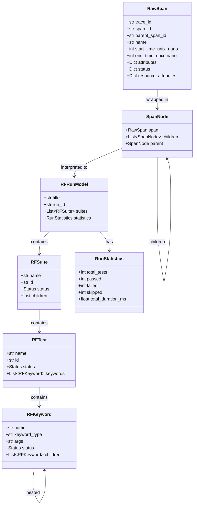

# Design Document: RF Trace Viewer

## Overview

The RF Trace Viewer is a Python CLI tool and embedded JavaScript application that reads OTLP NDJSON trace files from Robot Framework test executions and produces interactive HTML reports. The system operates in two modes:

- **Static mode**: Python reads the trace file, builds the span tree, interprets RF attributes, and generates a self-contained HTML file with all data, JS, and CSS embedded inline.
- **Live mode**: Python starts a minimal HTTP server that serves the HTML viewer and the raw trace file. The JavaScript application in the browser handles parsing, tree building, and rendering, polling for updates every 5 seconds.

The architecture follows a pipeline pattern: `NDJSON → Flat Spans → Span Tree → RF Model → HTML Report`. Each stage is a discrete, testable module. The viewer is vanilla JS with no framework dependencies, designed to be fully embeddable in a single HTML file.

### Key Design Decisions

1. **Dual parsing**: Python parses for static mode; JavaScript parses for live mode. This keeps the live server trivial (just file serving) and moves all logic to the client.
2. **Vanilla JS**: No React/Vue/Svelte. The entire viewer must embed in one HTML file without a build step.
3. **No runtime dependencies**: Python side uses only stdlib. The viewer uses only browser APIs.
4. **OTLP NDJSON as interchange**: The viewer reads standard OTLP JSON, not a custom format. Any OTLP-compatible tool can produce compatible files.
5. **Single-run scope**: The viewer handles one execution run at a time. Multi-run aggregation is out of scope.

## Architecture

```
┌─────────────────────────────────────────────────────────────┐
│                      CLI Entry Point                        │
│                    rf-trace-report                           │
│                                                             │
│   rf-trace-report <input> -o report.html   (static mode)    │
│   rf-trace-report <input> --live           (live mode)      │
├──────────┬──────────────────────────┬───────────────────────┤
│          │                          │                       │
│  Parser  │    Report Generator      │    Live Server        │
│ (Python) │    (Python)              │    (Python)           │
│          │                          │                       │
├──────────┴──────────────────────────┴───────────────────────┤
│                                                             │
│                   Span Tree Builder                         │
│          (Python for static, JS for live)                   │
│                                                             │
├─────────────────────────────────────────────────────────────┤
│                                                             │
│                RF Attribute Interpreter                      │
│          (Python for static, JS for live)                   │
│                                                             │
├─────────────────────────────────────────────────────────────┤
│                                                             │
│                  JS Viewer Application                      │
│   ┌──────────┬──────────┬──────────┬──────────┬──────────┐  │
│   │ Timeline │   Tree   │  Stats   │  Search  │  Theme   │  │
│   │  View    │   View   │  Panel   │ & Filter │  Toggle  │  │
│   └──────────┴──────────┴──────────┴──────────┴──────────┘  │
│                                                             │
└─────────────────────────────────────────────────────────────┘
```

### Data Flow — Static Mode

```
trace.json(.gz)
    │
    ▼
Parser.parse_file(path) → List[RawSpan]
    │
    ▼
SpanTreeBuilder.build(spans) → List[SpanNode]
    │
    ▼
RFModelInterpreter.interpret(tree) → RFRunModel
    │
    ▼
ReportGenerator.generate(model, options) → report.html
    │
    ▼
HTML file with embedded JSON data + JS viewer + CSS
```

### Data Flow — Live Mode

```
trace.json(.gz)
    │
    ▼
LiveServer starts HTTP on port 8077
    │
    ├── GET /          → serves HTML viewer (with JS parser/tree/model/renderer)
    ├── GET /traces    → serves raw trace file content (re-read each request)
    │
    ▼
Browser JS:
    poll /traces every 5s → parse NDJSON → build tree → interpret RF attrs → render
```

## Components and Interfaces

### 1. Parser (`parser.py`)

```python
@dataclass
class RawSpan:
    trace_id: str           # hex string
    span_id: str            # hex string
    parent_span_id: str     # hex string or empty
    name: str
    kind: str
    start_time_unix_nano: int
    end_time_unix_nano: int
    attributes: Dict[str, Any]   # flattened key→value
    status: Dict[str, str]       # {"code": "STATUS_CODE_OK", "message": "..."}
    events: List[Dict]
    resource_attributes: Dict[str, Any]  # from parent resource_spans

def parse_file(path: str) -> List[RawSpan]:
    """Parse an NDJSON trace file (plain or gzip). Returns flat span list."""

def parse_stream(stream: IO) -> List[RawSpan]:
    """Parse an NDJSON stream (for stdin support). Returns flat span list."""

def parse_line(line: str) -> List[RawSpan]:
    """Parse a single NDJSON line (ExportTraceServiceRequest). Returns spans from that line."""

def normalize_id(raw_id: str) -> str:
    """Normalize a trace/span ID to lowercase hex string."""

def flatten_attributes(attrs: List[Dict]) -> Dict[str, Any]:
    """Convert OTLP attribute list [{key, value: {string_value|int_value|...}}] to flat dict."""
```

### 2. Span Tree Builder (`tree.py`)

```python
@dataclass
class SpanNode:
    span: RawSpan
    children: List['SpanNode']
    parent: Optional['SpanNode']

def build_tree(spans: List[RawSpan]) -> List[SpanNode]:
    """Build span tree(s) from flat span list. Returns list of root nodes sorted by start time."""

def group_by_trace(spans: List[RawSpan]) -> Dict[str, List[RawSpan]]:
    """Group spans by trace_id."""
```

### 3. RF Model Interpreter (`rf_model.py`)

```python
class SpanType(Enum):
    SUITE = "suite"
    TEST = "test"
    KEYWORD = "keyword"
    SIGNAL = "signal"
    GENERIC = "generic"

class Status(Enum):
    PASS = "PASS"
    FAIL = "FAIL"
    SKIP = "SKIP"
    NOT_RUN = "NOT_RUN"

@dataclass
class RFSuite:
    name: str
    id: str
    source: str
    status: Status
    elapsed_time: float
    children: List[Union['RFSuite', 'RFTest']]

@dataclass
class RFTest:
    name: str
    id: str
    status: Status
    elapsed_time: float
    keywords: List['RFKeyword']
    tags: List[str]

@dataclass
class RFKeyword:
    name: str
    keyword_type: str   # KEYWORD, SETUP, TEARDOWN, FOR, IF, TRY, WHILE
    args: str
    status: Status
    elapsed_time: float
    children: List['RFKeyword']

@dataclass
class RFSignal:
    signal_type: str    # e.g. "test.starting"
    test_name: str

@dataclass
class RFRunModel:
    title: str
    run_id: str
    rf_version: str
    start_time: int     # epoch nanos
    end_time: int       # epoch nanos
    suites: List[RFSuite]
    statistics: RunStatistics

@dataclass
class RunStatistics:
    total_tests: int
    passed: int
    failed: int
    skipped: int
    total_duration_ms: float
    suite_stats: List[SuiteStatistics]

@dataclass
class SuiteStatistics:
    suite_name: str
    total: int
    passed: int
    failed: int
    skipped: int

def classify_span(span: RawSpan) -> SpanType:
    """Classify a span based on rf.* attributes."""

def interpret_tree(roots: List[SpanNode]) -> RFRunModel:
    """Convert span tree into RF model objects."""

def extract_status(span: RawSpan) -> Status:
    """Extract and map rf.status attribute to Status enum."""

def compute_statistics(suites: List[RFSuite]) -> RunStatistics:
    """Compute aggregate statistics from the suite tree."""
```

### 4. Report Generator (`generator.py`)

```python
def generate_report(model: RFRunModel, options: ReportOptions) -> str:
    """Generate self-contained HTML report string."""

@dataclass
class ReportOptions:
    title: Optional[str]
    theme: str  # "light", "dark", "system"

def embed_data(model: RFRunModel) -> str:
    """Serialize model to JSON for embedding in <script> tag."""

def embed_viewer_assets() -> Tuple[str, str]:
    """Read and return (js_content, css_content) for embedding."""
```

### 5. Live Server (`server.py`)

```python
def start_live_server(trace_path: str, port: int, no_open: bool) -> None:
    """Start HTTP server for live mode. Blocks until Ctrl+C."""
```

The server handles two routes:
- `GET /` → serves the HTML viewer with live-mode JS (includes parser, tree builder, renderer)
- `GET /traces` → serves the raw trace file content, re-reading from disk on each request

### 6. JS Viewer Application (`viewer/`)

The viewer is a set of vanilla JS modules that get concatenated and embedded in the HTML:

- `app.js` — Main application: initializes views, manages state, handles live polling
- `timeline.js` — Canvas-based Gantt timeline renderer with zoom/pan
- `tree.js` — DOM-based expandable tree view
- `stats.js` — Statistics panel renderer
- `search.js` — Search and filter logic
- `style.css` — Light and dark theme styles using CSS custom properties

#### Viewer State Model (JS)

```javascript
// Central application state
const AppState = {
    spans: [],           // parsed flat span list
    tree: [],            // SpanNode tree roots
    model: null,         // RFRunModel equivalent
    filters: {
        searchQuery: '',
        statusFilter: { pass: true, fail: true, skip: true },
        tags: []
    },
    timeline: {
        zoomLevel: 1.0,
        panOffset: 0,
        selectedSpanId: null
    },
    theme: 'system',     // 'light', 'dark', 'system'
    isLive: false,
    lastUpdated: null
};
```

### 7. CLI (`cli.py`)

```python
def main() -> int:
    """CLI entry point. Returns exit code."""
    # Parse args
    # If --live: start_live_server(...)
    # Else: parse → build tree → interpret → generate → write file
```

## Data Models

### OTLP NDJSON Input Format

Each line of the input file is a JSON object conforming to `ExportTraceServiceRequest`:

```json
{
  "resource_spans": [{
    "resource": {
      "attributes": [
        {"key": "service.name", "value": {"string_value": "long-running-suite"}},
        {"key": "run.id", "value": {"string_value": "pabot-run-20260219-141222"}},
        {"key": "rf.version", "value": {"string_value": "7.4.1"}}
      ]
    },
    "scope_spans": [{
      "scope": {"name": "robotframework_tracer.listener"},
      "spans": [{
        "trace_id": "0d077f083a9f42acdc3c862ebd202521",
        "span_id": "f17e43d020d07570",
        "parent_span_id": "5fbcfe1b71a6d724",
        "name": "One Minute Test",
        "kind": "SPAN_KIND_INTERNAL",
        "start_time_unix_nano": "1771506747553671186",
        "end_time_unix_nano": "1771506807559349268",
        "attributes": [
          {"key": "rf.test.name", "value": {"string_value": "One Minute Test"}},
          {"key": "rf.test.id", "value": {"string_value": "s1-t1"}},
          {"key": "rf.status", "value": {"string_value": "PASS"}},
          {"key": "rf.elapsed_time", "value": {"double_value": 60.006}}
        ],
        "status": {"code": "STATUS_CODE_OK"},
        "flags": 256
      }]
    }]
  }]
}
```

### OTLP Attribute Value Types

The OTLP attribute value is a oneof with these possible fields:

| Field | Python Type |
|-------|-------------|
| `string_value` | `str` |
| `int_value` | `int` |
| `double_value` | `float` |
| `bool_value` | `bool` |
| `array_value` | `list` |
| `kvlist_value` | `dict` |
| `bytes_value` | `bytes` (base64 encoded) |

The `flatten_attributes` function must handle all these types.

### RF Attribute Namespace

| Attribute | Span Type | Description |
|-----------|-----------|-------------|
| `rf.suite.name` | Suite | Suite display name |
| `rf.suite.id` | Suite | Suite identifier (e.g., `s1`) |
| `rf.suite.source` | Suite | Path to `.robot` file |
| `rf.test.name` | Test | Test case display name |
| `rf.test.id` | Test | Test identifier (e.g., `s1-t1`) |
| `rf.test.lineno` | Test | Line number in source |
| `rf.keyword.name` | Keyword | Keyword display name |
| `rf.keyword.type` | Keyword | KEYWORD, SETUP, TEARDOWN, FOR, IF, TRY, WHILE |
| `rf.keyword.args` | Keyword | Keyword arguments as string |
| `rf.keyword.lineno` | Keyword | Line number in source |
| `rf.signal` | Signal | Signal type (e.g., `test.starting`) |
| `rf.status` | Any | PASS, FAIL, SKIP, NOT_RUN |
| `rf.elapsed_time` | Any | Duration in seconds (float) |
| `rf.start_time` | Any | Human-readable start time |
| `rf.end_time` | Any | Human-readable end time |

### Internal Data Model Relationships




## Correctness Properties

*A property is a characteristic or behavior that should hold true across all valid executions of a system — essentially, a formal statement about what the system should do. Properties serve as the bridge between human-readable specifications and machine-verifiable correctness guarantees.*

### Property 1: Parse round-trip across input methods

*For any* valid NDJSON content, parsing from a plain-text file, a gzip-compressed file, and a stream (stdin) SHALL all produce identical lists of RawSpan objects.

**Validates: Requirements 1.1, 1.2, 1.3**

### Property 2: Invalid lines skipped, valid lines preserved

*For any* NDJSON file containing a mix of valid ExportTraceServiceRequest lines and invalid lines (malformed JSON or wrong structure), the Parser SHALL return exactly the spans from the valid lines, in order, with no spans from invalid lines.

**Validates: Requirements 1.4, 1.5**

### Property 3: ID normalization produces lowercase hex

*For any* span parsed by the Parser, the `trace_id` and `span_id` fields in the resulting RawSpan SHALL be non-empty strings matching the pattern `^[0-9a-f]+$`.

**Validates: Requirements 1.6**

### Property 4: Timestamps converted to numeric nanoseconds

*For any* span parsed by the Parser, the `start_time_unix_nano` and `end_time_unix_nano` fields in the resulting RawSpan SHALL be integers, and `start_time_unix_nano` SHALL be less than or equal to `end_time_unix_nano`.

**Validates: Requirements 1.7**

### Property 5: Resource attributes propagated to child spans

*For any* NDJSON line with resource attributes, every RawSpan extracted from that line SHALL have a `resource_attributes` dict containing all key-value pairs from the line's `resource.attributes`.

**Validates: Requirements 1.8**

### Property 6: Tree reconstruction round-trip

*For any* set of spans with valid trace_id and parent_span_id relationships forming a tree, flattening the tree to a span list and rebuilding via `build_tree` SHALL produce a tree with identical parent-child relationships, where root nodes are exactly those spans with no parent or an orphaned parent_span_id.

**Validates: Requirements 2.1, 2.2, 2.3, 2.5**

### Property 7: Children sorted by start time

*For any* SpanNode in the built tree, its `children` list SHALL be sorted in ascending order by `span.start_time_unix_nano`.

**Validates: Requirements 2.4**

### Property 8: Multiple trees sorted by root start time

*For any* set of spans belonging to multiple trace_ids, the list of root SpanNodes returned by `build_tree` SHALL be sorted in ascending order by the root span's `start_time_unix_nano`.

**Validates: Requirements 2.6**

### Property 9: Tree building preserves span data

*For any* RawSpan in the input list, the corresponding SpanNode in the built tree SHALL contain a `span` field with identical `attributes`, `events`, `status`, `name`, `trace_id`, `span_id`, `start_time_unix_nano`, and `end_time_unix_nano` values.

**Validates: Requirements 2.7**

### Property 10: Span classification correctness

*For any* RawSpan, `classify_span` SHALL return SUITE if and only if `rf.suite.name` is present in attributes, TEST if and only if `rf.test.name` is present, KEYWORD if and only if `rf.keyword.name` is present, SIGNAL if and only if `rf.signal` is present, and GENERIC otherwise. Priority order for spans with multiple rf.* attribute types: SUITE > TEST > KEYWORD > SIGNAL.

**Validates: Requirements 3.1**

### Property 11: RF model field extraction completeness

*For any* span classified as SUITE, TEST, KEYWORD, or SIGNAL, the produced model object SHALL contain all required fields populated from the span's `rf.*` attributes: name and status for all types, plus type-specific fields (id and source for suites; id for tests; keyword_type and args for keywords; signal_type and test_name for signals).

**Validates: Requirements 3.2, 3.3, 3.4, 3.5**

### Property 12: Generic span fallback

*For any* span with no `rf.*` attributes, `classify_span` SHALL return GENERIC, and the span's original `name` and `attributes` SHALL be preserved unmodified in the resulting model.

**Validates: Requirements 3.6**

### Property 13: Status mapping completeness

*For any* span with an `rf.status` attribute, `extract_status` SHALL return one of the four valid Status enum values (PASS, FAIL, SKIP, NOT_RUN), and the mapping SHALL be deterministic for the same input string.

**Validates: Requirements 3.7**

### Property 14: Embedded data round-trip

*For any* RFRunModel, embedding it as JSON in the HTML report and then extracting and parsing that JSON SHALL produce a data structure equivalent to the original model's serialized form.

**Validates: Requirements 4.2**

### Property 15: No external dependencies in generated HTML

*For any* generated HTML report, the document SHALL contain no `<script src="...">`, `<link rel="stylesheet" href="...">`, or `` tags referencing external URLs.

**Validates: Requirements 4.3**

### Property 16: Title embedding

*For any* non-empty title string provided to the Report_Generator, the generated HTML SHALL contain that exact string within the `<title>` element.

**Validates: Requirements 4.4**

### Property 17: Invalid CLI arguments exit non-zero

*For any* CLI invocation missing the required input positional argument, the process SHALL exit with a non-zero status code.

**Validates: Requirements 11.7**

## Error Handling

### Parser Errors

| Error Condition | Handling |
|----------------|----------|
| File not found | Raise `FileNotFoundError` with descriptive message. CLI catches and prints user-friendly error. |
| Permission denied | Raise `PermissionError`. CLI catches and prints user-friendly error. |
| Malformed JSON line | Log warning with line number, skip line, continue parsing. |
| Invalid OTLP structure | Log warning with line number, skip line, continue parsing. |
| Empty file | Return empty span list. No error. |
| Gzip decompression failure | Raise `IOError` with descriptive message. |
| Stdin read error | Raise `IOError`. CLI catches and prints error. |

### Tree Builder Errors

| Error Condition | Handling |
|----------------|----------|
| Orphan span (missing parent) | Treat as root span. Log info-level message. |
| Duplicate span_id | Keep first occurrence, log warning for duplicates. |
| Empty span list | Return empty tree list. No error. |
| Circular parent references | Detect cycles during tree building. Break cycle by treating the cycle-creating span as a root. Log warning. |

### RF Model Interpreter Errors

| Error Condition | Handling |
|----------------|----------|
| Missing rf.status attribute | Default to NOT_RUN status. |
| Unknown rf.status value | Default to NOT_RUN status. Log warning. |
| Missing rf.keyword.type | Default to "KEYWORD" type. |
| Missing expected rf.* fields | Use empty string or zero defaults. Log warning. |

### Report Generator Errors

| Error Condition | Handling |
|----------------|----------|
| Output path not writable | Raise `PermissionError`. CLI catches and prints error. |
| Viewer asset files missing | Raise `FileNotFoundError` with message indicating corrupted installation. |

### Live Server Errors

| Error Condition | Handling |
|----------------|----------|
| Port already in use | Print error message suggesting alternative port. Exit with non-zero code. |
| Trace file deleted during serving | Return HTTP 404 for `/traces` requests. Viewer shows "file not found" indicator. |
| Keyboard interrupt (Ctrl+C) | Graceful shutdown: close socket, print "Server stopped." |

### CLI Errors

| Error Condition | Handling |
|----------------|----------|
| Missing input argument | argparse prints usage and exits with code 2. |
| Invalid --port value | argparse prints error and exits with code 2. |
| Conflicting options | Print descriptive error. Exit with code 1. |

## Testing Strategy

### Testing Framework

- **Python unit tests**: `pytest` (already configured in pyproject.toml)
- **Property-based tests**: `hypothesis` library for Python
- **Coverage**: Target >70% for Python code (pytest-cov already configured)
- **JS tests**: Not in scope for initial implementation; JS logic is minimal in static mode

### Dual Testing Approach

Unit tests and property-based tests are complementary:

- **Unit tests** verify specific examples, edge cases, and integration points
- **Property-based tests** verify universal properties across randomly generated inputs
- Together they provide comprehensive coverage: unit tests catch concrete bugs, property tests verify general correctness

### Property-Based Testing Configuration

- Library: `hypothesis` for Python
- Minimum 100 examples per property test (Hypothesis default is 100)
- Each property test tagged with a comment referencing the design property:
  ```python
  # Feature: rf-trace-viewer, Property 1: Parse round-trip across input methods
  ```
- Each correctness property implemented as a single `@given` test function

### Test Organization

```
tests/
├── unit/
│   ├── test_parser.py          # Unit + property tests for parser
│   ├── test_tree.py            # Unit + property tests for tree builder
│   ├── test_rf_model.py        # Unit + property tests for RF model interpreter
│   ├── test_generator.py       # Unit tests for report generator
│   ├── test_server.py          # Unit tests for live server
│   └── test_cli.py             # Unit tests for CLI
├── fixtures/
│   ├── pabot_trace.json        # Real pabot trace (exists)
│   ├── simple_trace.json       # Single test, single suite
│   └── malformed_trace.json    # Mix of valid and invalid lines
└── conftest.py                 # Shared fixtures and Hypothesis strategies
```

### Hypothesis Strategies

Custom strategies needed for property tests:

- `raw_span()` — generates valid RawSpan objects with random attributes
- `ndjson_line(spans)` — wraps spans into a valid ExportTraceServiceRequest JSON line
- `span_tree(max_depth, max_children)` — generates random tree structures of spans
- `rf_suite_span()`, `rf_test_span()`, `rf_keyword_span()`, `rf_signal_span()` — generate spans with appropriate rf.* attributes
- `rf_run_model()` — generates complete RFRunModel objects for generator tests

### Unit Test Focus Areas

- **Parser**: Fixture-based tests with `pabot_trace.json`, empty file, gzip file, malformed lines
- **Tree builder**: Known tree structures, orphan handling, duplicate span_ids, empty input
- **RF model**: Each span type classification, status mapping edge cases, missing attributes
- **Generator**: HTML structure validation, title embedding, data embedding
- **Server**: Route handling, file re-reading, port configuration
- **CLI**: Argument parsing, error messages, version output
