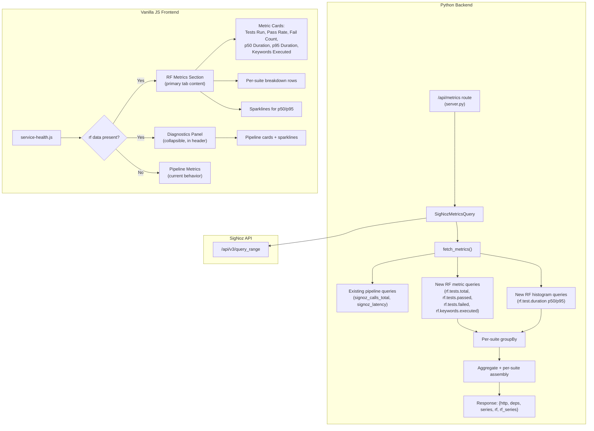

# Design Document: Service Health Refactor

## Overview

This design splits the existing Service Health tab into two distinct concerns:

1. A **Diagnostics Panel** — a collapsible admin-oriented section in the page header that shows pipeline/span-derived metrics (request count, latency percentiles, error rate).
2. An **RF Metrics Section** — the primary tab content showing Robot Framework test execution metrics (`rf.tests.total`, `rf.tests.passed`, `rf.test.duration`, etc.) queried from SigNoz.

The backend (`SigNozMetricsQuery`) gains new query methods for RF counter and histogram metrics using Cumulative temporality. The `/api/metrics` response adds an `rf` section and `rf_series` field while preserving the existing `http`, `deps`, and `series` fields for backward compatibility.

The frontend (`service-health.js`) conditionally renders either the RF Metrics Section (when RF data exists) or falls back to the current pipeline metrics view. When RF data is present, pipeline metrics move into a collapsible Diagnostics Panel in the header area.

### Key Design Decisions

- **Single JS file**: All changes stay in `service-health.js` (no new JS files) to avoid touching the asset embedding pipeline in `generator.py` and `server.py`.
- **Cumulative temporality**: RF metrics use `Cumulative` temporality (unlike the existing `Delta` span metrics), requiring a new query helper or parameterization of the existing `_query_counter_rate`.
- **Suite grouping via `groupBy`**: Per-suite breakdown is achieved by adding `suite` to the SigNoz query's `groupBy` field, returning one series per suite. Aggregation across suites is done server-side in Python.
- **Null-safe RF section**: When no RF metrics exist, the `rf` field is `null` (not omitted), and the frontend falls back to the current behavior.

## Architecture



## Components and Interfaces

### Backend Components

#### 1. `SigNozMetricsQuery` (modified)

New methods added to the existing class in `signoz_metrics.py`:

```python
def _query_cumulative_counter(
    self,
    metric_name: str,
    filters: list[dict],
    start_s: int,
    end_s: int,
    step: int,
    group_by: list[str] | None = None,
) -> dict:
    """Query a Cumulative counter metric, returning series grouped by labels.

    Returns dict keyed by group label tuple (or ("__all__",) for ungrouped).
    Each value is a list of {t, v} points.
    """
```

```python
def _query_cumulative_histogram_quantile(
    self,
    metric_name: str,
    quantile: str,
    filters: list[dict],
    start_s: int,
    end_s: int,
    step: int,
    group_by: list[str] | None = None,
) -> dict:
    """Query a Cumulative histogram for p50/p95, grouped by labels.

    Uses hist_quantile_50 / hist_quantile_95 aggregate operators.
    Returns dict keyed by group label tuple.
    """
```

```python
def _build_rf_metrics(
    self,
    base_filters: list[dict],
    start_s: int,
    end_s: int,
    step: int,
) -> tuple[dict | None, dict]:
    """Query all RF metrics and assemble the rf section + rf_series.

    Returns (rf_dict_or_none, rf_series_dict).
    On total failure of all RF queries, returns (None, {}).
    """
```

The existing `_build_query_payload` method already accepts `temporality` and `attr_type` parameters, so the new cumulative query helpers reuse it with `temporality="Cumulative"`.

The `groupBy` field (currently hardcoded to `[]` in `_build_query_payload`) needs to be parameterized to support per-suite breakdown.

#### 2. `fetch_metrics()` (modified)

The existing method is extended to:
1. Call `_build_rf_metrics()` after the existing pipeline queries.
2. Include `rf` and `rf_series` in the returned snapshot dict.
3. Compute `pass_rate_pct` as `(passed / total) * 100` per suite and aggregated.

#### 3. `/api/metrics` route (unchanged)

The route in `server.py` already calls `fetch_metrics()` and returns the snapshot as JSON. No route changes needed — the expanded snapshot dict is automatically serialized.

### Frontend Components

#### 4. RF Metrics Section (new DOM section)

Created dynamically in `service-health.js` when RF data is present:
- 6 metric cards: Tests Run, Pass Rate, Fail Count, Median Duration (p50), p95 Duration, Keywords Executed
- Aggregated summary row (always shown)
- Per-suite rows (shown when >1 suite)
- Sparklines for p50 and p95 duration using existing `renderSparkline()`

#### 5. Diagnostics Panel (new collapsible section)

A `<details>/<summary>` element in the header area containing the existing pipeline metric cards and sparklines. When RF data is present, pipeline cards move here. When collapsed, cards are hidden.

#### 6. Conditional Visibility Logic

On each poll cycle, the renderer checks `snapshot.rf`:
- If `rf` is non-null with at least one non-null value → show RF Metrics Section + Diagnostics Panel
- If `rf` is null → show pipeline metrics in the primary tab (current behavior)
- Tab label switches between "RF Metrics" and "Service Health" accordingly

### API Response Schema

```json
{
  "timestamp": 1700000000,
  "window_minutes": 30,
  "http": {
    "request_count": 138000,
    "p95_latency_ms": 12.5,
    "p99_latency_ms": 45.2,
    "error_rate_pct": 0.3,
    "inflight": null
  },
  "deps": {
    "request_count": null,
    "p95_latency_ms": null,
    "timeout_count": null
  },
  "series": {
    "p95_latency_ms": [{"t": 1700000000, "v": 12.5}],
    "error_rate_pct": [],
    "dep_p95_latency_ms": []
  },
  "rf": {
    "summary": {
      "tests_total": 42,
      "tests_passed": 40,
      "tests_failed": 2,
      "pass_rate_pct": 95.2,
      "p50_duration_ms": 150.0,
      "p95_duration_ms": 890.0,
      "keywords_executed": 312
    },
    "suites": {
      "LoginSuite": {
        "tests_total": 20,
        "tests_passed": 19,
        "tests_failed": 1,
        "pass_rate_pct": 95.0,
        "p50_duration_ms": 120.0,
        "p95_duration_ms": 750.0,
        "keywords_executed": 156
      },
      "CheckoutSuite": {
        "tests_total": 22,
        "tests_passed": 21,
        "tests_failed": 1,
        "pass_rate_pct": 95.5,
        "p50_duration_ms": 180.0,
        "p95_duration_ms": 920.0,
        "keywords_executed": 156
      }
    }
  },
  "rf_series": {
    "p50_duration_ms": [{"t": 1700000000, "v": 150.0}],
    "p95_duration_ms": [{"t": 1700000000, "v": 890.0}]
  }
}
```

When no RF data is available:
```json
{
  "timestamp": 1700000000,
  "window_minutes": 30,
  "http": { "..." : "..." },
  "deps": { "..." : "..." },
  "series": { "..." : "..." },
  "rf": null,
  "rf_series": {}
}
```

## Data Models

### Backend Data Structures

#### RF Metrics Snapshot (within `fetch_metrics` return dict)

| Field | Type | Description |
|---|---|---|
| `rf` | `dict \| None` | RF metrics section, null when no data |
| `rf.summary` | `dict` | Aggregated metrics across all suites |
| `rf.summary.tests_total` | `float \| None` | Total test count from `rf.tests.total` |
| `rf.summary.tests_passed` | `float \| None` | Passed count from `rf.tests.passed` |
| `rf.summary.tests_failed` | `float \| None` | Failed count from `rf.tests.failed` |
| `rf.summary.pass_rate_pct` | `float \| None` | Computed: `(passed / total) * 100` |
| `rf.summary.p50_duration_ms` | `float \| None` | Median test duration from histogram |
| `rf.summary.p95_duration_ms` | `float \| None` | p95 test duration from histogram |
| `rf.summary.keywords_executed` | `float \| None` | Keyword count from `rf.keywords.executed` |
| `rf.suites` | `dict[str, dict]` | Per-suite breakdown, keyed by suite label |
| `rf_series` | `dict` | Time-series for sparklines |
| `rf_series.p50_duration_ms` | `list[dict]` | `[{t, v}, ...]` for p50 sparkline |
| `rf_series.p95_duration_ms` | `list[dict]` | `[{t, v}, ...]` for p95 sparkline |

#### SigNoz Query Parameters for RF Metrics

| RF Metric | SigNoz Metric Name | Attr Type | Temporality | Aggregation | GroupBy |
|---|---|---|---|---|---|
| Tests total | `rf.tests.total` | Sum | Cumulative | `rate` | `suite` |
| Tests passed | `rf.tests.passed` | Sum | Cumulative | `rate` | `suite` |
| Tests failed | `rf.tests.failed` | Sum | Cumulative | `rate` | `suite` |
| Keywords executed | `rf.keywords.executed` | Sum | Cumulative | `rate` | `suite` |
| Test duration p50 | `rf.test.duration` | Histogram | Cumulative | `hist_quantile_50` | `suite` |
| Test duration p95 | `rf.test.duration` | Histogram | Cumulative | `hist_quantile_95` | `suite` |

### Frontend Data Structures

The frontend consumes the JSON response directly. Key structures:

- `RF_METRICS` array: card definitions for the 6 RF metric cards (analogous to existing `HTTP_METRICS` / `DEP_METRICS`)
- `RF_SPARKLINE_METRICS` map: maps card keys to `rf_series` keys for sparkline rendering
- `_rfHistory` buffer: rolling history for RF sparkline data points (same pattern as existing `_history`)


## Correctness Properties

*A property is a characteristic or behavior that should hold true across all valid executions of a system — essentially, a formal statement about what the system should do. Properties serve as the bridge between human-readable specifications and machine-verifiable correctness guarantees.*

### Property 1: RF response structure completeness

*For any* set of valid SigNoz query responses for RF metrics, `fetch_metrics` shall return a snapshot where the `rf` section contains all expected fields (`tests_total`, `tests_passed`, `tests_failed`, `pass_rate_pct`, `p50_duration_ms`, `p95_duration_ms`, `keywords_executed`) in the `summary` dict, and the `rf_series` dict contains `p50_duration_ms` and `p95_duration_ms` arrays.

**Validates: Requirements 1.1, 1.2, 1.5, 1.6, 7.2, 7.4**

### Property 2: Backward-compatible response structure

*For any* call to `fetch_metrics` (regardless of whether RF data is available or not), the returned snapshot shall always contain the keys `http`, `deps`, `series`, `timestamp`, `window_minutes`, `rf`, and `rf_series` — preserving the existing response shape while adding the new fields.

**Validates: Requirements 2.5, 7.1, 7.2, 7.4**

### Property 3: Pass rate computation

*For any* pair of non-negative values `(passed, total)` where `total > 0`, the computed `pass_rate_pct` shall equal `(passed / total) * 100`. When `total` is 0 or null, `pass_rate_pct` shall be null.

**Validates: Requirements 1.3**

### Property 4: Partial failure resilience

*For any* subset of RF metric queries that raise `ProviderError`, `fetch_metrics` shall still return a valid snapshot (not raise an exception), with null values for the failed metrics and correct values for the successful ones. The existing pipeline metrics shall be unaffected by RF query failures.

**Validates: Requirements 1.4**

### Property 5: RF metric card warning thresholds

*For any* numeric pass rate value, the Pass Rate card shall have a warning style if and only if the value is below 100%. *For any* numeric fail count value, the Fail Count card shall have a warning style if and only if the value is greater than zero.

**Validates: Requirements 3.3, 3.4**

### Property 6: Duration formatting

*For any* non-negative duration value in milliseconds, the formatter shall produce a string ending in "ms" when the value is less than 1000, and a string ending in "s" (with the value divided by 1000) when the value is 1000 or greater. Null or NaN values shall produce an em-dash ("—").

**Validates: Requirements 3.6**

### Property 7: Tab label reflects RF data availability

*For any* metrics snapshot, the tab label shall equal "RF Metrics" if and only if the `rf` field is non-null (contains at least one non-null metric value). Otherwise, the tab label shall equal "Service Health".

**Validates: Requirements 5.1, 5.2**

### Property 8: Suite groupBy in query payload

*For any* RF metric query built by `_build_query_payload` with a non-empty `group_by` parameter, the resulting payload's `builderQueries.A.groupBy` array shall contain the specified group-by keys (e.g., `["suite"]`).

**Validates: Requirements 6.1**

### Property 9: Suite aggregation correctness

*For any* set of per-suite metric values (tests_total, tests_passed, tests_failed, keywords_executed), the aggregated summary values shall equal the sum of the corresponding per-suite values. Pass rate in the summary shall be computed from the aggregated passed and total counts.

**Validates: Requirements 6.2**

## Error Handling

### Backend Error Handling

| Error Scenario | Handling | User Impact |
|---|---|---|
| Single RF metric query fails | Log warning, set that metric to `null` in response | Card shows "—" for that metric |
| All RF metric queries fail | Set `rf` to `null`, log warning | Frontend falls back to pipeline metrics view |
| All queries fail (pipeline + RF) | Raise `ProviderError` | Server returns 502, frontend shows warning banner |
| SigNoz authentication failure | Raise `AuthenticationError`, attempt token refresh | 502 if refresh fails |
| SigNoz timeout | `ProviderError` via existing `_execute_query` handling | Affected metric shows null |
| Division by zero in pass rate | Guard: if `total == 0`, set `pass_rate_pct` to `null` | Card shows "—" |

### Frontend Error Handling

| Error Scenario | Handling | User Impact |
|---|---|---|
| `/api/metrics` returns 502 | Existing `_showWarning()` displays error banner | Warning banner visible |
| `rf` field is `null` | Hide RF Metrics Section, show pipeline metrics | Graceful fallback |
| `rf` field has partial nulls | Cards with null values show "—" | Individual cards degrade gracefully |
| Sparkline data has < 2 points | Existing `renderSparkline()` shows "No data" placeholder | Placeholder text |
| Poll cycle fails | Warning banner shown, next poll retries | Transient — auto-recovers |

## Testing Strategy

### Property-Based Testing

Property-based tests use **Hypothesis** (Python) with the project's existing profile system:
- `dev` profile: `max_examples=5` for fast feedback (`make test-unit`)
- `ci` profile: `max_examples=200` for thorough coverage (`make test-full`)
- No hardcoded `@settings(max_examples=N)` on individual tests — the profile controls iteration counts globally.

Each property test must be tagged with a comment referencing the design property:
```python
# Feature: service-health-refactor, Property 3: Pass rate computation
```

Each correctness property above maps to a single property-based test. Tests run inside the `rf-trace-test:latest` Docker image via Makefile targets.

#### Property Test Plan

| Property | Test File | Strategy |
|---|---|---|
| P1: RF response structure | `tests/unit/test_signoz_rf_metrics.py` | Mock `_execute_query` to return generated SigNoz responses; verify snapshot structure |
| P2: Backward-compatible response | `tests/unit/test_signoz_rf_metrics.py` | Generate random RF success/failure combos; verify all required keys present |
| P3: Pass rate computation | `tests/unit/test_signoz_rf_metrics.py` | Generate random (passed, total) pairs; verify formula |
| P4: Partial failure resilience | `tests/unit/test_signoz_rf_metrics.py` | Generate random subsets of queries to fail; verify non-raising behavior |
| P5: RF card warning thresholds | `tests/unit/test_service_health_js.py` | Generate random pass_rate and fail_count values; verify threshold logic (test the pure functions exposed on `window`) |
| P6: Duration formatting | `tests/unit/test_service_health_js.py` | Generate random duration values; verify format output |
| P7: Tab label conditional | `tests/unit/test_service_health_js.py` | Generate random snapshots with/without rf data; verify label |
| P8: Suite groupBy payload | `tests/unit/test_signoz_rf_metrics.py` | Generate random group_by lists; verify payload structure |
| P9: Suite aggregation | `tests/unit/test_signoz_rf_metrics.py` | Generate random per-suite metric dicts; verify sums |

### Unit Testing

Unit tests complement property tests by covering specific examples and edge cases:

- **Edge case**: `rf` is `null` when all RF queries fail (Req 7.3)
- **Edge case**: Single suite present → no per-suite rows in response (Req 6.4)
- **Example**: RF Metrics Section has exactly 6 card definitions (Req 3.2)
- **Example**: Conditional visibility hides RF section when `rf` is null (Req 4.1)
- **Integration**: `/api/metrics` route returns expanded snapshot with `rf` field
- **Integration**: Existing pipeline metrics unchanged when RF queries added

### Test Execution

All tests run in Docker per project conventions:

```bash
make test-unit          # Fast: dev profile, <30s
make test-full          # Thorough: ci profile, 200 examples
make dev-test-file FILE=tests/unit/test_signoz_rf_metrics.py  # Single file
```
