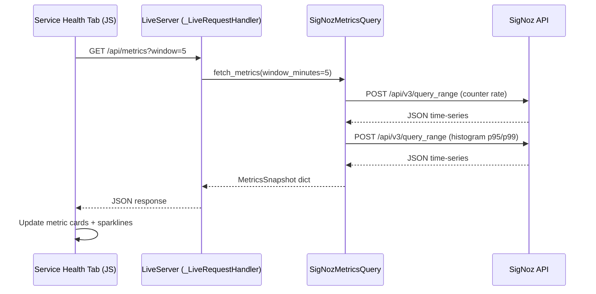
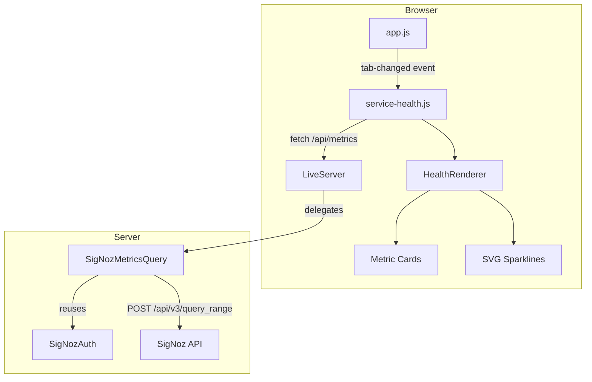

# Design Document: Service Health Tab

## Overview

The Service Health tab adds a self-monitoring dashboard to the rf-trace-viewer that reads back the OpenTelemetry metrics the server already pushes (via `metrics.py`) by querying them from SigNoz. It surfaces HTTP RED metrics (Rate, Errors, Duration), in-flight request counts, and dependency health as metric cards with inline SVG sparklines.

The feature spans three layers:

1. **Backend** — A new `/api/metrics` GET endpoint on `_LiveRequestHandler` that delegates to a `SigNozMetricsQuery` class. This class reuses the existing `SigNozProvider._api_request` / `SigNozAuth` plumbing to query the SigNoz `/api/v3/query_range` metrics API.
2. **Frontend data** — A new `service-health.js` viewer module that polls `/api/metrics` every 30 seconds while the tab is active, manages a rolling history buffer for sparkline data points, and delegates rendering to a `HealthRenderer`.
3. **Frontend UI** — Metric cards with current values, human-readable formatting, threshold-based status indicators, inline SVG sparklines, and full light/dark theme support via CSS custom properties.

The tab button is conditionally rendered: it only appears when `window.__RF_TRACE_LIVE__ === true` AND `window.__RF_PROVIDER === "signoz"`.

## Architecture





### Design Decisions

1. **Server-side aggregation** — The browser never talks to SigNoz directly. The `/api/metrics` endpoint returns pre-aggregated values. This avoids CORS issues, keeps SigNoz credentials server-side, and lets us shape the response for the UI.

2. **Reuse `SigNozAuth` via composition** — `SigNozMetricsQuery` takes a `SigNozProvider` instance (or at minimum a `SigNozAuth` + endpoint) rather than reimplementing auth. The existing `_api_request` pattern (auto-retry on 401) is reused.

3. **Single JS file** — `service-health.js` contains both the polling client (`MetricsAPIClient`) and the renderer (`HealthRenderer`). This follows the project convention of one JS file per viewer feature (like `flow-table.js`, `keyword-stats.js`).

4. **Sparkline history in JS** — The backend returns the current snapshot plus a `series` array of time-bucketed data points from the query window. The JS side keeps a rolling buffer (capped at 20 points) for sparkline rendering across polls.

5. **No external dependencies** — Sparklines are rendered as inline `<svg>` polylines. No charting library needed.

## Components and Interfaces

### Backend Components

#### `SigNozMetricsQuery` (new class in `src/rf_trace_viewer/providers/signoz_metrics.py`)

Responsible for building and executing metric queries against the SigNoz `/api/v3/query_range` API.

```python
class SigNozMetricsQuery:
    """Builds and executes metric queries against SigNoz."""

    def __init__(self, provider: SigNozProvider) -> None:
        """Reuse the provider's auth and endpoint config."""

    def fetch_metrics(self, window_minutes: int = 5) -> dict:
        """Query all service health metrics and return a snapshot dict.

        Returns:
            {
                "timestamp": <epoch_seconds>,
                "window_minutes": <int>,
                "http": {
                    "request_count": <float|None>,
                    "p95_latency_ms": <float|None>,
                    "p99_latency_ms": <float|None>,
                    "error_rate_pct": <float|None>,
                    "inflight": <float|None>,
                },
                "deps": {
                    "request_count": <float|None>,
                    "p95_latency_ms": <float|None>,
                    "timeout_count": <float|None>,
                },
                "series": {
                    "p95_latency_ms": [{"t": <epoch_s>, "v": <float>}, ...],
                    "error_rate_pct": [{"t": <epoch_s>, "v": <float>}, ...],
                    "dep_p95_latency_ms": [{"t": <epoch_s>, "v": <float>}, ...],
                }
            }
        """

    def _query_counter_rate(self, metric_name: str, filters: list[dict],
                            start_s: int, end_s: int, step: int) -> list[dict]:
        """Query a counter metric as rate-per-second over the window."""

    def _query_histogram_quantile(self, metric_name: str, quantile: float,
                                   filters: list[dict],
                                   start_s: int, end_s: int, step: int) -> list[dict]:
        """Query a histogram metric for a specific quantile (0.95, 0.99)."""

    def _build_service_filter(self) -> dict:
        """Build the service.name = 'robotframework-trace-report' filter."""

    def _build_query_payload(self, metric_name: str, aggregation: str,
                              filters: list[dict], start_s: int, end_s: int,
                              step: int, **kwargs) -> dict:
        """Build a /api/v3/query_range POST payload."""

    def _execute_query(self, payload: dict) -> dict:
        """Execute query via the provider's _api_request with 10s timeout."""
```

#### `/api/metrics` endpoint (added to `_LiveRequestHandler._do_GET`)

```python
# In _do_GET, after existing route checks:
if path == "/api/metrics":
    self._serve_metrics(request_id, query)
    return

def _serve_metrics(self, request_id: str, query: dict) -> None:
    """Serve aggregated metrics from SigNoz."""
    provider = getattr(self.server, "provider", None)
    if not isinstance(provider, SigNozProvider):
        self._send_json_response(404, {"error": "Metrics not available: SigNoz provider not configured"}, request_id)
        return
    window = int(query.get("window", ["5"])[0])
    window = max(1, min(60, window))  # clamp to 1-60 minutes
    metrics_query = SigNozMetricsQuery(provider)
    try:
        snapshot = metrics_query.fetch_metrics(window_minutes=window)
        self._send_json_response(200, snapshot, request_id)
    except Exception as exc:
        self._send_json_response(502, {"error": f"SigNoz query failed: {exc}"}, request_id)
```

### Frontend Components

#### `service-health.js` (new file in `src/rf_trace_viewer/viewer/`)

Contains two logical modules in a single IIFE:

**MetricsAPIClient** — Handles polling lifecycle:
- `startPolling()` — begins 30-second interval, immediate first fetch
- `stopPolling()` — clears interval
- `fetchMetrics()` — `GET /api/metrics`, returns parsed JSON
- Listens to `tab-changed` events from `app.js` event bus
- On fetch error: sets `lastError` and emits `metrics-error` event

**HealthRenderer** — Handles DOM rendering:
- `render(snapshot)` — updates all metric cards with current values
- `renderSparkline(svgEl, dataPoints)` — draws SVG polyline
- `formatLatency(ms)` — e.g. `"42 ms"`
- `formatCount(n)` — e.g. `"1.2k"`, `"3.4M"`
- `formatPercent(pct)` — e.g. `"2.1%"`
- `formatValue(value)` — returns `"—"` for null/undefined
- `getThresholdClass(errorRatePct)` — returns `""`, `"warning"`, or `"critical"`

**Tab visibility logic:**
```javascript
function shouldShowTab() {
    return window.__RF_TRACE_LIVE__ === true && window.__RF_PROVIDER === 'signoz';
}
```

The tab button and pane are created dynamically by `service-health.js` on init, only if `shouldShowTab()` returns true. This avoids modifying the HTML template in `generator.py`.

### Integration Points

| Integration | Mechanism |
|---|---|
| Tab switching | `eventBus.on('tab-changed', ...)` from `app.js` |
| Theme changes | `eventBus.on('theme-changed', ...)` from `theme.js` + CSS custom properties |
| JS load order | `service-health.js` added to `_JS_FILES` tuple in `generator.py` before `app.js` |
| Provider detection | `window.__RF_PROVIDER` set by `_serve_viewer()` in `server.py` |
| Live mode detection | `window.__RF_TRACE_LIVE__` set by `_serve_viewer()` in `server.py` |

## Data Models

### Backend: MetricsSnapshot (Python dict)

```python
MetricsSnapshot = {
    "timestamp": int,          # Unix epoch seconds when snapshot was taken
    "window_minutes": int,     # Query window used (default 5)
    "http": {
        "request_count": float | None,    # Total requests in window (rate * window)
        "p95_latency_ms": float | None,   # 95th percentile latency
        "p99_latency_ms": float | None,   # 99th percentile latency
        "error_rate_pct": float | None,   # 5xx / total * 100
        "inflight": float | None,         # Current in-flight gauge value
    },
    "deps": {
        "request_count": float | None,    # Total dep requests in window
        "p95_latency_ms": float | None,   # Dep 95th percentile latency
        "timeout_count": float | None,    # Dep timeouts in window
    },
    "series": {
        "p95_latency_ms": [{"t": int, "v": float}, ...],
        "error_rate_pct": [{"t": int, "v": float}, ...],
        "dep_p95_latency_ms": [{"t": int, "v": float}, ...],
    },
}
```

### Frontend: Sparkline History Buffer

```javascript
// Rolling buffer per metric, capped at 20 entries
var _history = {
    p95_latency_ms: [],      // [{t: epochSec, v: number}, ...]
    error_rate_pct: [],
    dep_p95_latency_ms: [],
};
```

### SigNoz Query Payload (sent to `/api/v3/query_range`)

```json
{
    "compositeQuery": {
        "builderQueries": {
            "A": {
                "queryName": "A",
                "expression": "A",
                "dataSource": "metrics",
                "aggregateOperator": "rate",
                "aggregateAttribute": {
                    "key": "http.server.requests",
                    "dataType": "float64",
                    "type": "Sum",
                    "isMonotonic": true
                },
                "filters": {
                    "items": [{
                        "key": {"key": "service.name", "dataType": "string", "type": "resource"},
                        "op": "=",
                        "value": "robotframework-trace-report"
                    }],
                    "op": "AND"
                },
                "groupBy": [],
                "orderBy": []
            }
        },
        "panelType": "graph",
        "queryType": "builder"
    },
    "start": 1700000000,
    "end": 1700000300,
    "step": 60
}
```

For histogram quantiles, the `aggregateOperator` changes to `p95` or `p99` and the `aggregateAttribute.type` is `"Histogram"`.

### Metric-to-Query Mapping

| Metric Card | OTel Metric Name | Query Type | Aggregation |
|---|---|---|---|
| Request Count | `http.server.requests` | Counter | `rate` → multiply by window |
| p95 Latency | `http.server.duration` | Histogram | `p95` |
| p99 Latency | `http.server.duration` | Histogram | `p99` |
| Error Rate % | `http.server.requests` (filtered `status_class=5xx`) / `http.server.requests` (total) | Counter | `rate` ratio × 100 |
| In-Flight | `http.server.inflight` | UpDownCounter | `last` (latest value) |
| Dep Request Count | `dep.requests` | Counter | `rate` → multiply by window |
| Dep p95 Latency | `dep.duration` | Histogram | `p95` |
| Dep Timeouts | `dep.timeouts` | Counter | `rate` → multiply by window |


## Correctness Properties

*A property is a characteristic or behavior that should hold true across all valid executions of a system — essentially, a formal statement about what the system should do. Properties serve as the bridge between human-readable specifications and machine-verifiable correctness guarantees.*

### Property 1: Tab visibility is the conjunction of live mode and SigNoz provider

*For any* combination of `(isLive: bool, providerType: string)`, the `shouldShowTab()` function returns `true` if and only if `isLive === true` AND `providerType === "signoz"`. In all other cases it returns `false`.

**Validates: Requirements 1.1, 1.2, 1.3**

### Property 2: Metrics response schema completeness

*For any* valid SigNoz API response (containing time-series data for the queried metrics), the `fetch_metrics()` output dict always contains all 8 metric fields: `http.request_count`, `http.p95_latency_ms`, `http.p99_latency_ms`, `http.error_rate_pct`, `http.inflight`, `deps.request_count`, `deps.p95_latency_ms`, and `deps.timeout_count`. Missing upstream values are represented as `None`, never as absent keys.

**Validates: Requirements 2.3**

### Property 3: Window parameter passthrough

*For any* integer `w` in `[1, 60]`, when `fetch_metrics(window_minutes=w)` is called, the SigNoz query payload's `start` and `end` fields span exactly `w * 60` seconds.

**Validates: Requirements 2.4**

### Property 4: SigNoz errors propagate as HTTP 502

*For any* exception raised by `SigNozMetricsQuery.fetch_metrics()` (timeout, HTTP error, connection error), the `/api/metrics` endpoint returns HTTP 502 with a JSON body containing an `"error"` key whose value is a non-empty string.

**Validates: Requirements 2.5**

### Property 5: Service name filter is always present

*For any* metric query payload built by `SigNozMetricsQuery._build_query_payload()`, the `filters.items` array contains exactly one item with `key.key == "service.name"` and `value == "robotframework-trace-report"`.

**Validates: Requirements 3.2**

### Property 6: Query aggregation matches metric type

*For any* counter metric name (e.g. `http.server.requests`, `dep.requests`, `dep.timeouts`), the built query uses `aggregateOperator = "rate"`. *For any* histogram metric name (e.g. `http.server.duration`, `dep.duration`), the built query uses `aggregateOperator` of `"p95"` or `"p99"` as requested.

**Validates: Requirements 3.3, 3.4**

### Property 7: Latency formatting produces whole milliseconds with suffix

*For any* non-negative finite float `v`, `formatLatency(v)` returns a string matching the pattern `"<integer> ms"` where `<integer>` is `Math.round(v)`.

**Validates: Requirements 8.1**

### Property 8: Count formatting uses SI suffixes above 999

*For any* non-negative finite number `n`, `formatCount(n)` returns: the plain integer string if `n <= 999`, a string with suffix `"k"` if `1000 <= n < 1_000_000`, or suffix `"M"` if `n >= 1_000_000`. The numeric prefix has at most one decimal place.

**Validates: Requirements 8.2**

### Property 9: Percentage formatting uses one decimal place

*For any* non-negative finite float `v`, `formatPercent(v)` returns a string matching the pattern `"<number>%"` where `<number>` has exactly one decimal digit.

**Validates: Requirements 8.3**

### Property 10: Error rate threshold classification

*For any* non-negative float `rate`, `getThresholdClass(rate)` returns `""` when `rate <= 5`, `"warning"` when `5 < rate <= 25`, and `"critical"` when `rate > 25`.

**Validates: Requirements 9.1, 9.2, 9.3**

## Error Handling

### Backend Errors

| Scenario | Behavior |
|---|---|
| SigNoz provider not configured | `/api/metrics` returns 404 `{"error": "Metrics not available: SigNoz provider not configured"}` |
| SigNoz API returns HTTP error | `/api/metrics` returns 502 `{"error": "SigNoz query failed: <detail>"}` |
| SigNoz API times out (>10s) | `SigNozMetricsQuery` raises `ProviderError` with metric name and timeout; endpoint returns 502 |
| SigNoz auth token expired | `_api_request` auto-refreshes token and retries (existing behavior) |
| Individual metric query fails | That metric's value is `None` in the response; other metrics still returned. Only a total failure returns 502. |
| Invalid `window` query param | Clamped to `[1, 60]` range silently |

### Frontend Errors

| Scenario | Behavior |
|---|---|
| `/api/metrics` returns non-200 | Show inline warning banner in the tab pane: "Metrics unavailable: <error>". Retry on next poll cycle. |
| `/api/metrics` network failure | Same as above. No modal or toast — the warning is scoped to the tab. |
| Sparkline has < 2 data points | Show "No data" text placeholder instead of SVG |
| Metric value is `null` | Display "—" (em dash) |
| Tab becomes inactive during fetch | Response is silently discarded; polling stops |

## Testing Strategy

### Property-Based Tests (Hypothesis)

Property tests use the project's existing Hypothesis profile system (`dev` profile: 5 examples, `ci` profile: 200 examples). No hardcoded `@settings` on individual tests.

Each property from the Correctness Properties section maps to a single Hypothesis test:

| Property | Test File | What It Generates |
|---|---|---|
| P1: Tab visibility | `tests/unit/test_service_health_properties.py` | Random `(bool, string)` pairs for `(isLive, providerType)` |
| P2: Schema completeness | `tests/unit/test_service_health_properties.py` | Random SigNoz API response dicts with varying metric availability |
| P3: Window passthrough | `tests/unit/test_service_health_properties.py` | Random integers in `[1, 60]` |
| P4: Error propagation | `tests/unit/test_service_health_properties.py` | Random exception types (`ProviderError`, `TimeoutError`, `URLError`) |
| P5: Service filter | `tests/unit/test_service_health_properties.py` | Random metric names |
| P6: Aggregation type | `tests/unit/test_service_health_properties.py` | Random `(metric_name, metric_type)` pairs |
| P7: Latency format | `tests/unit/test_service_health_properties.py` | Random non-negative floats |
| P8: Count format | `tests/unit/test_service_health_properties.py` | Random non-negative integers/floats |
| P9: Percent format | `tests/unit/test_service_health_properties.py` | Random non-negative floats |
| P10: Threshold class | `tests/unit/test_service_health_properties.py` | Random non-negative floats |

Each test is tagged with a comment:
```python
# Feature: service-health-tab, Property 1: Tab visibility is the conjunction of live mode and SigNoz provider
```

### Unit Tests

Unit tests cover specific examples, edge cases, and integration points:

| Test | File | What It Covers |
|---|---|---|
| `/api/metrics` returns 404 when no SigNoz provider | `tests/unit/test_server_routing.py` | Requirement 2.6 |
| `/api/metrics` returns valid JSON with all fields | `tests/unit/test_service_health.py` | Requirement 2.1 |
| Default window is 5 minutes | `tests/unit/test_service_health.py` | Requirement 2.2 |
| Timeout error includes metric name | `tests/unit/test_service_health.py` | Requirement 3.5 |
| `formatValue(null)` returns "—" | `tests/unit/test_service_health.py` | Requirement 8.4 |
| Sparkline with 0 or 1 points shows placeholder | `tests/unit/test_service_health.py` | Requirement 7.4 |
| All 8 metric cards rendered | `tests/unit/test_service_health.py` | Requirements 5.1–5.5, 6.1–6.3 |

### Test Commands

All tests run inside Docker per project convention:

```bash
make test-unit              # Fast feedback (dev profile, 5 examples)
make test-full              # Full PBT iterations (ci profile, 200 examples)
make dev-test-file FILE=tests/unit/test_service_health_properties.py  # Single file
```
