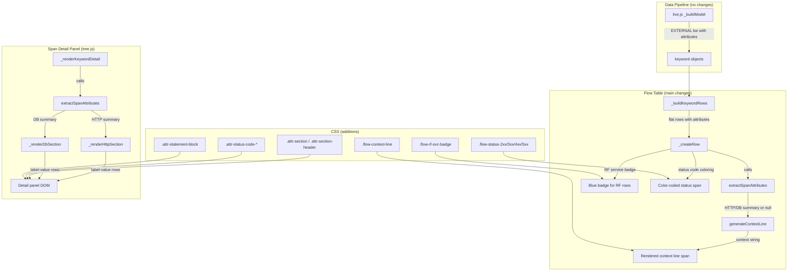

# Design Document: Span Attribute Enrichment

## Overview

This feature enriches the flow table and span detail panel with semantic OpenTelemetry attributes extracted from EXTERNAL span attribute maps. Currently, EXTERNAL spans show a span name and a purple service badge, but none of the rich semantic attributes — HTTP method, route, status code, database system, operation, table — are surfaced. This feature adds:

1. **Attribute extraction** — Pure functions that read an EXTERNAL span's `attributes` object and return structured HTTP or DB summaries.
2. **Context line generation** — Short inline summaries (e.g., `PUT /v1/runners → 204 @ essvt:8080` or `postgresql SELECT runner_t @ postgres:5432`) rendered after the span name in the flow table.
3. **Span detail panel sections** — Structured "HTTP" and "Database" sections in `tree.js` `_renderKeywordDetail` showing all recognized semantic attributes.
4. **Status code visual indicators** — Color-coded HTTP status codes (green 2xx, yellow 3xx/4xx, red 5xx) in both flow table and detail panel.
5. **Universal service badge** — Blue RF service badge on non-EXTERNAL keyword rows (from `window.__RF_SERVICE_NAME__`), complementing the existing purple EXTERNAL service badge.
6. **CSS theming** — All new UI elements readable in both light and dark themes.

### Key Design Decisions

1. **Pure extraction functions in flow-table.js** — `extractSpanAttributes(attrs)` and `generateContextLine(summary)` are pure functions added to `flow-table.js`. They operate on the `attributes` object already propagated to row objects by `_buildKeywordRows`. No new JS files needed (architecture constraint from contribution guidelines).

2. **No data pipeline changes** — The `attributes` field is already propagated through `_buildModel` (live.js) → keyword objects → `_buildKeywordRows` (flow-table.js) → row objects. The extractors consume `row.attributes` at render time.

3. **Detail panel follows `_renderSourceSection` pattern** — New `_renderHttpSection` and `_renderDbSection` functions in `tree.js` follow the same pattern as `_renderSourceSection`: a wrapper div with a section header, then `_addDetailRow` calls for each non-empty field.

4. **RF service badge is conditional** — Only rendered when `window.__RF_SERVICE_NAME__` is non-empty. Uses a distinct blue color (`#1565c0` light / `#42a5f5` dark) to differentiate from the purple EXTERNAL badge.

5. **Status code colors use inline styles** — The status code portion of the context line is wrapped in a `<span>` with a CSS class (`flow-status-2xx`, `flow-status-3xx`, etc.) rather than inline styles, keeping theming in CSS.

6. **Python mirror functions for property testing** — Following the established pattern from `test_sut_span_rendering.py`, the attribute extractor and context line generator are mirrored as Python functions and tested with Hypothesis.

## Architecture



### Change Scope Summary

| File | Change | Size |
|---|---|---|
| `flow-table.js` | Add `extractSpanAttributes`, `generateContextLine`. In `_createRow`: render context line after span name, render RF service badge for non-EXTERNAL rows, color-code status codes. | ~80 lines |
| `tree.js` | Add `_renderHttpSection`, `_renderDbSection`. In `_renderKeywordDetail`: call extractors and render attribute sections. | ~60 lines |
| `style.css` | Add `.flow-context-line`, `.flow-rf-svc-badge`, `.flow-status-2xx/3xx/4xx/5xx`, `.attr-section`, `.attr-section-header`, `.attr-statement-block`, `.attr-status-code-*` with light/dark variants. | ~80 lines |
| `live.js` | No changes. | 0 |

## Components and Interfaces

### `extractSpanAttributes(attrs)` — Pure Attribute Extractor

Location: `src/rf_trace_viewer/viewer/flow-table.js` (module-level function)

Takes a raw attributes object (the flat key-value map from a span). Returns one of:
- `{ type: 'http', method, route, path, status_code, server_address, server_port, client_address, url_scheme, user_agent }` — when `http.request.method` is present
- `{ type: 'db', system, operation, name, table, statement, connection_string, user, server_address, server_port }` — when `db.system` is present
- `null` — when neither key is present

Rules:
- Fields with empty/null/undefined values are omitted from the result object.
- `status_code` and `server_port` are coerced to integers via `parseInt(..., 10) || 0`; if 0, omitted.
- HTTP detection takes priority: if both `http.request.method` and `db.system` are present, returns HTTP summary.

```javascript
function extractSpanAttributes(attrs) {
  if (!attrs) return null;
  if (attrs['http.request.method']) {
    var result = { type: 'http' };
    var method = attrs['http.request.method'];
    if (method) result.method = method;
    var route = attrs['http.route'];
    if (route) result.route = route;
    var path = attrs['url.path'];
    if (path) result.path = path;
    var sc = parseInt(attrs['http.response.status_code'], 10) || 0;
    if (sc) result.status_code = sc;
    var sa = attrs['server.address'];
    if (sa) result.server_address = sa;
    var sp = parseInt(attrs['server.port'], 10) || 0;
    if (sp) result.server_port = sp;
    var ca = attrs['client.address'];
    if (ca) result.client_address = ca;
    var scheme = attrs['url.scheme'];
    if (scheme) result.url_scheme = scheme;
    var ua = attrs['user_agent.original'];
    if (ua) result.user_agent = ua;
    return result;
  }
  if (attrs['db.system']) {
    var result = { type: 'db' };
    var sys = attrs['db.system'];
    if (sys) result.system = sys;
    var op = attrs['db.operation'];
    if (op) result.operation = op;
    var name = attrs['db.name'];
    if (name) result.name = name;
    var tbl = attrs['db.sql.table'];
    if (tbl) result.table = tbl;
    var stmt = attrs['db.statement'];
    if (stmt) result.statement = stmt;
    var cs = attrs['db.connection_string'];
    if (cs) result.connection_string = cs;
    var usr = attrs['db.user'];
    if (usr) result.user = usr;
    var sa = attrs['server.address'];
    if (sa) result.server_address = sa;
    var sp = parseInt(attrs['server.port'], 10) || 0;
    if (sp) result.server_port = sp;
    return result;
  }
  return null;
}
```

### `generateContextLine(summary)` — Pure Context Line Generator

Location: `src/rf_trace_viewer/viewer/flow-table.js` (module-level function)

Takes an attribute summary (from `extractSpanAttributes`) and returns a string.

HTTP format: `{method} {route_or_path} → {status_code} @ {server_address}:{server_port}`
- Uses `route` if available, falls back to `path`.
- Omits URL component if neither `route` nor `path` is present.
- Omits `→ {status_code}` if no status code.
- Omits `@ {server}` suffix if no `server_address`.

DB format: `{system} {operation} {table} @ {server_address}:{server_port}`
- Omits any component that is absent.
- Omits `@ {server}` suffix if no `server_address`.

Returns `''` if summary is null.

```javascript
function generateContextLine(summary) {
  if (!summary) return '';
  if (summary.type === 'http') {
    var parts = [];
    if (summary.method) parts.push(summary.method);
    var url = summary.route || summary.path || '';
    if (url) parts.push(url);
    if (summary.status_code) parts.push('→ ' + summary.status_code);
    var line = parts.join(' ');
    if (summary.server_address) {
      line += ' @ ' + summary.server_address;
      if (summary.server_port) line += ':' + summary.server_port;
    }
    return line;
  }
  if (summary.type === 'db') {
    var parts = [];
    if (summary.system) parts.push(summary.system);
    if (summary.operation) parts.push(summary.operation);
    if (summary.table) parts.push(summary.table);
    var line = parts.join(' ');
    if (summary.server_address) {
      line += ' @ ' + summary.server_address;
      if (summary.server_port) line += ':' + summary.server_port;
    }
    return line;
  }
  return '';
}
```

### `_createRow` Changes — Context Line & RF Service Badge

Location: `src/rf_trace_viewer/viewer/flow-table.js`

#### 1. RF Service Badge (before type badge, for non-EXTERNAL rows)

When `kwTypeUpper !== 'EXTERNAL'` and `window.__RF_SERVICE_NAME__` is non-empty, render a blue service badge before the existing type badge:

```javascript
var rfSvcName = window.__RF_SERVICE_NAME__ || '';
if (kwTypeUpper !== 'EXTERNAL' && rfSvcName) {
  var rfBadge = document.createElement('span');
  rfBadge.className = 'flow-rf-svc-badge';
  rfBadge.textContent = rfSvcName;
  rfBadge.title = 'RF Service: ' + rfSvcName;
  tdKw.appendChild(rfBadge);
}
```

#### 2. Context Line (after span name, for EXTERNAL rows)

After the name span and source inline, before args:

```javascript
if (kwTypeUpper === 'EXTERNAL' && row.attributes) {
  var attrSummary = extractSpanAttributes(row.attributes);
  var ctxLine = generateContextLine(attrSummary);
  if (ctxLine) {
    var ctxDisplay = ctxLine.length > 80 ? ctxLine.substring(0, 77) + '...' : ctxLine;
    var ctxSpan = document.createElement('span');
    ctxSpan.className = 'flow-context-line';
    ctxSpan.title = ctxLine;
    // Render with color-coded status code if HTTP
    if (attrSummary && attrSummary.type === 'http' && attrSummary.status_code) {
      var sc = attrSummary.status_code;
      var scClass = 'flow-status-' + (sc < 300 ? '2xx' : sc < 400 ? '3xx' : sc < 500 ? '4xx' : '5xx');
      // Split context line around the status code to wrap it in a colored span
      var scStr = String(sc);
      var scIdx = ctxDisplay.indexOf('→ ' + scStr);
      if (scIdx >= 0) {
        ctxSpan.appendChild(document.createTextNode(ctxDisplay.substring(0, scIdx + 2)));
        var scSpan = document.createElement('span');
        scSpan.className = scClass;
        scSpan.textContent = scStr;
        ctxSpan.appendChild(scSpan);
        ctxSpan.appendChild(document.createTextNode(ctxDisplay.substring(scIdx + 2 + scStr.length)));
      } else {
        ctxSpan.textContent = ctxDisplay;
      }
    } else {
      ctxSpan.textContent = ctxDisplay;
    }
    tdKw.appendChild(ctxSpan);
  }
}
```

### `_renderKeywordDetail` Changes — Attribute Sections

Location: `src/rf_trace_viewer/viewer/tree.js`

After the existing `_renderSourceSection` call, add attribute section rendering:

```javascript
if (data.attributes) {
  var attrSummary = extractSpanAttributes(data.attributes);
  if (attrSummary && attrSummary.type === 'http') {
    _renderHttpSection(panel, attrSummary);
  } else if (attrSummary && attrSummary.type === 'db') {
    _renderDbSection(panel, attrSummary);
  }
}
```

Note: `extractSpanAttributes` is defined in `flow-table.js` which loads before `tree.js`. Since both are IIFEs in the same page, the function needs to be exposed. The simplest approach: define `extractSpanAttributes` and `generateContextLine` as properties on `window` (e.g., `window.extractSpanAttributes = extractSpanAttributes;`) at the end of the flow-table.js IIFE, or move them to a shared scope. Given the project's ES5 IIFE pattern, exposing on `window` is the pragmatic choice.

### `_renderHttpSection(panel, summary)` — New Function

Location: `src/rf_trace_viewer/viewer/tree.js`

```javascript
function _renderHttpSection(panel, summary) {
  var wrap = document.createElement('div');
  wrap.className = 'attr-section';
  var header = document.createElement('div');
  header.className = 'attr-section-header';
  header.textContent = 'HTTP';
  wrap.appendChild(header);

  if (summary.method) _addDetailRow(wrap, 'Method', summary.method);
  if (summary.route) _addDetailRow(wrap, 'Route', summary.route);
  if (summary.path) _addDetailRow(wrap, 'Path', summary.path);
  if (summary.status_code) {
    var scRow = document.createElement('div');
    scRow.className = 'detail-panel-row';
    var scLabel = document.createElement('span');
    scLabel.className = 'detail-label';
    scLabel.textContent = 'Status Code:';
    var scValue = document.createElement('span');
    var sc = summary.status_code;
    scValue.className = 'attr-status-code attr-status-code-' + (sc < 300 ? '2xx' : sc < 400 ? '3xx' : sc < 500 ? '4xx' : '5xx');
    scValue.textContent = String(sc);
    scRow.appendChild(scLabel);
    scRow.appendChild(scValue);
    wrap.appendChild(scRow);
  }
  if (summary.server_address) {
    var server = summary.server_address;
    if (summary.server_port) server += ':' + summary.server_port;
    _addDetailRow(wrap, 'Server', server);
  }
  if (summary.client_address) _addDetailRow(wrap, 'Client', summary.client_address);
  if (summary.url_scheme) _addDetailRow(wrap, 'Scheme', summary.url_scheme);
  if (summary.user_agent) _addDetailRow(wrap, 'User Agent', summary.user_agent);

  panel.appendChild(wrap);
}
```

### `_renderDbSection(panel, summary)` — New Function

Location: `src/rf_trace_viewer/viewer/tree.js`

```javascript
function _renderDbSection(panel, summary) {
  var wrap = document.createElement('div');
  wrap.className = 'attr-section';
  var header = document.createElement('div');
  header.className = 'attr-section-header';
  header.textContent = 'Database';
  wrap.appendChild(header);

  if (summary.system) _addDetailRow(wrap, 'System', summary.system);
  if (summary.operation) _addDetailRow(wrap, 'Operation', summary.operation);
  if (summary.name) _addDetailRow(wrap, 'Database', summary.name);
  if (summary.table) _addDetailRow(wrap, 'Table', summary.table);
  if (summary.statement) {
    var stmtRow = document.createElement('div');
    stmtRow.className = 'detail-panel-row';
    var stmtLabel = document.createElement('span');
    stmtLabel.className = 'detail-label';
    stmtLabel.textContent = 'Statement:';
    var stmtValue = document.createElement('pre');
    stmtValue.className = 'attr-statement-block';
    stmtValue.textContent = summary.statement;
    stmtRow.appendChild(stmtLabel);
    stmtRow.appendChild(stmtValue);
    wrap.appendChild(stmtRow);
  }
  if (summary.connection_string) _addDetailRow(wrap, 'Connection', summary.connection_string);
  if (summary.user) _addDetailRow(wrap, 'User', summary.user);
  if (summary.server_address) {
    var server = summary.server_address;
    if (summary.server_port) server += ':' + summary.server_port;
    _addDetailRow(wrap, 'Server', server);
  }

  panel.appendChild(wrap);
}
```

### CSS Additions

Location: `src/rf_trace_viewer/viewer/style.css`

```css
/* ── Span Attribute Enrichment ── */

/* Context line inline in flow table */
.rf-trace-viewer .flow-context-line {
  color: var(--text-secondary);
  font-size: 0.8em;
  margin-left: 8px;
  font-style: italic;
  opacity: 0.85;
  max-width: 400px;
  overflow: hidden;
  text-overflow: ellipsis;
  white-space: nowrap;
  display: inline-block;
  vertical-align: middle;
}

/* RF service badge (blue) for non-EXTERNAL rows */
.rf-trace-viewer .flow-rf-svc-badge {
  display: inline-block;
  font-size: 9px;
  padding: 1px 5px;
  border-radius: 3px;
  background: #1565c0;
  color: #fff;
  font-weight: 600;
  vertical-align: middle;
  max-width: 160px;
  overflow: hidden;
  text-overflow: ellipsis;
  white-space: nowrap;
  margin-right: 4px;
}

.rf-trace-viewer.theme-dark .flow-rf-svc-badge {
  background: #42a5f5;
  color: #1e1e1e;
}

/* HTTP status code colors in flow table context line */
.rf-trace-viewer .flow-status-2xx { color: #2e7d32; font-weight: 600; }
.rf-trace-viewer .flow-status-3xx { color: #888888; }
.rf-trace-viewer .flow-status-4xx { color: #f9a825; font-weight: 600; }
.rf-trace-viewer .flow-status-5xx { color: #c62828; font-weight: 600; }

.rf-trace-viewer.theme-dark .flow-status-2xx { color: #66bb6a; }
.rf-trace-viewer.theme-dark .flow-status-3xx { color: #9e9e9e; }
.rf-trace-viewer.theme-dark .flow-status-4xx { color: #ffca28; }
.rf-trace-viewer.theme-dark .flow-status-5xx { color: #ef5350; }

/* Attribute sections in span detail panel */
.rf-trace-viewer .attr-section {
  margin: 8px 0;
  padding: 6px 0;
  border-top: 1px solid var(--border-color);
}

.rf-trace-viewer .attr-section-header {
  font-size: 11px;
  font-weight: 600;
  text-transform: uppercase;
  color: var(--text-muted);
  margin-bottom: 4px;
  letter-spacing: 0.5px;
}

/* Status code colors in detail panel */
.rf-trace-viewer .attr-status-code {
  font-weight: 600;
  padding: 1px 6px;
  border-radius: 3px;
}

.rf-trace-viewer .attr-status-code-2xx { color: #2e7d32; background: #e8f5e9; }
.rf-trace-viewer .attr-status-code-3xx { color: #888888; background: #f5f5f5; }
.rf-trace-viewer .attr-status-code-4xx { color: #f57f17; background: #fff8e1; }
.rf-trace-viewer .attr-status-code-5xx { color: #c62828; background: #ffebee; }

.rf-trace-viewer.theme-dark .attr-status-code-2xx { color: #66bb6a; background: #1b3a1b; }
.rf-trace-viewer.theme-dark .attr-status-code-3xx { color: #9e9e9e; background: #2a2a2a; }
.rf-trace-viewer.theme-dark .attr-status-code-4xx { color: #ffca28; background: #3a351b; }
.rf-trace-viewer.theme-dark .attr-status-code-5xx { color: #ef5350; background: #3a1b1b; }

/* DB statement monospace block */
.rf-trace-viewer .attr-statement-block {
  font-family: monospace;
  font-size: 12px;
  white-space: pre-wrap;
  word-break: break-word;
  background: var(--bg-secondary);
  padding: 4px 8px;
  border-radius: 3px;
  margin: 2px 0;
  max-height: 120px;
  overflow-y: auto;
}
```


## Data Models

### HTTP Attribute Summary

Returned by `extractSpanAttributes` when `http.request.method` is present:

| Field | Type | Source Attribute | Notes |
|---|---|---|---|
| `type` | `string` | — | Always `'http'` |
| `method` | `string` | `http.request.method` | e.g., `GET`, `PUT`, `POST` |
| `route` | `string` | `http.route` | e.g., `/v1/runners/{runnerName}/heartbeat` |
| `path` | `string` | `url.path` | Fallback when route absent |
| `status_code` | `integer` | `http.response.status_code` | Parsed via `parseInt`, omitted if 0 |
| `server_address` | `string` | `server.address` | e.g., `essvt` |
| `server_port` | `integer` | `server.port` | Parsed via `parseInt`, omitted if 0 |
| `client_address` | `string` | `client.address` | |
| `url_scheme` | `string` | `url.scheme` | e.g., `http`, `https` |
| `user_agent` | `string` | `user_agent.original` | |

All fields except `type` are optional — only included when the source attribute is present and non-empty.

### DB Attribute Summary

Returned by `extractSpanAttributes` when `db.system` is present (and `http.request.method` is absent):

| Field | Type | Source Attribute | Notes |
|---|---|---|---|
| `type` | `string` | — | Always `'db'` |
| `system` | `string` | `db.system` | e.g., `postgresql`, `mysql` |
| `operation` | `string` | `db.operation` | e.g., `SELECT`, `INSERT` |
| `name` | `string` | `db.name` | Database name |
| `table` | `string` | `db.sql.table` | e.g., `runner_t` |
| `statement` | `string` | `db.statement` | Full SQL statement |
| `connection_string` | `string` | `db.connection_string` | |
| `user` | `string` | `db.user` | |
| `server_address` | `string` | `server.address` | e.g., `postgres` |
| `server_port` | `integer` | `server.port` | Parsed via `parseInt`, omitted if 0 |

All fields except `type` are optional.

### Context Line Format Examples

| Span Type | Attributes Present | Context Line |
|---|---|---|
| HTTP (full) | method, route, status_code, server_address, server_port | `PUT /v1/runners → 204 @ essvt:8080` |
| HTTP (path fallback) | method, path, status_code | `GET /api/health → 200` |
| HTTP (minimal) | method only | `POST` |
| DB (full) | system, operation, table, server_address, server_port | `postgresql SELECT runner_t @ postgres:5432` |
| DB (minimal) | system only | `postgresql` |
| Neither | no http/db attrs | `''` (empty, no element rendered) |

### Attribute-to-OTel Key Mapping

For reference, the complete mapping from OTel semantic convention keys to summary fields:

```
http.request.method      → summary.method
http.route               → summary.route
url.path                 → summary.path
http.response.status_code → summary.status_code (int)
server.address           → summary.server_address
server.port              → summary.server_port (int)
client.address           → summary.client_address
url.scheme               → summary.url_scheme
user_agent.original      → summary.user_agent
db.system                → summary.system
db.operation             → summary.operation
db.name                  → summary.name
db.sql.table             → summary.table
db.statement             → summary.statement
db.connection_string     → summary.connection_string
db.user                  → summary.user
```


## Correctness Properties

*A property is a characteristic or behavior that should hold true across all valid executions of a system — essentially, a formal statement about what the system should do. Properties serve as the bridge between human-readable specifications and machine-verifiable correctness guarantees.*

### Property 1: Attribute extraction correctness

*For any* attributes object, `extractSpanAttributes` shall return: an HTTP summary (with `type === 'http'` and correctly mapped fields) when `http.request.method` is present; a DB summary (with `type === 'db'` and correctly mapped fields) when `db.system` is present and `http.request.method` is absent; or `null` when neither key is present. In all cases, fields whose source attribute value is empty, null, or zero (for integer fields) shall be absent from the result.

**Validates: Requirements 1.1, 1.2, 1.3, 1.5**

### Property 2: HTTP context line format

*For any* HTTP attribute summary, `generateContextLine` shall produce a string where: the method appears first; the route appears next (or path if route is absent, or nothing if both are absent); `→ {status_code}` appears if status_code is present; and `@ {server_address}:{server_port}` is appended if server_address is present (port included only when non-zero). The route shall always be preferred over path when both are present.

**Validates: Requirements 2.1, 2.5, 5.1**

### Property 3: DB context line format

*For any* DB attribute summary, `generateContextLine` shall produce a string containing the present components (system, operation, table) in order separated by spaces, with `@ {server_address}` appended if server_address is present (port included only when non-zero). Components that are absent shall not appear in the output.

**Validates: Requirements 2.2, 5.2**

### Property 4: Extractor and generator idempotence

*For any* attributes object, calling `extractSpanAttributes` twice with the same input shall produce identical results. *For any* attribute summary, calling `generateContextLine` twice with the same input shall produce identical results.

**Validates: Requirements 1.4, 2.4, 7.1, 7.2**

### Property 5: Extract-generate pipeline stability

*For any* attributes object where `extractSpanAttributes` returns a non-null result, the pipeline `generateContextLine(extractSpanAttributes(attrs))` shall produce the same context line on every invocation with the same source attributes.

**Validates: Requirements 7.3**

### Property 6: Status code CSS class classification

*For any* integer HTTP status code, the CSS class shall be: `2xx` for codes 200–299, `3xx` for codes 300–399, `4xx` for codes 400–499, and `5xx` for codes 500–599. This classification shall be consistent between the flow table context line and the detail panel status code badge.

**Validates: Requirements 4.5, 6.1, 6.2, 6.3, 6.4**

### Property 7: Context line truncation

*For any* context line string, the displayed text shall be at most 80 characters. If the original string exceeds 80 characters, the displayed text shall be the first 77 characters followed by `...`. If the original string is 80 characters or fewer, the displayed text shall equal the original.

**Validates: Requirements 3.4**

## Error Handling

### Null/Missing Attributes

- `extractSpanAttributes(null)` returns `null`. The context line generator and detail panel rendering both check for null before proceeding.
- `extractSpanAttributes({})` returns `null` (no `http.request.method` or `db.system` key).
- Row objects with `attributes: null` (RF keywords, pre-feature EXTERNAL spans) skip all attribute enrichment code paths.

### Empty/Null Attribute Values

- When a recognized attribute key exists but its value is `''`, `null`, or `undefined`, the extractor omits that field from the summary. The truthiness check (`if (value)`) handles all three cases.
- Integer fields (`status_code`, `server_port`) use `parseInt(..., 10) || 0` — non-numeric strings, `null`, and `undefined` all resolve to 0, which is then omitted.

### Missing RF Service Name

- `window.__RF_SERVICE_NAME__` may be `undefined`, `null`, or `''` in environments where the RF service name isn't configured. The badge rendering checks `rfSvcName` for truthiness before creating the DOM element.

### Pre-Feature Trace Data

- Traces from before the sut-span-rendering feature may have EXTERNAL spans without `attributes` on the row object. The `if (row.attributes)` guard in `_createRow` prevents any attribute enrichment for these rows.
- The detail panel similarly checks `if (data.attributes)` before calling the extractor.

### Shared Function Access Between IIFEs

- `extractSpanAttributes` is defined in `flow-table.js` and needs to be called from `tree.js`. Since both are IIFEs, the function is exposed via `window.extractSpanAttributes`. If `flow-table.js` fails to load, `tree.js` checks `typeof window.extractSpanAttributes === 'function'` before calling it.

## Testing Strategy

### Property-Based Tests (Hypothesis)

All property tests use the project's Hypothesis profile system (`dev` for fast feedback, `ci` for thorough coverage). No hardcoded `@settings(max_examples=N)`.

The property-based testing library is **Hypothesis** (already used throughout the project).

Each property test must run a minimum of 100 iterations in CI mode (the `ci` profile is configured with `max_examples=200`).

Each property test must be tagged with a comment referencing the design property.

Each correctness property from the design maps to a single property-based test:

| Property | Test | Strategy |
|---|---|---|
| P1: Extraction correctness | `test_property_extraction_correctness` | Generate random attribute dicts with arbitrary subsets of HTTP keys (`http.request.method`, `http.route`, `url.path`, `http.response.status_code`, `server.address`, `server.port`, `client.address`, `url.scheme`, `user_agent.original`), DB keys (`db.system`, `db.operation`, `db.name`, `db.sql.table`, `db.statement`, `db.connection_string`, `db.user`, `server.address`, `server.port`), both, or neither. Verify return type, field presence/absence, and field values match the mapping rules. |
| P2: HTTP context line format | `test_property_http_context_line_format` | Generate random HTTP summaries with optional fields. Verify the output string contains method first, route (or path, or neither), optional `→ {status_code}`, optional `@ server:port`. Verify route is preferred over path when both present. |
| P3: DB context line format | `test_property_db_context_line_format` | Generate random DB summaries with optional fields. Verify the output string contains present components in order, with optional `@ server:port` suffix. |
| P4: Idempotence | `test_property_idempotence` | Generate random attribute dicts. Call `extractSpanAttributes` twice, verify identical results. Call `generateContextLine` twice on the same summary, verify identical results. |
| P5: Pipeline stability | `test_property_pipeline_stability` | Generate random attribute dicts where extraction returns non-null. Run the full pipeline twice from the same source attrs. Verify identical context lines. |
| P6: Status code classification | `test_property_status_code_classification` | Generate random integers in 100–599 range. Apply the classification function. Verify: 200–299 → `2xx`, 300–399 → `3xx`, 400–499 → `4xx`, 500–599 → `5xx`. |
| P7: Context line truncation | `test_property_context_line_truncation` | Generate random context line strings of varying lengths (0–200 chars). Apply truncation logic. Verify: strings ≤ 80 chars unchanged, strings > 80 chars truncated to 77 + `...`. |

### Python Mirror Functions

Following the established pattern from `test_sut_span_rendering.py`, the test file will contain Python mirror implementations of:

- `extract_span_attributes(attrs)` — mirrors `extractSpanAttributes` from flow-table.js
- `generate_context_line(summary)` — mirrors `generateContextLine` from flow-table.js
- `classify_status_code(code)` — mirrors the status code → CSS class logic
- `truncate_context_line(line)` — mirrors the 80-char truncation logic

### Hypothesis Strategies

New strategies for this feature:

- `http_attributes_strategy()` — generates attribute dicts with `http.request.method` and optional HTTP-related keys
- `db_attributes_strategy()` — generates attribute dicts with `db.system` and optional DB-related keys
- `generic_attributes_strategy()` — generates attribute dicts without `http.request.method` or `db.system`
- `any_span_attributes_strategy()` — one_of the above three
- `http_summary_strategy()` — generates HTTP summary dicts directly
- `db_summary_strategy()` — generates DB summary dicts directly

### Unit Tests

Unit tests cover specific examples and edge cases:

- `test_extract_http_full` — all HTTP fields present, verify complete summary
- `test_extract_db_full` — all DB fields present, verify complete summary
- `test_extract_null_attrs` — null input returns null
- `test_extract_empty_attrs` — empty dict returns null
- `test_extract_empty_values_omitted` — keys present with empty string values are omitted
- `test_extract_http_priority_over_db` — attrs with both `http.request.method` and `db.system` returns HTTP
- `test_context_line_http_with_route` — verify route used over path
- `test_context_line_http_with_path_fallback` — verify path used when no route
- `test_context_line_http_no_url` — verify method + status only when no route/path
- `test_context_line_db_minimal` — system only
- `test_context_line_null_returns_empty` — null summary returns empty string
- `test_context_line_server_suffix` — verify `@ server:port` appended
- `test_status_code_boundary_values` — 199, 200, 299, 300, 399, 400, 499, 500, 599
- `test_truncation_exactly_80` — 80-char string unchanged
- `test_truncation_81_chars` — 81-char string truncated to 77 + `...`

### Test File Location

`tests/unit/test_span_attribute_enrichment.py`

### Test Execution

```bash
make test-unit                                                    # Quick dev run
make dev-test-file FILE=tests/unit/test_span_attribute_enrichment.py  # Single file
make test-full                                                    # Full CI iterations
```
