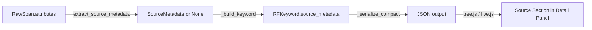

# Design Document: Span Source Metadata

## Overview

This feature extends the robotframework-trace-report data pipeline to detect, extract, store, and display optional backend source-location metadata on spans. Backend instrumentation may emit `app.source.class`, `app.source.method`, `app.source.file`, and `app.source.line` attributes on spans. This feature surfaces those attributes in the span detail panel as a read-only "Source" section without altering the Gantt/timeline visualization.

The change touches four layers of the pipeline:

1. **Python extraction** — a new `extract_source_metadata` helper in `rf_model.py`
2. **Data model** — a new `SourceMetadata` dataclass and an optional field on `RFKeyword`
3. **Serialization** — `_serialize_compact` naturally omits `None` fields; no special-casing needed
4. **JavaScript rendering** — a new `_renderSourceSection` in `tree.js` and equivalent logic in `live.js`

## Architecture



The data flows left-to-right through the existing pipeline. The only new code is the extraction helper, the dataclass, and the rendering function. No new files are created — all changes go into existing modules.

### Key Design Decisions

1. **Single helper function, not a class** — `extract_source_metadata` is a pure function that takes an attributes dict and returns `SourceMetadata | None`. No state, no side effects.

2. **Dataclass for SourceMetadata** — Using a `@dataclass` keeps it consistent with `RFKeyword`, `RFTest`, etc. and lets `_serialize_compact` handle it automatically.

3. **None omission via existing serializer** — `_serialize_compact` already skips fields whose value is `""`, `[]`, `{}`, or `0` (int). For `source_metadata`, the field will be `None` when absent. We need to add `None` to the skip conditions in `_serialize_compact` so the field is omitted from JSON when not present. This preserves backward compatibility — existing traces produce identical output.

4. **Reuse existing `data-field="source"` toggle** — The detail panel already has a "source" toggle pill that controls visibility of `data-field="source"` containers. The new Source_Section will be wrapped in a `data-field="source"` container, so the existing toggle controls it automatically.

5. **Derived fields computed at extraction time** — `display_location` and `display_symbol` are computed once in Python and stored in the dataclass, not recomputed in JavaScript. This keeps the JS rendering simple.

## Components and Interfaces

### SourceMetadata Dataclass

Location: `src/rf_trace_viewer/rf_model.py`

```python
@dataclass
class SourceMetadata:
    """Optional backend source-location metadata extracted from span attributes."""
    class_name: str = ""
    method_name: str = ""
    file_name: str = ""
    line_number: int = 0
    display_location: str = ""   # "{file_name}:{line_number}" when both present
    display_symbol: str = ""     # "{short_class}.{method_name}" when both present
```

All fields default to empty/zero. The dataclass is only instantiated when at least one `app.source.*` attribute is present on the span.

### extract_source_metadata Function

Location: `src/rf_trace_viewer/rf_model.py`

```python
def extract_source_metadata(attributes: dict[str, Any]) -> SourceMetadata | None:
    """Extract source-location metadata from span attributes.

    Looks for app.source.class, app.source.method, app.source.file,
    and app.source.line in the attributes dict. Returns None if none
    of the four keys are present.
    """
```

Behavior:
- Returns `None` if no `app.source.*` keys exist in the dict
- Extracts present keys into the corresponding dataclass fields
- Converts `app.source.line` to `int` regardless of whether the input is `str` or `int` (using `int()` with a try/except defaulting to 0)
- Computes `display_location` as `"{file_name}:{line_number}"` only when both `file_name` is non-empty and `line_number > 0`
- Computes `display_symbol` as `"{short_class}.{method_name}"` only when both `class_name` and `method_name` are non-empty, where `short_class` is `class_name.rsplit(".", 1)[-1]`

### RFKeyword Changes

Location: `src/rf_trace_viewer/rf_model.py`

Add one field to the existing `RFKeyword` dataclass:

```python
source_metadata: SourceMetadata | None = None
```

### _build_keyword Changes

Location: `src/rf_trace_viewer/rf_model.py`

Add one line to the existing `_build_keyword` function to call `extract_source_metadata`:

```python
def _build_keyword(node: SpanNode) -> RFKeyword:
    attrs = node.span.attributes
    children = [...]
    return RFKeyword(
        ...,
        library=str(attrs.get("rf.keyword.library", "")),
        source_metadata=extract_source_metadata(attrs),  # NEW
    )
```

### _serialize_compact Changes

Location: `src/rf_trace_viewer/generator.py`

The current skip condition in `_serialize_compact` handles `""`, `[]`, `{}`, and `0` (int). `None` values are currently NOT skipped. We need to add `None` to the skip condition so that `source_metadata=None` is omitted:

```python
if k not in _KEEP_FIELDS and (
    v is None or v == "" or v == [] or v == {} or (v == 0 and type(v) is int)
):
    continue
```

Adding `v is None` as the first check is safe because no existing dataclass field uses `None` as a meaningful value — all current optional-like fields use `""` or `0` as defaults. The `_KEEP_FIELDS` set (`children`, `keywords`, `tags`, `suites`, `events`) protects structural fields from being skipped.

### JavaScript: _renderSourceSection

Location: `src/rf_trace_viewer/viewer/tree.js`

A new function added after `_renderKeywordDetail`:

```javascript
function _renderSourceSection(panel, sourceMetadata) {
  var wrap = document.createElement('div');
  wrap.setAttribute('data-field', 'source');
  wrap.className = 'source-metadata-section';

  var header = document.createElement('div');
  header.className = 'source-section-header';
  header.textContent = 'Source';
  wrap.appendChild(header);

  if (sourceMetadata.class_name) {
    _addDetailRow(wrap, 'Class', sourceMetadata.class_name);
  }
  if (sourceMetadata.method_name) {
    _addDetailRow(wrap, 'Method', sourceMetadata.method_name);
  }
  if (sourceMetadata.file_name) {
    _addDetailRow(wrap, 'File', sourceMetadata.file_name);
  }
  if (sourceMetadata.line_number && sourceMetadata.line_number > 0) {
    _addDetailRow(wrap, 'Line', String(sourceMetadata.line_number));
  }
  if (sourceMetadata.display_location) {
    _addDetailRow(wrap, 'Location', sourceMetadata.display_location);
  }
  if (sourceMetadata.display_symbol) {
    _addDetailRow(wrap, 'Symbol', sourceMetadata.display_symbol);
  }

  panel.appendChild(wrap);
}
```

### _renderKeywordDetail Changes

Location: `src/rf_trace_viewer/viewer/tree.js`

Insert the Source_Section call after the existing `lineno`/source block and before `_addCompactInfoBar`:

```javascript
// Existing source line block...
if (data.lineno && data.lineno > 0) { ... }

// NEW: Source metadata section
if (data.source_metadata) {
  _renderSourceSection(panel, data.source_metadata);
}

_addCompactInfoBar(panel, data);
```

### Live Mode Changes

Location: `src/rf_trace_viewer/viewer/live.js`

In the `buildKeywords` inner function, after building the `kw` object, add source metadata extraction:

```javascript
var kw = {
  name: ca['rf.keyword.name'] || child.name || '',
  // ... existing fields ...
  children: buildKeywords(child.span_id)
};

// Extract source metadata if present
var srcClass = ca['app.source.class'] || '';
var srcMethod = ca['app.source.method'] || '';
var srcFile = ca['app.source.file'] || '';
var srcLine = parseInt(ca['app.source.line'] || '0', 10) || 0;
if (srcClass || srcMethod || srcFile || srcLine > 0) {
  var shortClass = srcClass.indexOf('.') >= 0
    ? srcClass.substring(srcClass.lastIndexOf('.') + 1) : srcClass;
  kw.source_metadata = {
    class_name: srcClass,
    method_name: srcMethod,
    file_name: srcFile,
    line_number: srcLine,
    display_location: (srcFile && srcLine > 0) ? srcFile + ':' + srcLine : '',
    display_symbol: (srcClass && srcMethod) ? shortClass + '.' + srcMethod : ''
  };
}
```

The same pattern applies to the suite-level keyword builder block in `buildSuite`.

### CSS Additions

Location: `src/rf_trace_viewer/viewer/style.css`

```css
.source-metadata-section {
  margin-top: 8px;
  padding-top: 6px;
  border-top: 1px solid var(--border-color, #e0e0e0);
  opacity: 0.85;
}
.source-section-header {
  font-size: 0.8em;
  font-weight: 600;
  text-transform: uppercase;
  letter-spacing: 0.05em;
  color: var(--text-secondary, #666);
  margin-bottom: 4px;
}
```

The `opacity: 0.85` and secondary text color ensure the section is visually subordinate to the main detail content.

## Data Models

### SourceMetadata

| Field | Type | Default | Description |
|---|---|---|---|
| `class_name` | `str` | `""` | Full class name from `app.source.class` |
| `method_name` | `str` | `""` | Method name from `app.source.method` |
| `file_name` | `str` | `""` | File name from `app.source.file` |
| `line_number` | `int` | `0` | Line number from `app.source.line` (coerced to int) |
| `display_location` | `str` | `""` | Computed `"{file}:{line}"` or `""` |
| `display_symbol` | `str` | `""` | Computed `"{shortClass}.{method}"` or `""` |

### RFKeyword (modified)

New field added:

| Field | Type | Default | Description |
|---|---|---|---|
| `source_metadata` | `SourceMetadata \| None` | `None` | Source location metadata, or None if no `app.source.*` attributes present |

### Serialized JSON Shape (when present)

```json
{
  "name": "Create Order",
  "keyword_type": "KEYWORD",
  "source_metadata": {
    "class_name": "com.example.OrderService",
    "method_name": "createOrder",
    "file_name": "OrderService.java",
    "line_number": 142,
    "display_location": "OrderService.java:142",
    "display_symbol": "OrderService.createOrder"
  }
}
```

When `source_metadata` is `None`, the key is omitted entirely from the JSON.


## Correctness Properties

*A property is a characteristic or behavior that should hold true across all valid executions of a system — essentially, a formal statement about what the system should do. Properties serve as the bridge between human-readable specifications and machine-verifiable correctness guarantees.*

### Property 1: Source metadata extraction correctness

*For any* attributes dict containing an arbitrary subset of the four `app.source.*` keys (with arbitrary string values for class/method/file and string-or-int values for line), `extract_source_metadata` shall return a `SourceMetadata` object where each present attribute maps to its corresponding field, and each absent attribute's field has its default value (`""` for strings, `0` for line_number). When no `app.source.*` keys are present, the function shall return `None`.

**Validates: Requirements 1.1, 1.4, 1.5**

### Property 2: Line number coercion

*For any* `app.source.line` value that is either a valid integer or a string representation of a valid integer, the extracted `line_number` field shall be an `int` equal to the numeric value of the input.

**Validates: Requirements 1.2, 1.3**

### Property 3: Display_Location derivation

*For any* `SourceMetadata` produced by `extract_source_metadata`, `display_location` equals `"{file_name}:{line_number}"` if and only if `file_name` is non-empty and `line_number > 0`; otherwise `display_location` is `""`.

**Validates: Requirements 2.1, 2.2**

### Property 4: Display_Symbol derivation

*For any* `SourceMetadata` produced by `extract_source_metadata`, `display_symbol` equals `"{short_class}.{method_name}"` (where `short_class` is the last dot-segment of `class_name`) if and only if both `class_name` and `method_name` are non-empty; otherwise `display_symbol` is `""`.

**Validates: Requirements 2.3, 2.4**

### Property 5: Pipeline passthrough

*For any* keyword span built via `_build_keyword`, the resulting `RFKeyword.source_metadata` is non-`None` if and only if the span's attributes contain at least one `app.source.*` key, and when non-`None`, the metadata fields match the values returned by `extract_source_metadata` on the same attributes.

**Validates: Requirements 3.2, 3.3**

### Property 6: Serialization symmetry

*For any* `RFKeyword` instance, `_serialize_compact` includes the `"source_metadata"` key in its output if and only if `source_metadata` is not `None`. When `source_metadata` is `None`, the serialized dict is identical to what would be produced by an `RFKeyword` without the field at all.

**Validates: Requirements 3.4, 3.5, 5.1, 5.3**

### Property 7: Source metadata round-trip

*For any* valid `SourceMetadata` object, serializing it via `_serialize_compact` and then reconstructing a `SourceMetadata` from the resulting dict shall produce an object equal to the original.

**Validates: Requirements 7.8**

## Error Handling

### Python Layer

- **Invalid `app.source.line` values**: If `app.source.line` is a string that cannot be parsed as an integer (e.g., `"abc"`), `extract_source_metadata` catches the `ValueError` from `int()` and defaults `line_number` to `0`. This prevents a single malformed span from crashing the entire report generation.
- **Missing attributes**: The function uses `dict.get()` with defaults, so missing keys never raise `KeyError`.
- **Non-string attribute values**: If `app.source.class` etc. are non-string types (e.g., int from a misconfigured backend), `str()` coercion is applied to ensure the dataclass fields are always strings.

### JavaScript Layer

- **Missing `source_metadata` key**: The rendering code checks `if (data.source_metadata)` before calling `_renderSourceSection`, so keywords without the field render normally.
- **Partial metadata in live mode**: `parseInt(...) || 0` handles non-numeric line values gracefully. Empty strings for class/method/file are falsy and skip rendering.

### Backward Compatibility

- Traces generated before this feature have no `source_metadata` key in their JSON. The JS viewer simply doesn't render the Source_Section — no errors, no visual changes.
- The `_serialize_compact` change (adding `v is None` to the skip condition) is safe because no existing field uses `None` as a meaningful value. All current fields default to `""`, `0`, `[]`, or `{}`.

## Testing Strategy

### Property-Based Tests (Hypothesis)

All property tests use the project's Hypothesis profile system (`dev` for fast feedback, `ci` for thorough coverage). No hardcoded `@settings(max_examples=N)`.

The property-based testing library is **Hypothesis** (already used throughout the project in `tests/conftest.py`).

Each property test must run a minimum of 100 iterations in CI mode (the `ci` profile is configured with `max_examples=200`).

Each property test must be tagged with a comment referencing the design property:

```python
# Feature: span-source-metadata, Property 1: Source metadata extraction correctness
```

Each correctness property from the design maps to a single property-based test:

| Property | Test | Strategy |
|---|---|---|
| P1: Extraction correctness | `test_property_extraction_correctness` | Generate random subsets of `app.source.*` attributes, call `extract_source_metadata`, verify field mapping and None return |
| P2: Line number coercion | `test_property_line_number_coercion` | Generate `app.source.line` as `st.one_of(st.integers(), st.from_regex(r"^[0-9]+$"))`, verify `line_number` is always `int` |
| P3: Display_Location derivation | `test_property_display_location` | Generate random file names and line numbers, verify format rule |
| P4: Display_Symbol derivation | `test_property_display_symbol` | Generate random class names (with dots) and method names, verify short-class extraction and format |
| P5: Pipeline passthrough | `test_property_pipeline_passthrough` | Generate keyword spans with/without `app.source.*` attrs via `rf_keyword_span` strategy, build tree, verify `source_metadata` presence |
| P6: Serialization symmetry | `test_property_serialization_symmetry` | Generate `RFKeyword` instances with and without `source_metadata`, serialize, verify key presence/absence |
| P7: Round-trip | `test_property_source_metadata_roundtrip` | Generate `SourceMetadata` instances, serialize via `_serialize_compact`, reconstruct, verify equality |

### Unit Tests

Unit tests cover specific examples and edge cases not suited to property-based testing:

- `test_extract_all_four_attributes` — all four `app.source.*` keys present with typical values
- `test_extract_no_source_attributes` — attributes dict with only `rf.*` keys, returns `None`
- `test_extract_partial_class_only` — only `app.source.class` present
- `test_line_string_to_int` — `app.source.line` as `"142"` → `line_number=142`
- `test_line_invalid_string` — `app.source.line` as `"abc"` → `line_number=0`
- `test_display_location_both_present` — file + line → `"OrderService.java:142"`
- `test_display_location_file_only` — file without line → `""`
- `test_display_symbol_dotted_class` — `"com.example.OrderService"` + `"createOrder"` → `"OrderService.createOrder"`
- `test_display_symbol_no_dots` — `"OrderService"` + `"createOrder"` → `"OrderService.createOrder"`
- `test_backward_compat_existing_fixture` — parse `simple_trace.json`, serialize, verify no `source_metadata` keys in output

### Test File Location

All tests go in `tests/unit/test_source_metadata.py` (new file) for both property and unit tests.

### CHANGELOG Update

Add to `CHANGELOG.md` under `[Unreleased] > Added`:

```markdown
- Source metadata display: optional `app.source.class`, `app.source.method`, `app.source.file`, and `app.source.line` span attributes are now shown in the detail panel "Source" section when present. This is metadata display support only — no changes to the Gantt/timeline visualization.
```
