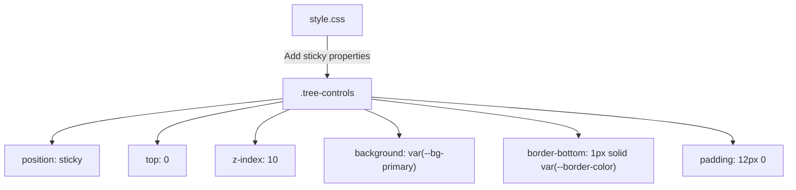

# Design Document: Sticky Tree Controls

## Overview

This feature makes the `.tree-controls` div (containing "Expand All", "Collapse All", and "Failures Only" buttons) stick to the top of the `.panel-tree` scroll container as the user scrolls through the tree view. The implementation follows the exact same CSS pattern already established by the Gantt chart's `.timeline-sticky-header`, which uses `position: sticky; top: 0` with a solid background, z-index layering, and a bottom border separator.

The change is purely CSS — no JavaScript logic changes are needed. The tree controls div already exists as the first child of `.panel-tree` in both standard and virtual scroll rendering modes. Adding sticky positioning CSS properties to `.tree-controls` is sufficient.

## Architecture

### Current DOM Structure

Both rendering paths (standard and virtual) produce the same DOM hierarchy:

```
.panel-tree (overflow-y: auto — the scroll container)
├── .tree-controls (Expand All | Collapse All | Failures Only)
└── .tree-root (tree nodes)
```

`position: sticky` works when the sticky element is a direct child of the scroll container. Since `.tree-controls` is already a direct child of `.panel-tree`, no DOM restructuring is needed.

### Reference Pattern: Gantt Sticky Header

The Gantt chart uses this pattern in `style.css`:

```css
.rf-trace-viewer .timeline-sticky-header {
  position: sticky;
  top: 0;
  z-index: 10;
  background: var(--bg-secondary);
  border-bottom: 1px solid var(--border-color);
}
```

The tree controls will adopt the same properties, adapted to use `var(--bg-primary)` since `.panel-tree` has a `--bg-primary` background (unlike the timeline section which uses `--bg-secondary`).

### Change Scope



Only `style.css` needs modification. No changes to `tree.js`, `app.js`, or any other file.

## Components and Interfaces

### Modified Component: `.tree-controls` CSS Rule

**File:** `src/rf_trace_viewer/viewer/style.css`

**Current rule:**
```css
.rf-trace-viewer .tree-controls {
  display: flex;
  gap: 8px;
  margin-bottom: 12px;
}
```

**Updated rule:**
```css
.rf-trace-viewer .tree-controls {
  display: flex;
  gap: 8px;
  position: sticky;
  top: 0;
  z-index: 10;
  background: var(--bg-primary);
  border-bottom: 1px solid var(--border-color);
  padding: 12px 0;
  margin-bottom: 0;
}
```

### Design Decisions

| Decision | Choice | Rationale |
|---|---|---|
| Background color | `var(--bg-primary)` | `.panel-tree` uses `--bg-primary`; the controls must match to hide content scrolling beneath |
| z-index | `10` | Same value used by `.timeline-sticky-header` — consistent layering |
| `margin-bottom` → `padding` | Replace `margin-bottom: 12px` with `padding: 12px 0` | Margins on sticky elements can cause visual gaps; padding keeps the spacing while the background covers the full area |
| Border | `1px solid var(--border-color)` | Matches the Gantt zoom bar separator pattern |
| No JS changes | CSS-only | The DOM structure already supports sticky positioning; no restructuring needed |

### Rendering Mode Compatibility

- **Standard scroll mode** (`_renderTreeWithFilter`): Creates `.tree-controls` as first child of `container` (which is `.panel-tree`). Sticky works directly.
- **Virtual scroll mode** (`_renderTreeVirtual`): Also creates `.tree-controls` as first child of `container` (`.panel-tree`). The virtual scroll viewport (`.tree-virtual-scroll`) is a sibling, not a wrapper. Sticky works directly.

Both modes share the same `.tree-controls` class, so a single CSS change covers both.

## Data Models

No data model changes are required. This feature is a pure CSS presentation change. The tree controls DOM structure, event handlers, and state management remain unchanged.


## Correctness Properties

*A property is a characteristic or behavior that should hold true across all valid executions of a system — essentially, a formal statement about what the system should do. Properties serve as the bridge between human-readable specifications and machine-verifiable correctness guarantees.*

This feature is a pure CSS change with no algorithmic logic, data transformations, or input-dependent behavior. All acceptance criteria describe specific CSS property values or specific UI interactions — they are example-based checks, not universally quantified properties over a range of inputs.

After prework analysis and reflection:

- Requirements 1.1–1.4 verify specific CSS property values (`position: sticky`, `top: 0`, `z-index: 10`, `background`, `border-bottom`). These are fixed values, not properties over generated inputs.
- Requirements 2.1–2.2 verify the same CSS properties exist in two specific rendering modes. No random input generation applies.
- Requirement 3.1 is redundant with 1.1–1.4 (same CSS checks).
- Requirement 3.2 checks theme-specific CSS variable resolution — a specific example per theme.
- Requirements 4.1–4.4 verify that existing button/click handlers still work — specific interaction examples.

No testable properties exist for this feature. All validation is through example-based tests (specific CSS assertions and specific UI interaction checks).

## Error Handling

This feature introduces no new error conditions. The change is purely additive CSS properties on an existing element. Failure modes are limited to:

1. **CSS not applied**: If the stylesheet fails to load, the entire viewer would be unstyled — not specific to this feature.
2. **Sticky not supported**: `position: sticky` is supported in all modern browsers (Chrome 56+, Firefox 59+, Safari 13+, Edge 16+). No fallback is needed for the target audience.
3. **z-index conflicts**: The chosen `z-index: 10` matches the Gantt header and is sufficient since tree content has no explicit z-index.

No JavaScript error handling changes are needed.

## Testing Strategy

### Testing Approach

Since this is a CSS-only change, testing focuses on browser-level verification through the existing Robot Framework + Browser Library test infrastructure. No unit tests or property-based tests are applicable — there is no Python or JavaScript logic change to test.

### Browser Tests (Robot Framework)

All tests run in Docker containers per the project's testing strategy.

**Test 1: Sticky CSS properties are applied (both modes)**
- Load a report with a small tree (standard scroll mode)
- Verify `.tree-controls` has `position: sticky`, `top: 0px`, `z-index: 10`, non-transparent background, and a bottom border
- Load a report with a large tree (virtual scroll mode)
- Verify the same CSS properties

*Validates: Requirements 1.1, 1.2, 1.3, 1.4, 2.1, 2.2, 3.1*

**Test 2: Controls remain visible after scrolling**
- Load a report with enough tree nodes to scroll
- Scroll the `.panel-tree` down
- Verify `.tree-controls` is still visible in the viewport (bounding rect top >= panel top)

*Validates: Requirements 1.1, 2.1, 2.2*

**Test 3: Theme compatibility**
- Load a report in light theme, verify `.tree-controls` background matches `.panel-tree` background
- Toggle to dark theme, verify backgrounds still match

*Validates: Requirements 3.2*

**Test 4: Button functionality while sticky**
- Scroll down so controls are in sticky position
- Click "Expand All" — verify tree nodes expand
- Click "Collapse All" — verify tree nodes collapse
- Click "Failures Only" — verify filter activates

*Validates: Requirements 4.1, 4.2, 4.3*

**Test 5: Tree node interaction not blocked**
- Scroll down so controls are sticky
- Click a tree node below the sticky controls
- Verify the detail panel updates

*Validates: Requirements 4.4*

### Property-Based Testing

No property-based tests are applicable for this feature. The change is purely CSS with no algorithmic logic, data transformations, or input-dependent behavior that would benefit from randomized input generation. All acceptance criteria map to specific CSS value assertions or specific UI interaction checks, which are best validated through example-based browser tests.

### Test Execution

All tests run via Docker:
```bash
make test-browser
```
Or directly:
```bash
docker compose -f tests/browser/docker-compose.yml up --build
```
