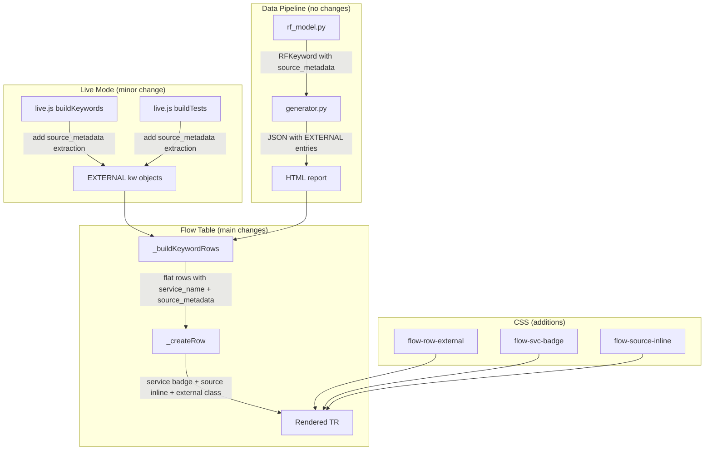

# Design Document: SUT Span Rendering in Flow Table

## Overview

This feature extends the execution flow table (`flow-table.js`) to render cross-service SUT spans (keyword_type `EXTERNAL`) as visually distinct, indented child rows beneath the RF keywords that triggered them. The tree view (`tree.js`) already renders EXTERNAL spans with purple borders, service name badges, and source metadata sections. This feature brings equivalent treatment to the flow table.

The change is primarily frontend (JavaScript + CSS). The data pipeline already produces EXTERNAL keyword entries with `service_name`, `attributes`, and recursive `children`. The one gap is that `live.js` does not yet extract `source_metadata` for EXTERNAL spans (it does for RF keywords). The flow table's `_buildKeywordRows` already traverses children recursively via a stack — EXTERNAL keywords are already in the tree, they just need distinct rendering in `_createRow`.

### Key Design Decisions

1. **No Python backend changes** — `rf_model.py` already has `SourceMetadata`, `extract_source_metadata()`, and the `source_metadata` field on `RFKeyword`. The static report pipeline already extracts source metadata for all keyword types including EXTERNAL. No changes needed.

2. **Minimal live.js change** — Add `source_metadata` extraction to the two EXTERNAL span construction blocks in `live.js` (inside `buildKeywords` and `buildTests`). The extraction pattern already exists for RF keywords — reuse the same `app.source.*` extraction logic.

3. **`_buildKeywordRows` propagation** — Add `service_name` and `source_metadata` fields to the flat row objects. The stack-based traversal already handles EXTERNAL children; we just need to copy the extra fields through.

4. **`_createRow` conditional rendering** — When `keyword_type === 'EXTERNAL'` and `service_name` is present, render a service name badge instead of the type badge. Append inline source info after the span name. Apply `flow-row-external` CSS class.

5. **CSS reuses existing color tokens** — The purple accent (`#7b1fa2` light / `#ce93d8` dark) already exists for `.kw-external` and `.svc-name-badge` in the tree view. The flow table styles mirror these values.

## Architecture



### Change Scope Summary

| File | Change | Size |
|---|---|---|
| `flow-table.js` | `_buildKeywordRows`: propagate `service_name`, `source_metadata`. `_createRow`: conditional service badge, source inline, external CSS class. Add `EXTERNAL` to `BADGE_LABELS`. | ~40 lines |
| `live.js` | Extract `source_metadata` for EXTERNAL spans in `buildKeywords` and `buildTests` blocks. | ~20 lines |
| `style.css` | Add `.flow-row-external`, `.flow-svc-badge`, `.flow-source-inline` with light/dark variants. | ~30 lines |
| `tree.js` | No changes. | 0 |
| `rf_model.py` | No changes. | 0 |

## Components and Interfaces

### `_buildKeywordRows` Changes

Location: `src/rf_trace_viewer/viewer/flow-table.js`

The existing function traverses `test.keywords` via a stack and builds flat row objects. Currently it copies: `source`, `lineno`, `name`, `args`, `status`, `duration`, `error`, `events`, `id`, `keyword_type`, `depth`, `parentId`, `hasChildren`.

Add three fields to the row object:

```javascript
rows.push({
  // ... existing fields ...
  service_name: kw.service_name || '',        // NEW
  source_metadata: kw.source_metadata || null, // NEW
  attributes: kw.attributes || null            // NEW (for future extensibility)
});
```

The `lineno` field already falls back to `kw.lineno || 0`. For EXTERNAL spans, `lineno` is typically 0 (they don't have RF line numbers). The `_createRow` function will use `source_metadata.line_number` for the Line column when available.

### `BADGE_LABELS` Addition

Add EXTERNAL to the badge map:

```javascript
var BADGE_LABELS = {
  // ... existing 18 entries ...
  EXTERNAL: 'EXT'   // NEW
};
```

This provides a fallback label when `service_name` is absent.

### `_createRow` Changes

Location: `src/rf_trace_viewer/viewer/flow-table.js`

The function creates a `<tr>` with four `<td>` cells: Keyword, Line, Status, Duration.

#### 1. Add `flow-row-external` CSS class

After the existing `flow-row-setup` / `flow-row-teardown` class additions:

```javascript
if (kwTypeUpper === 'EXTERNAL') tr.classList.add('flow-row-external');
```

#### 2. Conditional badge rendering

Replace the unconditional type badge block with:

```javascript
if (kwTypeUpper === 'EXTERNAL' && row.service_name) {
  // Service name badge (purple, matching tree view svc-name-badge)
  var svcBadge = document.createElement('span');
  svcBadge.className = 'flow-svc-badge';
  svcBadge.textContent = row.service_name;
  svcBadge.title = 'Service: ' + row.service_name;
  tdKw.appendChild(svcBadge);
} else {
  // Standard keyword type badge
  var badge = document.createElement('span');
  badge.className = 'flow-type-badge flow-type-' + kwType.toLowerCase();
  badge.textContent = BADGE_LABELS[kwType] || kwType;
  tdKw.appendChild(badge);
}
```

#### 3. Source metadata inline

After the name span, before the args span:

```javascript
// Inline source info for SUT spans
if (row.source_metadata) {
  var srcText = row.source_metadata.display_location
    || row.source_metadata.display_symbol
    || '';
  if (srcText) {
    var srcInline = document.createElement('span');
    srcInline.className = 'flow-source-inline';
    srcInline.textContent = srcText;
    srcInline.title = srcText;
    tdKw.appendChild(srcInline);
  }
}
```

#### 4. Line column override for SUT spans

Replace the line column logic:

```javascript
var tdL = document.createElement('td');
tdL.className = 'flow-col-line';
if (row.source_metadata && row.source_metadata.line_number > 0) {
  tdL.textContent = row.source_metadata.line_number;
} else {
  tdL.textContent = row.lineno > 0 ? row.lineno : '';
}
tr.appendChild(tdL);
```

### `_computeFailFocusedExpanded` — No Changes Needed

The existing function already traverses all children (including EXTERNAL) via a stack and expands FAIL-status nodes. EXTERNAL spans with `status === 'FAIL'` will be expanded automatically.

### `live.js` Changes

Location: `src/rf_trace_viewer/viewer/live.js`

Two EXTERNAL span construction blocks need `source_metadata` extraction. Both are in the cross-service span sections that build `keyword_type: 'EXTERNAL'` objects.

#### Block 1: Inside `buildKeywords` (after the RF keyword handling)

After the existing EXTERNAL span object is pushed to `result`:

```javascript
// Extract source metadata for EXTERNAL spans
var extSrcClass = ca['app.source.class'] || '';
var extSrcMethod = ca['app.source.method'] || '';
var extSrcFile = ca['app.source.file'] || '';
var extSrcLine = parseInt(ca['app.source.line'] || '0', 10) || 0;
if (extSrcClass || extSrcMethod || extSrcFile || extSrcLine > 0) {
  var extShortClass = extSrcClass.indexOf('.') >= 0
    ? extSrcClass.substring(extSrcClass.lastIndexOf('.') + 1) : extSrcClass;
  result[result.length - 1].source_metadata = {
    class_name: extSrcClass,
    method_name: extSrcMethod,
    file_name: extSrcFile,
    line_number: extSrcLine,
    display_location: (extSrcFile && extSrcLine > 0) ? extSrcFile + ':' + extSrcLine : '',
    display_symbol: (extSrcClass && extSrcMethod) ? extShortClass + '.' + extSrcMethod : ''
  };
}
```

#### Block 2: Inside `buildTests` (EXTERNAL spans as direct test children)

Same pattern applied to the `kws.push(...)` block for cross-service spans that are direct children of test spans.

### CSS Additions

Location: `src/rf_trace_viewer/viewer/style.css`

```css
/* ── EXTERNAL / SUT span row styling ── */
.rf-trace-viewer .flow-row-external {
  border-left: 3px solid #7b1fa2;
}

.rf-trace-viewer.theme-dark .flow-row-external {
  border-left-color: #ce93d8;
}

/* Service name badge in flow table (matches tree view svc-name-badge) */
.rf-trace-viewer .flow-svc-badge {
  display: inline-block;
  font-size: 9px;
  padding: 1px 5px;
  border-radius: 3px;
  background: #7b1fa2;
  color: #fff;
  font-weight: 600;
  vertical-align: middle;
  max-width: 160px;
  overflow: hidden;
  text-overflow: ellipsis;
  white-space: nowrap;
}

.rf-trace-viewer.theme-dark .flow-svc-badge {
  background: #9c27b0;
}

/* EXTERNAL type badge fallback (when no service_name) */
.rf-trace-viewer .flow-type-external {
  background: #f3e5f5;
  color: #7b1fa2;
}

.rf-trace-viewer.theme-dark .flow-type-external {
  background: #2a1530;
  color: #ce93d8;
}

/* Inline source metadata (file:line or class.method) */
.rf-trace-viewer .flow-source-inline {
  color: var(--text-muted);
  font-size: 0.8em;
  margin-left: 6px;
  font-style: italic;
  opacity: 0.8;
}
```

## Data Models

### Flow Table Row Object (extended)

The flat row objects produced by `_buildKeywordRows` gain three new fields:

| Field | Type | Default | Description |
|---|---|---|---|
| `service_name` | `string` | `''` | Service name for EXTERNAL spans, empty for RF keywords |
| `source_metadata` | `object \| null` | `null` | Source location metadata object, or null if absent |
| `attributes` | `object \| null` | `null` | Raw span attributes for future extensibility |

### source_metadata Object Shape (JS)

When present on an EXTERNAL span:

```json
{
  "class_name": "com.example.OrderService",
  "method_name": "createOrder",
  "file_name": "OrderService.java",
  "line_number": 142,
  "display_location": "OrderService.java:142",
  "display_symbol": "OrderService.createOrder"
}
```

### BADGE_LABELS Map (extended)

| Key | Label | Status |
|---|---|---|
| `EXTERNAL` | `EXT` | NEW — only used as fallback when `service_name` is absent |

All 18 existing entries remain unchanged.


## Correctness Properties

*A property is a characteristic or behavior that should hold true across all valid executions of a system — essentially, a formal statement about what the system should do. Properties serve as the bridge between human-readable specifications and machine-verifiable correctness guarantees.*

### Property 1: Row structure correctness for all keyword types

*For any* keyword tree (containing arbitrary mixes of RF keywords and EXTERNAL spans at arbitrary nesting depths), `_buildKeywordRows` shall produce exactly one row per keyword, where each row's `depth` equals its parent's depth + 1 (or 0 for root keywords), `parentId` equals its parent keyword's `id` (or null for root keywords), and `hasChildren` is true if and only if the keyword has a non-empty `children` array.

**Validates: Requirements 1.1, 1.2, 1.3, 6.1**

### Property 2: Sibling order preservation

*For any* keyword tree where children at each level are sorted by `start_time`, the rows produced by `_buildKeywordRows` shall maintain that ordering among siblings — that is, for any two rows with the same `parentId`, the one with the earlier `start_time` in the input shall appear first in the output array.

**Validates: Requirements 1.4**

### Property 3: Source metadata extraction for EXTERNAL spans

*For any* EXTERNAL span attributes dict, `source_metadata` shall be present on the resulting keyword object if and only if at least one `app.source.*` key exists in the attributes. When present, `class_name`, `method_name`, `file_name`, and `line_number` shall match the corresponding attribute values (with `line_number` coerced to int), `display_location` shall equal `"{file_name}:{line_number}"` when both are non-empty/non-zero (empty string otherwise), and `display_symbol` shall equal `"{shortClass}.{method_name}"` when both class and method are non-empty (empty string otherwise).

**Validates: Requirements 4.1, 4.2**

### Property 4: Source metadata propagation through row builder

*For any* keyword tree where some keywords have a `source_metadata` object and some do not, `_buildKeywordRows` shall produce rows where `source_metadata` is the same object reference (or equivalent value) as the input keyword's `source_metadata`, and rows for keywords without `source_metadata` shall have `source_metadata` equal to `null`.

**Validates: Requirements 4.3, 9.1**

### Property 5: Expand-all includes all row types equally

*For any* set of flow table rows containing both RF keyword and EXTERNAL span rows, the expand-all operation shall set `expandedIds[row.id] = true` for every row where `hasChildren` is true, regardless of `keyword_type`.

**Validates: Requirements 6.3**

### Property 6: Fail-focused expansion includes EXTERNAL FAIL spans

*For any* keyword tree containing EXTERNAL spans with `status === 'FAIL'` that have children, `_computeFailFocusedExpanded` shall include those EXTERNAL span IDs in the expanded set, identical to how it treats RF keyword FAIL spans.

**Validates: Requirements 6.5**

### Property 7: Backward compatibility defaults

*For any* keyword object that lacks `service_name` and `source_metadata` fields (simulating pre-feature trace data), `_buildKeywordRows` shall produce a row with `service_name === ''` and `source_metadata === null`, and the row's `name`, `keyword_type`, `depth`, `parentId`, `hasChildren`, `lineno`, `status`, `duration`, and `error` fields shall be identical to what the pre-feature implementation would produce.

**Validates: Requirements 8.1, 8.2**

### Property 8: BADGE_LABELS completeness

*For any* keyword type in the set of 19 types (the 18 existing RF types plus `EXTERNAL`), `BADGE_LABELS[type]` shall return a non-empty string. The 18 existing mappings shall remain unchanged from their current values.

**Validates: Requirements 8.3**

## Error Handling

### Missing Fields (Backward Compatibility)

- `service_name`: Defaults to `''` via `kw.service_name || ''`. RF keywords don't have this field — the fallback ensures no errors.
- `source_metadata`: Defaults to `null` via `kw.source_metadata || null`. The `_createRow` function checks `if (row.source_metadata)` before accessing any sub-fields.
- `attributes`: Defaults to `null` via `kw.attributes || null`. Not accessed by current rendering code — reserved for future use.

### Invalid Source Metadata

- `line_number` parsing: `parseInt(ca['app.source.line'] || '0', 10) || 0` handles non-numeric strings by falling back to 0.
- Missing `display_location` / `display_symbol`: The inline source rendering checks for truthy values before creating DOM elements. Empty strings are falsy — no element is created.

### EXTERNAL Spans Without service_name

- When `service_name` is empty/absent, `_createRow` falls back to the standard `BADGE_LABELS` path. The new `EXTERNAL: 'EXT'` entry ensures a meaningful badge label.

### Pre-Feature Trace Files

- Traces generated before this feature have no EXTERNAL keyword entries. The flow table renders identically to before — no new code paths are triggered for RF-only keyword trees.
- If a trace somehow has `keyword_type: 'EXTERNAL'` but no `service_name` (e.g., from a partial implementation), the fallback badge `EXT` is shown and no source inline is rendered.

## Testing Strategy

### Property-Based Tests (Hypothesis)

All property tests use the project's Hypothesis profile system (`dev` for fast feedback, `ci` for thorough coverage). No hardcoded `@settings(max_examples=N)`.

The property-based testing library is **Hypothesis** (already used throughout the project).

Each property test must run a minimum of 100 iterations in CI mode (the `ci` profile is configured with `max_examples=200`).

Each property test must be tagged with a comment referencing the design property:

```python
# Feature: sut-span-rendering, Property 1: Row structure correctness for all keyword types
```

Each correctness property from the design maps to a single property-based test:

| Property | Test | Strategy |
|---|---|---|
| P1: Row structure correctness | `test_property_row_structure_all_keyword_types` | Generate random keyword trees with mixed RF/EXTERNAL types at varying depths. Run `_buildKeywordRows` (or a Python equivalent). Verify each row has correct depth, parentId, hasChildren. |
| P2: Sibling order preservation | `test_property_sibling_order_preservation` | Generate keyword trees with children sorted by start_time. Verify output rows maintain sibling ordering (rows with same parentId appear in start_time order). |
| P3: Source metadata extraction | `test_property_source_metadata_extraction_external` | Generate random attribute dicts with arbitrary subsets of `app.source.*` keys. Apply the extraction logic. Verify source_metadata presence/absence and field correctness. |
| P4: Source metadata propagation | `test_property_source_metadata_propagation` | Generate keyword trees where some keywords have source_metadata and some don't. Run row builder. Verify source_metadata is preserved or null as appropriate. |
| P5: Expand-all includes all types | `test_property_expand_all_includes_all_types` | Generate row arrays with mixed keyword_type values and hasChildren flags. Simulate expand-all. Verify all hasChildren rows are in expandedIds. |
| P6: Fail-focused expansion includes EXTERNAL | `test_property_fail_focused_expansion_external` | Generate keyword trees with EXTERNAL FAIL spans that have children. Run `_computeFailFocusedExpanded`. Verify EXTERNAL FAIL IDs are in expanded set. |
| P7: Backward compatibility defaults | `test_property_backward_compat_defaults` | Generate keyword objects without service_name/source_metadata fields. Run row builder. Verify defaults and that other fields match. |
| P8: BADGE_LABELS completeness | `test_property_badge_labels_completeness` | Enumerate all 19 keyword types. Verify each has a non-empty BADGE_LABELS entry. Verify the 18 existing entries haven't changed. |

### Unit Tests

Unit tests cover specific examples and edge cases:

- `test_external_row_with_service_badge` — EXTERNAL keyword with service_name produces row with service_name field
- `test_external_row_without_service_name` — EXTERNAL keyword without service_name defaults to empty string
- `test_external_row_with_source_metadata` — EXTERNAL keyword with source_metadata propagates to row
- `test_external_nested_children` — EXTERNAL span with child EXTERNAL spans produces correct depth chain
- `test_mixed_rf_and_external_siblings` — RF keyword and EXTERNAL span as siblings at same depth
- `test_no_external_keywords_unchanged` — Test with only RF keywords produces identical output to pre-feature behavior
- `test_source_metadata_display_location_format` — Verify `file:line` format when both present
- `test_source_metadata_display_symbol_short_class` — Verify dotted class name is shortened
- `test_line_column_uses_source_metadata` — EXTERNAL row with source_metadata.line_number > 0 should have that value available
- `test_line_column_empty_for_external_without_metadata` — EXTERNAL row without source_metadata has lineno 0

### Test File Location

Property tests: `tests/unit/test_sut_span_rendering.py` (new file)

Since the core logic being tested is JavaScript (flow-table.js), the property tests will validate equivalent Python implementations of the key algorithms (`_buildKeywordRows`, `_computeFailFocusedExpanded`, source metadata extraction). This mirrors the existing project pattern where Python-side logic is tested with Hypothesis and JS rendering is verified through integration tests.

### Test Execution

```bash
make test-unit                                    # Quick dev run (Hypothesis dev profile)
make dev-test-file FILE=tests/unit/test_sut_span_rendering.py  # Single file
make test-full                                    # Full CI iterations
```
