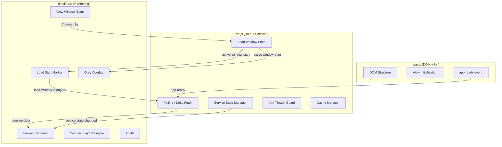

# Design Document: Timeline Span Viewer

## Overview

This design extends the RF Trace Viewer with a timeline-based span viewer that introduces four major capabilities:

1. **Load Window with Delta Fetching** — A draggable marker controls which time range is loaded, with incremental fetching of older spans.
2. **Compact Layout Mode** — A toggle to pack visible spans vertically, reducing whitespace.
3. **Service Toggle with Cache Management** — Per-service on/off toggling with eviction timers, grace periods, and anti-thrash protection.
4. **Fit All** — A button that zooms the view to fit all visible spans.

All new functionality integrates into the existing IIFE architecture (`timeline.js`, `live.js`, `app.js`) using the established event bus pattern (`window.RFTraceViewer.emit` / `on`). No new JS files are introduced. Static (non-live) mode remains unaffected.

## Architecture

### Integration with Existing Modules



### Event Flow

New events added to the existing `RFTraceViewer` event bus:

| Event | Emitter | Consumer | Payload |
|---|---|---|---|
| `load-window-changed` | Timeline_Module | Live_Module | `{ newStart, oldStart }` |
| `delta-fetch-start` | Live_Module | Timeline_Module | `{ from, to }` |
| `delta-fetch-end` | Live_Module | Timeline_Module | `{ spanCount }` |
| `service-state-changed` | Live_Module | Timeline_Module | `{ serviceName, state }` |
| `layout-mode-changed` | Timeline_Module | Timeline_Module | `{ mode }` |
| `filter-changed` | Search/Live | Timeline_Module | (existing) |

### Static vs Live Mode

All new features (Load_Start_Marker, Grey_Overlay, service toggles, delta fetching) are gated behind `window.__RF_TRACE_LIVE__`. In static mode, the timeline renders exactly as it does today. The Compact_Button and Fit_All button are available in both modes since they are purely visual operations on already-loaded data.

## Components and Interfaces

### 1. Load Window Manager (in `live.js`)

Manages the `activeWindowStart` state and coordinates delta fetches.

```javascript
// New state added to live.js IIFE scope
var _loadWindowState = {
  activeWindowStart: 0,       // epoch seconds, set on init
  executionStartTime: 0,      // from first span data
  maxLookback: 6 * 3600,      // 6 hours in seconds
  stepSize: 15 * 60,          // 15 minutes per delta fetch step
  isFetching: false,
  totalCachedSpans: 0,
  maxCachedSpans: 50000
};

// Public API
window.RFTraceViewer.getActiveWindowStart = function() { ... };
window.RFTraceViewer.setActiveWindowStart = function(newStart) { ... };
```

**Key behaviors:**
- On init: `activeWindowStart = executionStartTime - (15 * 60)`
- On drag backward: triggers delta fetch for `[newStart, oldStart]` in 15-minute steps
- On drag forward: moves marker only, no fetch, no cache eviction
- Enforces 6-hour max lookback and 50,000 span cap

### 2. Delta Fetch Engine (in `live.js`)

Extends the existing polling infrastructure to support incremental historical fetches.

```javascript
function _deltaFetch(fromTime, toTime) {
  // Breaks [fromTime, toTime] into 15-minute steps
  // Fetches each step sequentially
  // Merges results into allSpans[] using seenSpanIds for dedup
  // Emits 'delta-fetch-start' and 'delta-fetch-end' events
}
```

**Integration:** Uses the same `_pollSigNoz` / `_pollJson` code paths with modified time parameters. The existing `_ingestSigNozSpans` / `_ingestNdjson` functions handle dedup via `seenSpanIds`.

### 3. Load Start Marker (in `timeline.js`)

A draggable visual element rendered on the canvas at the `activeWindowStart` position.

```javascript
// Rendered during _renderHeader() or as an overlay on the main canvas
function _renderLoadStartMarker(ctx, width) {
  var x = _timeToScreenX(loadWindowState.activeWindowStart);
  // Draw vertical line + drag handle + label "Loading from: HH:MM (drag to load older)"
}

// Drag handling integrated into existing _setupEventListeners
// Debounced: fires load-window-changed every 300ms or on mouseup
```

### 4. Grey Overlay (in `timeline.js`)

A semi-transparent overlay drawn over the canvas area before `activeWindowStart`.

```javascript
function _renderGreyOverlay(ctx, width, height) {
  var markerX = _timeToScreenX(loadWindowState.activeWindowStart);
  if (markerX > 0) {
    ctx.fillStyle = 'rgba(128, 128, 128, 0.3)';
    ctx.fillRect(0, 0, markerX, height);
  }
}
```

Called at the start of `_render()`, before span bars are drawn.

### 5. Compact Layout Engine (in `timeline.js`)

Adds a `layoutMode` to `timelineState` and a greedy lane-packing algorithm.

```javascript
// Added to timelineState
// layoutMode: 'baseline' | 'compact'

function _compactLanes(workers) {
  // For each worker group:
  //   Sort spans by startTime
  //   Greedy first-fit: assign each span to the first lane where it fits
  //   Respects group/parent relationships (children stay near parents)
}
```

**Button:** Rendered in the zoom bar area. Toggles between "Compact visible spans" and "Reset layout". Keyboard accessible (Enter/Space).

**Auto-reset:** On any `filter-changed` event, `layoutMode` resets to `baseline`. An optional "Auto-compact after filtering" toggle (default OFF) re-applies compact after the reset.

### 6. Service State Manager (in `live.js`)

Replaces the simple `_activeServices` map with a richer per-service state model.

```javascript
var _serviceStates = {};  // serviceName → ServiceState

// ServiceState structure:
// {
//   enabled: boolean,
//   disabledSince: number|null,      // timestamp when toggled off
//   pendingEnableFetch: boolean,      // true during grace period
//   evictionTimer: number|null,       // setTimeout ID
//   cachedSpanCount: number,
//   cachedRange: { start: number, end: number } | null,
//   graceTimer: number|null,          // setTimeout ID for enable grace
//   toggleHistory: number[],          // timestamps of recent toggles
//   thrashLocked: boolean             // anti-thrash active
// }
```

**Toggle Off flow:**
1. Set `enabled = false`, hide spans immediately (UI filter)
2. Start 30s eviction timer
3. If toggled back on within 30s → cancel timer, show cached spans
4. If timer expires → clear spans from cache, retain service name

**Toggle On flow (no cache):**
1. Start 3s grace period (1s if only one service pending and no cache)
2. Show countdown "Loading starts in 3…2…1"
3. If toggled off during grace → cancel, no fetch
4. On grace expiry → fetch spans for `[activeWindowStart, executionEndTime]`

### 7. Anti-Thrash Guard (in `live.js`)

Tracks toggle frequency per service using a sliding window.

```javascript
function _recordToggle(serviceName) {
  var state = _serviceStates[serviceName];
  var now = Date.now();
  state.toggleHistory.push(now);
  // Trim entries older than 10 seconds
  state.toggleHistory = state.toggleHistory.filter(function(t) {
    return now - t < 10000;
  });
  if (state.toggleHistory.length >= 5) {
    state.thrashLocked = true;
    // Display "Stabilizing…" — auto-unlock after 10s of no toggles
  }
}
```

### 8. Fit All (in `timeline.js`)

Zooms `viewStart`/`viewEnd` to the bounding box of visible (non-filtered) spans, clamped by `activeWindowStart`.

```javascript
function _fitAll() {
  var visible = timelineState.filteredSpans.length > 0
    ? timelineState.filteredSpans
    : timelineState.flatSpans;
  if (visible.length === 0) {
    // Zoom to last 5 minutes, show toast "No spans in current filters"
    return;
  }
  var minT = Infinity, maxT = -Infinity;
  for (var i = 0; i < visible.length; i++) {
    if (visible[i].startTime < minT) minT = visible[i].startTime;
    if (visible[i].endTime > maxT) maxT = visible[i].endTime;
  }
  // Clamp: minT >= activeWindowStart
  var aws = window.RFTraceViewer.getActiveWindowStart
    ? window.RFTraceViewer.getActiveWindowStart()
    : timelineState.minTime;
  if (minT < aws) minT = aws;
  timelineState.viewStart = minT;
  timelineState.viewEnd = maxT;
  _render();
  _renderHeader();
}
```

### 9. Service List UX (in `live.js`)

Extends `_renderServiceList()` to show per-service status badges:

| State | Display |
|---|---|
| Enabled + cached | `"Enabled (N spans cached)"` |
| Grace period active | `"Pending (N s)"` with countdown |
| Eviction timer active | `"Evicting in N s"` |
| Anti-thrash locked | `"Stabilizing…"` |
| Disabled + evicted | `"Disabled"` |

The countdown timers update via a 1-second `setInterval` that re-renders the service list labels.

## Data Models

### Load Window State

```
LoadWindowState {
  activeWindowStart: number    // epoch seconds
  executionStartTime: number   // epoch seconds (from first data)
  maxLookback: number          // 21600 (6 hours)
  stepSize: number             // 900 (15 minutes)
  isFetching: boolean
  totalCachedSpans: number
  maxCachedSpans: number       // 50000
}
```

### Service State (per service)

```
ServiceState {
  enabled: boolean
  disabledSince: number | null
  pendingEnableFetch: boolean
  evictionTimer: number | null       // setTimeout ID
  graceTimer: number | null          // setTimeout ID
  cachedSpanCount: number
  cachedRange: { start: number, end: number } | null
  toggleHistory: number[]            // timestamps for anti-thrash
  thrashLocked: boolean
}
```

### Timeline State Extensions

Added to the existing `timelineState` object:

```
timelineState (extended) {
  ...existing fields...
  layoutMode: 'baseline' | 'compact'
  activeWindowStart: number | null    // synced from Live_Module
  autoCompactAfterFilter: boolean     // default false
}
```

### View Window vs Load Window Relationship

```
|<--- Grey Overlay --->|<---------- Loaded Data ---------->|
                       ^                                    ^
              activeWindowStart                    executionEndTime
                       |                                    |
                       |<-- viewStart ... viewEnd -->|      |
                       |   (zoom/pan controlled)     |      |
```

Invariant: `viewStart >= activeWindowStart` (always enforced by Timeline_Module).


## Correctness Properties

*A property is a characteristic or behavior that should hold true across all valid executions of a system — essentially, a formal statement about what the system should do. Properties serve as the bridge between human-readable specifications and machine-verifiable correctness guarantees.*

### Property 1: Active Window Start initialization

*For any* `executionStartTime` (a valid epoch-seconds timestamp), the computed `activeWindowStart` shall equal `executionStartTime - 900` (15 minutes).

**Validates: Requirements 1.1**

### Property 2: Active Window Start clamping (6-hour max)

*For any* attempted `activeWindowStart` value and any `executionStartTime`, the resulting `activeWindowStart` shall be >= `executionStartTime - 21600` (6 hours) and <= `executionStartTime`.

**Validates: Requirements 3.1, 3.3**

### Property 3: Cached span count cap

*For any* sequence of delta fetch operations, the total number of cached spans shall never exceed 50,000. If the cache is at capacity, no further spans are ingested.

**Validates: Requirements 3.2, 3.4**

### Property 4: Delta fetch covers correct interval in 15-minute steps

*For any* pair `(newStart, oldStart)` where `newStart < oldStart`, the delta fetch shall produce fetch steps that collectively cover `[newStart, oldStart]` exactly, with each step spanning at most 15 minutes (900 seconds).

**Validates: Requirements 2.2, 3.5**

### Property 5: Cache merge preserves existing spans

*For any* existing cache of spans and any set of newly fetched spans from a delta fetch, the resulting cache shall be a superset of the original cache — no previously cached span is removed or modified.

**Validates: Requirements 2.3**

### Property 6: Forward drag preserves cache and triggers no fetch

*For any* drag operation that moves `activeWindowStart` forward (toward the present), the cache shall remain identical before and after the drag, and no delta fetch shall be triggered.

**Validates: Requirements 2.6, 2.7**

### Property 7: View start is always clamped to Active Window Start

*For any* operation that sets `viewStart` or `filterStart` (zoom, pan, fitAll, or filter change), the resulting value shall be >= `activeWindowStart`.

**Validates: Requirements 4.2, 4.5, 10.3**

### Property 8: Load Window and View Window are independent

*For any* zoom or pan operation, `activeWindowStart` shall remain unchanged. Conversely, *for any* change to `activeWindowStart`, `viewStart` and `viewEnd` shall remain unchanged.

**Validates: Requirements 4.3, 4.4**

### Property 9: Compact layout produces non-overlapping lanes

*For any* set of spans in compact layout mode, no two spans assigned to the same lane within the same worker group shall have overlapping time intervals (i.e., for spans A and B on the same lane, `A.endTime <= B.startTime` or `B.endTime <= A.startTime`).

**Validates: Requirements 5.3**

### Property 10: Compact then baseline is a round trip on lane assignments

*For any* set of spans with original lane assignments, applying compact layout and then resetting to baseline shall restore each span's lane to its original value.

**Validates: Requirements 5.5, 6.1, 6.2**

### Property 11: Filter change resets layout mode (with auto-compact option)

*For any* filter change event, if `autoCompactAfterFilter` is false, `layoutMode` shall be `baseline` after the event. If `autoCompactAfterFilter` is true, `layoutMode` shall be `compact` after the event.

**Validates: Requirements 6.1, 6.3**

### Property 12: Service toggle off hides spans and eviction clears cache

*For any* service that is toggled off, its spans shall be immediately excluded from the visible set. If the eviction timer (30s) expires without the service being re-enabled, the cache shall contain zero spans for that service, but the service name shall remain in the known services list.

**Validates: Requirements 7.1, 7.3**

### Property 13: Service toggle off then on within 30s preserves cache

*For any* service that is toggled off and then back on before the 30-second eviction timer expires, the eviction timer shall be cancelled and the cached spans for that service shall be identical to what they were before the toggle-off.

**Validates: Requirements 7.4**

### Property 14: Grace period cancellation prevents fetch

*For any* service that is toggled on (starting a grace period) and then toggled off before the grace period expires, no network fetch shall be initiated for that service.

**Validates: Requirements 8.1, 8.3**

### Property 15: Grace period duration depends on pending service count

*For any* state where exactly one service is pending fetch and has no cached spans, the grace period shall be 1 second. In all other cases (multiple pending services or existing cache), the grace period shall be 3 seconds.

**Validates: Requirements 8.5**

### Property 16: Anti-thrash activates iff 5+ toggles in 10-second window

*For any* sequence of toggle events for a service with timestamps, `thrashLocked` shall be true if and only if 5 or more toggle events occurred within the most recent 10-second sliding window. When `thrashLocked` is true, no fetches shall be initiated for that service.

**Validates: Requirements 9.1, 9.2**

### Property 17: Anti-thrash deactivates after 10 seconds of inactivity

*For any* service with an active anti-thrash guard, if 10 seconds pass with no further toggle events, `thrashLocked` shall be set to false and normal fetch behavior shall resume.

**Validates: Requirements 9.4**

### Property 18: Fit All zooms to visible span bounds

*For any* non-empty set of visible (non-filtered) spans, after fitAll, `viewStart` shall equal the minimum `startTime` of visible spans (clamped to `activeWindowStart`) and `viewEnd` shall equal the maximum `endTime` of visible spans.

**Validates: Requirements 10.2, 10.3**

### Property 19: Service status label derivation

*For any* `ServiceState` object, the derived status label shall be:
- `"Enabled (N spans cached)"` when `enabled=true` and `cachedSpanCount > 0`
- `"Pending (N s)"` when `pendingEnableFetch=true` and grace timer is active
- `"Evicting in N s"` when `enabled=false` and eviction timer is active
- `"Stabilizing…"` when `thrashLocked=true`
- `"Disabled"` when `enabled=false` and no eviction timer is active

**Validates: Requirements 11.1, 11.2, 11.3, 11.4, 11.5**

### Property 20: Baseline layout backward compatibility

*For any* set of spans processed in `baseline` layout mode, the lane assignments shall be identical to those produced by the existing `_assignLanes` algorithm (i.e., the new code does not alter baseline behavior).

**Validates: Requirements 12.1**

## Error Handling

### Network Errors During Delta Fetch

- If a delta fetch step fails (network error, timeout, HTTP 4xx/5xx), the Live_Module retries with exponential backoff using the existing `backoffMs` mechanism.
- Partial results from completed steps are retained in the cache. The failed step can be retried independently.
- The "Fetching older spans…" indicator updates to show "Retry in N s…" during backoff.

### Span Cap Reached During Delta Fetch

- If the 50,000 span cap is hit mid-fetch, the current step completes but no further steps are initiated.
- The existing `_onSpanCapReached` handler displays the banner. The Load_Start_Marker remains at its current position (not snapped back).

### Invalid Drag Positions

- Dragging the Load_Start_Marker beyond the 6-hour limit clamps to the limit. No error is thrown.
- Dragging forward past `executionStartTime` clamps to `executionStartTime`.

### Timer Edge Cases

- If the browser tab is backgrounded (visibility change), eviction timers and grace timers continue running via `setTimeout`. The existing `_listenVisibility` handler pauses polling but does not affect service state timers.
- If multiple services are toggled rapidly, each service's timers are independent. No shared state between service timers.

### Anti-Thrash Recovery

- When anti-thrash unlocks after 10 seconds of inactivity, the service's current `enabled` state determines behavior: if enabled, a fetch is triggered; if disabled, no action.

## Testing Strategy

### Property-Based Testing

This project uses **Hypothesis** (Python) for property-based testing, with profiles configured in `tests/conftest.py`:
- `dev` profile: `max_examples=5` (fast feedback, < 30s total)
- `ci` profile: `max_examples=200` (thorough coverage)

Do NOT hardcode `@settings(max_examples=N)` on individual tests. The profile system controls iteration counts globally.

Since the core logic being tested (state machines, clamping, cache management, anti-thrash) is implemented in JavaScript, the property tests will validate **pure logic functions** extracted into testable Python equivalents that mirror the JS implementations. This follows the project's existing pattern where the Python test suite validates the data model and logic, while browser tests cover UI integration.

Each property test must be tagged with a comment referencing the design property:

```python
# Feature: timeline-span-viewer, Property 1: Active Window Start initialization
@given(execution_start=st.floats(min_value=1e9, max_value=2e9))
def test_active_window_start_init(execution_start):
    result = compute_active_window_start(execution_start)
    assert result == execution_start - 900
```

### Unit Tests

Unit tests complement property tests for:
- Specific examples (e.g., fitAll with zero visible spans shows toast)
- Edge cases (e.g., drag exactly to 6-hour limit, span cap at exactly 50,000)
- Integration points (e.g., event bus wiring between modules)
- Static mode rendering (no live-only features present)

### Test Organization

```
tests/unit/
  test_load_window.py          # Properties 1-6 (load window, delta fetch, cache)
  test_view_window.py          # Properties 7-8 (clamping, independence)
  test_compact_layout.py       # Properties 9-11 (compact lanes, round trip, filter reset)
  test_service_state.py        # Properties 12-17 (toggle, eviction, grace, anti-thrash)
  test_fit_all.py              # Property 18 (fit all zoom)
  test_service_label.py        # Property 19 (status label derivation)
  test_backward_compat.py      # Property 20 (baseline lane assignment)
```

### Running Tests

```bash
make test-unit          # Dev profile (5 examples), < 30s
make test-full          # CI profile (200 examples), thorough
make test-properties    # Property tests only, CI profile
```

All tests run inside the `rf-trace-test:latest` Docker container. Never run raw Python on the host.
