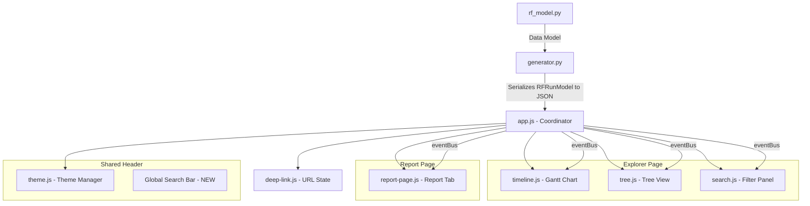

# Design Document: UX Feedback Improvements

## Overview

This design covers 14 UX improvements to the RF Trace Viewer (Requirement 13 is out of scope). The changes span both the Explorer page (`app.js`, `search.js`, `timeline.js`) and the Report page (`report-page.js`), plus the shared header (`app.js`, `theme.js`) and stylesheet (`style.css`). No backend (Python) changes are required for most items; only Requirement 11 (metadata display) and Requirement 7 (timestamps) depend on data already present in the `RFRunModel` serialization pipeline.

The improvements fall into four categories:

1. **Navigation & Defaults** (Reqs 1, 2, 9, 10): Change the default active tab, expand the filter panel on load, add suite-grouped view, fix the dark mode icon.
2. **Filter Enhancements** (Reqs 3, 4, 5, 6, 8, 12): Per-section reset buttons, vertical duration stacking, multi-select tags, keyword filtering on Report page, suite filter on Report page, global search bar.
3. **Data Display** (Reqs 7, 11): Timestamps on test cases, execution metadata on the summary dashboard.
4. **Timeline Polish** (Reqs 14, 15): Hide time presets in offline mode, fix compact button wording.

All JavaScript must use the IIFE pattern with `var` declarations — no ES6+ features. The viewer is a single-page HTML report; all DOM is built programmatically.

## Architecture

The viewer follows a coordinator pattern where `app.js` bootstraps the DOM, initializes sub-modules, and provides cross-view navigation via an `eventBus`. Each JS file is an IIFE that registers itself on `window.RFTraceViewer` or exposes global functions.



### Change Impact by File

| File | Requirements | Changes |
|------|-------------|---------|
| `app.js` | 1, 2, 10, 12 | Tab order & default, filter panel init state, theme icon chars, global search bar in header |
| `search.js` | 3, 4 | Per-section reset buttons, vertical duration range layout |
| `report-page.js` | 5, 6, 7, 8, 9, 11 | Multi-select tags, keyword filtering, timestamps, suite filter, suite-grouped view, metadata display |
| `timeline.js` | 14, 15 | Hide time presets in offline mode, compact button wording |
| `theme.js` | 10 | Moon icon character update |
| `style.css` | 3, 4, 5, 6, 7, 8, 9, 12, 14 | New CSS for reset buttons, vertical stacking, filter badges, timestamps, suite groups, global search dropdown, preset hiding |
| `generator.py` | 11 | Ensure `rf_version`, `start_time`, `end_time` are serialized (already present in `_serialize`) |

## Components and Interfaces

### 1. Tab Navigation Changes (Req 1)

**Current**: `_initApp` creates tabs as `[{id:'report',...}, {id:'explorer',...}]` with `report` getting the `active` class. The report tab pane gets `class="tab-pane active"` and explorer gets `class="tab-pane"`.

**Change**: Swap the tab array order to `[{id:'explorer',...}, {id:'report',...}]`. Set `active` class on the explorer tab button and pane instead of report.

**File**: `app.js` → `_initApp`

### 2. Filter Panel Default State (Req 2)

**Current**: `filterSidebar` is created with `className = 'panel-filter collapsed'` and toggle button text is `'◀ Filters'`.

**Change**: Remove `collapsed` from the initial class. Set toggle text to `'▶ Filters'` (indicating click will collapse). The toggle click handler already uses `classList.toggle('collapsed')` so no logic change needed.

**File**: `app.js` → `_initApp`

### 3. Individual Filter Reset Buttons (Req 3)

**Current**: `_buildFilterUI` creates filter sections. `_clearAllFilters` resets all state. No per-section reset exists.

**Design**: Each `_build*` function (text search, test status, kw status, tag, suite, keyword type, duration) returns a section element. After building each section, attach a small reset button (×) that is shown/hidden based on whether the section's value differs from its default. On click, reset only that section's `filterState` fields and call `_applyFilters()`.

A new helper `_updateSectionResetButtons()` is called after every filter change (inside `_applyFilters` and `_clearAllFilters`) to show/hide each section's reset button by comparing current state to defaults.

**Default values** (for comparison):
- Text: `''`
- Test statuses: `['PASS', 'FAIL', 'SKIP']` (all checked)
- KW statuses: `['PASS', 'FAIL', 'NOT_RUN']` (all checked)
- Tags: `[]`
- Suites: `[]`
- Keyword types: `[]`
- Duration min/max: `null`/`null`
- Execution ID: `''`
- Scope toggle: `true`

**File**: `search.js`

### 4. Duration Range Vertical Stacking (Req 4)

**Current**: `_buildDurationFilter` places min and max inputs side-by-side in a `filter-range-container` div with a `' — '` text separator.

**Change**: Replace the inline separator with a label element "to" between stacked inputs. Add CSS `flex-direction: column` to `.filter-range-container`. Each input gets `width: 100%`.

**Files**: `search.js` → `_buildDurationFilter`, `style.css`

### 5. Multi-Select Tags on Report Page (Req 5)

**Current**: `_state.tagFilter` is a single string (one tag or `null`). Clicking a tag row sets `_state.tagFilter = tag` or clears it.

**Change**: Convert `_state.tagFilter` to an array `_state.tagFilters = []`. Clicking a tag row toggles its presence in the array. `_filterTests` uses OR logic: show tests that have at least one selected tag. The toolbar renders a badge per active tag with individual remove buttons.

**File**: `report-page.js` → `_renderTagStatistics`, `_renderTestResultsTable`, `_filterTests`

### 6. Keyword Filtering on Report Page (Req 6)

**Current**: Clicking a keyword row in `_renderKeywordInsights` calls `_navigateToExplorer(stat.firstSpanId)` which switches to the Explorer tab.

**Change**: Add `_state.keywordFilters = []` (array for consistency with tags). Clicking a keyword row toggles it in the filter set instead of navigating. `_filterTests` is extended to also filter by keyword name (OR logic). A filter badge is shown in the toolbar. The keyword drill-down rows within expanded test cases continue to navigate to Explorer (no change to `_renderKeywordDrillDown`).

**File**: `report-page.js` → `_renderKeywordInsights`, `_renderTestResultsTable`, `_filterTests`

### 7. Timestamps on Test Cases (Req 7)

**Current**: The sort bar has columns `[name, status, duration]`. Test rows show status dot, name, error preview (if fail), and duration.

**Change**: Add `start_time` column to the sort bar. Display formatted start time and end time in each test row summary. The `RFTest` model already has `start_time` and `end_time` (epoch nanoseconds). The `_serialize` function already includes these fields. If a test has `start_time === 0`, display "N/A". Add `_sortTests` support for `start_time` column.

**File**: `report-page.js` → `_renderTestResultsTable`, `_sortTests`

### 8. Suite Filter on Report Page (Req 8)

**Current**: `_renderSuiteSelector` renders a dropdown that sets `_selectedSuiteId` and re-renders the entire page. This changes which suite's tests are shown.

**Change**: Add a separate `_state.suiteFilter` (string or null) to the toolbar alongside status pills and tag badges. This filters the test list within the currently selected suite scope. When active, a filter badge is shown. The suite filter works in combination with text, status, tag, and keyword filters.

For multi-suite traces, the existing suite selector changes the data scope (which suite tree to collect tests from), while the new suite filter further narrows within that scope. For single-suite traces, the suite filter is hidden.

**File**: `report-page.js` → `_renderTestResultsTable`, `_filterTests`

### 9. Suite-First Navigation View (Req 9)

**Current**: Test results are always a flat list.

**Change**: Add a toggle button in the Test Results sub-tab toolbar to switch between "Flat" and "Suite-grouped" views. In suite-grouped mode, render suite names as `<details>` elements with summary showing suite name + pass/fail/skip counts. Expanding a suite group shows its test cases. All active filters apply to both views.

**State**: `_state.viewMode = 'flat'` (default) or `'suite-grouped'`.

**File**: `report-page.js` → `_renderTestResultsTable`

### 10. Dark Mode Toggle Icon (Req 10)

**Current**: Light mode shows `☾` (U+263E), dark mode shows `☀` (U+2600). The `☾` renders poorly in some fonts.

**Change**: Use `🌙` (U+1F319, crescent moon) for light mode. Keep `☀` (U+2600) for dark mode. Update both `app.js` (toggle button creation and click handler) and `theme.js` (OS preference change handler).

**Files**: `app.js` → `_initApp`, `theme.js`

### 11. Metadata on Report Page (Req 11)

**Current**: `_renderSummaryDashboard` shows verdict, pass/fail/skip counts, pass rate bar, and total duration. No start/end time or RF version.

**Change**: Add a metadata row below the hero section showing:
- Run start time (formatted from `data.start_time` epoch nanoseconds)
- Run end time (formatted from `data.end_time`)
- RF version (from `data.rf_version`) — only if non-empty
- Executor type (from `data.executor` if available) — only if non-empty

The `RFRunModel` already has `rf_version`, `start_time`, and `end_time`. The `_serialize` function includes all dataclass fields. Executor info needs to be checked — if not present in the model, it can be derived from suite structure (multiple root suites = pabot).

**File**: `report-page.js` → `_renderSummaryDashboard`

### 12. Global Search Bar (Req 12)

**Design**: Add a search input to the viewer header (between the title and the theme toggle). The input is always visible. On typing (debounced 150ms), search across:
- Suite names (from `data.suites`, recursively)
- Test case names (from all tests)
- Keyword names (from aggregated keyword stats)

Display results in a dropdown grouped by type. Selecting a result navigates:
- Test case → switch to Explorer, highlight in tree
- Suite → switch to Report, set suite filter
- Keyword → switch to Explorer, highlight first occurrence

**File**: `app.js` → `_initApp` (DOM creation), new helper functions for search logic

### 13. Time Preset Hiding in Offline Mode (Req 14)

**Current**: Time preset buttons and calendar button are always rendered in the zoom bar.

**Change**: In `timeline.js`, after creating the preset group and calendar button, check `window.__RF_TRACE_LIVE__`. If falsy, set `presetGroup.style.display = 'none'`, `calendarBtn.style.display = 'none'`, and `sepPresets.style.display = 'none'` (the separator before presets). This prevents a gap in the toolbar.

**File**: `timeline.js`

### 14. Compact Button Wording (Req 15)

**Current**: `_toggleLayoutMode` sets `compactBtn.textContent = 'Reset layout'` when in compact mode.

**Change**: Change to `'Expand to baseline'` with matching `aria-label`. Also update `_handleFilterChanged` (which resets layout on filter change) to ensure the button text reverts to `'Compact visible spans'`.

**File**: `timeline.js` → `_toggleLayoutMode`, `_handleFilterChanged`

## Data Models

### Existing Models (No Changes)

The `RFRunModel` dataclass already contains all fields needed:

```python
@dataclass
class RFRunModel:
    title: str
    run_id: str
    rf_version: str      # Used by Req 11
    start_time: int       # Epoch ns — used by Req 11
    end_time: int         # Epoch ns — used by Req 11
    suites: list[RFSuite]
    statistics: RunStatistics

@dataclass
class RFTest:
    name: str
    id: str
    status: Status
    start_time: int       # Epoch ns — used by Req 7
    end_time: int         # Epoch ns — used by Req 7
    elapsed_time: float
    keywords: list[RFKeyword]
    tags: list[str]
    doc: str
    status_message: str
```

### Report Page State Changes

```javascript
// Current _state shape
var _state = {
  tagFilter: null,        // string | null (single tag)
  textFilter: '',
  statusFilter: null,
  sortColumn: 'name',
  sortAsc: true,
  activeTab: 'results',
  logLevel: 'INFO',
  expandedTests: {}
};

// New _state shape
var _state = {
  tagFilters: [],          // string[] (multi-select tags, Req 5)
  keywordFilters: [],      // string[] (keyword filtering, Req 6)
  suiteFilter: null,       // string | null (suite filter, Req 8)
  viewMode: 'flat',        // 'flat' | 'suite-grouped' (Req 9)
  textFilter: '',
  statusFilter: null,
  sortColumn: 'name',
  sortAsc: true,
  activeTab: 'results',
  logLevel: 'INFO',
  expandedTests: {}
};
```

### Global Search Result Shape

```javascript
// Search result item
{
  type: 'suite' | 'test' | 'keyword',
  name: 'Test Case Name',
  id: 'span-id-or-suite-id',    // For navigation
  context: 'Parent Suite Name'    // Optional context hint
}
```


## Correctness Properties

*A property is a characteristic or behavior that should hold true across all valid executions of a system — essentially, a formal statement about what the system should do. Properties serve as the bridge between human-readable specifications and machine-verifiable correctness guarantees.*

### Property 1: Filter section reset button visibility matches non-default state

*For any* filter section and any filter state, the reset button for that section is visible if and only if the section's current value differs from its default value.

**Validates: Requirements 3.1, 3.4**

### Property 2: Resetting a single filter section only affects that section

*For any* filter state with multiple non-default sections, resetting one section produces a state where only that section returns to its default value and all other sections remain unchanged.

**Validates: Requirements 3.2, 3.3**

### Property 3: Clear all resets all filter sections to defaults

*For any* filter state (regardless of how many sections have non-default values), clicking "Clear All" produces a state where every section is at its default value.

**Validates: Requirements 3.5**

### Property 4: Tag click toggles presence in filter set

*For any* tag name and any current tag filter set, clicking that tag row adds it to the set if absent, or removes it if present. The resulting set size changes by exactly one.

**Validates: Requirements 5.1, 5.2**

### Property 5: Tag filter uses OR logic on test results

*For any* non-empty set of selected tags and any list of tests, the filtered result contains exactly those tests that have at least one tag in the selected set. When the tag filter set is empty, all tests are returned.

**Validates: Requirements 5.3, 5.5**

### Property 6: Keyword click toggles presence in keyword filter set

*For any* keyword name and any current keyword filter set, clicking that keyword row adds it to the set if absent, or removes it if present. The resulting set size changes by exactly one.

**Validates: Requirements 6.1, 6.3**

### Property 7: Active filter badge count matches total active filter items

*For any* combination of active tag filters, keyword filters, and suite filter, the number of filter badges rendered in the toolbar equals the total count of active filter items (length of tag filters + length of keyword filters + (1 if suite filter is active, else 0)).

**Validates: Requirements 5.4, 6.4, 8.4**

### Property 8: Test timestamps are displayed when available

*For any* test with non-zero `start_time` and `end_time`, the rendered test row summary contains formatted start and end timestamps. For any test with `start_time === 0`, the row displays "N/A" for that field.

**Validates: Requirements 7.2, 7.3, 7.4**

### Property 9: Sorting by start time produces correctly ordered results

*For any* list of tests with start times, sorting by the `start_time` column in ascending order produces a list where each test's start time is less than or equal to the next test's start time. Descending order reverses this.

**Validates: Requirements 7.5**

### Property 10: Combined filters produce intersection of all criteria

*For any* combination of text filter, status filter, tag filters, keyword filters, and suite filter applied to any list of tests, the filtered result is exactly the set of tests that satisfy ALL active filter criteria simultaneously. This holds in both flat and suite-grouped view modes.

**Validates: Requirements 8.5, 9.5**

### Property 11: Suite group headers show correct counts

*For any* suite in suite-grouped view mode, the group header displays the suite name and pass/fail/skip counts that exactly match the counts computed from the tests belonging to that suite (after applying active filters).

**Validates: Requirements 9.2, 9.4**

### Property 12: Non-empty metadata fields appear in the summary dashboard

*For any* `RFRunModel` with non-zero `start_time`, non-zero `end_time`, non-empty `rf_version`, or available executor info, each such field appears in the rendered summary dashboard. Fields that are zero/empty are omitted entirely (no empty placeholders).

**Validates: Requirements 11.1, 11.2, 11.3, 11.4, 11.5**

### Property 13: Global search results are grouped by type

*For any* search query that matches at least one item, the returned results are partitioned into groups by type (suites, test cases, keywords), and every result in each group matches the search query as a case-insensitive substring of the item's name.

**Validates: Requirements 12.2**

### Property 14: Compact button aria-label matches visible text

*For any* layout mode (baseline or compact), the compact button's `aria-label` attribute value is identical to its `textContent`.

**Validates: Requirements 15.3**

## Error Handling

### Filter State Errors
- If `_state.tagFilters` or `_state.keywordFilters` somehow contains duplicates, the filter logic should deduplicate before applying. Use `indexOf` checks before adding.
- If a tag or keyword in the filter set no longer exists in the data (e.g., after suite selector change), silently remove stale entries during the next `_filterTests` call.

### Metadata Display Errors
- If `start_time` or `end_time` is `0`, `null`, or `undefined`, omit the field from the dashboard rather than displaying "Invalid Date".
- If `rf_version` is an empty string, omit the version row.
- Use a safe date formatting function that returns `null` for invalid epoch values, allowing the caller to skip rendering.

### Global Search Errors
- If the data model is not yet loaded when the user types in the search bar, show "Loading..." instead of "No results".
- Cap search results at 50 items per group to prevent DOM performance issues with very large traces.
- Handle the case where `data.suites` is empty or undefined gracefully (return empty results).

### Timeline Errors
- The `window.__RF_TRACE_LIVE__` check for hiding presets should use a falsy check (`!window.__RF_TRACE_LIVE__`) to handle `undefined`, `null`, `false`, and `0`.
- If `compactBtn` reference is lost (shouldn't happen but defensive), guard `_handleFilterChanged` with a null check before setting `textContent`.

### Backward Compatibility
- The `_state.tagFilter` (singular) to `_state.tagFilters` (array) migration: if any external code or deep-link state references the old `tagFilter` property, add a compatibility shim that converts a string to a single-element array.
- The `_filterTests` function signature changes from `(tests, text, tagFilter)` to `(tests, text, tagFilters, keywordFilters, suiteFilter)`. Any callers must be updated.

## Testing Strategy

### Property-Based Testing

This project uses **Hypothesis** (Python) for property-based testing with two profiles:
- `dev` profile: `max_examples=5` for fast feedback during development
- `ci` profile: `max_examples=200` for thorough CI coverage

Do NOT hardcode `@settings(max_examples=N)` on individual tests. The profile system controls iteration counts globally.

All tests run inside Docker using the `rf-trace-test:latest` image via Makefile targets.

### Test Approach

Since the UX improvements are primarily JavaScript/DOM changes, the testable properties fall into two categories:

**1. Python-side property tests** (for data model and serialization):
- Property 8 (timestamps): Test that `_serialize` / `_serialize_compact` correctly includes `start_time` and `end_time` for `RFTest` objects. Generate random `RFTest` instances and verify the serialized output contains the timestamp fields.
- Property 9 (sort correctness): Test sort functions with generated test lists.
- Property 12 (metadata): Test that `_serialize` includes `rf_version`, `start_time`, `end_time` from `RFRunModel`. Generate random models and verify serialized output.
- Property 5 (tag OR filter): Implement the filter logic as a pure function and test with generated test/tag data.
- Property 10 (combined filters): Test the filter composition logic with generated multi-filter states.
- Property 13 (search grouping): Test the search function with generated data sets.

**2. Unit tests** (specific examples and edge cases):
- Req 1: Verify tab order and default active state in generated HTML.
- Req 2: Verify filter panel initial state.
- Req 4: Verify duration range DOM structure (vertical stacking).
- Req 10: Verify moon/sun icon characters.
- Req 14: Verify time preset visibility based on `__RF_TRACE_LIVE__` flag.
- Req 15: Verify compact button text in both states.

**3. Browser integration tests** (Robot Framework):
- End-to-end verification of filter interactions, tag multi-select, keyword filtering, global search navigation.
- These complement property tests by testing real DOM behavior.

### Property Test Tagging

Each property test must include a comment referencing the design property:

```python
# Feature: ux-feedback-improvements, Property 5: Tag filter uses OR logic on test results
@given(...)
def test_tag_filter_or_logic(tags, tests):
    ...
```

### Test File Organization

```
tests/
  unit/
    test_report_filters.py      # Properties 4, 5, 6, 7, 10 (filter logic)
    test_report_sort.py          # Property 9 (sort correctness)
    test_report_metadata.py      # Property 12 (metadata serialization)
    test_global_search.py        # Property 13 (search grouping)
    test_generator.py            # Property 8 (timestamp serialization) — extend existing
  browser/
    test_ux_improvements.robot   # Integration tests for DOM behavior
```

### Commands

```bash
make test-unit          # Fast dev run (<30s, dev profile)
make test-full          # Full PBT iterations (ci profile)
make test-properties    # Property tests only, full iterations
make test-browser       # Browser integration tests
```
