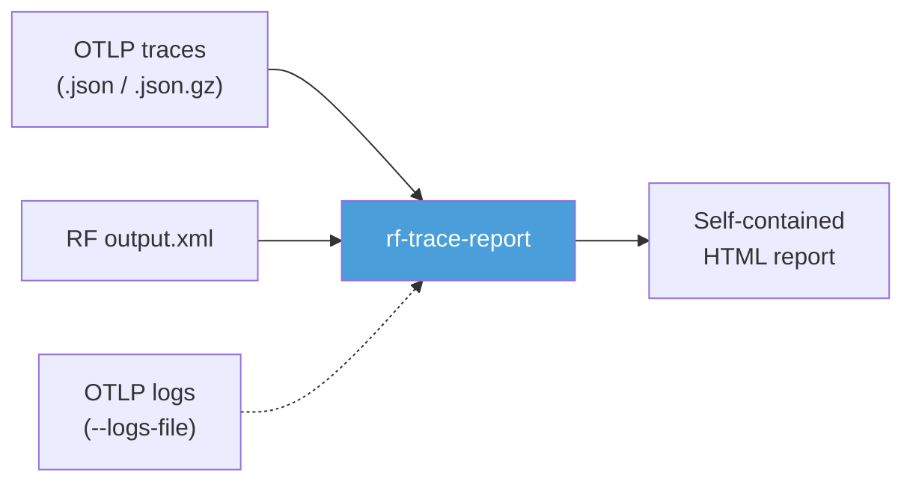
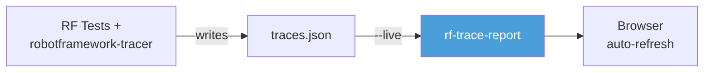
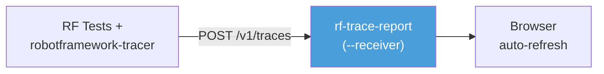
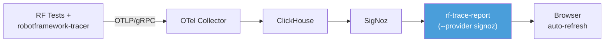
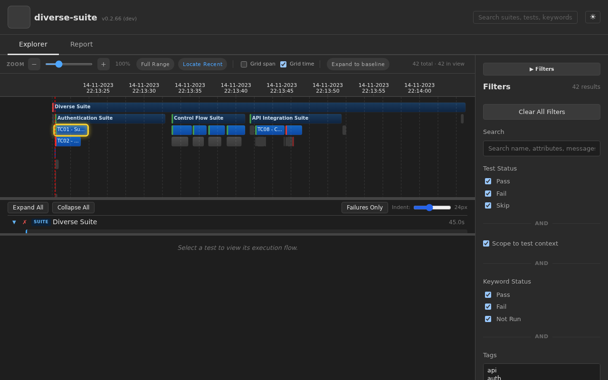
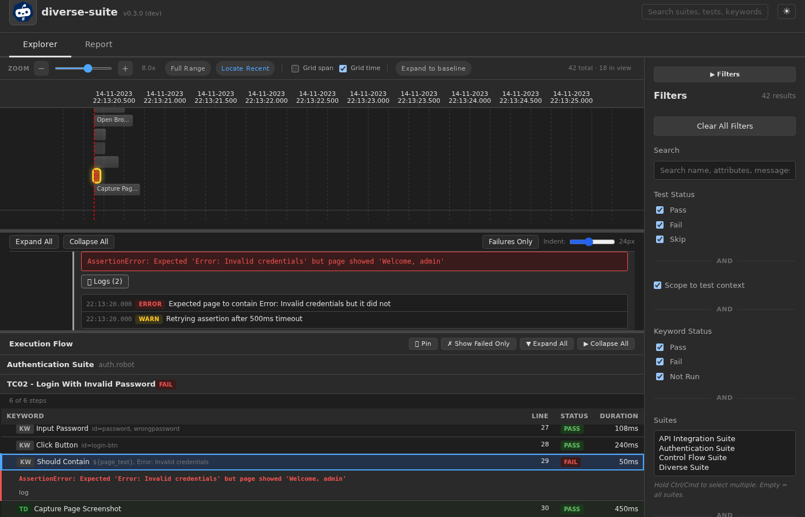
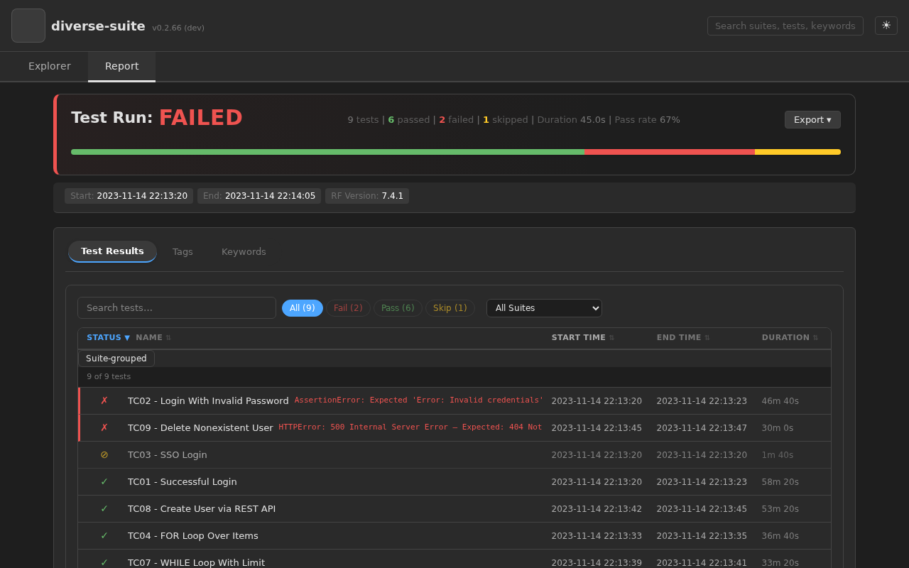

# Robot Framework Trace Report

Interactive HTML report generator and live trace viewer for Robot Framework, powered by OpenTelemetry.

`rf-trace-report` turns OpenTelemetry traces, logs, and even plain Robot Framework `output.xml` files into rich, self-contained HTML reports with timeline visualization, live updates, and parallel execution clarity — no `rebot --merge` required.

## How It Works

### Static Report (offline)



### Live Mode

#### Option A: Watch a trace file

The tracer writes spans to a local file as tests run. `rf-trace-report` tails the file and serves updates to the browser — no infrastructure needed.



#### Option B: OTLP receiver

`rf-trace-report` acts as a lightweight OTLP endpoint. Point your tracer's HTTP exporter directly at it — no file, no collector.



#### Option C: SigNoz backend

For teams already running SigNoz. Traces flow through the standard OTel pipeline into ClickHouse, and `rf-trace-report` queries them via the SigNoz API.



> [robotframework-tracer](https://github.com/tridentsx/robotframework-tracer) is the OpenTelemetry listener that instruments Robot Framework test execution.

## Screenshots

### Explorer View


### Explorer View with OTLP Log Correlation


### Report View


## Installation

Requires **Python 3.10+** on Linux or macOS. Windows is not supported.

```bash
pip install robotframework-trace-report
```

## Quick Start

```bash
# Generate a static report from OTLP traces
rf-trace-report traces.json -o report.html

# Generate a report directly from RF output.xml (no tracer needed)
rf-trace-report output.xml -o report.html

# Convert output.xml to OTLP NDJSON for further processing
rf-trace-report convert output.xml -o traces.json.gz

# Include OTLP log records alongside traces
rf-trace-report traces.json --logs-file logs.json -o report.html

# Live mode — auto-refreshing browser view
rf-trace-report traces.json --live

# OTLP receiver mode — ingest traces directly, no file needed
rf-trace-report --receiver

# Receiver with upstream forwarding (act as a trace proxy)
rf-trace-report --receiver --forward http://jaeger:4318/v1/traces

# Query traces from a SigNoz backend
rf-trace-report serve --provider signoz --signoz-endpoint http://signoz:8080
```

## Features

- **Multiple input formats** — OTLP NDJSON traces, RF `output.xml`, OTLP receiver, SigNoz backend
- **OTLP log support** — attach a separate OTLP logs file (`--logs-file`) for inline log messages with level badges
- **Timeline / Gantt view** — parallel execution lanes per pabot worker, zoom, pan, time-range selection
- **Explorer view** — hierarchical suite → test → keyword navigation with inline logs
- **Report page** — summary dashboard, test results table, tag statistics, keyword insights, failure triage with error breadcrumbs
- **Keyword drill-down** — expand test rows inline to see the full keyword execution tree with type badges, arguments, and log messages
- **Search & filter** — text search, status/tag/duration/time-range/service-name filters
- **Live mode** — real-time updates during test execution with configurable polling
- **OTLP receiver** — ingest traces via `POST /v1/traces`, optionally forward upstream (`--forward`)
- **Dark mode** — system-aware theme toggle
- **Deep links** — shareable URLs that restore exact viewer state (tab, span, filters)
- **SigNoz integration** — query traces from SigNoz backend with JWT and API key auth
- **Compact serialization** — `--compact-html`, `--gzip-embed`, `--max-keyword-depth`, `--exclude-passing-keywords`, `--max-spans`
- **Custom branding** — `--logo-path` for custom SVG logo in the report header
- **Kubernetes ready** — Kustomize overlays, health probes, structured logging, Flux GitOps support
- **Docker Compose stacks** — pre-built stacks for local dev and full SigNoz observability

## Deployment Scenarios

| Scenario | Description | Guide |
|----------|-------------|-------|
| **Local static** | Generate a self-contained HTML file from traces or output.xml | [Architecture Guide](docs/architecture.md) |
| **Local live** | File-watching server with auto-refresh | [Architecture Guide](docs/architecture.md) |
| **OTLP receiver** | Ingest OTLP traces directly, optionally forward upstream | [Architecture Guide](docs/architecture.md) |
| **SigNoz provider** | Query traces from a SigNoz backend | [Architecture Guide](docs/architecture.md) |
| **Docker Compose** | Pre-built stacks for RF+tracer or SigNoz+OTel setups | [Architecture Guide](docs/architecture.md) |
| **Kubernetes** | Production deployment with Kustomize overlays, health probes, structured logging | [K8s Deployment Guide](docs/kubernetes.md) |
| **Flux GitOps** | Declarative deployment via Flux CD | [K8s Deployment Guide](docs/kubernetes.md) |

See the [User Guide](docs/user-guide.md) for step-by-step setup instructions for each scenario.

## Comparison with RF Core Reports

| Feature | RF report.html | Trace Viewer |
|---------|---------------|--------------|
| Generate from output.xml | ✅ (built-in) | ✅ (`rf-trace-report output.xml`) |
| Live updates during execution | ❌ | ✅ |
| Timeline / Gantt visualization | ❌ | ✅ |
| Parallel execution view | ❌ (flat merge) | ✅ (per-worker lanes) |
| Offline static HTML | ✅ | ✅ |
| Log messages inline | ✅ | ✅ |
| Failure triage & error breadcrumbs | ❌ | ✅ |
| Tag & keyword statistics | ✅ | ✅ |
| Merge multiple runs | `rebot --merge` | `cat` (lossless) |
| Deep links | ❌ | ✅ |
| Dark mode | ❌ | ✅ |
| Compact serialization | N/A | ✅ |
| OTLP log integration | N/A | ✅ |

## Documentation

| Document | Description |
|----------|-------------|
| [Architecture Guide](docs/architecture.md) | System design, data pipeline, deployment scenario diagrams |
| [User Guide](docs/user-guide.md) | CLI reference, viewer features, deployment walkthroughs |
| [SigNoz Integration](docs/signoz-integration.md) | SigNoz setup, authentication, environment variables |
| [Contributing](CONTRIBUTING.md) | Development workflow, Docker-only testing, code style |
| [Testing](docs/testing.md) | Test types, Makefile targets, Docker test image |
| [Docker Testing](docs/docker-testing.md) | Docker-only testing philosophy and setup |
| [Kubernetes Deployment](docs/kubernetes.md) | K8s deployment guide, configuration reference, troubleshooting |
| [Metrics](docs/metrics.md) | OpenTelemetry metrics catalog, configuration, and dashboard queries |
| [CHANGELOG](CHANGELOG.md) | Release history |

## Related Projects

- [robotframework-tracer](https://github.com/tridentsx/robotframework-tracer) — OpenTelemetry listener that produces the trace files this viewer consumes
- [Robot Framework](https://robotframework.org/) — The test automation framework

## License

Apache License 2.0

## Status

**Version:** 0.3.0 · **Development Status:** Pre-Alpha
