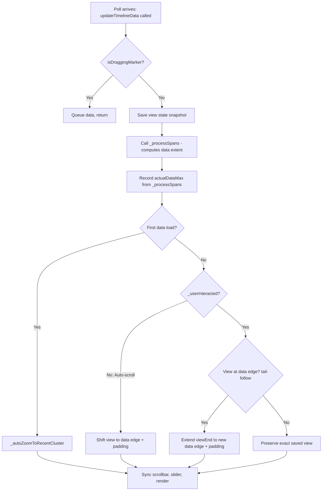

# Architecture Guide

## Overview

`rf-trace-report` is a Python CLI tool that reads OpenTelemetry (OTLP) trace files produced by [robotframework-tracer](https://github.com/robocorp/robotframework-tracer), Robot Framework `output.xml` files, or traces from a SigNoz backend, and generates interactive, self-contained HTML reports. It supports static report generation, live mode with auto-refresh, OTLP receiver mode, and querying traces from a SigNoz backend.

The tool has no runtime dependency on `robotframework-tracer` — it reads standard OTLP NDJSON files and interprets Robot Framework-specific span attributes (`rf.*`) to reconstruct the suite/test/keyword hierarchy. It can also convert RF `output.xml` files to OTLP format on-the-fly.

## Data Pipeline

The core data pipeline transforms raw OTLP trace data into an interactive HTML report:

```
OTLP NDJSON file ─────────────────────┐
                                      │
RF output.xml ──► output_xml_converter┤
                                      │
                                      ▼
                               ┌─────────────┐
                               │   Parser     │  parser.py — reads NDJSON lines, extracts flat span list
                               │  (NDJSON)    │
                               └──────┬──────┘
                                      │ List[RawSpan]
                                      ▼
                               ┌─────────────┐
                               │  Span Tree   │  tree.py — groups by trace_id, links parent→child
                               │  Builder     │
                               └──────┬──────┘
                                      │ List[SpanNode]  (tree roots)
                                      ▼
                               ┌─────────────┐
                               │ RF Attribute │  rf_model.py — classifies spans as suite/test/keyword,
                               │ Interpreter  │  extracts RF-specific fields, computes statistics
                               └──────┬──────┘
                                      │ RFRunModel
                                      ▼
                               ┌─────────────┐
                               │   Report     │  generator.py — serializes model to JSON, embeds JS/CSS,
                               │  Generator   │  produces self-contained HTML
                               └──────┬──────┘
                                      │ HTML string
                                      ▼
                                 trace-report.html
```

Optional OTLP logs (`--logs-file`) are parsed separately and attached to spans by `span_id` for inline display in the viewer.

In live mode, the Python server serves the raw trace file and the JS viewer handles parsing, tree building, and rendering entirely in the browser.

## Python Components

### Parser (`parser.py`)

Reads OTLP NDJSON trace files (plain or gzip-compressed). Each line is an `ExportTraceServiceRequest` JSON object containing `resource_spans` → `scope_spans` → `spans`.

- **Input**: File path (`.json`, `.json.gz`), stdin (`-`), or IO stream
- **Output**: `List[RawSpan]` — flat list of spans with normalized hex IDs and nanosecond timestamps
- **Key behaviors**:
  - Handles both `snake_case` and `camelCase` OTLP field names
  - Skips malformed lines with warnings (never crashes on bad input)
  - Supports incremental reading via `parse_incremental()` for live mode (seek to byte offset and read new lines)
  - Flattens OTLP attribute arrays into `dict[str, Any]` with typed value extraction (string, int, double, bool, array, kvlist, bytes)

### Span Tree Builder (`tree.py`)

Reconstructs the hierarchical span tree from the flat span list.

- **Input**: `List[RawSpan]`
- **Output**: `List[SpanNode]` — tree roots sorted by start time
- **Key behaviors**:
  - Groups spans by `trace_id` (supports multiple traces from pabot parallel runs or merged files)
  - Links parent→child via `parent_span_id` → `span_id`
  - Orphan spans (parent not in dataset) become roots
  - Duplicate `span_id` values keep first occurrence with a warning
  - Children sorted by `start_time_unix_nano` ascending
  - `IncrementalTreeBuilder` class supports paged span loading with orphan tracking and automatic re-parenting when parent spans arrive in later pages

### RF Attribute Interpreter (`rf_model.py`)

Interprets Robot Framework-specific span attributes and maps them to a typed UI model.

- **Input**: `List[SpanNode]` (tree roots)
- **Output**: `RFRunModel` containing `RFSuite`, `RFTest`, `RFKeyword` hierarchy and `RunStatistics`
- **Key behaviors**:
  - Classifies spans by `rf.*` attributes: `rf.suite.name` → suite, `rf.test.name` → test, `rf.keyword.name` → keyword, `rf.signal` → signal
  - Extracts documentation, tags, arguments, log messages, status, keyword type (SETUP, TEARDOWN, FOR, IF, etc.)
  - Computes per-suite and aggregate statistics (total/passed/failed/skipped tests, duration)
  - Extracts suite metadata from `rf.suite.metadata.*` attributes
  - Suite-level SETUP/TEARDOWN keywords are included as direct suite children

### Report Generator (`generator.py`)

Produces the self-contained HTML report file.

- **Input**: `RFRunModel` + `ReportOptions`
- **Output**: HTML string with embedded data, JS, and CSS
- **Key behaviors**:
  - Serializes the model to JSON and embeds it in a `<script>` tag (`window.__RF_TRACE_DATA__`)
  - Reads all JS viewer files from `viewer/` directory and concatenates them in dependency order
  - Reads `style.css` and embeds it inline
  - Compact mode (`--compact-html`): omits default-value fields, applies key shortening (`name` → `n`, `status` → `s`, etc.), builds string intern table for repeated values
  - Gzip mode (`--gzip-embed`): gzip-compresses and base64-encodes the JSON payload
  - Supports span limiting (`--max-spans`), depth truncation (`--max-keyword-depth`), and passing-keyword exclusion (`--exclude-passing-keywords`)
  - Output is a single HTML file with zero external dependencies

### Live Server (`server.py`)

Minimal HTTP server for live trace viewing.

- **Input**: Trace file path or provider instance + configuration
- **Output**: HTTP responses (HTML viewer, trace data, OTLP receiver)
- **Endpoints**:
  - `GET /` — serves the HTML viewer with live mode flags
  - `GET /traces.json?offset=N` — serves raw trace data from file (incremental via byte offset)
  - `GET /api/spans?since_ns=N` — serves spans from a live-poll provider (SigNoz)
  - `POST /v1/traces` — OTLP receiver endpoint (accepts `ExportTraceServiceRequest` JSON)
- **Key behaviors**:
  - File-based live mode: serves raw NDJSON, JS viewer parses in browser
  - Receiver mode: buffers OTLP payloads in memory, optionally writes journal file for crash recovery, optionally forwards to upstream collector
  - SigNoz mode: proxies `poll_new_spans()` calls to the SigNoz provider
  - Generates static HTML report from buffered spans on shutdown (receiver mode)
  - Auto-opens browser on start (configurable)

### CLI Entry Point (`cli.py`)

Command-line interface with three modes: default command, `serve` subcommand, and `convert` subcommand.

- **Default command**: `rf-trace-report <input> [options]` — static report generation or live mode with `--live`. Accepts OTLP NDJSON (`.json`, `.json.gz`) or RF `output.xml` files (auto-detected by extension).
- **Serve subcommand**: `rf-trace-report serve [options]` — starts live server without requiring an input file (for receiver/SigNoz modes)
- **Convert subcommand**: `rf-trace-report convert <input.xml> [-o output.json.gz]` — converts RF `output.xml` to OTLP NDJSON format
- **Key behaviors**:
  - Shared argument set between default and serve parsers
  - Three-tier config precedence: CLI args > config file (`--config`) > environment variables
  - Provider selection: `--provider json` (default, file-based) or `--provider signoz` (SigNoz API)
  - Receiver mode (`--receiver`) implies live mode
  - `--logs-file` attaches a separate OTLP NDJSON logs file for inline log display
  - `--logo-path` embeds a custom SVG logo in the report header

### Configuration (`config.py`)

Three-tier configuration loader with validation.

- **Precedence**: CLI arguments (highest) → JSON config file → environment variables (lowest)
- **Key behaviors**:
  - `AppConfig` dataclass holds all merged settings
  - `SigNozConfig` dataclass is a subset for provider construction
  - Supports `camelCase` → `snake_case` conversion for config file keys
  - Nested config file keys are flattened: `{"signoz": {"apiKey": "x"}}` → `signoz_api_key`
  - Type coercion for env vars (int, float, bool, string)
  - Validates required fields (e.g., `--signoz-endpoint` required when `--provider signoz`)

### Robot Semantics Layer (`robot_semantics.py`)

Provider-agnostic attribute normalization.

- **Input/Output**: `TraceViewModel` → `TraceViewModel` (enriched)
- **Key behaviors**:
  - Maps alternative attribute names (`robot.type`, `robot.suite`, `robot.test`, `robot.keyword`) to canonical `rf.*` names
  - No-op when spans already have `rf.*` attributes (e.g., from JsonProvider)
  - Groups spans by execution ID attribute for multi-execution support

## Trace Provider Abstraction

The provider layer decouples trace data sourcing from the rendering pipeline. All providers emit canonical `TraceSpan` objects consumed by the rest of the system.

```
                    ┌──────────────────┐
                    │  TraceProvider    │  (abstract base)
                    │  ─────────────── │
                    │  list_executions()│
                    │  fetch_spans()   │
                    │  fetch_all()     │
                    │  supports_live() │
                    │  poll_new_spans()│
                    └────────┬─────────┘
                             │
              ┌──────────────┴──────────────┐
              │                             │
    ┌─────────┴────────┐         ┌──────────┴─────────┐
    │   JsonProvider    │         │  SigNozProvider     │
    │  (local files)    │         │  (SigNoz API)       │
    └──────────────────┘         └────────────────────┘
```

### TraceProvider Interface (`providers/base.py`)

Defines the contract all providers must implement:

| Method | Description |
|--------|-------------|
| `list_executions(start_ns, end_ns)` | List available test executions in a time range |
| `fetch_spans(execution_id, trace_id, offset, limit)` | Fetch a page of spans (returns `(TraceViewModel, next_offset)`) |
| `fetch_all(execution_id, trace_id, max_spans)` | Fetch all spans with automatic pagination |
| `supports_live_poll()` | Whether this provider supports live polling |
| `poll_new_spans(since_ns, service_name)` | Fetch spans newer than a timestamp |

Canonical data models:
- `TraceSpan` — single span with validated fields (non-empty IDs, non-negative timestamps, status ∈ {OK, ERROR, UNSET})
- `TraceViewModel` — container of spans + resource attributes
- `ExecutionSummary` — metadata for a test execution (ID, start time, span count)

### JsonProvider (`providers/json_provider.py`)

Wraps the existing NDJSON parser as a `TraceProvider`. Reads local trace files and converts `RawSpan` objects to canonical `TraceSpan` objects.

- Does not support live polling (`supports_live_poll() → False`)
- Single-page fetch (all spans returned in one call)
- Maps OTLP status codes to simple strings (OK/ERROR/UNSET)

### SigNozProvider (`providers/signoz_provider.py`)

Fetches trace data from a SigNoz instance via the `/api/v3/query_range` API.

- Supports live polling (`supports_live_poll() → True`)
- Automatic pagination with configurable page size (`max_spans_per_page`, default 10,000)
- `poll_new_spans()` paginates through all available spans up to `max_spans` (default 500,000), enabling large time-range queries (e.g., 7-day lookback) to return complete datasets instead of being silently capped at one page
- `fetch_all()` uses the same pagination pattern for static report generation
- Span deduplication via `_seen_span_ids` set (reset on `fetch_all()`)
- Overlap window for live poll to handle clock skew
- Handles SigNoz-specific response formats (ISO timestamps, nested result structure)
- Authentication via `SigNozAuth` helper (static API key, JWT self-signing, or auto-registration)
- Automatic token refresh on 401 responses

## JS Viewer Architecture

The viewer is a vanilla JavaScript application embedded in the generated HTML report. All JS files are concatenated by the generator in dependency order and inlined in a single `<script>` tag.

### Viewer Files

| File | Responsibility |
|------|---------------|
| `flatpickr.min.js` | Date/time picker library for date range filter |
| `tree.js` | Tree view — expandable suite/test/keyword hierarchy with inline details |
| `date-range-picker.js` | Date range picker component for time-based filtering |
| `timeline.js` | Timeline/Gantt view — zoom, pan, time range selection, worker lanes, seconds grid |
| `keyword-stats.js` | Keyword statistics — aggregated keyword execution metrics |
| `report-page.js` | Report page — summary dashboard, test results table, tag statistics, keyword insights, failure triage, keyword drill-down |
| `search.js` | Search and filter — text search, status filter, tag filter, duration filter, time range filter, service name filter |
| `deep-link.js` | Deep linking — encodes/decodes viewer state in URL hash for shareable links |
| `theme.js` | Theme management — light/dark mode toggle, system preference detection, CSS custom properties |
| `flow-table.js` | Execution flow table — code-like indented keyword view with type badges, sticky suite/test headers, and 4-column layout (Keyword, Line, Status, Duration) |
| `live.js` | Live mode — polling loop, incremental data fetching, NDJSON parsing in browser |
| `service-health.js` | Service health dashboard — real-time sparkline charts for server and client metrics |
| `app.js` | Main application — initialization, event bus, view coordination |
| `style.css` | Styles — light and dark themes via CSS custom properties, responsive layout |
| `flatpickr.min.css` | Date/time picker styles |

### Service Health Dashboard

The health dashboard (`app.js`) displays real-time sparkline charts for server and client metrics. It polls `/api/v1/resources/history` every 10 seconds and renders canvas-based sparklines with optional reference lines (e.g., memory/CPU limits).

Server-side charts (from resource snapshots):
- Memory RSS (MB) — with request and limit reference lines
- CPU Usage (%) — with limit reference line
- Total Spans — count in the backend
- Active Users — connected browser sessions

Client-side charts (from `performance.memory`):
- Spans/sec — ingestion rate computed in the browser
- Browser JS Heap (MB) — only shown on Chromium browsers (Chrome, Edge, Opera) where `performance.memory` is available. Displays `usedJSHeapSize` with `jsHeapSizeLimit` as a dashed reference line. The card is labeled "(client)" and does not appear at all on non-Chromium browsers.

### Span Ingestion Limits

The viewer has a multi-layer approach to span limits:

| Layer | Config | Default | Purpose |
|-------|--------|---------|---------|
| SigNoz page size | `MAX_SPANS_PER_PAGE` | 10,000 | Spans per SigNoz API request |
| Server total cap | `MAX_SPANS` | 500,000 | Max spans `poll_new_spans` will paginate through |
| Client span cap | `__RF_TRACE_MAX_SPANS__` | 1,000,000 | Browser-side cap before polling stops |

When the client cap is reached, a dismissible banner appears and polling pauses. Dismissing the banner doubles the cap and resumes polling.

### Load Order

The generator concatenates files in this specific order (defined in `_JS_FILES` tuple in `generator.py`):

1. `flatpickr.min.js` — date picker library
2. `tree.js`, `date-range-picker.js`, `timeline.js`, `keyword-stats.js`, `report-page.js`, `search.js` — define functions used by `app.js`
3. `deep-link.js`, `theme.js`, `flow-table.js`, `live.js`, `service-health.js` — independent modules
4. `app.js` — main entry point, initializes all components

### Event Bus

Components communicate through a shared event bus pattern. `app.js` coordinates initialization and routes events between views (e.g., selecting a test in the tree highlights it in the timeline, search results update both views).

### Technology Choices

- Vanilla ES2020+ JavaScript — no framework, no build step, no external dependencies
- CSS3 with custom properties for theming
- Canvas/SVG for timeline rendering
- The entire viewer must be embeddable in a single HTML file

## Deployment Scenarios

### Scenario A: Local Static Report

The simplest deployment — generate a static HTML file from a local trace file.

```
┌──────────────┐     trace.json      ┌──────────────┐     report.html
│  RF Tests +   │ ──────────────────→ │ rf-trace-     │ ──────────────→  Browser
│  Tracer       │   (OTLP NDJSON)    │ report        │   (self-contained)
└──────────────┘                     └──────────────┘
```

```bash
# Plain JSON
rf-trace-report trace.json -o report.html

# Gzip-compressed input
rf-trace-report trace.json.gz -o report.html

# Compact serialization (smaller output)
rf-trace-report trace.json --compact-html --gzip-embed -o report.html
```

Data flow: `trace.json` → Parser → Span Tree → RF Model → Generator → `report.html`

### Scenario B: Local Live Mode

Watch a trace file and auto-refresh the browser as new data arrives.

```
┌──────────────┐     trace.json      ┌──────────────┐     HTTP
│  RF Tests +   │ ──────(writing)───→ │ rf-trace-     │ ◄──────────→  Browser
│  Tracer       │                    │ report --live │   (polls /traces.json)
└──────────────┘                     └──────────────┘
```

```bash
rf-trace-report trace.json --live --port 8077
```

Data flow: Python serves raw file at `/traces.json`. JS viewer polls with byte offset, parses NDJSON in browser, and renders incrementally.

### Scenario C: OTLP Receiver Mode

`rf-trace-report` acts as a lightweight OTLP receiver, accepting trace data via HTTP POST and optionally forwarding to an upstream collector.

```
┌──────────────┐    OTLP/HTTP POST    ┌──────────────┐     HTTP
│  RF Tests +   │ ──────────────────→  │ rf-trace-     │ ◄──────────→  Browser
│  Tracer       │   /v1/traces        │ report        │
│  (OTLP export)│                     │ --receiver    │
└──────────────┘                      └──────┬───────┘
                                             │ (optional)
                                             ▼
                                      ┌──────────────┐
                                      │  Upstream     │
                                      │  OTel         │
                                      │  Collector    │
                                      └──────────────┘
```

```bash
# Receiver only
rf-trace-report serve --receiver --port 8077

# Receiver with forwarding to Jaeger
rf-trace-report serve --receiver --forward http://jaeger:4318/v1/traces
```

Data flow: Tracer POSTs OTLP JSON to `/v1/traces`. Server buffers in memory, writes journal file for crash recovery. JS viewer polls `/traces.json?offset=N` for incremental updates. On shutdown, generates a static HTML report from buffered spans.

### Scenario D: SigNoz Provider Mode

Query traces from a SigNoz backend instead of reading local files.

```
┌──────────────┐    OTLP/gRPC     ┌──────────────┐
│  RF Tests +   │ ───────────────→ │  OTel         │
│  Tracer       │                  │  Collector    │
└──────────────┘                   └──────┬───────┘
                                          │ ClickHouse
                                          │ exporters
                                          ▼
                                   ┌──────────────┐
                                   │  ClickHouse   │
                                   │  (storage)    │
                                   └──────┬───────┘
                                          │
                                          ▼
                                   ┌──────────────┐    /api/v3/     ┌──────────────┐
                                   │   SigNoz      │ ◄────────────  │ rf-trace-     │
                                   │  (query API)  │  query_range   │ report        │
                                   └──────────────┘                 │ --provider    │
                                                                    │   signoz      │
                                                                    └──────┬───────┘
                                                                           │ HTTP
                                                                           ▼
                                                                        Browser
```

```bash
# Static report from SigNoz
rf-trace-report --provider signoz \
  --signoz-endpoint http://signoz:8080 \
  --signoz-api-key <token>

# Live mode from SigNoz
rf-trace-report serve --provider signoz \
  --signoz-endpoint http://signoz:8080 \
  --signoz-api-key <token>
```

Data flow: SigNozProvider queries `/api/v3/query_range` with pagination. Spans are converted to canonical `TraceSpan` objects, then fed through the standard pipeline (tree builder → RF model → generator). In live mode, the server proxies `poll_new_spans()` calls via `/api/spans`.

### Scenario E: Docker Compose — RF Stack

Pre-built Docker Compose stack for local development with Robot Framework tests.

```
┌─────────────────────────────────────────────────┐
│              Docker Compose                      │
│                                                  │
│  ┌──────────────┐       ┌──────────────────┐    │
│  │  RF Test      │ OTLP  │  rf-trace-report │    │
│  │  Runner +     │──────→│  (receiver mode) │    │
│  │  Tracer       │       │  :8077           │    │
│  └──────────────┘       └──────────────────┘    │
│                                                  │
└─────────────────────────────────────────────────┘
                                    │
                                    ▼
                              Browser :8077
```

The RF test runner executes tests with `robotframework-tracer` configured to export OTLP traces to the report viewer's receiver endpoint. The viewer displays results in real time.

### Scenario F: Docker Compose — SigNoz Stack

Full observability stack with SigNoz for trace storage and querying.

```
┌──────────────────────────────────────────────────────────────────┐
│                       Docker Compose                              │
│                                                                   │
│  ┌──────────┐   ┌───────────┐   ┌───────────┐   ┌────────────┐  │
│  │ ZooKeeper │   │ClickHouse │   │  SigNoz   │   │  OTel      │  │
│  │           │──→│ (storage) │◄──│ (API+SPA) │   │ Collector  │  │
│  └──────────┘   └───────────┘   │  :8080    │   │            │  │
│                                  └───────────┘   └─────┬──────┘  │
│                                                        │         │
│  ┌──────────────┐  OTLP/gRPC                          │         │
│  │  RF Test      │─────────────────────────────────────┘         │
│  │  Runner +     │                                               │
│  │  Tracer       │       ┌──────────────────┐                    │
│  └──────────────┘       │  rf-trace-report  │                    │
│                          │  --provider signoz│                    │
│                          │  :8077            │                    │
│                          └──────────────────┘                    │
│                                                                   │
└──────────────────────────────────────────────────────────────────┘
```

This stack is used for integration testing (`tests/integration/signoz/`). It includes:

| Service | Image | Purpose |
|---------|-------|---------|
| zookeeper | signoz/zookeeper:3.7.1 | ClickHouse coordination |
| clickhouse | clickhouse/clickhouse-server:25.12.5 | Trace storage |
| schema-migrator | signoz/signoz-schema-migrator:v0.144.2 | DB schema setup (~90s first run) |
| signoz | signoz/signoz-community:v0.113.0 | Query API + SPA frontend |
| signoz-otel-collector | signoz/signoz-otel-collector:v0.144.2 | OTLP receiver → ClickHouse |
| rf-test-runner | Custom (robotframework-tracer) | Runs RF tests, emits traces |
| rf-trace-report | Custom (this project) | Serves the trace viewer |

The test orchestrator (`run_integration.sh`) uses a three-phase startup:
1. Infrastructure (ZooKeeper, ClickHouse, schema migration)
2. Core services (SigNoz, OTel collector, RF test runner)
3. Report viewer (after obtaining auth token)

## SigNoz Integration Architecture

### Authentication Flow

SigNoz v0.76+ uses a single binary serving both the SPA frontend and API on port 8080. Authentication is handled via two middleware chains:

1. **API Key middleware** — checks `SIGNOZ-API-KEY` header, looks up token in `factor_api_key` table
2. **AuthN middleware** — checks `Authorization` header, validates JWT or opaque token

The provider sends both headers for maximum compatibility:

```python
headers = {
    "SIGNOZ-API-KEY": token,
    "Authorization": f"Bearer {token}",
}
```

`SigNozAuth` (`providers/signoz_auth.py`) supports three authentication modes:

1. **Static API key** — user provides a long-lived token (SigNoz Cloud). No refresh needed.
2. **JWT self-signing** — for self-hosted deployments, the provider uses the known `SIGNOZ_TOKENIZER_JWT_SECRET` to sign HS256 JWTs locally. Tokens are refreshed automatically on 401 or before expiry (23-hour lifetime).
3. **Auto-registration** — on fresh SigNoz instances, registers a service user via `POST /api/v1/register`, captures user/org IDs, then self-signs JWTs.

### Query API

The SigNozProvider uses `POST /api/v3/query_range` for all data access:

- **List executions**: Aggregate query grouped by execution attribute (e.g., `execution_id`)
- **Fetch spans**: List query with filters (execution ID, trace ID, service name), pagination via offset/limit, ordered by timestamp ascending
- **Live poll**: Same as fetch spans but with a time-based start filter; paginates through all results up to `max_spans` to support large time-range lookbacks (e.g., 7 days)

### ClickHouse Storage

SigNoz stores traces in ClickHouse tables. The OTel Collector receives OTLP/gRPC from the tracer and exports to ClickHouse via its exporter. The SigNoz query service reads from ClickHouse and exposes the `/api/v3/query_range` REST API.

### Known Issues (v0.113.0)

- **`POST /api/v1/login` returns HTML**: The SPA catch-all route intercepts the login endpoint. This is a routing bug in the single-binary architecture.
- **Workaround**: Use `POST /api/v1/register` on first boot, then self-sign JWTs using the known secret.
- **Affected GET routes**: Some GET API routes (e.g., `/api/v1/services`) also return HTML. POST routes like `/api/v3/query_range` work correctly.

## Design Decisions

### Vanilla JS, No Framework

The viewer must be embeddable in a single HTML file. React/Vue/Svelte would require a build step and increase file size. Vanilla JS with modern browser APIs (ES2020+, CSS custom properties, Canvas/SVG for timeline) keeps it simple and self-contained.

### Python for CLI, JS for Rendering

Python handles file I/O, gzip, HTTP serving, and SigNoz API communication. JavaScript handles all rendering and user interaction. In live mode, the JS viewer does its own NDJSON parsing to avoid round-trips to the server — the Python server just serves raw data.

### NDJSON as Interchange Format

The trace file format is standard OTLP NDJSON (`ExportTraceServiceRequest` per line). The viewer doesn't define its own format. Any OTLP-compatible tool can produce files the viewer can read.

### No Dependency on robotframework-tracer

The viewer reads OTLP JSON files and interprets RF-specific rendering based on attribute naming conventions (`rf.suite.*`, `rf.test.*`, `rf.keyword.*`), not code coupling. This means any tracer that sets these attributes will work.

### Provider Abstraction

The `TraceProvider` interface decouples data sourcing from rendering. Adding a new backend (e.g., Jaeger, Grafana Tempo) requires implementing five methods without touching the rendering pipeline.

## Project File Structure

```
robotframework-trace-report/
├── src/
│   └── rf_trace_viewer/
│       ├── __init__.py              # Package init, version
│       ├── cli.py                   # CLI entry point (default + serve + convert subcommands)
│       ├── config.py                # Three-tier config loader
│       ├── exceptions.py            # Custom exception classes
│       ├── generator.py             # HTML report generator
│       ├── output_xml_converter.py  # RF output.xml → OTLP NDJSON converter
│       ├── parser.py                # NDJSON trace file parser (traces + logs)
│       ├── rf_model.py              # RF attribute interpreter + data models
│       ├── robot_semantics.py       # Provider-agnostic attribute normalization
│       ├── server.py                # Live mode HTTP server
│       ├── tree.py                  # Span tree builder
│       └── providers/
│           ├── __init__.py          # Provider exports
│           ├── base.py              # TraceProvider interface + data models
│           ├── json_provider.py     # Local NDJSON file provider (traces + logs)
│           ├── signoz_auth.py       # SigNoz authentication (JWT, API key)
│           └── signoz_provider.py   # SigNoz API provider
│       └── viewer/
│           ├── app.js               # Main viewer application
│           ├── date-range-picker.js # Date range picker component
│           ├── deep-link.js         # URL state encoding/decoding
│           ├── flatpickr.min.js     # Date picker library
│           ├── flatpickr.min.css    # Date picker styles
│           ├── flow-table.js        # Execution flow table
│           ├── keyword-stats.js     # Keyword statistics
│           ├── live.js              # Live mode polling
│           ├── report-page.js       # Report page (summary, test results, tag stats, failure triage)
│           ├── search.js            # Search and filter
│           ├── service-health.js    # Service health dashboard
│           ├── style.css            # Light + dark theme styles
│           ├── theme.js             # Theme management
│           ├── timeline.js          # Timeline/Gantt renderer
│           ├── tree.js              # Tree view renderer
│           └── default-logo.svg     # Default logo
├── tests/
│   ├── unit/                        # Unit + property-based tests
│   ├── browser/                     # Browser tests (RF + Playwright)
│   ├── fixtures/                    # Test trace files
│   └── integration/
│       └── signoz/                  # SigNoz integration test stack
│           ├── docker-compose.yml
│           ├── run_integration.sh
│           └── ...
├── docs/
│   ├── architecture.md              # This file
│   ├── user-guide.md                # End-user documentation
│   ├── signoz-integration.md        # SigNoz setup guide
│   ├── testing.md                   # Test infrastructure reference
│   ├── docker-testing.md            # Docker testing philosophy
│   └── analysis/                    # Internal development artifacts
├── README.md                        # Project landing page
├── CONTRIBUTING.md                  # Contributor guide
├── CHANGELOG.md                     # Release history
├── LICENSE                          # MIT license
├── Makefile                         # Build/test targets
├── Dockerfile                       # Production image
├── Dockerfile.test                  # Test image (rf-trace-test:latest)
├── pyproject.toml                   # Python project config
└── TODO.md                          # Development roadmap
```

## Live Timeline Update Flow

In live mode, the timeline view is driven entirely by actual span data — never by wall-clock speculation. The `advanceTimelineNow` timer is disabled (early return when `window.__RF_TRACE_LIVE__` is true) because `maxTime` is now derived from the latest span `endTime` arriving via poll cycles, not from `Date.now()`. The `setInterval` in `live.js` still fires but the function is a no-op.

### Two-Branch Update Flow

`updateTimelineData` uses a linear two-branch design instead of the previous 5+ code paths:



The key steps on each poll:

1. Jog shuttle guard — if `isDraggingMarker`, queue data in `_jogPendingData` and return
2. Snapshot current view state (`viewStart`, `viewEnd`, `zoom`, `panY`, `selectedSpan`, `hadSpans`)
3. `_processSpans(data)` recomputes spans and sets `minTime`/`maxTime` from actual span data
4. Record `actualDataMax = timelineState.maxTime`
5. Two-branch view management:
   - **First data load** → `_autoZoomToRecentCluster()`
   - **No user interaction** → auto-scroll: `viewEnd = actualDataMax + 5% padding`, shift `viewStart` to maintain view width
   - **User interacted + at data edge** → tail-follow: extend `viewEnd` to new data edge
   - **User interacted + not at edge** → preserve exact saved view
6. Ensure `maxTime` encompasses view (for scrollbar), recompute `zoom`, restore `panY`/`selectedSpan`, render

### Tail-Follow Detection

Tail-follow uses a simple edge-proximity check:

```javascript
var wasAtEdge = Math.abs(saved.viewEnd - prevDataMax) < 2;
```

The 2-second tolerance accounts for nanosecond-to-second conversion rounding. The previous `viewCoverage` heuristic was removed — if the user's view edge is within 2 seconds of the data edge, they want to see the latest data regardless of zoom level.

### Interaction Matrix

This matrix documents how every view-state mutator interacts with the update flow:

| Mutator | Modifies | Sets `_userInteracted` | Resolution |
|---------|----------|----------------------|------------|
| `_processSpans` | minTime, maxTime, viewStart, viewEnd | No | View is set AFTER `_processSpans`, not restored over it |
| `updateTimelineData` | viewStart, viewEnd, zoom, maxTime | No | Two-branch flow, single authority |
| Wheel zoom | viewStart, viewEnd, zoom | Yes | Next poll preserves view |
| Drag pan | viewStart, viewEnd | Yes | Next poll preserves view |
| Drag-to-zoom | viewStart, viewEnd, zoom | Yes | Next poll preserves view |
| Scrollbar drag | viewStart, viewEnd | Yes | Next poll preserves view |
| `_applyPreset` | viewStart, viewEnd, zoom | Clears (false) | Preset sets initial view, then auto-scroll takes over |
| Nav undo/redo | viewStart, viewEnd, zoom | Yes | Next poll preserves restored view |
| `_applyTimePicker` | viewStart, viewEnd | Yes | Next poll preserves picker range |
| `_handleFilterChanged` | workers, filteredSpans, lanes | No | Deduped: skips if span count unchanged |
| `advanceTimelineNow` | (none in live mode) | No | Disabled — early return when `__RF_TRACE_LIVE__` is true |

## Related Documentation

- [User Guide](user-guide.md) — CLI options, deployment instructions, viewer features
- [SigNoz Integration Guide](signoz-integration.md) — SigNoz setup, authentication, troubleshooting
- [Testing](testing.md) — Test types, Docker test image, Makefile targets
- [Contributing](../CONTRIBUTING.md) — Development workflow, code style, project structure
